# Setup Examples

The Option S9x070xB Modulation Distortion application measures the nonlinear
behavior of an RF microwave amplifier and converters under a modulated signal.

A modulation file is created, uploaded to a signal generator, then fed into
the VNA to test the behavior of the device by measuring band power, ACP, and
EVM.

In this topic:

  * Example Distortion Setup Procedure
  * Physical Setup - Typical
  * Physical Setup - High Power
  * Physical Setup - External
  * Physical Setup - Converters

#### See Also

  * [Configuring Distortion Measurements](Modulation_Distortion_Settings.md)
  * [Creating Modulation Files](Create_Modulation_Files.md)
  * [Displaying Distortion Parameters](Displaying_Distortion_Parameters.md)
  * Programming Examples:
    * Measurement Setup
    * [Create Modulation File](../../Programming/GPIB_Example_Programs/Create_Modulation_File.md)
    * [Display Data Setup](../../Programming/GPIB_Example_Programs/Display_Data_Setup.md)
    * Source Modulation Calibration

## Example Distortion Setup Procedure

The following example describes how to set up a typical measurement using an
N5182B MXG. In this example, a modulation file for a Compact modulation type
is created. Compact signals cut a slice of the IQ data from an original
waveform. [Learn more](Create_Modulation_Files.md#Compact).

  1. Connect the equipment as shown after this procedure.

  2. On the VNA front panel, press Preset.

  3. Perform the following steps to set up an external MXG signal generator: 

     1. On the VNA front panel, press Setup > External Hardware > External Device....

     2. Click on the New button.

     3. Click in the Name field and type a name for the source. For example, myMXG.

     4. For Device Type, select Source.

     5. For the Driver, select MXG_Vector. (When you use VXG or VXT, select VXG or VXT_Vector, respectively)

     6. Select Active - Show in UI.

     7. Ensure that Enable IO is checked.

     8. In the I/O Configuration field, type the VISA address of the MXG.

     9. Click on the OK button. The following is an example:  
  
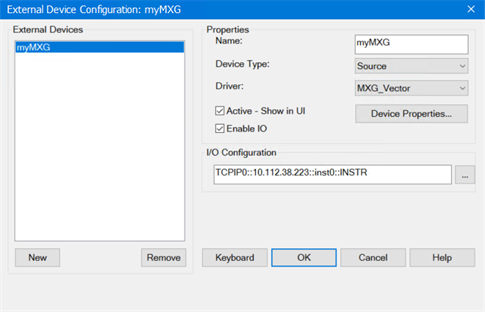

  4. On the VNA front panel, press Meas > S-Param > Meas Class....

  5. Select Modulation Distortion, then either:

     * OK delete the existing measurement, or

     * New Channel to create the measurement in a new channel.

  6. The Modulation Distortion Setup dialog will be displayed.

  7. Click on the Sweep tab and define the parameters as shown below:  
  

  8. Click on the RF Path tab and define the parameters as shown below:  
  
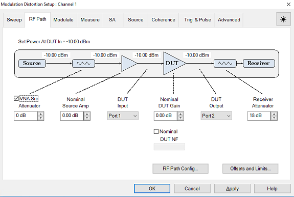  
  
  
Nominal Src Amp \- If there is a loss between the MXG source output and Port 1
of the VNA, then use a negative number. This value is used for power
calibration and to set the power level at the output of the DUT..  
  
To access the Offsets and Limits dialog, click on the Offsets and Limits...
button.  
  
Nominal DUT Gain \- This value is used for power calibration.

  9. Click on the Modulate tab.   
  
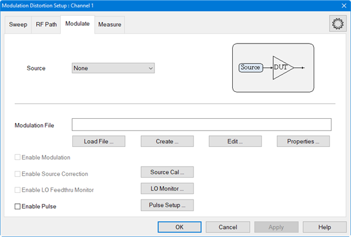

  10. Select the MXG source from the Source pull down.

  11. Click on the Create... button to access the Create Modulation dialog.   
  

  12. For the Modulation Type, ensure that Compact is selected from the pull down menu. This is the default selection.

  13. Click on the "..." button to the right of the Filename field to load the original file from which to create a compact signal.

  14. For Signal Span, use the default value.

  15. For Tone Spacing and Number of Tones, use the default values.

  16. For DAC Scaling, use the default value. For better S/N, increase the scaling value until a DAC overload occurs.

  17. For Frequency Tolerance, use default value of 1 %.

  18. Click on the Calculate button then verify that the signal is reasonable.

  19. Click the Save... button and save the compact signal file. The filename is displayed below the display window.  
  
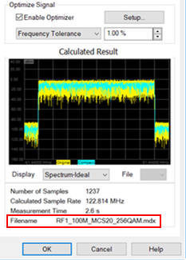

  20. In the Display pull down menu, select Spectrum-Ideal. Signals similar to the following should be displayed:  
  

  21. In the Display pull down menu, select Time. Signals similar to the following should be displayed:  
  

  22. In the Display pull down menu, select CCDF. Signals similar to the following should be displayed:  
  

Increasing the number of tones results in the following:

  * Finer tone spacing.

  * Longer period for the compact test signal.

  * More accurate CCDF as shown below.

  23. In the Create Modulation dialog, click OK.

  24. Click on the Measure tab and define the parameters as shown below:  
  

  25. Selecting ACP+EVM measures band power, ACP, and EVM for the specified frequency settings in the Measure tab.

  26. Click OK.

  27. To make a measurement check without calibration, perform the following steps:

     1. Make a Thru connection between the Pin and Pout reference planes.

     2. Press Format > Format 1 > Log Mag then select dBm/Hz.

     3. Press Scale > Main > Scale then set the scale to 10 dBm Per Division.

     4. Press Reference Level then set it to -70 dBm.

     5. Press Reference Position then set it to 10 Div.

     6. Press Display > Display Setup > Show Table then select Distortion.

  28. Note the following:

     1. The Modulation Distortion channel makes multiple background sweeps to complete the measurement. During the measurement, the carrier frequency of the compact signal does not change, but the VNA local frequency changes to cover the SA span (300 MHz in this example). The result is stitched together and stored in the Modulation Distortion channel.  
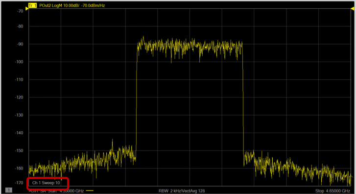

     2. The Power Spectral Density (PSD) dBm/Hz at the reference plane is displayed.  
  
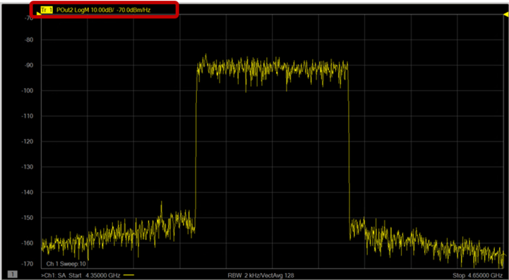

     3. The power level is not calibrated at this point. The result shown is based on the factory calibration of the receiver.  
  
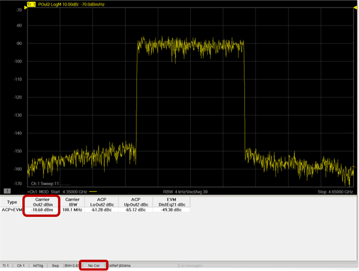

  29. Refer to [S-Parameter Calibration](S-Parameter_Calibration.md) for a procedure on calibrating the VNA receivers.
  30. After performing an S-parameter calibration, refer to [Source Modulation Calibration](Modulation_Flatness_and_Power_Calibration.md) for a procedure on calibrating source power and flatness.
  31. After calibration, perform the following steps:
     1. Press Trace > Trace 1-7 > New Traces....
     2. In the New Trace dialog, select PIn1 (Power In), POut2 (Power Out) and MDist2 (Modulation Distortion Out).
     3. Change the format to dBm/Hz.
     4. Scale as needed.
     5. If the Distortion Table is not displayed, Press Display > Display Setup > Show Table then select Distortion.
  32. The following is an example showing input signal and output signal measuring ACPR and EVM.  
  
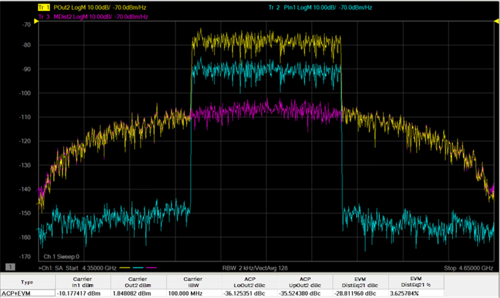  

  33. Add/remove parametric values by right-clicking in the distortion table at the bottom of the measurement area to access the pop up menu then selecting Edit Columns....  
  
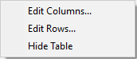

  34. Make desired selections from the Distortion Table Setup dialog.  
  
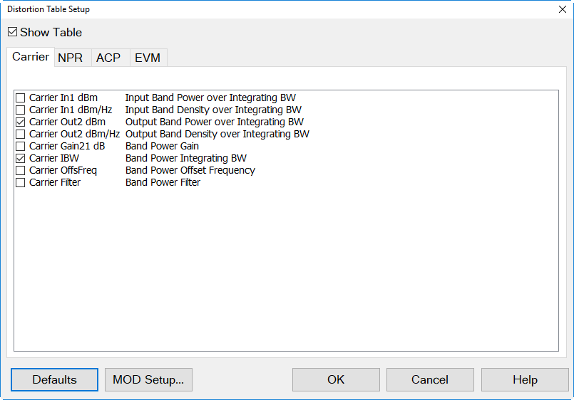

## Physical Setup - Typical

The following diagram shows a typical hardware setup using an N5182B MXG with
the signal connected to the VNA rear-panel Port 1 J10 input connector.

Note: Though this example uses an N5182B MXG, an M8190A with E8267D PSG, or an
M9383A MCS can be used as the external source.

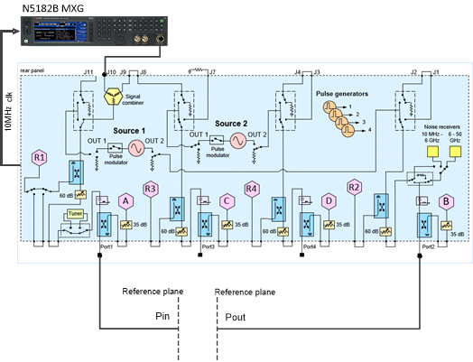

### Key Parameters

Frequency: 4.5 GHz

BW Signal: 100 MHz

Pin Max: -10 dBm at reference plane

SA Span: 300 MHz

## Physical Setup - High Power

The following diagram shows a typical high power hardware setup using an
M8190A with E8267D PSG with the signal connected to the VNA rear-panel Port 1
J10 input connector.

### Key Parameters

Frequency: 28 GHz

BW Signal: 400 MHz

Pin Max: 10 dBm at reference plane

SA Span: 1.2 GHz

## Physical Setup - External

The following diagram shows a typical external hardware setup using an M8190A
with E8267D PSG with the signal connected externally.

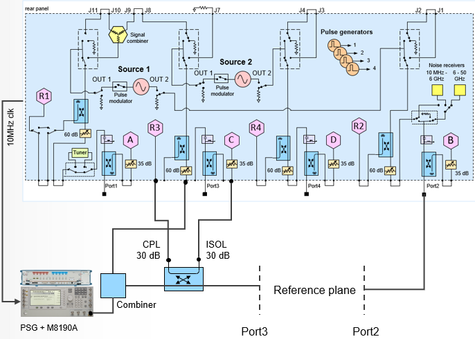

### Key Parameters

Frequency: 28 GHz

BW Signal: 400 MHz

Pin Max: 0 dBm at reference plane

SA Span: 1.2 GHz

## Physical Setup - Converter

The following diagram shows a typical hardware setup using an N5182B MXG with
the signal connected to the VNA rear panel Port 1 J10 input connector. Another
method of connecting an N5182B MXG is with the signal connected to the VNA
rear panel Port 1 J9 and connecting J10 to J11. This allows switching between
the MXG and Source 1 without a mechanical switch.

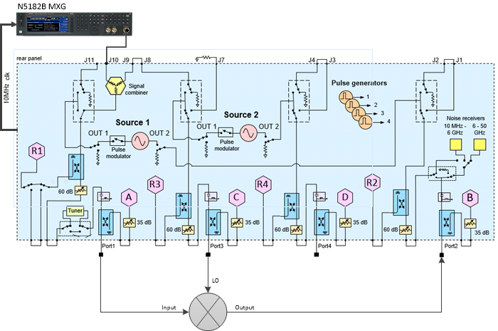

### Key Parameters

The Key Parameters are dependent upon the mixer setup and the measurement
setup.

Carrier Frequency

Carrier Power

SA Center/Span

Noise BW

LO Frequency

LO Power

Measurement Type

Measurement Offset Frequency

Measurement IBW

