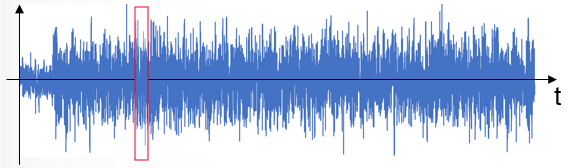
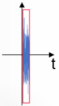

# Modulation File Overview

Modulation files are created then loaded into the source. The modulation files
created using the Create Modulation dialog include Digital Modulation, Flat
Tones, NPR Notch, and a shortened version of a modulation file called Compact.

When viewed in the frequency domain, this signal is a mult-tone "grid" of
frequencies. The data is measured on this multi-tone gird.

## Digital Modulation Type

Digital modulation functions can be used for creating I/Q signals on Keysight
signal generators. The functions include the ability to specify sampling rate,
number of symbols, symbol rate (frequency), modulation type, pulse-shaping
filter, number of carriers, and the spacing between the carriers.

## Compact Modulation Type

Compact test signals cut a slice of the IQ data from an original parent signal
created using Keysight Signal Studio or created using a .csv file. The slice
of IQ data is chosen that best fits in terms of statistical distribution
(CCDF), then conditions the waveform so that it has the same spectrum
signature as the original signal.

Original signal:

Compact signal:

#### Keysight Signal Studio Waveform (.wfm)

The Keysight Signal Studio Software can be used to create the original parent
signal in a .wfm file format for a compact modulation type measurement.

In order to use a compact file (.mdx) which is created from .wfm, the
corresponding license is required on the Signal Generator to play the .mdx.

When the waveform pack license is used, the original waveform file must be
assigned / locked to the signal generator in order to use the .mdx created
from the original waveform file.

Note: Encrypted .wfm files created using the N5182B MXG RF Vector Signal
Generator are not supported.

####

#### IQ File (.csv)

The original parent file can also be created using a .csv file format that has
a timestamp, I, and Q that uses a comma to separate the values.

No license is required on the signal generator to play the .mdx created from
the .csv.

## Flat Tones Modulation Type

Flat tones are used to measure the frequency response of a device with a
single input signal. This allows the gain and electrical delay through the
device to be measured.

A modulated communications signal such as 5GNR or OFDM, when plotted versus
frequency, is not a set of flat tones. It is relatively flat, but some tones
may be very small (near zero). So those signals are not as useful for
measuring gain and electrical delay, although it can be done by ignoring noisy
data and smoothing.

It is possible to measure distortion (EVM and ACP) using flat tones. The
creation of flat tones is provided because it is very simple and is useful.

  * Flat tones are often used with satellites (which are complicated converters):

    * Users are less concerned about communications formats and EVM.

    * Users are interested in gain and electrical delay through their device.

  * Flat tones may also be used with any amplifier/converter:

    * Measure gain and electrical delay and EVM/ACP.

    * Make measurements using Modulation Distortion or Modulation Distortion Converters application.

## NPR Notch Modulation Type

NPR Notch modulation type is a Noise Power Ratio measurement. The notch is
created where no signals are present. The location and span of the notch is
set by the user. With the stimulus applied to the DUT, the ratio of the noise
power of the carrier to the noise power in the notch is measured.

