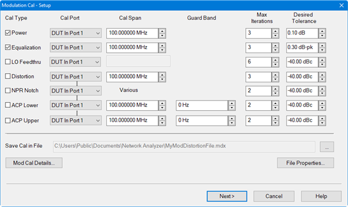
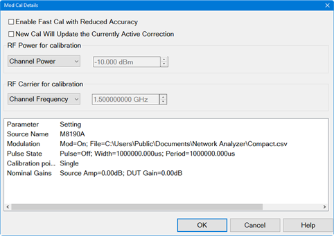
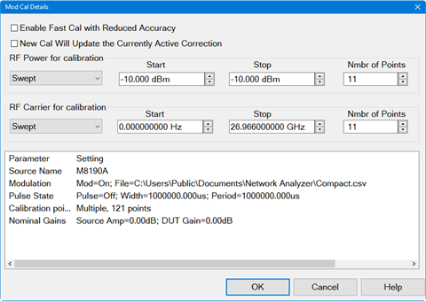
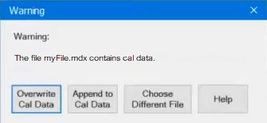
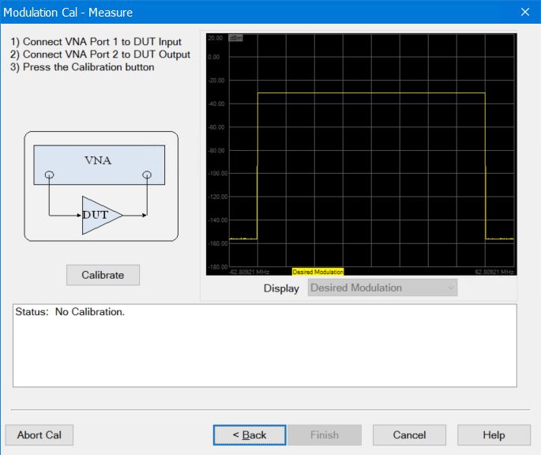
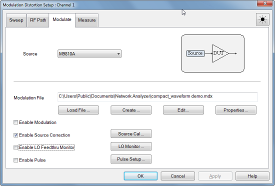
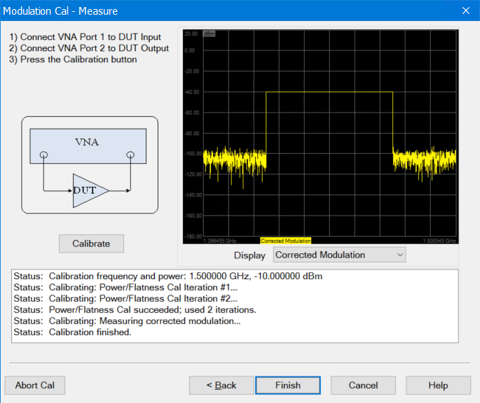

# Source Modulation Calibration

Note: The calibration information in this topic applies to both the Option
S93070xB, S9x070B Modulation Distortion and Option S9x09xxA/B, S9x090A/B
Spectrum Analysis applications.

Note: For Option S93070xB, S9x070B Modulation Distortion, traditional
S-parameter calibration using Cal All... must be performed before performing a
Source Modulation Calibration. Cal All.. is not required for Option
S9x09xxA/B, S9x090A/B Spectrum Analysis.

In this topic:

  * Initiating the Calibration
  * Modulation Cal - Setup Dialog Description
  * Source Modulation Correction ON | OFF
  * Example Calibration Procedure

## Initiating the Calibration

#### Accessing Source Modulation Cal - Option S93070xB, S9x070B Modulation
Distortion Application  
  
---  
Using Hardkey/SoftTab/Softkey |  Using a mouse  
  
  1. Press Cal > Main > Other Cals.
  2. Select Source Modulation Cal....

|

  1. Click Response.
  2. Select Cal.
  3. Select Other Cals.
  4. Select Source Modulation Cal....

  
  
#### Accessing Source Modulation Cal - Option S9x09xxA/B, S9x090A/B Spectrum
Analysis Application  
  
---  
Using Hardkey/SoftTab/Softkey |  Using a mouse  
  
  1. Press Freq > Main > SA Setup....
  2. Select the Source tab.
  3. Click in the IQMod column for your external source then select Edit.
  4. Click on the Calibrate Modulation... button.

|

  1. Click Instrument.
  2. Select SA Setup....
  3. Select the Source tab.
  4. Click in the IQMod column for your external source then select Edit.
  5. Click on the Calibrate Modulation... button.

  
  
## Modulation Cal - Setup Dialog Description

Source Modulation Cal - Setup dialog help |    
---|---  
 Note: The
calibration information is saved in the source modulation .mdx file and is
enabled/disabled by the Source Modulation Correction ON/OFF selection. Cal
Type \- Select the type of calibration to perform: Power calibrates the total
output power of the carrier integrated over the signal span. Equalization
performs a linear pre-distortion calibration which equalizes the magnitude of
the modulated signal. The Cal Span defaults to the occupied BW of the Carrier
Signal. LO Feedthru minimizes the LO feedthru tone. (LO feedthru tone may be
changed after calibration. [LO Feedthru
Monitor](Modulation_Distortion_Settings.htm#LOFeedthuMonitordialog) allows you
to check the LO feedthru at every measurement) Note: LO Feedthru cal is always
disabled for internal sources since they use digital up-conversion. Distortion
minimizes the vector error of the modulation signal over the Cal Span. The Cal
Span defaults to the occupied BW of the Carrier Signal. Note: An Equalization
calibration is included when a Distortion calibration is performed. NPR Notch
nulls the NPR notch. The Cal Span defaults to the frequency range of the
notch. If there are multiple notches having different spans, then Cal Span
displays Various. ACP Upper/ACP Lower nulls the ACP upper/lower sideband of
the signal. The Cal Span is set to the frequency width of the ACP sideband
being calibrated. The default Cal Span is equal to the carrier span. Note: The
Cal Span may be set so high that the source cannot correct the signal. In this
case, the Cal Span will be reduced automatically. The maximum span is 80% of
the source sampling frequency. Cal Port - Selects the calibration plane used
for the calibration. Note: The Cal Port selections for Distortion, NPR, and
ACP are coupled. Changing one selection will change them all. Cal Span - Sets
the span of the calibration. Guard Band \- (ACP Cal only) Sets the frequency
delta from the edge of the carrier to the beginning of the Cal Span. The
default is set to zero. This value is positive for both ACP Lower and ACP
Upper. Note: The Guard Band may be set so high that the source cannot correct
the signal. In this case, the Cal Span will be reduced automatically. In
addition, it is possible to set the Guard Band so high that the Cal Span is
set to zero, in which case the Guard Band will also be limited automatically.
Max Iterations \- The calibration routine uses successive approximation. This
value sets the maximum number of iterations used by the calibration routine.
Desired Tolerance \- Sets the desired tolerance for each calibration. Save Cal
in File \- Saves the modulation calibration to a file. Mod Cal Details...
button - Opens the Mod Cal Details dialog.

 Enable Fast
Cal with Reduced Accuracy \- Check to perform a faster calibration. New Cal
Will Update the Currently Active Correction \- Check to retain the currently
active correction data but update those parts that are calibrated by the
calibration process with new correction data. For example, if a power
calibration is performed after a power and distortion calibration, only the
power data will be updated while retaining the distortion correction data. RF
Power for calibration: Fixed \- Calibration is performed at a fixed power
level. Cal Power \- Sets the fixed power level. Swept \- Calibration is
performed at multiple power levels. Start Sets the beginning value of the
power sweep. Stop Sets the end value of the power sweep. Nmbr of Points Sets
the number of power points to calibrate during a sweep. Channel Power \-
Displays either the fixed power or swept power. RF Carrier for calibration:
Fixed \- Calibration is performed at a fixed frequency. Cal Frequency \- Sets
the fixed frequency. Swept \- Calibration is performed at multiple
frequencies. Start Sets the beginning frequency value. Stop Sets the end
frequency value. Nmbr of Points \- Sets the number of frequency points to
calibrate during a sweep. Channel Frequency \- Displays either the fixed
frequency or swept frequency. Note: Several powers and several frequencies can
be set up and the VNA will calibrate all combinations. VNA Status \- Displays
a list of parameters and their settings. File Properties... button Waveform
Tab Displays the properties of the currently active modulation file, which was
selected in the Modulation settings dialog. This information cannot be edited.

Calibration Tab The Calibration tab displays the calibration files and their
properties stored in the .mdx file. Each calibration displayed in the list is
for one power level. Calibrations may have been performed on multiple power
levels during a single calibration. In this case, multiple calibrations will
be saved in the .mdx file. Any of these calibrations can be deleted by
selecting the calibration name then clicking on the Delete Cal button.  Next>
button- When pressed, the wizard checks to see if the selected filename
contains an existing cal file. If it does, then the following warning message
is displayed: 
Overwrite Cal Data \- Existing cal data will be overwritten. Append to Cal
Data \- Keeps all existing cal data and appends only the data for the
currently selected Cal Type. For example, if LO Feedthru is selected as the
only Cal Type in the Modulation Cal - Setup dialog and the calibration is
performed, only the LO Feedthru cal data will be updated and the cal data for
all previous cals will remain unchanged. If you repeat the LO Feedthru
calibration, and append to the file, it will replace the LO Feedthru cal while
leaving the other calibrations (distortion, equalization, NPR, and ACPR)
unchanged Choose Different File \- Allows selection of a different cal file.
Accesses the Modulation Cal - Measure dialog:
 Calibrate
button - Starts the calibration. Display \- Select to display one of the
following: Desired Modulation is the ideal simulated signal from the
modulation file data. Uncorrected Modulation is the real-time measured signal
without correction. Corrected Modulation is the real-time measured signal with
correction. Correction Terms displays a static trace showing the correction
terms applied to the modulation data. Calibration Iterations displays multiple
static traces used during the calibration. If one or more of the default
tolerance values could not be achieved, a warning message is displayed. You
have the option to change the tolerance values and re-calibrate or save the
current calibration.  
  

####  
  
## Source Modulation Correction ON | OFF

  * Cick on Cal > Main > Src Correction to select from Off, Modulation, Power, or Modulation & Power.

  * ONLY correction for the Modulation Distortion channel is changed.

## Example Calibration Procedure

The Source Modulation Cal procedure optimizes the signal across the pass band
with the DUT connected. The following example describes how to perform a
Source Modulation calibration for a typical setup using an N5182B MXG.

  1. If you have the Option S93070xB Modulation Distortion Application installed, perform the following steps: 
     1. From the Modulate tab, select the source with the Source pulldown menu.
     2. Load the Modulation File using the Load File... button.
     3. Click Source Cal... button.  
  

  2. If you have the Option S9x09xxA/B, S9x090A/B Spectrum Analysis Application installed, perform the following steps: 
     1. Click on the SA Setup... button to open the SA Setup dialog then select the Source tab.
     2. Click in the IQMod column for your external source and select Edit to access the Modulation settings dialog.

     3. Load the Modulation Filename.

     4. Click on the Calibrate Modulation... button.

  3. The Modulation Cal - Setup dialog is displayed.  
  

  4. Select Power check box to calibrate power across the entire pass band.
  5. Select Equalization check box to perform a linear pre-distortion calibration.
  6. Under Cal Port for Power and Equalization, select DUT In Port 1 to calibrate the input side, or DUT Out Port 2 to calibrate the output side (select a receiver for SA Analysis option). This will perform a calibration at the input or output of the DUT.  
  

  7. The default values for Cal Span, Max Iterations and Desired Tolerance will be used. Also, the default fixed power level will be used that is set using the Mod Cal Details dialog (-10 dBm).
  8. Click Next. The following dialog is displayed.  
  

  9. Make the connections shown in the Modulation Cal -Measure dialog.

  10. Click Calibrate to begin the calibration. When finished, the corrected modulated signal is displayed.  
  

  11. Click on the Finish button. If one or more of the default tolerance values could not be achieved, a warning message is displayed. You have the option to change the tolerance values and re-calibrate or save the current calibration.  
  

  12. The Enable Source Correction or Enable Modulation Correction check box is checked.

  13. Click OK.

