# Overview

The S93070xB Modulation Distortion application characterizes the nonlinear
distortion of RF microwave amplifiers and converters under a modulated signal.

In this topic:

  * Features and Requirements
  * Hardware Setup
  * Compact Modulated Waveform
  * Measuring Spectrum Using PNA-X Receivers
  * Spectrum Decomposition
  * Computing ACPR and EVM
  * Optimizing Modulation Distortion Measurements
  * Modulation Distortion Graphical User Interface

#### See Also

  * [Starting and Exiting Modulation Distortion](Starting_and_Exiting_Modulation_Distortion_Application.md)
  * [Configuring Distortion Measurements](Modulation_Distortion_Settings.md)
  * [Creating Modulation Files](Create_Modulation_Files.md)
  * [Displaying Distortion Parameters](Displaying_Distortion_Parameters.md)
  * [Calibration](Calibration_Overview.md)
  * [Setup Examples](Modulation_Distortion_Setup.md)
  * [Modulation Distortion Measurement](Modulation_Distortion_Measurement.md)
  * Programming Examples: 
    * Measurement Setup
    * [Measurement Setup Converters](../../Programming/GPIB_Example_Programs/Measurement_Setup_Converters.md)
    * [Create Modulation File](../../Programming/GPIB_Example_Programs/Create_Modulation_File.md)
    * [Display Data Setup](../../Programming/GPIB_Example_Programs/Display_Data_Setup.md)
    * Source Modulation Calibration
  * [Spectrum Analyzer Settings](../Spectrum_Analyzer.md)

## Features and Requirements

#### Features

  * Unprecedented dynamic range through coherent averaging (repetitive waveforms are used)

  * Corrects for port match and establishes calibration reference plane (VNA vector error correction is applied)

  * No need to demodulate the response signal

  * Accurate measurement of modulated signal with VNA receivers

  * Analysis of nonlinear behavior of the device under modulated signal stimulus

  * Measure input and output signals coherently

  * Delivers figure of merits of the device commonly used in the industry (ACP, EVM, NPR)

#### Requirements

  * Modulation Distortion Option S93070xB

  * Requires a configurable test set (it does not work with N522xB-200/210/400/410)

#### Supported external sources:

Note: When setting up an M9383A, M9383B, or M9384B source in the [External
Device
Configuration](../../System/Configure_an_External_Device.htm#ExtDevConfig)
dialog, select MXG_Vector as the driver (they are code compatible).

  *     * E8267D PSG Vector Signal Generator

    * M8190A with E8267D PSG Vector Signal Generator

    * M9384B VXG Microwave Signal Generator
    * M9484C VXG Vector Signal Generator (pulse modulation not supported)
    * N5166B CXG RF Vector Signal Generator
    * N5182A MXG RF Vector Signal Generator
    * N5186A MXG Vector Signal Generator
    * N5172B EXG X-Series RF Vector Signal Generator
    * N5182B MXG X-Series RF Vector Signal Generator

    * N5192A and N5194A UXG Vector Adapter

    * M8195A 65 GSa/s Arbitrary Waveform Generator / M8196A 92 GSa/s Arbitrary Waveform Generator / M8198A 128 GSa/s Arbitrary Waveform Generator / M8199A Arbitrary Waveform Generator / M8199B 256 GSa/s Arbitrary Waveform Generator

  * Option S93083A/B provides Frequency Converter Application (FCA) for converter measurements (includes [Scalar Mixer (SMC)](../../FreqOffset/SMC_Measurements.md) and [Vector Mixer (VMC)](../../FreqOffset/VMC_Measurements.md) measurements).

  * Option S9x084A/B provides the ability to measure frequency converters that have an embedded LO.

  * Windows 10 operating system

##

## Hardware Setup

A Vector Signal Generator is used to generate a repetitive signal with a given
CCDF (Complementary-Cumulative-Distribution-Function) and PSD (Power Spectral
Density).

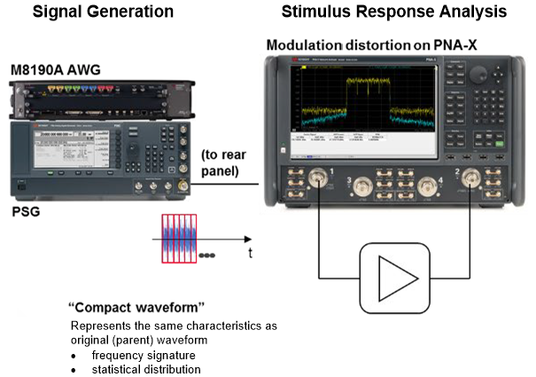

## Compact Modulated Waveform

The modulation distortion application uses a short waveform period to perform
an accurate measurement within a relatively short time frame. This process is
known as compacting the waveform.

For example, use this process if you want to determine the response of the DUT
using a waveform under a specific modulation scheme. The VNA firmware helps to
create a slice of the parent waveform. The waveform inherits the frequency
signature and statistical characteristics. The sliced waveform is called the
compact test signal.

The parent waveform is created using the Keysight Signal Studio Software and
is a .wfm file. (The parent waveform is also referred to as the original
waveform.) In addition, you can use a .csv file format that has a timestamp,
I, and Q that uses a comma to separate the values.

Note: Encrypted .wfm files created using the N5182B MXG RF Vector Signal
Generator are not supported.

The following parent waveform is a 5G NR 100 MHz bandwidth signal:

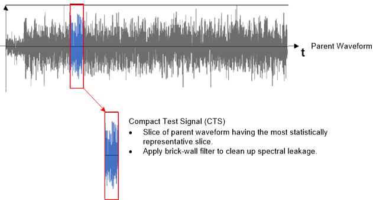

The PNA-X firmware uses a unique algorithm to determine the most statistically
representative slice from the parent signal. The results are from the
parameters selected in the [Create Modulation
dialog](Create_Modulation_Files.htm#Compact). The firmware then applies a
brick wall filter to remove spectral leakage when the compact test signal
plays.

The following shows the CDF of a parent signal and subset slice:

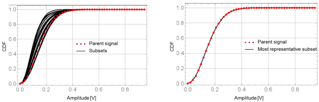

Depending on the parameters selected in the [Create Modulation
dialog](Create_Modulation_Files.htm#Compact), the compact test signal displays
different characteristics, which can affect the measurement result.

For example, if you are using a 5G NR 100 MHz bandwidth waveform as a parent
waveform to create a compact test signal, the plots below illustrate two
different compact test signal characteristics when using different parameters
for the same parent waveform.

The yellow trace indicates the parent waveform, and the blue trace shows the
compact test signal. The plots on the left display a compact test signal
consisting of 1,001 tones with a 100 kHz tone spacing. The plots on the right
display a compact test signal consisting of 10,001 tones with a 10 kHz tone
spacing.

The following plots represent the spectrum of the waveform. The results show
what the waveform looks like in the frequency domain by applying the Fast
Fourier Transform (FFT) to each waveform. The frequency signature of signals
in both the left and right plots have the same bandwidth as the original
signal. The original signal has a higher out-of-band spectrum. The compact
test signal has a low out-of-band spectrum that uses the brick wall filter for
cleaning the signal.

CTS #1: 1,001 Tones |  CTS #2: 10,001 Tones  
---|---  
  
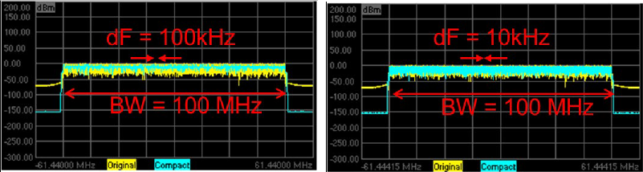

The following plots represent the position of a compact test signal within the
parent signal in the time domain. The numbers shown represent the waveform
length (reciprocal of the tone spacing). The left compact test signal has a
waveform length of 10 us; the waveform length of the right compact test signal
is 100 us. A finer tone spacing waveform results in an extended period of the
compact test signal waveform.

CTS #1: 1,001 Tones |  CTS #2: 10,001 Tones  
---|---  
  
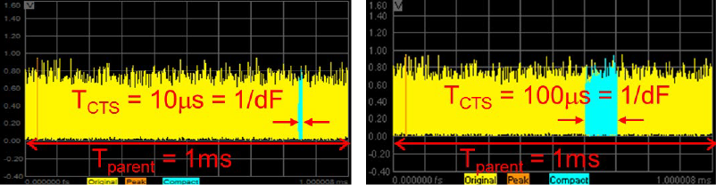

The following plots represent the complementary cumulative distribution
function (CCDF) curve of the parent signal, compact test signal, as well as
Gaussian distribution (pink trace). The CCDF of this specific parent waveform
is in alignment with the Gaussian distribution. The CCDF of a compact test
signal that consists of 10,001 tones aligns with the parent waveform across
the entire probability. The CCDF of a compact test signal that includes 1,001
tones aligns with the parent waveform, but only until it is approximately a
0.1% probability.

CTS #1: 1,001 Tones |  CTS #2: 10,001 Tones  
---|---  
  
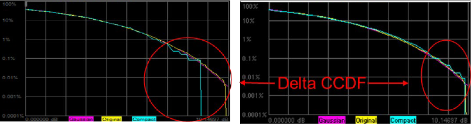

## Measuring Spectrum Using VNA Receivers

The following is a simplified block diagram of a modulation distortion setup
showing the VNA receivers and VSG.

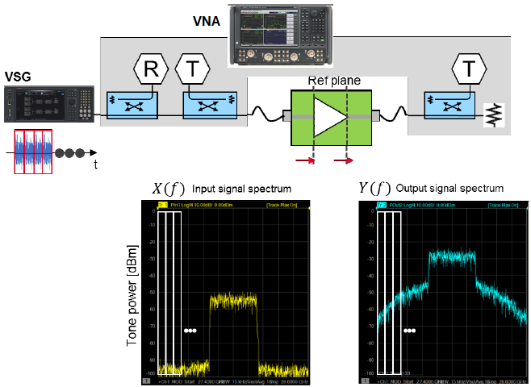

The VSG replays the compact test signal without any interruptions. Three VNA
receivers capture the spectrum at the reference plane at the input and output
of the DUT. The instantaneous bandwidth of the VNA ADC (Analog-to-Digital
Converter) is at 30 MHz. When the modulation distortion application measures
the spectrum of the signal with a bandwidth wider than 30 MHz, it moves the
local frequency of the VNA to measure the spectrum for each instantaneous
bandwidth. It then combines the captured partial spectrum to obtain a complete
spectrum response.

When the modulation distortion application measures the spectrum for each
section, it uses multiple receivers coherently and applies linear calibration
terms. The modulation distortion application offers a measuring technique
where the VNA completes accurate vector corrected measurements at the
reference plane.

The block diagram above shows how the VNA measures the input signal and the
output signal spectrum:

  * Signal generator generates a repetitive compact test signal.

  * VNA receiver measures the input signal spectrum and output signal spectrum in the frequency domain.

  * Output signal spectrum has spectral regrowth created by the nonlinear response of the DUT.

## Spectrum Decomposition

The DUT is stimulated with a low-level signal to measure its linear parameters
and a high-level modulated signal to measure its distortion characteristics.
The modulation distortion application processes the data and compares the
input spectrum X(f) and the output spectrum Y(f) using a process known as
spectral correlation. As a result, the modulation distortion application
decomposes the output signal spectrum into two parts: H(f)*X(f) and D(f).
H(f)*X(f) linearly correlates to the input while D(f) represents the
distortion which does not correlate to the input.

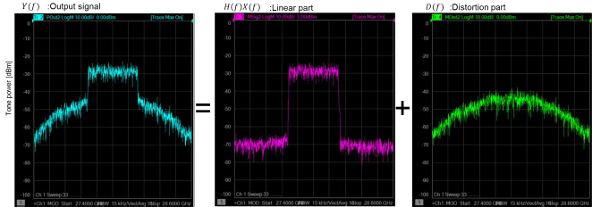

## Computing ACPR and EVM

Computing ACPR is similar to the traditional signal generator and signal
analyzer approach. The channel power of the in-band channel of interest and
the channel power of the adjacent channel band is evaluated. The ratio between
the BAND and AC is then computed.

For the EVM computation, the compact test signal plays continuously in the
signal generator following the measurement of the input and output response of
the DUT in the frequency domain. Spectrum correlation is then performed to
compute the EVM.

When viewed in the frequency domain, this signal is a mult-tone "grid" of
frequencies. The data is measured on this multi-tone gird.

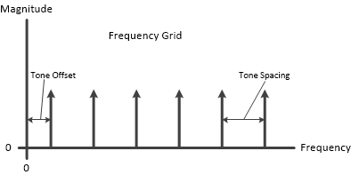

## Optimizing Modulation Distortion Measurements

### Signal-to-noise ratio of the spectrum measurement

Poor EVM occurs when the random noise is the dominant factor of the EVM, where
it likely happens at the left side of the bathtub curve. Improving the SNR of
the measurement can improve the accuracy of the measurement.

### Noise bandwidth

The resolution bandwidth and the number of coherent averaging of the
measurement determine the noise bandwidth. The default value of the noise
bandwidth is 1 kHz. Noise bandwidth determines the signal-to-noise ratio (SNR)
of the measurement system and measurement time.

As noise bandwidth decreases, modulation distortion increases the underlying
coherent average. The result is a wider signal noise ratio and longer
measurement time. The resolution bandwidth is set automatically with firmware
from the compact test signal waveform length; it is a discrete number. It is
the closest value to the one you entered.

### Signal noise ratio of the vector signal generator

The SNR of the VSG differs depending on multiple factors. A key factor is the
number of tones of the compact test signal. As you increase the number of
tones, the SNR of the VSG degrades. For example, compare a compact test signal
with 1,000 tones and a compact test signal with 10,000 tones given the same
channel power: -10dBm.

The tone power level of the compact test signal with 1,000 tones is -40 dBm,
while the tone power of the compact test signal with 10,000 tones is -50 dBm.
If the measurement has the same noise floor for each compact test signal, the
compact test signal with 1,000 tones is 10 dB better than the compact test
signal with 10,000 tones.

### Nonlinearity of the test receiver

If there is a nonlinear response in the test receiver, it is unable to
distinguish nonlinearity that comes either from the DUT or the receiver of the
test system. The PNA-X test receiver needs to be in linear when measuring the
signal. When it measures the subtle nonlinearity of a DUT, such as the EVM
level of 1%, the recommendation is to keep the power level less than -5 dBm at
the test port of the PNA-X. Use the receiver attenuator to adjust the power
level if the test port power is higher than -5 dBm.

### Nonideal compact test signal

The linear error due to the test system can be corrected to have the desired
compact test signal at the reference plane. You can do this by adjusting the
channel power and linear flatness response using the modulated correction
feature. Also, out-of-band spectral regrowth is suppressible by adjusting the
ACPR.

### Compact test signal statistical characteristics

It is critical to understand that nonlinear characteristics of the DUT under
modulated signal condition is highly dependent on the stimulus signal. It is
also important to create the compact test signal that can stimulate the DUT
with the most representative statistical characteristics to the practical
usage of the DUT.

The best practice is to align the complementary cumulative distribution
function (CCDF) of the compact test signal with the parent waveform. However,
the CCDF is not the same since the compact test signal is a slice of the
parent waveform. The recommendation is to match the CCDF until it is 0.1% of
probability. By choosing more than 3,000 tones gives you a good match of the
CCDF — up to 0.1%.

### Measurement throughput

Faster measurement time gives faster throughput to complete the evaluation.
You can determine measurement time using these parameters:

  * signal analyzer span

  * noise bandwidth

  * compact test signal number of tones

Measurement time and measurement accuracy is generally a trade-off. It is
essential to have the right balance of speed and accuracy to modify the
parameter depending on the target measurement value.

## Modulation Distortion Graphical User Interface

The GUI consists of setup dialogs accessed by clicking on their corresponding
tabs. In this way, configurations can be set up quickly. See [Configuring
Distortion Measurements](Modulation_Distortion_Settings.htm) for information
about these dialogs.

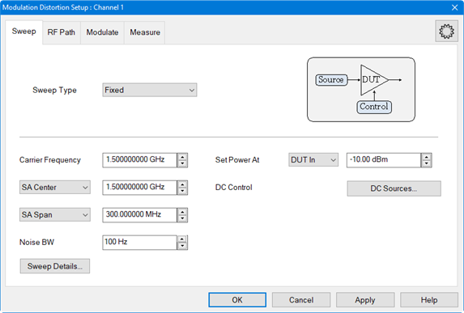

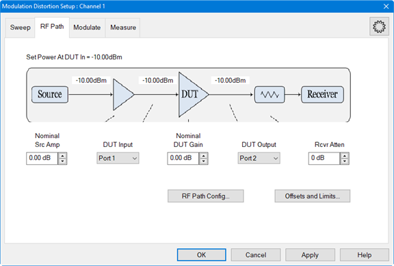

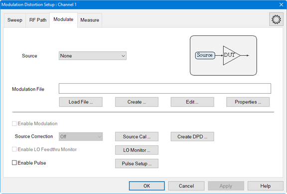

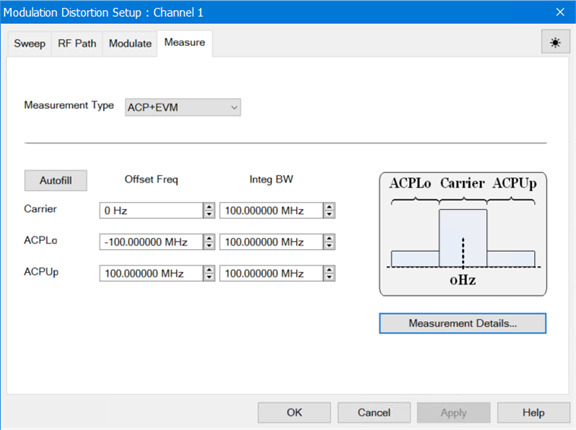

The Create... button in the Modulate tab accesses the Create Modulation dialog
used to set up the compact test signal. See [Creating Modulation
Files](Create_Modulation_Files.htm) for information about this dialog.

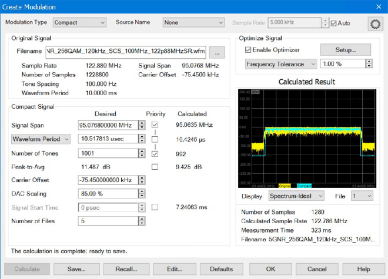

