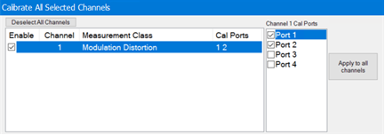
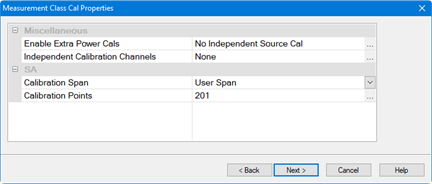
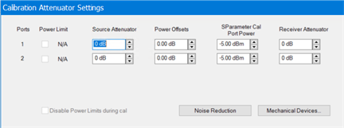
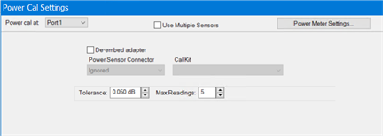

# S-Parameter Calibration

Note: Perform this calibration before the [Source Modulation
Calibration](Modulation_Flatness_and_Power_Calibration.htm).

The example procedure in this topic describes how to perform a typical
calibration using the Cal All Calibration Wizard method, which allows multiple
channel calibrations in a single session. For more information about this
calibration method, refer to [Calibrate All
Channels](../../S3_Cals/Calibrate_All_Channels.htm).

  1. Ensure that the Modulation Distortion measurement class to be calibrated is currently active.

  2. Press Cal > Main > Cal All... to launch the following dialog showing the active measurement class:  
  

  3. Select the ports.

  4. Click Next, then confirm or change the calibration properties in the Measurement Class Cal Properties dialog:  
  

  5. Click Next. to access the Calibration Attenuator Settings dialog:  
  

  6. In the Calibration Attenuator Settings dialog, perform the following:

        1. Set the attenuator settings. [Learn more](../../S3_Cals/Calibrate_All_Channels.md#CalAttnSettingsDiag).

        2. Click on the Noise Reduction button to improve measurement accuracy. [Learn more](../../S2_Opt/Trce_Noise.md).

        3. Click on the Mechanical Devices button to view all switches and attenuators in the VNA. [Learn more](../../System/Mechanical_Devices.md).

  7. Click Next, then select the DUT connectors and calibration kits in the Select DUT Connectors and Cal Kits dialog.  
  

  8. Click Next to access the Power Cal Settings dialog.  
  

  9. In the Power Cal Settings dialog, set the desired Tolerance and Max Readings. Learn more about [Accuracy Tolerance](../../S3_Cals/Guided_Power_Calibration.md#Accuracy) and [Max Number of Readings](../../S3_Cals/Guided_Power_Calibration.md#Accuracy).

  10. Click Next and follow the calibration process until completed.

