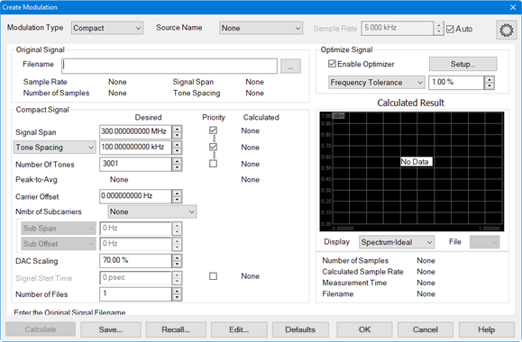
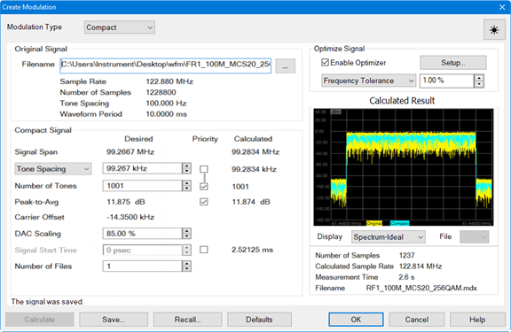
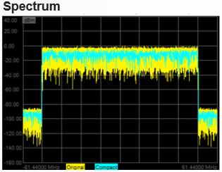
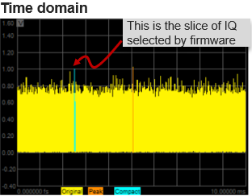
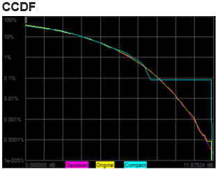
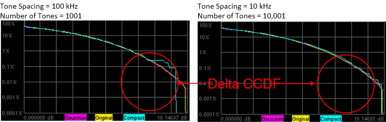

# Set Up a Compact Modulation Type

  1. If the Modulation Distortion Setup dialog is not displayed, press Freq> SA Frequency > MOD Setup....

  2. The Sweep, RF Path, Modulate, or Measure tab functions can now be selected.

  3. Select the Modulate tab.  
  

  4. In the Modulate tab, click on the Create... button to access the Create Modulation dialog.  
  

  5. In the Modulation Type pull down menu, select Compact. 

  6. In the Source Name pull down menu, select the source. If it is not in the list, select Add Source... then refer to [Set Up the External Source](Set_Up_the_External_Source.md) to set up a source.

  7. In the Filename field, click on the "..." button to the right of this field and load the original (parent) signal file. The compact test signal will be based on this original signal and is generated automatically. The input waveforms are created using Signal Studio or IQ files in *.csv format. The resultant compact test signal version of the waveform matches the CCDF and PSD of the “parent-IQ waveform”.

  8. The settings under Compact Signal are filled in based on the original signal. 

  9. Click on the Calculate button then under Calculated Result, verify that the signal looks reasonable.

  10. To make adjustments to the settings, perform the following procedure (optional):

     1. Set the Number of Files to 2 using the up arrow. This function is useful to create several signals, compare them, then save the best signal.

     2. To adjust the frequency span of the modulated carrier, click in the Signal Span data entry field then use the up/down arrows or double-click in the data entry field then enter the frequency using the displayed keypad. 

     3. To adjust the distance between each tone, click in the Tone Spacing data entry field then use the up/down arrows or double-click in the data entry field then enter the frequency using the displayed keypad. 

     4. To adjust the number of tones, click in the Number of Tones data entry field then use the up/down arrows to make a change. Increasing the number of tones increases the CCDF accuracy.

     5. To adjust the carrier offset value relative to the carrier LO frequency, click in the Carrier Offset data entry field then use the up/down arrows or double-click in the data entry field then enter the frequency using the displayed keypad. 

     6. To define a multicarrier signal, select 2, 3, 4, 5, 6, 7, 8, or 9 from the Nmbr of Subcarriers pull-down menu then set the corresponding SubN Span and SubN Offset (where "N" is the subcarrier number).

     7. To adjust the the scaling factor used for the waveform (full scale = 100%), click in the DAC Scaling data entry field then use the up/down arrows or double-click in the data entry field then enter the value using the displayed keypad. This ensures that the DAC filter does not output a signal that is larger than the DAC's maximum output level, which can cause distortion in the system. Setting the scaling factor to 100% will usually cause excessive distortion.

     8. To adjust where to start the compact signal within the original signal, check the Priority check box for Signal Start Time, click in its data entry field, then use the up/down arrows or double-click in the data entry field then enter the start time using the displayed keypad.

     9. With the Enable Optimizer check box checked, the calculated modulated signal will be optimized according to the constraints defined in Optimize Signal group box. For more information, refer to the description for [Enable Optimizer](Create_Modulation_Files.md#Enable_Optimizer) and the [Optimizer Setup](Create_Modulation_Files.md#OptimizerSetupDialog) dialog.

     10. To adjust the allowed tolerance for tone spacing when calculating the modulation signal, select Frequency Tolerance from the Optimize Signal pull down menu, click in its data entry field, then use the up/down arrows or double-click in the data entry field then enter the tolerance using the displayed keypad.

     11. To adjust minimum period of the waveform greater than or equal to the specified value (seconds), select Min Waveform Period from the Optimize Signal pull down menu, click in its data entry field, then use the up/down arrows or double-click in the data entry field then enter the period using the displayed keypad.

     12. To adjust minimum number of tones greater than or equal to the specified value, select Min Number of Tones from the Optimize Signal pull down menu, click in its data entry field, then use the up/down arrows or double-click in the data entry field then enter the number of tones using the displayed keypad. This will ignore the Number of Tones selection.

     13. To adjust maximum tone spacing less than or equal to the specified value (Hz), select Max Tone Spacing from the Optimize Signal pull down menu, click in its data entry field, then use the up/down arrows or double-click in the data entry field then enter the maximum tone spacing using the displayed keypad. This will ignore the Tone Spacing selection.

     14. After making any adjustments, click on the Calculate button then, under Calculated Result, verify that the signal looks reasonable. 

     15. Use the File pull down menu to switch between the first and second file for comparison. 

     16. Choose the best signal.

  11. Click the Save... button and save the compact test signal file. The filename is displayed below the display window.  
  

  12. In the Display pull down menu, select Spectrum-Ideal. Signals similar to the following should be displayed:  
  

  13. In the Display pull down menu, select Time. Signals similar to the following should be displayed:  
  

  14. In the Display pull down menu, select CCDF. The following plot represents the complementary cumulative distribution function (CCDF) curve of the original (parent) signal, compact test signal, as well as the Gaussian distribution (pink trace):  
  

  15. Increasing the number of tones results in the following:

  16. Finer tone spacing.

  17. Longer period for the compact test signal.

  18. More accurate CCDF as shown below.

  16. Click on the OK button. The modulation file is uploaded to the external source.

  17. The Autofill Measurements message is displayed asking whether to autofill measurement frequencies or not. These frequencies are in the Measure tab. [Learn more](Modulation_Distortion_Settings.md#Autofill).  
  

  18. Click Yes.

