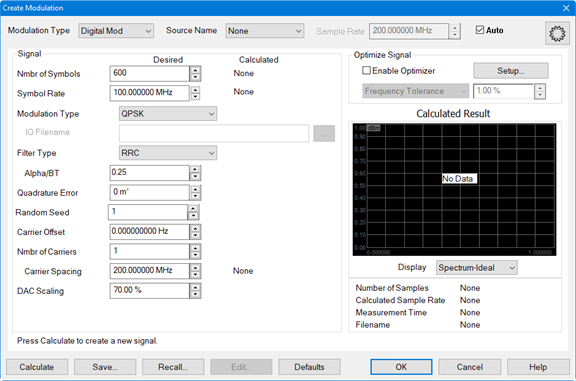
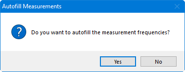

# Set Up a Digital Modulation Type

  1. If the Modulation Distortion Setup dialog is not displayed, press Freq> SA Frequency > MOD Setup....

  2. The Sweep, RF Path, Modulate, or Measure tab functions can now be selected.

  3. Select the Modulate tab.  
  

  4. In the Modulate tab, click on the Create... button to access the Create Modulation dialog.

  5. In the Modulation Type pull down menu, select Digital Mod.   
  
  

  6. In the Source pull down menu, select the source. If it is not in the list, select Add Source... then refer to [Set Up the External Source](Set_Up_the_External_Source.md) to set up a source.

  7. In the Nmbr of Symbols field, specify the number of symbols.

  8. In the Symbol Rate field, specify the symbol rate (frequency).

  9. In the Modulation Type pull-down menu, select the desired type. Select IQ File to load an existing IQ file by clicking the "..." button In the IQ Filename field, then navigate to the file. [Learn more](Create_Modulation_Files.md#Modulation_Type).

  10. In the Filter Type pull-down menu, select the filter type to apply to the time data.

  11. In the Alpha/BT field, enter the Alpha/BT filter characteristics of the selected filter.

  12. The Quadrature Error field indicates the orthogonal error between the I and Q signals.

  13. In the Random Seed field, enter the random seed value. [Learn more](Create_Modulation_Files.md#Random_Seed).

  14. To adjust the carrier offset value relative to the carrier LO frequency, click in the Carrier Offset data entry field then use the up/down arrows or double-click in the data entry field then enter the frequency using the displayed keypad. 

  15. To define a multicarrier signal, enter the number of carriers in the Nmbr of Carriers field then set the desired spacing between carriers using Carrier Spacing.

  16. To adjust the the scaling factor used for the waveform (full scale = 100%), click in the DAC Scaling data entry field then use the up/down arrows or double-click in the data entry field then enter the value using the displayed keypad. This ensures that the DAC filter does not output a signal that is larger than the DAC's maximum output level, which can cause distortion in the system. Setting the scaling factor to 100% will usually cause excessive distortion.

  17. With the Enable Optimizer check box checked, the calculated modulated signal will be optimized according to the constraints defined in Optimize Signal group box. For more information, refer to the description for [Enable Optimizer](Create_Modulation_Files.md#Enable_Optimizer) and the [Optimizer Setup](Create_Modulation_Files.md#OptimizerSetupDialog) dialog.

  18. After making any adjustments, click on the Calculate button then, under Calculated Result, verify that the signal looks reasonable. 

  19. Click the Save... button and save the test signal file. 

  20. Click on the OK button. The modulation file is uploaded to the external source.

  21. The Autofill Measurements message is displayed asking whether to autofill measurement frequencies or not. These frequencies are in the Measure tab. [Learn more](Modulation_Distortion_Settings.md#Autofill).  
  

  22. Click Yes.

