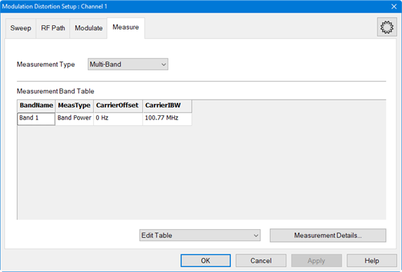
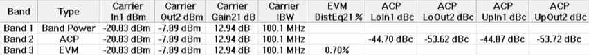

# Set Up a Multi-Band Measurement

The Multi-Band measurement allows multiple measurement types with
corresponding measurement data to be displayed in a single table.

In this topic:

  * Multi-Band Measurement Criteria
  * Multi-Band Measurement Setup

## Multi-Band Measurement Criteria

The procedures in the list below must be performed prior to making Multi-Band
measurements. For purposes of this example, the DUT used is an amplifier and
the Modulation Type is Flat Tones.

  * Required set up procedures:
    * [Hardware Setup for Amplifiers](Hardware_Setup_for_Amplifier.md)
    * Create a Modulation Distortion Channel
    * [Set Up a Sweep](Set_Up_a_Sweep.md)
    * [Set Up the RF Path](Set_Up_the_RF_Path.md)
    * [Set Up the External Source](Set_Up_the_External_Source.md)
    * [Set Up a Flat Tones Modulation Type](Set_Up_a_Flat_Tones_Modulation_Type.md)
  * Calibration procedures:
    * [Phase Reference Wizard](../../FreqOffset/Phase_Reference_Calibration.md)
    * [S-Parameter Calibration](S-Parameter_Calibration.md)
    * [Source Modulation Calibration](Modulation_Flatness_and_Power_Calibration.md)

## Multi-Band Measurement Setup

  1. If the Modulation Distortion Setup dialog is not displayed, press Freq > SA Frequency > MOD Setup....
  2. The Sweep, RF Path, Modulate, or Measure tab functions can now be selected.

  3. Select the Measure tab.  
  

  4. In the Measurement Type pull down menu, select Multi-Band.  
  

  5. Click on the Edit Table pull down menu then select Append Band.

  6. In the MeasType column for the new entry, select ACP.

  7. Click on the Edit Table pull down menu then select Append Band.

  8. In the MeasType column for the new entry, select EVM.

  9. Click on the Edit Table pull down menu then select Autofill Current Table from Mod File. Measurement settings from the currently active modulation file loaded in the source are used for all measurement types in the table.

  10. To change the band name, right-click in the Band Name field to display a keyboard for editing the name.  
  

  11. Type in the band name then click on Enter.

  12. Click on the Apply button to apply the changes. The Multi-Band table is displayed below the measurement area with the default measurement parameters.

  13. Click on the OK button to close the dialog.

  14. Additional measurement parameters can be selected for any measurement type using the [Distortion Table Setup](Displaying_Distortion_Parameters.md#Distortion_Table_dialog_help) dialog. Press Meas > Main > Distortion Table... or right-click on the Distortion Table displayed below the measurement area then select Edit Columns... in the pop-up menu. The Distortion Table Setup dialog is displayed:  
  

  15. Select the measurement type tab then add the desired measurement parameters.

  16. Click on the OK button to close the dialog.

  17. Ensure that the VNA Trigger is set to Continuous. Press Trigger > Main > Continuous.

  18. The following shows a Multi-Band measurement:  
  

Note: NPR was not measured because it requires a NPR Notch modulation type
instead of the Flat Tones modulation type used here to measure ACP, EVM, and
Band Power.

