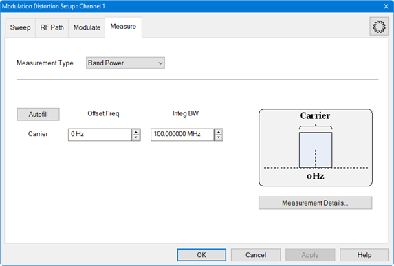
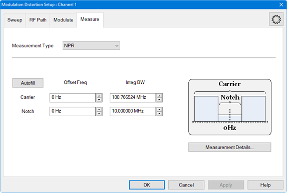
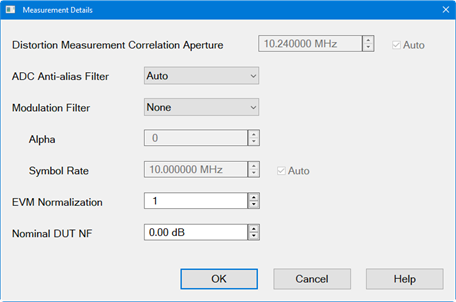
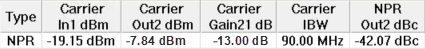
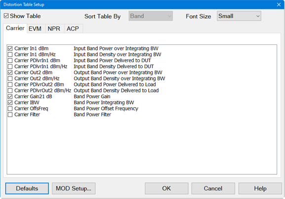
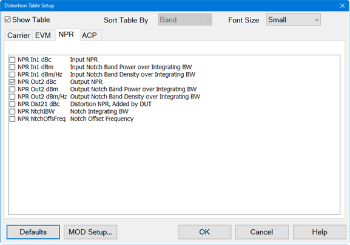
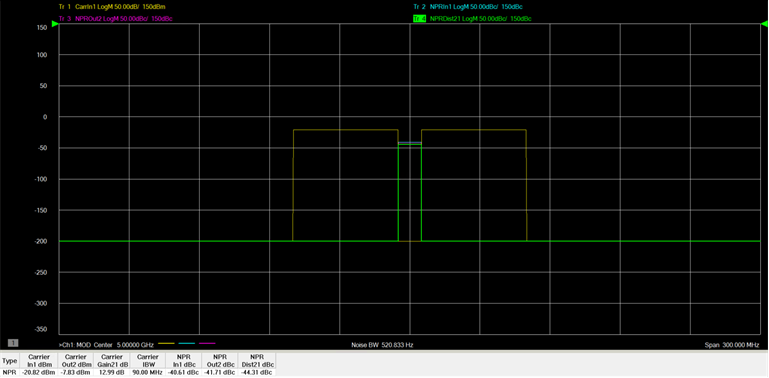

# Set Up a NPR Measurement

NPR Notch is a Noise Power Ratio measurement. The notch is created where no
signals are present. With the stimulus applied to the DUT, the ratio of the
noise power of the carrier to the noise power in the notch is measured.

In this topic:

  * NPR Measurement Criteria
  * Input/Output NPR and NPR Contribution of the DUT

## NPR Measurement Criteria

The procedures in the list below must be performed prior to making NPR
measurements. For purposes of this example, the DUT used is an amplifier and
the Modulation Type is NPR Notch.

  * Required set up procedures:
    * [Hardware Setup for Amplifiers](Hardware_Setup_for_Amplifier.md)
    * Create a Modulation Distortion Channel
    * [Set Up a Sweep](Set_Up_a_Sweep.md)
    * [Set Up the RF Path](Set_Up_the_RF_Path.md)
    * [Set Up the External Source](Set_Up_the_External_Source.md)
    * [Set Up a NPR Notch Modulation Type](Set_Up_a_NPR_Notch_Modulation_Type.md)
  * Calibration procedures:
    * [Phase Reference Wizard](../../FreqOffset/Phase_Reference_Calibration.md)
    * [S-Parameter Calibration](S-Parameter_Calibration.md)
    * [Source Modulation Calibration](Modulation_Flatness_and_Power_Calibration.md)

## Input/Output NPR and NPR Contribution of the DUT

  1. If the Modulation Distortion Setup dialog is not displayed, press Freq > SA Frequency > MOD Setup....
  2. The Sweep, RF Path, Modulate, or Measure tab functions can now be selected.

  3. Select the Measure tab.  
  

  4. In the Measurement Type pull down menu, select NPR.  
  

  5. Click on the Autofill button to automatically fill in the measurement settings for all bands from the currently active modulation file loaded in the source. Therefore, changing the settings in the following steps is optional.

  6. To offset the Carrier integration bandwidth relative to the Carrier LO used to generate the modulation signal, use the up/down arrows in the Carrier Offset Freq field or double-click in the field then enter the value using the displayed keypad.

  7. To set the Carrier integration bandwidth for the distortion measurement, use the up/down arrows in the Carrier Integ BW field or double-click in the field then enter the value using the displayed keypad. The IBW is used to determine total signal power within a specified frequency span.

  8. To offset the Notch center relative to the carrier LO used to generate the modulation signal, use the up/down arrows in the Notch Offset Freq field or double-click in the field then enter the value using the displayed keypad.

  9. To set the integration bandwidth of the NPR notch measurement, use the up/down arrows in the Notch Integ BW field or double-click in the field then enter the value using the displayed keypad.

  10. To adjust other measurement settings, click on the Measurement Details... button:  
  

     1. To set the frequency span window used for modeling the DUT's gain and distortion, use the up/down arrows in the Distortion Measurement Correlation Aperture field or double-click in the field then enter the value using the displayed keypad. Checking Auto will automatically set Distortion Measurement Correlation Aperture to window size.

     2. To select the IF filter anti-aliasing path, click on the ADC Anti-alias Filter pull down menu then select Auto, Wide, or Narrow. Auto will automatically set the ADC Filter setting based on the ADC Sampling Frequency. If the currently selected modulation waveform was created with Nyquist Rejection = OFF, then the VNA will measure the signal using the Narrow anti-alias filter in the receiver. Wide selects the ADC 38 MHz IF filter path. Narrow selects the ADC 11 MHz IF filter path. A warning message will appear if the Narrow IF filter path is selected and the Resolution Bandwidth is > 1 MHz.

     3. To set the measurement filter to either None (default) or RRC (root-raised-cosine filter), click on the Modulation Filter pull down menu then make the selection. With RRC selected, Alpha sets the Alpha factor of the filter and Symbol Rate sets the Symbol Rate of the filter. If Auto is selected, the Symbol Rate from the file is used. If no Symbol Rate is indicated in the file, then the Symbol Rate will be approximated from the bandwidth of the signal.

     4. Click on the OK button.

  11. Click on the Apply button to apply the setting changes made in this dialog.

  12. Click on the OK button to close the dialog.

  13. Ensure that the VNA Trigger is set to Continuous. Press Trigger > Main > Continuous.

  14. The Distortion Table is displayed below the measurement area. Each column represents a measurement parameter. The measurement parameters shown in the Distortion Table below are the default parameters selected for an NPR measurement. In this case, only the output NPR is selected so the input NPR will be added in the following steps.  
  

  15. The measurement parameters are selected using the [Distortion Table Setup](Displaying_Distortion_Parameters.md#Distortion_Table_dialog_help) dialog. To add or change parameters, press Meas > Main > Distortion Table... or right-click on the Distortion Table displayed below the measurement area then select Edit Columns... in the pop-up menu. The Distortion Table Setup dialog is displayed:  
  

  16. Select the NPR tab.  
  

  17. Check the NPR In1 dBc (input NPR) and NPR Dist21 dBc (NPR contribution by DUT) measurement parameters then click on the OK button.

  18. To view traces displaying the Input/Output NPR and NPR contribution by DUT, perform the following:

     1. Press Meas > Main > Other... then click on the "..." button. The Measure dialog is displayed:  
  

     2. Select the Distortion tab to display distortion traces:  
  

     3. Check NPRIn1 to measure input NPR then click on the Apply button.

     4. In the Distortion tab, check New trace. If any parameters are currently checked, uncheck them.

     5. Check NPROut2 to measure the output NPR then click on the Apply button.

     6. In the Distortion tab, check New trace. If any parameters are currently checked, uncheck them.

     7. Check NPRDist21 to measure the NPR contribution by the DUT then click on the OK button.

     8. If necessary, press Scale > Main > Scale Coupling..., select Window as the Coupling Method, then click OK. This re-scales all traces to the same scale.

     9. Click on the Autoscale All softkey.

  19. The following is an example of a typical trace and Distortion Table showing input and output NPR and NPR contribution of the DUT:  
  

