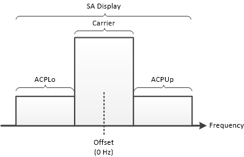
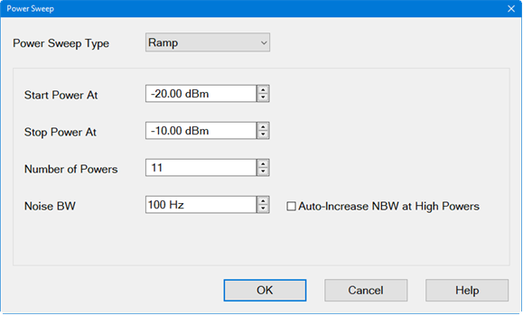
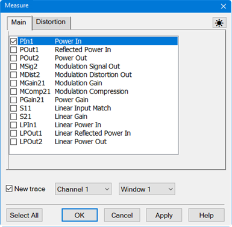
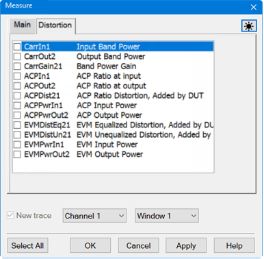
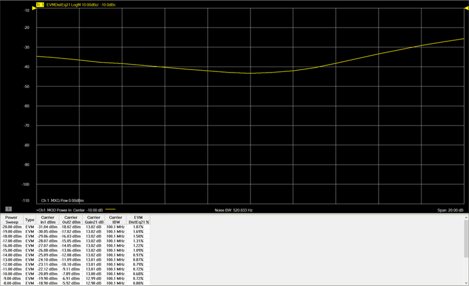

# Set Up a Power Sweep Measurement

A Power Sweep measurement can be set up to sweep power within a specified
power range and specified number of powers. A trace can be set up to display
input power on the X axis with the EVM measurement on the Y axis. This
displays a "bathtub" type curve due to noise at low power levels and
distortion at high power levels.

  1. If the Modulation Distortion Setup dialog is not displayed, press Freq> SA Frequency > MOD Setup....
  2. The Sweep, RF Path, Modulate, or Measure tab functions can now be selected.

  3. Select the Sweep tab.  
  

  4. Click on the Sweep Type pull down menu then select Power.

  5. Set the Carrier Frequency by either using the up/down arrows or by double-clicking in the data entry field and entering the frequency using the displayed keypad. This is dependent upon the frequency of the DUT.

  6. Set the SA Center by either using the up/down arrows or by double-clicking in the data entry field and entering the frequency using the displayed keypad. This sets the Spectrum Analyzer display center. 

  7. Set the SA Span by either using the up/down arrows or by double-clicking in the data entry field and entering the frequency using the displayed keypad. This sets the Spectrum Analyzer (SA) display span. The following graphic shows the SA display set to the same center frequency as the Carrier and covering a span that includes the integrated bandwidth settings of ACPLo + Carrier + ACPUp.   
  

  8. Set the Noise BW by either using the up/down arrows or by double-clicking in the data entry field and entering the value using the displayed keypad. Noise BW is equal to the Resolution BW divided by the Vector Average factor.

  9. Click on the Sweep Details... button to set the following:

     * Force RF Power OFF at the End of Sweep - System Preference \- If enabled, RF power is turned off at the end of a sweep. 

  10. Delay Before Start of Sweep \- Same as [Sweep Delay](../../S1_Settings/Sweep.md#SweepSetupDiag) in a standard channel.

  11. Delay Before Distortion Measurement \- Adds delay after the linear S-parameter sweep and before the distortion measurement to allow the RF source to settle.

  12. Enable S-Param Sweep - Enables S-parameters to be measured at the low linear power level. If disabled (default), curve fitting (smoothing) is used instead of the S-parameter sweep. Curve fitting can be adjusted by varying the window aperture using the [Equalization Aperture](Modulation_Distortion_Settings.md#Equalization_Aperture) setting in the Measurement Details dialog. 

  13. S-Param Source \- Selects source and signal used to measure S-parameters.

  14. External Vector - Chirp \- Selects a chirp signal from the external signal generator for measuring S-parameters.

  15. S-Param Power \- Sets the power level used at the DUT input to measure the DUT gain when operating in its linear region. The linear gain is used to calculate distortion.

  16. S-Param Freq Step \- Frequency step size setting used when measuring S-parameters.

  17. S-Param IFBW \- Bandwidth setting when measuring S-parameters.

  18. Re-use Previous S-Parameter Measurements If Available \- If disabled, S-parameters will be measured at the low linear power level. If enabled and compatible measurements exist from a previous sweep, those measurements will be used and a Linear S-parameter sweep will not be performed. If enabled and compatible measurements are not available, then a Linear S-parameter sweep will be performed.

  10. Click on the Power Sweep... button to set up the Power Sweep dialog as follows:  
  

     1. Set Start Power At to -20 dBm.

     2. Set Stop Power At to 0 dBm.

     3. Set Number of Powers to 21.

     4. Set Noise BW to 520.833 Hz.

     5. Click OK.

  11. Select the Set Power At pull down to set the power at the DUT In. 

  12. To set up a power supply, click on the DC Sources... button which accesses the standard dialog for controlling power supplies. [Learn more](../../S1_Settings/DC_Control.md).

  13. Click on the Apply button to apply the setting changes made in this dialog.

  14. Set up an EVM measurement as described in [Set Up an EVM Measurement](Set_Up_an_EVM_Measurement.md).

  15. To view a trace displaying the equalized EVM of the DUT (non-linear contribution), perform the following:

     1. Press Meas > Main > Other... then click on the "..." button. The Measure dialog is displayed:  
  

     2. Select the Distortion tab to display distortion traces:  
  

     3. Check EVMDistEq21 then click on the OK button. This trace measures the EVM equalized distortion added by DUT (non-linear contribution).

  16. Select Sweep > Main > X-axis Type... and ensure that the X-axis Type is set to Power In.

  17. Click on the OK button.

  18. The following is an example of a typical "Bathtub" trace and Distortion Table showing power sweep values:  
  

