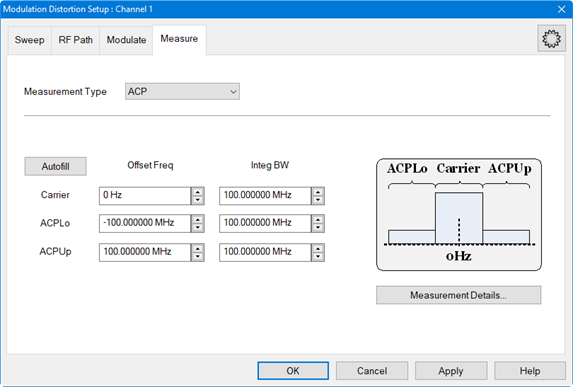
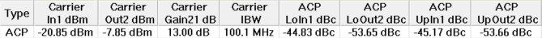
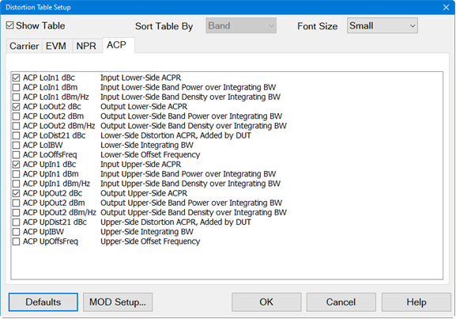
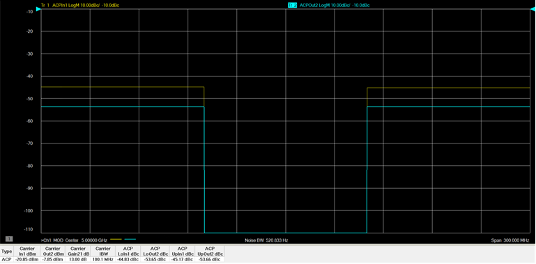
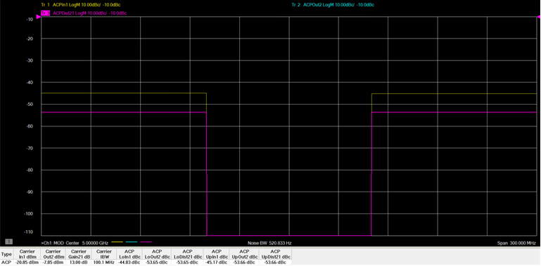

# Set Up an ACP Measurement

ACP (Adjacent Channel Power) measures the channel power of the lower and upper
adjacent channel band. DUT input and output ACP can be measured as well as the
DUT contribution.

In this topic:

  * ACP Measurement Criteria
  * Upper and Lower Side Bands of the Input and Output Signal
  * Upper and Lower Side Bands Contribution of the DUT

## ACP Measurement Criteria

The procedures in the list below must be performed prior to making ACP
measurements. For purposes of this example, the DUT used is an amplifier and
the Modulation Type is Flat Tones.

  * Required set up procedures:
    * [Hardware Setup for Amplifiers](Hardware_Setup_for_Amplifier.md)
    * Create a Modulation Distortion Channel
    * [Set Up a Sweep](Set_Up_a_Sweep.md)
    * [Set Up the RF Path](Set_Up_the_RF_Path.md)
    * [Set Up the External Source](Set_Up_the_External_Source.md)
    * [Set Up a Flat Tones Modulation Type](Set_Up_a_Flat_Tones_Modulation_Type.md)
  * Calibration procedures:
    * [Phase Reference Wizard](../../FreqOffset/Phase_Reference_Calibration.md)
    * [S-Parameter Calibration](S-Parameter_Calibration.md)
    * [Source Modulation Calibration](Modulation_Flatness_and_Power_Calibration.md)

## Upper and Lower Side Bands of the Input and Output Signal

  1. If the Modulation Distortion Setup dialog is not displayed, press Freq > SA Frequency > MOD Setup....
  2. The Sweep, RF Path, Modulate, or Measure tab functions can now be selected.

  3. Select the Measure tab.  
  

  4. In the Measurement Type pull down menu, select ACP.  
  

  5. Click on the Autofill button to automatically fill in the measurement settings for all bands from the currently active modulation file loaded in the source. Therefore, changing the settings in the following steps is optional.

  6. To offset the Carrier integration bandwidth relative to the Carrier LO used to generate the modulation signal, use the up/down arrows in the Carrier Offset Freq field or double-click in the field then enter the value using the displayed keypad.

  7. To set the Carrier integration bandwidth for the distortion measurement, use the up/down arrows in the Carrier Integ BW field or double-click in the field then enter the value using the displayed keypad. The IBW is used to determine total signal power within a specified frequency span.

  8. To offset the lower ACP integration bandwidth relative to the LO used to generate the modulated signal, use the up/down arrows in the ACPLo Offset Freq field or double-click in the field then enter the value using the displayed keypad.

  9. To set the integration bandwidth of the lower ACP measurement, use the up/down arrows in the ACPLo Integ BW field or double-click in the field then enter the value using the displayed keypad. The IBW is used to determine total signal power of the lower ACP within a specified frequency span.

  10. To offset the upper ACP integration bandwidth relative to the LO used to generate the modulated signal, use the up/down arrows in the ACPUp Offset Freq field or double-click in the field then enter the value using the displayed keypad.

  11. To set the integration bandwidth of the upper ACP measurement, use the up/down arrows in the ACPUp Integ BW field or double-click in the field then enter the value using the displayed keypad. The IBW is used to determine total signal power of the upper ACP within a specified frequency span.

  12. To adjust other measurement settings, click on the Measurement Details... button:  
  

     1. To set the frequency span window used for modeling the DUT's gain and distortion, use the up/down arrows in the Distortion Measurement Correlation Aperture field or double-click in the field then enter the value using the displayed keypad. Checking Auto will automatically set Distortion Measurement Correlation Aperture to window size.

     2. To select the IF filter anti-aliasing path, click on the ADC Anti-alias Filter pull down menu then select Auto, Wide, or Narrow. Auto will automatically set the ADC Filter setting based on the ADC Sampling Frequency. If the currently selected modulation waveform was created with Nyquist Rejection = OFF, then the VNA will measure the signal using the Narrow anti-alias filter in the receiver. Wide selects the ADC 38 MHz IF filter path. Narrow selects the ADC 11 MHz IF filter path. A warning message will appear if the Narrow IF filter path is selected and the Resolution Bandwidth is > 1 MHz.

     3. To set the measurement filter to either None (default) or RRC (root-raised-cosine filter), click on the Modulation Filter pull down menu then make the selection. With RRC selected, Alpha sets the Alpha factor of the filter and Symbol Rate sets the Symbol Rate of the filter. If Auto is selected, the Symbol Rate from the file is used. If no Symbol Rate is indicated in the file, then the Symbol Rate will be approximated from the bandwidth of the signal.

     4. Click on the OK button.

  13. Click on the Apply button to apply the setting changes made in this dialog.

  14. Click on the OK button to close the dialog.

  15. Ensure that the VNA Trigger is set to Continuous. Press Trigger > Main > Continuous.

  16. The Distortion Table is displayed below the measurement area. Each column represents a measurement parameter. The measurement parameters shown in the Distortion Table below are the default parameters selected for an ACP measurement.  
  

  17. The measurement parameters are selected using the [Distortion Table Setup](Displaying_Distortion_Parameters.md#Distortion_Table_dialog_help) dialog. To add or change parameters, press Meas > Main > Distortion Table... or right-click on the Distortion Table displayed below the measurement area then select Edit Columns... in the pop-up menu. The Distortion Table Setup dialog is displayed:  
  
  

  18. Select the ACP tab.  
  

  19. Check the desired measurement parameters then click on the OK button.

  20. To view traces displaying the ratio of upper and Lower side bands of the input and output signal, perform the following:

     1. Press Meas > Main > Other... then click on the "..." button. The Measure dialog is displayed:  
  

     2. Select the Distortion tab to display distortion traces:  
  

     3. To display a trace measuring the ratio of upper and lower side bands of the input signal, check ACPIn1 then click on the Apply button.

     4. In the Distortion tab, check New trace.

     5. To display a trace measuring the ratio of upper and lower side bands of the output signal, check ACPOut2 then click on the OK button.

  21. The following is an example of a typical trace and Distortion Table showing the ACP lower and upper input/output:  
  

## Upper and Lower Side Bands Contribution of the DUT

After setting up and performing an ACP measurement as described in the above
procedure, perform the following procedure to measure the distortion
contribution by the DUT.

  1. Press Meas > Main > Distortion Table... or right-click on the Distortion Table displayed below the measurement area then select Edit Columns... in the pop-up menu.

  2. In the Distortion Table Setup dialog, select the ACP tab.  
  

  3. Check the ACP LoDist21 dBc (lower side added by DUT) and ACP UpDist21 dBc (upper side added by DUT) parameters then click on the OK button. The added parameters are displayed as a new column in the Distortion Table displayed below the measurement area.

  4. To view a trace displaying the distortion contribution by the DUT, perform the following:

     1. Press Meas > Main > Other... then click on the "..." button. The Measure dialog is displayed:  
  

     2. Select the Distortion tab to display distortion traces:  
  

     3. In the Distortion tab, check New trace. If any parameters are currently checked, uncheck them.

     4. Check ACPDist21 then click on the Apply button.

     5. If necessary, press Scale > Main > Scale Coupling..., select Window as the Coupling Method, then click OK. This re-scales all traces to the same scale.

     6. Click on the Autoscale All softkey.

  5. The following is an example of a typical trace and Distortion Table showing the lower and upper contributions by the DUT:  
  

