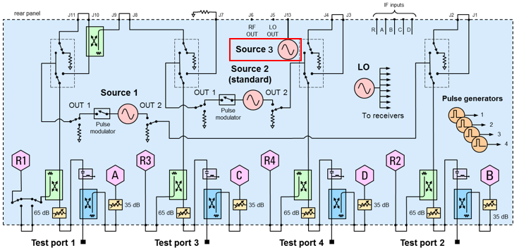

# Set Up Source3 Modulation Source - Option S93072B

Option S93072B Arbitrary Waveform Generation on XSB Port (requires Option
S93072B, Option XSB, Option S93070xB or Sx090A/B, and either Option 422 or
Option 423) allows you to generate arbitrary waveforms including multitone
signals.

The following PNA-X block diagram shows Option XSB with Option 423.

## Source3 Setup Limitations

#### Sample Rate

Allowed sample rate values are integer divisors of 19.2 GHz from 19.2 GHz to 1
MHz.

#### Signal Span

Allowed signal span is 1 MHz to 6 GHz.

Tone Spacing/Waveform Period

**Waveform Period can be from 1.666 nsec to 6.822 microseconds in multiples of
1.666 nsec. The waveform memory limitation is 2^17 or 128k and the waveform
length must be a multiple of 32. That is, the tone spacing of the underlying
waveform must be 600 MHz/N where N is 1 to 4096.**

Carrier Frequency

Signal Span/2 <= Carrier Frequency <= (6 GHz - Signal Span/2)

The carrier must land on the tone spacing grid:

  * For odd number of tones, Carrier Frequency = N*Tone Spacing

  * For even number of tones, Carrier Frequency = N*(Tone Spacing)/2, where N is odd.

## Select Source3 in Create Modulation Dialog

  1. If the Modulation Distortion Setup dialog is not displayed, press Freq> SA Frequency > MOD Setup....

  2. The Sweep, RF Path, Modulate, or Measure tab functions can now be selected.

  3. Select the Modulate tab.  
  

  4. In the Modulate tab, click on the Create... button to access the Create Modulation dialog.  
  

  5. In the Modulation Type pull down menu, select the desired modulation type. 

  6. In the Source Name pull down menu, select Source3.

  7. For the remainder of the setup, refer to the procedure corresponding to the Modulation Type selection in Step 5. 

     * [Set Up a Compact Modulation Type](Set_Up_a_Compact_Modulation_Type.md)

     * [Set Up a Flat Tones Modulation Type](Set_Up_a_Flat_Tones_Modulation_Type.md)

     * [Set Up a NPR Notch Modulation Type](Set_Up_a_NPR_Notch_Modulation_Type.md)

