# Narrowband Pulsed Application

* * *

Note: Beginning with the A.14.80.xx firmware release, the Narrowband Pulsed
Application is no longer available. The Integrated Pulse App (Opt S93026A/B)
replaces this application.

The Narrowband Pulsed Application is a Visual Basic program that provides a
user interface for making pulsed measurements.

In this topic:

  * [Required Options](Narrowband_Pulsed_Application.md#Overview)

  * [Connecting External Pulse Generators](Narrowband_Pulsed_Application.md#Physical)

  * [Using the Narrowband Pulsed Application](Narrowband_Pulsed_Application.md#Using)

  * [How to Configure Pulse Generators and Receivers](Narrowband_Pulsed_Application.md#configure)

  * [Calibration in Pulse Mode](Narrowband_Pulsed_Application.md#Calibration)

  * [Pulse Profiling](Narrowband_Pulsed_Application.md#profileDiag)

  * [Signal Reduction versus Gate Width](Narrowband_Pulsed_Application.md#reduction)

  * [Pulsed Frequency Converter Measurements](Narrowband_Pulsed_Application.md#Converter)

  * Writing your own Narrowband Pulsed Application

  * [Enhanced Pulse Measurement Capabilities](Narrowband_Pulsed_Application.md#PulsedMain)

  * [Support for Internal Pulse Generators / Modulators (PNA-X only)](Narrowband_Pulsed_Application.md#configure)

### See Also

  * Learn about the Wideband Pulsed Application.

  * For more conceptual information see our [Pulsed Measurement App Notes.](../Tutorials/App_Notes.md#Pulsed)

  * [See PNA-X Block Diagram of IF Path / Pulse Generators / Source Modulation](../IFAccess/IF_Path_Configuration.md)

  * [Programming commands](Narrowband_Pulsed_Application.md#Writing)

[Other IF Access Topics](../IFAccess/IF_Access_Overview.md)

Required Options and Equipment

The VNA H08 option provides the Narrowband Pulsed Application. The following
options are also required. If your VNA does not have the required options, a
message is displayed on the screen. For more information, see [Pulsed-RF
Measurements Configuration
Guide](http://literature.cdn.Keysight.com/litweb/pdf/5988-9833EN.pdf)

### Models

  * PNA-X models: [Opts 021\. 022. and S93025A/B](../Support/Configurations.md#PNAX) greatly enhance speed, performance, and convenience.

  * PNA-X Opt 224 (2-port Dual Source) select the 2-port Dual Source Configuration in the [Path Configuration](../S1_Settings/Path_Configurator.md) dialog to provide Pulse modulation on both port 1 and port 2.

  * Use the [Pulse I/O connector](../Rear_Panel/XPulseIO.md) to access the internal pulse generators

  * See the PNA-X [IF Path Configuration block diagram](../IFAccess/IF_Path_Configuration.md) which includes the Pulse Modulators and Generators.

### Other VNA Models

  * PNA-L models: HO8 NOT available

  * Keysight 81104A or 81110A Pulse Generator with ONLY the 81105A or 81111A output modules. The 81112A module does NOT have selectable 50 ohm/1K ohm output impedance/load compensation to drive the 1K ohm VNA IF gates. For more information, see the 81100 Family of Pulse Pattern Generators Technical Specifications at: <http://literature.cdn.Keysight.com/litweb/pdf/5980-1215E.pdf>

### Connecting External Pulse Generators to the Z5623A H81

Each 81110A Pulse Generator has two output modules. Each output can drive a
VNA IF Receiver or Source Modulation (Z5623A H81). Connect the Pulse
Generators as follows:

81110A front panel connectors

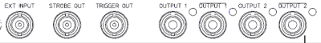

  * Connect GPIB cables to the 81110A and VNA.

  * Connect the VNA 10 MHz Ref Out to the 81110A 10 MHz IN.

  * If using two 81110As for a total of 4 outputs, then connect the TRIGGER OUT of one to the EXT INPUT of the other 81110A.

  * Connect the 81110A OUTPUTs to the VNA rear panel IF inputs to be gated. The outputs are mapped in the [Pulsed Generator Configuration](Narrowband_Pulsed_Application.md#gen) dialog box.

### Connect the Z5623A H81Pulse Test Set (optional) to the VNA front-panel
port 1 loops as follows:

VNA | H81  
---|---  
Src Out | Source IN  
CPLR THRU | CPLR THRU  
RCVR R1 IN | RCVR R1 Out  
  
### See Also

  * [VNA Front-panel loops](../Front_Panel/FPJumpersChoice.md)

  * [PNA-X IF Connectors](../Rear_Panel/XRtour.md#IF)

  * [81110A Documentation](http://literature.cdn.Keysight.com/litweb/pdf/81110-91021.pdf)

  * [Z5623A H81 Documentation](http://literature.cdn.Keysight.com/litweb/pdf/Z5623-90064.pdf)

Using the Narrowband Pulsed Application

#### How to start the Narrowband Pulsed Application  
  
---  
Using Hardkey/SoftTab/Softkey | Using a mouse  
  
  1. Press Macro > Pulse

|

  1. Click Utility
  2. Select Macro
  3. Select Pulse

  
  
  
### See Also

  * [See programming commands to launch the Macro remotely.](../Programming/XUtilityTopic.md#Macro)

  * [See how to write your own custom Narrowband Pulsed Application.](Narrowband_Pulsed_Application.md#Writing)

### Keypad Data Entry

The VNA front-panel Numeric Entry and Navigation keys can be used for dialog
box input. Also, a keyboard can be used to enter values, including alpha
characters for prefixes (for example, u for usec.) . After typing values,
first press Enter, then press Tab to go to the next field.

The following is an image of the main dialog box:

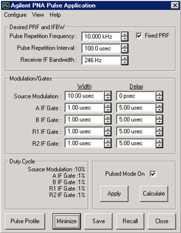

Pulsed Application Main dialog box help  
---  
| Note: An error message may appear on the VNA stating that the response
frequency has exceeded the maximum allowed frequency. The Narrowband Pulsed
Application may set the offset frequency ([option
S93080A](../Support/Configurations.htm#080)) of the VNA to some value other
than zero (the default value). If the stop frequency is set to the maximum of
the VNA model, then the error message will appear. To fix this, set the stop
frequency to a value that is at least 2 kHz less than the maximum allowed. For
example, if you have a 20 GHz VNA, and the stop frequency is set to 20 GHz,
and the error message appears, then set the stop frequency to 19.999998 GHz  
---  
  
[See Block Diagram of IF Path / Pulse Generators / Source
Modulation](../IFAccess/IF_Path_Configuration.htm)

### Configure

You can configure more than one channel to make pulsed measurements, but the
channels must use the same [pulse generator
settings](Narrowband_Pulsed_Application.htm#gen).

Only the Keysight 81110A Pulse Generator is supported with the Narrowband
Pulsed Application. Refer to the 81110A documentation for pulse repetition
frequency and duty cycle capabilities.

### See Also

  * [Configure Receivers](Narrowband_Pulsed_Application.md#Receiver)

  * [Converter Measurements](Narrowband_Pulsed_Application.md#Converter)

Edit / Undo Pulse Application settings revert to those when Apply was last
pressed.

Desired PRF and IFBW Enter the DESIRED values. When Calculate is pressed, one
or both of these values may change.

Pulse Repetition Frequency (PRF): Frequency of the pulses from the Pulse
Generator.

Pulse Repetition Interval: 1/ PRF Changes to either PRF or this setting
changes both.

Receiver IF Bandwidth: IF Bandwidth of the VNA. Choose a setting from 1 Hz to
10 KHz.

Fixed PRF When checked, (default setting) the Calculate algorithm will NOT
adjust the PRF, but only change the IF Bandwidth. When cleared, both the PRF
and IF Bandwidth values are adjusted as necessary.

Note: On VNA's with [DSP version 4](../S0_Start/HelpAbout.md#DSPchanges), the
Calculate algorithm will NOT find nulling at several PRF frequencies. If this
error is returned, add a small offset to the PRF (for example, 2.1 MHz instead
of 2 MHz) or clear the Fixed PRF checkbox.

Modulation/Gates The Source Modulation and four VNA receiver gates can each
have their own, or share, Pulse Generator outputs. Shared outputs have
identical Width and Delay values. To configure and enable outputs, click
Configure, then Pulse Generators to launch the [Pulsed Generator
Configuration](Narrowband_Pulsed_Application.htm#gen) dialog box.

Note: Option 036 and 037 limits the Source Modulation width to 117 ns.

Width Pulse Width.

Delay The delay that occurs before the pulse.

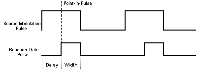

Duty Cycle Calculated Duty Cycle of the source and each of the selected
receivers. Updated when Calculate is pressed.

Pulse Mode On When this box is checked, the VNA is enabled for Pulsed
measurements. The VNA [Status
Bar](../S1_Settings/Customize_Your_Analyzer_Screen.htm#status_bar) annotation
indicates the following:

  * G Internal IF gates enabled.

  * F Filtering for Pulsed Measurements enabled.

Apply All selections are sent to the pulse generator and the active channel of
the VNA.

Calculate All selections are calculated and valid PRF and IFBW values are
entered in their fields. If these settings are not acceptable, try changing
the values you previously entered and click Calculate again. When acceptable
values are attained, click Apply to send these values to the pulse generator
and VNA.

Pulse Profile Launches the Pulse Profile dialog box. Same as clicking View /
Pulse Profile. If not available, check Pulse Mode ON, click Calculate, then
Apply.

Minimize Click to minimize the dialog box to make changes in the VNA
application. To see the dialog again, select Macro, Pulse, or turn the [Status
Bar](../S1_Settings/Customize_Your_Analyzer_Screen.htm#status_bar) ON.

Save All settings from the Narrowband Pulsed Application are saved in a *.ppf
file. These settings are NOT saved with VNA instrument state.

Recall Restore settings from the specified *.ppf file that were previously
saved.

Close Closes the dialog box without saving changes.  
  
#### How to configure Pulse Generators / Modulators and Receivers  
  
---  
From the [Pulse App main dialog
box](Narrowband_Pulsed_Application.htm#PulsedMain)
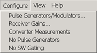 Learn about...

  * [Configure Receiver Gain](Narrowband_Pulsed_Application.md#Receiver)
  * [Converter Measurements](Narrowband_Pulsed_Application.md#Converter)
  * No Pulse Generators When checked, the Narrowband Pulsed Application does NOT attempt to communicate with internal or external pulse generators. This setting is used for troubleshooting purposes.
  * No SW Gating When checked, the improved SW gating sensitivity is turned OFF. This setting is used for troubleshooting purposes.

  
  
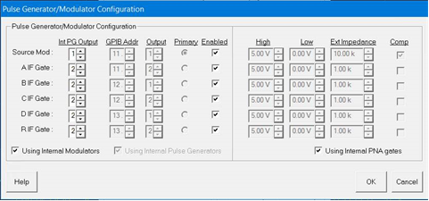

Pulsed Generator Configuration dialog box help  
---  
Notes:

  * [See Block Diagram of PNA-X IF Path / Pulse Generators / Source Modulation](../IFAccess/IF_Path_Configuration.md)
  * For PNA-X Opt 224 (2-port Dual Source) select the 2-port Dual Source Configuration in the [Path Configuration](../S1_Settings/Path_Configurator.md) dialog to provide Pulse Modulation on both port 1 and port 2.
  * This dialog may look different depending on the VNA model and number of receivers available.

Configures either the internal pulse generators (PNA-X models with relevant
options), or Keysight 81110A Pulse Generator outputs. You can configure each
81110A Pulse Generator with either one or two 81111A output modules. The
Source Mod and four VNA receiver gates can each have their own, or shared,
pulsed generators allowing identical Width and Delay values which are selected
on the Main dialog. To share an external generator output between one or more
VNA inputs, use the same GPIB address and output module for each VNA input.
Internal Pulse Gen Output (available ONLY on the [PNA-X opt
S93025A/B)](../Support/Configurations.htm#PNAX) Specify the Pulse Gen (1
through 4) to use to modulate each of the VNA receiver IF gates or Sources.
External Pulse Generator settings GPIB Addr: The GPIB address of the 81110A.
Output: The output module of the 81110A. Primary: The 81110A that uses the 10
MHz reference signal from the VNA. Enabled: Turns the pulse output ON.
External Gate/Modulator settings High: Specify a 'TTL-High' voltage level Low:
Specify a 'TTL-Low' voltage level Ext Impedance: Impedance of the modulator
used to create the pulse. Complement: When this box is cleared, TTL HIGH is
the pulse. When checked, TTL LOW is the pulse. Using Internal Modulators When
this box is checked, the voltage, impedance, and complement values are forced
to settings that prevent damage to the internal modulator. Using Internal
Pulse Generators  Makes the appropriate settings on this dialog available.
Using Internal VNA gates When this box is checked, the voltage, impedance, and
complement values are forced to settings that prevent damage to the internal
gates.  
  
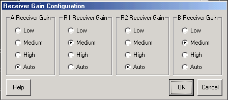

Receiver Gain Configuration dialog box help  
---  
[See Block Diagram of PNA-X IF Path / Pulse Generators / Source
Modulation](../IFAccess/IF_Path_Configuration.htm) This dialog may look
different depending on the VNA model and number of receivers available. Sets
the gain of each VNA receiver manually or automatically. Auto \- The VNA
selects the best gain level to make pulsed measurements. Use the following to
manually set the gain for each receiver. Low - about 0 dB of gain Medium -
about 17 dB of gain High \- about 24 dB of gain  The PNA-X has the following
attenuation settings: Low \- 30 dB of attenuation Medium \- 15 dB of
attenuation Hi \- 0 dB of attenuation  
  
Calibration in Pulse Mode

To perform a calibration in pulse mode (option H08), first configure and apply
the pulse parameters (PRF, Pulse Width, Delays, IF gating, and so forth)
before calibrating the system. This will ensure the VNA is configured properly
during the calibration and measurement.

When performing [Unknown
Thru](../S3_Cals/Calibration_THRU_Methods.htm#UnknownThru) or [TRL
calibrations](../S3_Cals/TRL_Calibration.htm), ALL receivers must be gated.
Otherwise, the error terms will not be correct after the calibration has
completed. This can be accomplished by either having a separate pulse
generator output for each of the IF gates, or by connecting pairs of the IF
gates together with BNC-T's. For example, if the pulse generator does not have
enough outputs, then connect the R1 and R2 IF gates to the same pulse
generator output. Also, connect the A and B IF gates to either separate
outputs (recommended) or one output (reduces flexibility). The error terms
will then be valid after the calibration is complete.

Pulse Profiling

Pulse profiling provides a time domain view of the pulse envelope. Profiling
is performed using a measurement technique that "walks" a narrow receiver
"snapshot" across the width of the pulse. This is analogous to using a camera
to take many small snapshots of a wide image, then piecing them together to
form a single, panoramic view.

  * Pulse Profiling can be performed using ratioed or unratioed measurements.

  * Pulse Profiling is performed at a single CW frequency.

How to perform Pulse Profiling  
---  
From the [Pulse App main dialog
box](Narrowband_Pulsed_Application.htm#PulsedMain), Click the Pulse Profile
button. or: 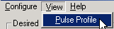 If this setting is
unavailable, check Pulse Mode ON, click Calculate, then Apply.  
  
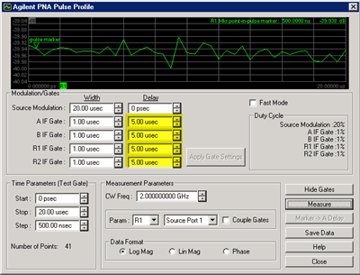

Pulse Profile dialog box help  
---  
[Learn about Pulse Profiling (scroll
up)](Narrowband_Pulsed_Application.htm#Pulseprofile) [See Block Diagram of
PNA-X IF Path / Pulse Generators / Source
Modulation](../IFAccess/IF_Path_Configuration.htm)

### Modulation / Gates

These setting duplicate those found on the main [Pulse App dialog
box](Narrowband_Pulsed_Application.htm#PulsedMain). In Pulse Profile, the Gate
Delay settings (highlighted in yellow) are significant only with certain
Measurement Parameter and Couple Gates settings.

### Time Parameters

Start, Stop These two combine to make the window of the assembled pulse
profile. To view the entire pulse, the start and stop values must be at least
as wide as the Source Modulation Width plus Delay value. Step Each consecutive
snapshot is incremented by this value until the stop value is reached.
Therefore, the number of points for the pulse profile measurement can be
calculated as: (Stop - Start) / Step. The higher the number of points, the
longer it takes to make the measurement.

### Measurement Parameter

CW Freq. Frequency of the VNA source. Source Port The VNA port supplying the source power. Only required for single receiver (unratioed) measurements. Param(eter) Only those receiver gates (and relevant measurements) that are configured in [Pulsed Generator Configuration](Narrowband_Pulsed_Application.md#gen) are available. Note: When a single receiver (unratioed) is selected, Gate Delay Settings (highlighted in yellow on above dialog image) are ignored. If the reference receiver gate is NOT configured, the average of the Source Modulation pulse is used as the reference. For example: With S21 Selected, but ONLY B receiver gate is configured, then... | 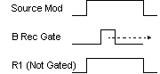 | B Gate is walked across the Source Modulation pulse. Source Modulation pulse average is used as reference (not gated).  
---|---  
  
Coupled Gates Used when the appropriate receiver gates are
[configured](Narrowband_Pulsed_Application.md#gen) for your S-parameter
measurement ONLY. This setting is ignored when a single receiver (Param) is
selected.

  * Uncoupled (box cleared) The reference gate is FIXED at the delay setting as the test gate is walked across the Source Modulation pulse as dictated by the Time Parameter settings.

For example:  
---  
S21 Selected, B and R1 receiver gates configured, Gates Uncoupled  
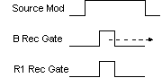 | B Gate is walked across the Source Modulation pulse. R1 gate is fixed at pulse width and delay setting.  
  
  * Coupled (box checked) The reference gate is walked synchronously with the test gate as dictated by the Time Parameter settings. Only the difference between the test and reference gate delay values is significant; NOT the absolute values.

For example:  
---  
S21 Selected, B and R1 receiver gates configured, Gates Coupled B gate delay =
3 microseconds, R1 gate delay = 2 microseconds Difference = 1 microsecond  
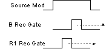 | B Gate is walked across the Source Modulation pulse. R1 gate is fixed at pulse width and delay setting. B gate leads R1 gate by 1 microsecond.  
  
Data Format Log Magnitude, Linear Magnitude, or Phase (only available if
S-parameter selected).

### Buttons

Show Gates Allows you do change the receiver gating width and delay while
looking at the results.

Apply Gate Settings Click after making changes to gate settings.

Continuous Sweep Check, then click Measure, to continuously measure pulse
profiling.

Measure Click to start the pulse profile measurement. Becomes Stop when
continuously sweeping.

Marker to Delay After making a measurement, you can drag the display maker to
any point along the trace. Click this button and the marker time is entered
into the Receiver Delay field on the [main dialog
box](Narrowband_Pulsed_Application.htm#PulsedMain).

Save Data Saves time domain data to the VNA hard drive in any of the following
formats:

  * Touchstone (*.s1p)

  * Comma delimited (*.prn)

  * Citifile (*.cti)

[Learn more about these data formats](../S5_Output/SaveRecall.md#ASCII)  
  
Signal Reduction versus Gate Width

### Signal Reduction versus Gate Width

PRF = 1 MHz  
---  
The following two figures show the performance of the internal IF gates as the
width is narrowed. 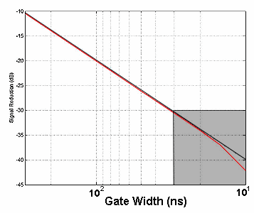 The following is a
zoomed image of the shaded area (above).
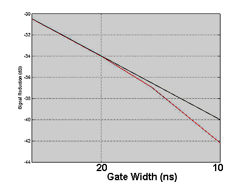

  * The straight line shows the theoretical loss in dynamic range due to duty cycle effects when using narrowband detection. 
  * The curved (red) line shows the actual measured performance of the gates.
  * The minimum gate width for <1dB deviation from theoretical is approximately 20ns.

See the specifications for the [option
H11](../Specs/ManualChoice.htm#H11_specs) and [option
H08](../Specs/ManualChoice.htm#H08_specs).  
  
Pulsed Frequency Converter Measurements

The Narrowband Pulsed Application works with both [FCA (option
S93083A/B)](../FreqOffset/FCA_Use.htm) and standard [Frequency Offset (opt
S93080A)](../FreqOffset/Frequency_Offset_Mode.htm) measurements. On the
Configure menu, check Converter Measurements. When checked, this setting
prevents the Narrowband Pulsed Application from [overwriting frequency offset
values](Narrowband_Pulsed_Application.htm#PulsedMain). This may limit the
number of PRF and IFBW solutions that are returned when Calculate is pressed
on the main Pulsed Application dialog box.

Note: Pulse Profiling can NOT be performed with frequency converter
measurements.

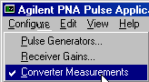

Writing your own Narrowband Pulsed Application

You can use the Narrowband Pulsed Application or use an example program as a
template for making your own Narrowband Pulsed Application.

The Narrowband Pulsed Application uses a custom .dll to perform the
calculations that are necessary to make pulsed measurements. Use the COM
Method below to send and return values to agilentPNApulsed.dll. Then use SCPI
or COM commands to control the VNA.

COM Example Program | [PNA-X Create](../Programming/COM_Example_Programs/PNA-X_Create_a_Pulsed_Measurement.md)  
---|---  
SCPI Example Programs | [Point-in-Pulse](../Programming/GPIB_Example_Programs/Create_a_Narrowband_Point-in-Pulse_Measurement_PNA-X.md) [Pulse Profile](../Programming/GPIB_Example_Programs/Create_a_Narrowband_Pulse_Profile_Measurement-PNA-X.md)  
COM Methods | [ConfigEnhancedNB2](../Programming/COM_Reference/Methods/ConfigEnhancedNB2_Method.md) [ConfigEnhancedNBIFAtten](../Programming/COM_Reference/Methods/ConfigEnhancedNBIFAtten_Method.md)  
SCPI commands | [SCPI](../Programming/GP-IB_Command_Finder/Sense/XSensIF.md)  
COM commands | [COM](../Programming/COM_Reference/Objects/IIFConfiguration_Object.md)  
  
### Install and Register the Pulsed .dll on your PC

To create your own Narrowband Pulsed Application, or run the Narrowband Pulsed
Application from a remote PC, you must do the following:

  1. Copy the following files from the VNA C:\program files(x86)\Keysight\network analyzer\ to a directory on your PC.

     * agilentpnapulsed.dll

     * OffsetList.txt

     * prfbw.txt

     * prfbwmixer.txt

  2. To register the ActiveX DLL in Microsoft Windows Operating System:

     * From a command prompt on your PC, navigate to the directory where you copied the DLL.

     * Type: regsvr32 agilentpnapulsed.dll and press Enter

For Operating Systems other than Windows, see their associated help files to
learn how to register DLL files.

* * *

