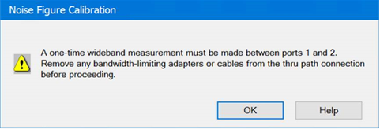
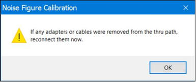
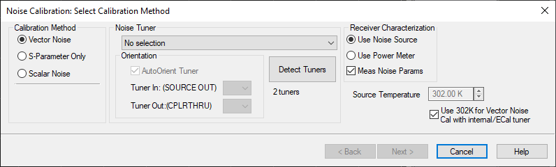
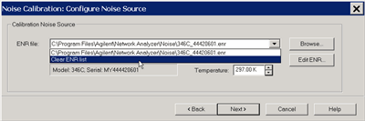
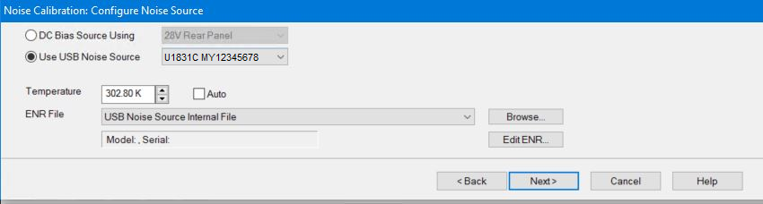
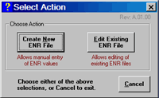
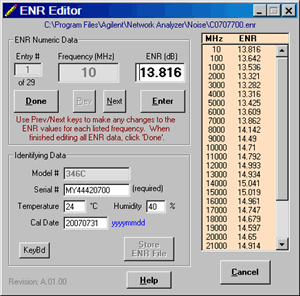
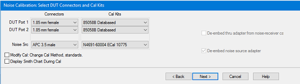
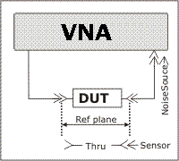
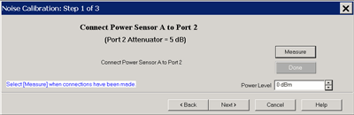

# Calibration for Noise Figure on Amplifiers and Converters (NFX)

* * *

This topic discusses calibration for both Noise Figure on Amplifiers and Noise
Figure on Converters (NFX).

  * [Overview](Noise_Cal.md#Overview)

  * [How to Perform a Noise Figure Cal](Noise_Cal.md#How)

  *     * [Select Calibration Method](Noise_Cal.md#SelectMethodDiag)

    * [Configure Noise Source](Noise_Cal.md#ConfigureNSDiag)

    * [Select DUT Connectors and Cal Kits](Noise_Cal.md#SelectDutConn)

    * [Measure Standards Steps](Noise_Cal.md#Steps)

    * [NFX Calibration](Noise_Cal.md#NFxCal)

    * [Validate Noise Source Cal](Noise_Cal.md#Validate)

### See Also

[Noise Figure and TRL Cal](Noise_Figure_and_TRL_Cal.md)

See [Noise Figure](Noise_Figure.md) and [NFX](Noise_Figure_on_Converters.md)
Applications

## Noise Figure Calibration Overview

Note: Noise Figure results are NOT at all accurate without a Noise Figure
calibration.

### NFX Calibration

Noise Figure calibration is very similar for both amplifiers and converters
(NFX).

  * NFX does NOT offer ['S-params ONLY'](Noise_Cal.md#SelectMethodDiag) calibration.

  * NFX includes an optional [LO Power Cal](Noise_Cal.md#SelectMethodDiag).

  * NFX Cal may generate a Cal Kit Frequency Error message. [Learn more](Noise_Cal.md#NFXError).

### Calibrating the Noise Receivers

Note: The term 'noise receiver' is used here to refer to the receiver that is
used to measure noise. It can be a standard VNA receiver or the dedicated
noise receivers that are provided with Opt. 029.

The noise figure calibration process is different depending on if a Noise
Source or a VNA source (calibrated with a power meter) is used to calibrate
the noise receiver.

Using a Power Meter

When 'Use Power Meter' is selected on the ['Select Cal Method'
dialog](Noise_Cal.htm#SelectMethodDiag), a power meter is used in place of a
noise source to characterize the noise receiver. IMPORTANT: The power cal step
must be completed first when acquiring the calibration.

The process happens in three steps:

  1. A Source Power Cal is performed at the port connected to the DUT’s input, with a power level that is specified on the [first measurement step](Noise_Cal.md#Steps) of the calibration wizard.

  2. A THRU connection is made from the calibrated source port to the specified noise receiver port. The gain of the noise receiver is then measured, as well as the receiver’s noise floor.

  3. With the THRU connection in place, the swept-frequency response of the noise bandwidth filter is measured. Since the noise receiver uses double-sideband homodyne mixing, the user sees a symmetrical response representing the low- and high-side responses, with a notch in the middle that nulls out the DC response. From the measured filter shape, the equivalent noise bandwidth is calculated. This information combined with the data from step 2 gives the gain-bandwidth product and noise figure of the noise receiver.

The following are variations to this process depending on the type of noise
receiver selected.

Using the low-noise (Opt 029) receiver:

  1.      1. Step 3 (measure the frequency response of the noise bandwidth filter) is always performed, over the frequency range specified in the noise figure channel.

     2. The gain-bandwidth information is contained within the noise figure calset.

     3. Note: 'Use Power Meter' is NOT allowed when the [Noise bandwidth](Noise_Figure.md#NoiseSettingDiag) is set to 8 MHz or 24 MHz.

     4. Noise averaging is not automatically turned on.

Using a standard receiver:

  1.      1. Step 3 (measure the frequency response of the noise bandwidth filter) is performed one time for each noise bandwidth and each measurement receiver. When this step occurs, it happens over the full frequency range of the VNA. Therefore, a broadband connection must be ensured -- there should be NO filtering in the thru path. For example, a wave-guide-to-coax adapter, which has a high-pass frequency response, should NOT be included. The first time a calibration is done with a particular receiver/bandwidth combination, a dialog similar to the one below will be displayed.  
  
  
  
When the bandwidth measurements are complete, another reminder dialog will be
displayed:  
  

     2. After the initial cal, the noise bandwidth data is saved to an xml file and reused for subsequent noise calibrations. As new noise bandwidths and receivers are selected, new data is appended to the xml file. If you suspect that the xml file might contain bad values for the noise filter bandwidths, then delete:  
For XP - C:\Program Files\Keysight\Network Analyzer\Noise\noiseBW.xml  
For Win7 and Win10 - C:\programdata\Keysight\network
analyzer\Noise\noiseBW.xml  
This will cause the noise-filter shape for the selected receiver to be
remeasured the next time a noise cal is performed using a standard receiver.

     3. Noise averaging is automatically turned on, with a default value of 100 noise averages. This value can be modified as necessary. [Learn more about Noise Averaging.](Noise_Figure.md#Setupdiag)

Using a Noise Source ([See Noise Source
requirements](Noise_Figure.htm#Requirements)). NOT used when measuring noise
figure with Standard VNA receivers.

A Noise Source is a device that generates two very consistent levels of noise
over its operating frequency range:

  * Hot (On) - the Noise Source is biased in order to provide a high level of noise.

  * Cold (Off) - the Noise Source is unbiased to provide ambient temperature noise level.

These levels are measured by the Noise Source manufacturer and provided in
table and electronic format with each Noise Source by serial number. The
electronic file is known as the ENR (Excess Noise Ratio) file.

  1. The Noise Source is connected to the noise receiver through test port 2.

Note: For highest accuracy, the noise source should be connected as close as
possible (the least amount of electrical loss) to the VNA port 2 connector.
This causes the largest difference between the Noise Source HOT (on) and COLD
(off) settings.

  2. The Noise Source is measured by the noise receivers at each measurement frequency. The differences between the known ENR noise levels and the measured noise levels are the noise error terms. These values are removed from subsequent noise measurements. 

  3. During the Noise Source measurements, noise averaging and noise bandwidth is automatically turned ON to the values that you specify. [Learn more about Noise Averaging.](Noise_Figure.md#Setupdiag)

### Following the Noise Receiver Cal

  * A 2-port S-parameter calibration is performed on the noise figure channel. This is because S-parameters are measured at each frequency step before a noise measurement. Also during the S-parameter cal, at least FOUR different impedance states are presented at port 2 in order to later characterize the noise generated by the noise receiver. This cal can be either a SOLT or [TRL cal](../S3_Cals/TRL_Calibration.md). See [Noise Figure and TRL Cal](Noise_Figure_and_TRL_Cal.md).

  * After calibration, correction is automatically turned ON. The VNA [status bar](../S1_Settings/Customize_Your_Analyzer_Screen.md#status_bar) shows VNC_2P (for Vector) or SNC_2P (for Scalar).

#### How to Perform a Noise Figure Calibration

  * Follow [Create A Noise Figure Measurement](Noise_Figure.md#Create) steps.
  * Make the noise figure channel the active channel.
  * Connect the noise figure Tuner to the VNA (for Vector noise figure cal). [Learn More.](Noise_Figure.md#Connection)

  
---  
Using Hardkey/SoftTab/Softkey | Using a mouse  
  
  1. Press CAL > Main > Smart Cal....

|

  1. Click Response
  2. Select Cal
  3. Select Smart Cal...

  
  
  
The following Cal Wizard pages are unique to noise figure calibration. The
remaining pages that are presented are the same as those in the standard [Cal
Wizard SmartCal.](../S3_Cals/Calibration_Wizard.htm#GuidedCal)

Select Calibration Method dialog box help  
---  

### Calibration Method

  * Vector Noise - Comprehensive noise figure calibration 
  * S-Parameter Only - Does NOT calibrate the noise receivers. NOT offered with NFX.
  * Scalar Noise - Calibration for scalar noise figure measurements. [Learn more.](Noise_Figure.md#Scalar)

Enable LO Power Cal \- NFX ONLY. Check to cause the Cal Wizard to guide you
through a Power Calibration on the LO source. Note: NO correction is provided
for an adapter that may be used to connect the power sensor to the LO source.

### Noise Tuner

  * Not available when Scalar Noise is selected.
  * Select from the ECal modules that are connected to the USB. [Learn More.](Noise_Figure.md#Connection)
  * For 50 GHz Noise Receivers, select "Internal" to use the built-in Noise Tuner. [Learn more](Noise_Figure.md#50GHz).

### Orientation

AutoOrient Tuner Check to allow the noise tuner orientation to be auto-
detected. When cleared, use the following two fields to provide manual
orientation of the noise tuner. Tuner In (SOURCE OUT) / Tuner Out (CPLRTHRU):
Specify the ECal module labels that are connected to the VNA front panel
jumper connectors. [Learn how to connect the noise
tuner.](Noise_Figure.htm#Connection) Detect Tuners Click to re-detect the
Noise Tuners (ECal modules) that are connected to the USB. If the ECal module
is not detected, check the USB connection, then click this button. The label
below the button indicates the total number of ECal modules that are connected
to the USB.

### Receiver Characterization - Learn more about this process.

  * Use Noise Source \- A noise source is used to characterize the low-noise receivers.
  * Use Power Meter \- A Power Meter/Sensor is used to calibrate a VNA source, which then is used to characterize either the low-noise receivers or a VNA receiver. This selection is made for you and can NOT be changed when NA Receiver is selected on the [Noise Figure Setup dialog](Noise_Figure.md#Setupdiag).  
  

  * Meas Noise Params \- Perform pulling measurements using a variety of impedances to characterize the noise parameters of the noise receiver. These are measured by default. If unselected, no pulling measurements will be performed and the GammaOpt of the noise receiver will be assumed to be idealized (see Noise Parameters definitions below for description of GammaOpt). Turning noise pull measurements off is useful if there is a lot of loss between the output port cal plane and the receiver, or if the number of standards that can be used for pulling is small (for instance, when using mechanical standards and/or CalPods). 

Note: Use Power Meter is NOT available when the Noise Bandwidth is 8 MHz or 24
MHz. In the [Noise Setup dialog](Noise_Figure.md#NoiseSettingDiag), lower the
Noise Bandwidth to allow this selection.

### Source Temperature

**Use 302K for Vector Noise Cal with internal/ECal tuner When checked will use
302K as the source temperature when vector correction is applied and the tuner
is an ECal or internal tuner. When unchecked, the specified source temperature
will be used.**  
  
Configure Noise Source (Opt 029) dialog box help  
---  
 ENR File Select the Noise Source ENR
file. If not already there, copy your Noise Source ENR file to the VNA
C:\Program Files(x86)\Keysight\Network Analyzer\Noise folder. Then click
Browse to find the ENR file. Clear ENR List Scroll to the bottom of the ENR
list, then click to remove the selected ENR file. Then browse or select to
find a new file. Edit ENR Click to launch the [ENR
Editor](Noise_Cal.htm#EditENR) dialog box which is used to change or create
ENR files. This is NOT usually necessary. Temperature Specify the current
temperature at the Noise Source connector. The Noise source is kept ON during
noise figure measurements. This results in the Noise Source being a few
degrees warmer than Ambient temperature, and a more accurate calibration. See
[Noise Figure tips](Noise_Figure.md#tips) to learn more about the
significance of temperature. [See Noise Source
requirements.](Noise_Figure.htm#Requirements)  
  
Configure Noise Source dialog box help  
---  
 DC Bias Source using Select
28 V Rear Panel for PNA or External Source for PXI Use USB Noise Source Select
the required noise source from selection. Temperature Specify the current
temperature at the Noise Source connector. The Noise source is kept ON during
noise figure measurements. This results in the Noise Source being a few
degrees warmer than Ambient temperature, and a more accurate calibration. See
[Noise Figure tips](Noise_Figure.md#tips) to learn more about the
significance of temperature. ENR File Use USB Noise Source Internal File or
select the Noise Source ENR file. If not already there, copy your Noise Source
ENR file to the VNA C:/Program Files/Keysight/Network Analyzer/Noise folder.
Then click Browse to find the ENR file. Clear ENR List Scroll to the bottom of
the ENR list, then click to remove the selected ENR file. Then browse or
select to find a new file. Edit ENR Click to launch the [ENR
Editor](Noise_Cal.htm#EditENR) dialog box which is used to change or create
ENR files. This is NOT usually necessary. [See Noise Source
requirements.](Noise_Figure.htm#Requirements)  
  

Click either Create or Edit to launch the same dialog box, shown below.

  * Edit populates all fields with existing data which can then be edited and stored.

  * Create has empty fields except for frequencies.

Edit / Create ENR File dialog box help  
---  

### ENR Numeric Data

Use Previous and Next buttons to scroll to Entry # to edit. Type ENR value in
dB, then press Enter. Done Click when finished editing all values. Then click
Store ENR File to save the file.

### Identifying Data

Model # of the Noise Source. This can NOT be changed. Serial # of the Noise
Source. Temperature and Humidity in which the Noise Source was calibrated.
This is for information only. The ENR data is always normalized to 290 Kelvin.
KeyBd launches a mouse-driven keyboard. Store ENR File Click to launch a
dialog to save the new or edited ENR file.  
  
Select DUT connectors and Cal Kits dialog box help  
---  
 Port 1 and Port 2 DUT (Device
Under Test) Connectors Specify the connector and gender of the DUT. Cal Kits
Select the Cal Kit to be used to calibrate each test port. The list for each
DUT Port displays kits having the same connector type as the DUT. Using
incorrect calibration standards can significantly degrade measurement
accuracy. [Learn more.](../S3_Cals/Accurate.md#wrong) Power Sensor Used to
calibrate the source port. Specify the connector and gender of the Power
Sensor. Noise Src Used to calibrate the noise receivers (Opt 029). Specify the
connector and gender of the Noise Source. The Keysight 346C has an "APC 3.5
male" connector. Note: For highest accuracy, the noise source should be
connected as close as possible to the VNA port 2 connector. This causes the
largest difference between the Noise Source HOT (on) and COLD (off) settings.
For both Cal devices (power sensor and noise source, specify the connector
type and gender. When the Cal device connector is NOT the same type and gender
as the DUT Port connector, then for optimum accuracy, extra cal steps are used
to measure and correct for the adapter that is used to connect the Cal device
to the reference plane. Select Ignored (at the bottom of the DUT Connectors
list) to NOT compensate for the adapter. Select the Cal Kit that will be used
for that process. De-embed power sensor adapter / noise source adapter / thru
adapter The VNA uses the connector type and gender of the DUT along with the
connector type and gender of the cal device to determine if an adapter removal
operation is taking place AND whether or not that removal operation requires
an additional cal step.  However, the use of the connector type can, in
special cases, hide the need for the extra cal step. Check the "De-embed..."
box in these cases to inform the VNA that the extra step is needed. Such a
case is illustrated below where the noise source is connected close to test
port 2 for higher accuracy. If unchecked, the VNA would assume in this case
that the Noise Source is connected to the Thru standard at the port 1 (DUT
input) reference plane. A similar situation occurs when the power sensor
connector does not match the input DUT connector, but does mate with the
output DUT connector. The VNA would assume in this case that the power sensor
is connected to the Thru standard at the port 2 (DUT output) reference plane.
In both cases, the prompt will clarify that the adapter is expected to remain
in-place during the Thru connection.  Source
Cal Settings Click to launch the [Source Power Cal (for
apps)](../S3_Cals/Power_Cal_for_Apps.htm#SourceCalApps) dialog. This dialog is
used to set Power Meter / Sensor settings for both the Port 1 Power Cal, and
the optional LO Power Cal. Modify Cal Check, then click Next, to Modify Cal
(Standards AND Thru Method). Display Smith Chart During Cal Smith Chart is
selected as format during calibration measurement. Note: [Enhanced Response
Calibration](../S3_Cals/Select_Cal.htm#Enhanced) is NOT supported with noise
figure.  
  
Measure Standards Steps dialog box help  
---  
 Power Level at which to perform the
Power Cal. It is usually best to set power level to 0 dBm at the power sensor
because the power sensor is calibrated at that level. Lower power levels will
yield a slower and noisier calibration. However, with the default source
attenuation (10 dB or 20 dB depending on the model), the VNA may not be
capable of achieving this power level at higher frequencies. To check the max
leveled power, view an [R1 (port 1 reference receiver)
trace](../S1_Settings/Measurement_Parameters.htm#Receiver) over the frequency
range of interest, then increase the power until roll-off appears. Power
levels at the test port may be approximately 2 dB lower than at the R1
receiver. If an external component is used between the VNA test port and the
calibration reference plane, then adjust the power level so that the power at
the sensor is about 0 dBm if possible. The current source attenuation value is
shown on the dialog. LO Power Cal (Optional) When
[enabled](Noise_Cal.md#SelectMethodDiag), perform a Source Power Cal at the
DUT LO input. An LO must already be selected. [Learn
how](MixerConverter_Setup.htm#MixerSetupTab). The power level of the LO source
calibration is set on the [NFX (LO) Power
Tab](MixerConverter_Setup.htm#MixerPowerTab). Connect Noise Source to the Port
2 measurement (reference) plane When the ["De-embed
Adapter.."](Noise_Cal.htm#DeEmbedAdapter) boxes are checked, additional cal
steps are required.

### Subsequent Steps

Connect Port 1 to Port 2 \- Connect port 1 reference plane to the port 2
reference plane using the required Thru standard or adapter. Connect ECal to
Ports 1 and 2 - Connect the ECal module between the port 1 reference plane and
the port 2 reference plane.  
  
### NFX Cal Kit Frequency Error

When performing an NFX calibration with at least two ECal modules with
different connector types, you may see the following error message.

This occurs because the VNA performs two full 2-port cals: one at the input
frequencies with both connector types, and one at the output frequencies with
both connector types. One of the ECal modules may not be defined over both
frequency ranges.

To overcome this, you can perform a User-Characterization for the limited ECal
module over the required frequency range. The VNA will present a warning, but
it will be allowed. [Learn how](../S3_Cals/ECal_User_Characterization.md).

### Validate Noise Source Cal

To validate a Noise Source calibration, connect the Noise Source to Port 2 and
measure [ENR](Noise_Figure_on_Converters.md#NFXParams).

Compare the measured values to the values in the ENR table.

How to manually turn the Noise Source ON | OFF

  1. Press Power > Main > Noise Source.

* * *

