# Noise Figure Application

* * *

The Noise Figure Application makes fast, easy, and accurate noise figure
measurements. This function is available with Opt 028, S9x029A/B, or S9x027B.

The information presented in this topic pertains to Noise Figure measurements
on BOTH Amplifiers and Converters unless stated otherwise.

  * Noise Figure Hardware and Software Options Explained (028, S9x029A/B, S93027B, H29 - obsolete)

  * [Features, Requirements, and Limitations](Noise_Figure.md#Requirements)

  * [Noise Concepts](Noise_Figure.md#concepts)

  * [How the Noise Figure Application Works](Noise_Figure.md#How)

  * [Scalar Noise Figure Measurements](Noise_Figure.md#Scalar)

  * PNA-X Option H29 - Block Diagram

  * PNA-X Option 029 - Block Diagram

  * Noise Figure Option S9x027B

  * [The Noise Tuner Switch](Noise_Figure.md#NoiseTunerSwitch)

  * [Noise Parameters that are Offered](Noise_Figure.md#parameters)

  * Using Noise Figure App

  *     * [Connect Tuner and Noise Source](Noise_Figure.md#Connection)

    * [Create a Noise Figure Measurement](Noise_Figure.md#Create)

    * [Make Noise Figure Settings](Noise_Figure.md#HowNoiseSetup)

    * [Perform Calibration](Noise_Cal.md) (separate topic)

    * [Save Noise Data](Noise_Figure.md#SaveNoiseData)

  * [Noise Model and the Noise Correlation Matrix](Noise_Figure.md#Model)

  * Noise Figure Measurement Tips

  * [Using Noise Figure Traces in Equation Editor](Noise_Figure.md#UsingEquationEditor)

  * Noise Figure Automatic Switch Control

### See Also

[Noise Figure Calibration](Noise_Cal.md)

[Noise Figure on Converters (NFX)](Noise_Figure_on_Converters.md)

[Programming commands](../Programming/MixerTopic.md#NoiseSetup)

[PNA-X Noise Figure Options (VNA Configuration
Guide)](http://literature.cdn.Keysight.com/litweb/pdf/5989-7606EN.pdf)

[High-Accuracy Noise Figure Measurements Using the
PNA-X](http://literature.cdn.Keysight.com/litweb/pdf/5990-5800EN.pdf)

[Noise Figure and TRL Cal](Noise_Figure_and_TRL_Cal.md)

[Example Setup for U7229x Amplifier
Control](../Programming/GPIB_Example_Programs/NF_U7229x_Amplifier_Control.htm)

[See other VNA Applications](Applications.md)

## Noise Figure Hardware and Software Options Explained

See Also: [PNA-X Noise Figure Options (VNA Configuration
Guide)](http://literature.cdn.Keysight.com/litweb/pdf/5990-7745EN.pdf) \-
Internet connection required

  * 029 \- (PNA-X ONLY) Includes low-noise receivers and noise tuner bypass switch to enable noise figure measurements to 50 GHz. Also includes Opt 028 capability.

  * E29 \- (PNA-X ONLY) Includes low-noise receivers and noise tuner bypass switch to enable noise figure measurements to 67 GHz. Only valid on N5247B. Also includes Opt 028 capability.

  * 028 \- Uses VNA receivers to measure noise figure. A noise source is NOT used during calibration. Any two ports can be used. Use with DUTs that have sufficiently high gain and noise figure. Additional filtering may be necessary. [Learn more.](Noise_Figure.md#NoiseSettingDiag)

  * S93027B \- (PNA-X ONLY) Allows PNA-X models with Opt 029 to use mechanical noise tuners. Learn more.

  * S9x029A/B \- Noise figure measurement application.

  * H29 (obsolete) \- Noise Figure on N5244A (43.5 GHz PNA-X model) and N5245A (50 GHz PNA-X model). Includes both:

  *     * Opt 029 hardware from the N5242A (noise measurements to 26.5 GHz)

    * Opt 028 (noise measurements using standard receiver to 50 GHz). [See H29 specifications](../Specs/ManualChoice.md).

Note: Option H29 does not include an internal noise tuner.

### 50 GHz and 67 GHz Noise Figure Receivers on N524xx

Beginning in October 2012, Option 029 (low-noise receivers) is available in
the N5244B (43 GHz), N5245B (50 GHz), and N5247B (67 GHz) models.

Beginning in Fall 2023, Option E29 (low-noise receivers to 67GHz) is available
in the N5247B models.

  * The low-noise receiver and the noise receiver path switch is added between the port 2 CPLR THRU jumper connector and the port 2 bias tee. See Option 029 block diagram below. When it is configured with a multiport test set (i.e. U3024AH10), the low-noise receiver cannot be used with test ports on the test set with standard multiport test set jumper connections. See modified test set connections to use low-noise receiver with multiport test set.

  * These models (with Option 029) include a built-in (internal) Noise Tuner which can be selected at the beginning of the [Noise Figure Calibration.](Noise_Cal.md#SelectMethodDiag) The Noise Tuner switch is managed differently than in 26.5 GHz models. [Learn more.](Noise_Figure.md#NoiseTunerSwitch)

  * When used with the N5247A, Noise Figure measurements between 50 GHz and 67 GHz are possible using the standard receivers (Opt 028) and a 67 GHz Power Sensor or with low-noise receivers with the E29 option. [See Opt 028 Measurement tips](Noise_Figure.md#Opt028Tip).

  * [See limitations of the 50 GHz Noise Source](Noise_Figure.md#NoiseSource).

  * See Using Opt. 029 (low-noise receiver) with External Test Set

### Noise Figure Application Features

  * Cold noise method includes correction for imperfect system source match for highly accurate noise figure measurements.

  * With Opt 029/S93029A/B you can measure devices with noise figure values ranging from about 0 to 50 dB and devices with GAIN ranging from about -40 to +60 dB. [Learn more.](Noise_Figure.md#tips)

  * With Opt 028/S93029A/B you can also measure noise figure using standard VNA receivers. [Learn more](Noise_Figure.md#Opt028Tip).

  * Measure noise figure of frequency translating devices. [Learn more.](Noise_Figure_on_Converters.md)

  * During calibration, ENR values are interpolated for frequencies between the supplied data points.

### Noise Figure Application Requirements

  * Noise Tuner - Required for vector noise figure measurements. Not required for [scalar noise figure](Noise_Figure.md#Scalar).

  *     * ONLY the N4690 Series ECal modules are supported. The N4691D m-f is recommended.

    * Opt 029 provides an additional cable and adapter to connect the ECal module to the front-panel connectors. [Learn more.](Noise_Figure.md#Connection)

    * A built-in Noise Tuner is provided with the 50 GHz noise receiver models. [Learn more.](Noise_Figure.md#50GHz)

  * Power Meter - Required when calibrating [NFX](Noise_Figure_on_Converters.md) (Noise Figure on Converters).

  * Recommended: An accurate thermometer. [Learn more](Noise_Figure.md#Temperature).

  * MM Head: The N5290A or N5291A broadband millimeter heads may be used to measure noise figure. This feature must be used in conjunction with a broadband amplifier such as the U722xx series amplifiers, and the use of the macro feature (SENS:NOIS:SWE:MACR). Careful physical setup including filters may be necessary. The feature may be accessed by SCPI only ([SENSe<ch>:NOISe:RECeiver <char>](../Programming/GP-IB_Command_Finder/Sense/Noise.md#Receiver)).

### Noise Source

Note: Support for U1832X and U1833X Noise Sources is a Licensed Feature. Learn
more about [Licensed Features](../Support/Software_Support.md). A Noise
Source is NOT required to calibrate the Opt 029 Noise Receivers. Instead, the
Noise Receivers can be calibrated using a calibrated VNA source. [Learn
more](Noise_Cal.htm#Overview). When using a Noise Source, the following
requirements apply:

  * The 346C Noise Source (recommended) produces ENR values to 26.5 GHz.
  * The 346B Noise Source can be used up to 18 GHz. 
  * The 346A Noise Source can also be used up to 18 GHz, but requires more [averaging](Noise_Figure.md#NoiseSettingDiag) for calibration.
  * The 346C K01 (50 GHz) Noise Source typically has about 6 dB of ENR at 50 GHz which may NOT yield an adequate calibration, depending on how many noise averages are used. An alternative approach calibrates the noise receivers using a power sensor-based method. Select Use Power Meter for the noise figure calibration. [Learn more](Noise_Cal.md#CalibratingReceiver).
  * The U1831C Noise Source can be used up to 26.5 GHz.
  * The U1832(A/B/C/D) and U1833(A/B/C/D/G) Noise Sources can be used.
    * A: 26.5GHz, B: 50GHz, C: 50GHz, D: 55GHz, G: 67GHz
    * U1832X: Low ENR models
    * U1833X: High ENR models
  * An adapter may be necessary to connect the Noise Source to the VNA port 2 reference plane during [calibration](Noise_Cal.md#Overview). Cal Kit (or second ECal module) with same connector type and gender as DUT connectors.

  
---  
  
### Limitations with the Noise Figure Application

The following features are NOT supported in a noise figure channel:

  * [FCA ](../FreqOffset/FCA_Use.md)or [Frequency Offset](../FreqOffset/Frequency_Offset_Mode.md)

  * [Analog sweep](../S1_Settings/Sweep.md#SweepSetupDiag). All frequency sweeps are STEPPED.

  * Independent IFBW, Power Levels, or Sweep Time in a [segment table](../S1_Settings/Sweep.md#SegmentDiag) is NOT supported.

  * [External Test Set Control](../System/External_Testset_Control.md) (Opt S93551A/B)

  * [Receiver calibration](../S3_Cals/PwrCalibration.md#ReceiverPowerCal).

  * [Enhanced Response Cal](../S3_Cals/Select_Cal.md#Enhanced)

  * [ECal User Characterization](../S3_Cals/ECal_User_Characterization.md).

  * Some Fixturing Features

  * [Auto Port Extensions](../S3_Cals/Port_Extensions.md#AutoPortExtensions)

  * [Auto Formatted Citifile](../S5_Output/SaveRecall.md#cti) data.

  * [External DC Devices](../System/Configure_a_DC_Device.md)

  * Pulsed noise figure measurements are supported with the following limitations:

  *     * Minimum 300 microsecond pulse width using 24 MHz noise bandwidth

    * Narrower noise bandwidths cause larger minimum pulse widths

    * A drop-out may occur at start of sweep and at 6 GHz. This is corrected by a 1 ms pulse width at 24 MHz Noise BW.

  * Option [205](../Support/Configurations.md#205) or Option [425](../Support/Configurations.md#425-N5242B)

## Noise Concepts

The following conceptual information is a short summary taken from the
[Keysight Noise Figure App Note
57-1](http://literature.cdn.Keysight.com/litweb/pdf/5952-8255E.pdf).

All electronic circuits have some degree of random noise. The most common form
is thermal noise, which increases as the temperature of the circuit increases.

The signal-to-noise (S/N) ratio of components in a communications system is a
very important parameter. To improve the S/N ratio, it is usually easier and
more cost-effective to reduce noise than to increase signal power. In order to
reduce noise, an accurate method to measure noise is required.

Noise Figure

Noise Figure is the degradation in the signal-to-noise ratio as a signal
passes through a device. For example, in the following images:

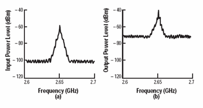  
---  
(a) At the INPUT of the DUT: The noise floor is -100 dBm, the signal is at -60 dBm, 40 dB above the noise floor. |  (b) At the OUTPUT of the same DUT: The gain has boosted the signal AND the noise floor by 20 dB. The DUT then added 10 dB of its own noise. The output signal is now only 30 dB above the noise floor. Since the degradation in signal-to-noise ratio is 10 dB, the DUT has a 10 dB noise figure.  
  
For consistency, noise measurements are calculated as if using a 1 Hz
bandwidth, although measurements are almost always made at higher bandwidths.

The following formula shows the lowest possible noise power in dBm at 290° K
(room temperature). The only way to measure noise lower than this is to make
the measurement at a lower temperature.

  * P = 10LOG(4.0 x 10 -21 watts/.001 watt)

  * P = -174 dBm / Hz

## How the Noise Figure Application Works

The goal of the noise figure application is to accurately measure the noise
that is generated by the DUT. This may be done using special low-noise
receivers or using the standard VNA receivers depending on whether the VNA has
Options 029 or 02. Learn more.

The standard receivers are always calibrated using a power meter and a
measurement of the receivers effective noise bandwidth. The low-noise
receivers can be calibrated using either a characterized noise source or using
the same process as a standard VNA source. [Learn more about the noise
calibration process](Noise_Cal.htm).

Some noise measurement error is caused by a poor source match presented to the
DUT input. Therefore, during every measurement, the noise figure application
uses an ECal module to present at least four different impedances at the input
of the DUT. This "Noise Tuner" is connected to the VNA port 1 or port 2 front-
panel loops that are in the VNA internal source path (see [block
diagram](Noise_Figure.htm#blockDiag) below). From the measurements at various
impedance states, the VNA calculates the noise out of the DUT as though the
VNA were exactly 50 ohms. No assumptions are made regarding the input
impedance of the DUT.

Here is how a vector noise figure measurement is made using Option 029. The
sweep numbers are annotated on the VNA display as they occur.

  1. With the noise tuner in the THRU state, S-parameter measurements are made to accurately characterize the gain of the DUT. This requires sweeps in both forward and reverse directions. (sweep #1 and #2).

  2. The noise measurements are performed next. VNA source power is turned OFF and the noise tuner is switched to the first impedance state.

  3. At each frequency, the noise receiver samples a large number of readings in order to attain one valid measurement. If [Noise Averaging](Noise_Figure.md#NoiseSettingDiag) is selected, the specified number of measurements are made and averaged together to obtain one noise measurement. This continues for all frequencies (sweep #3).

  4. The next noise tuner impedance state is switched IN and the noise measurements in step 3 are repeated. This occurs until measurements are made at all impedance states. At least four impedance states must be used. (sweeps #4, #5, #6+)

  5. Calibration error terms are applied and calculations made to simulate the measurement with a perfect 50 ohm input impedance. The sweep result is plotted on the VNA display.

  6. The VNA begins sweeping again with step 1.

## Scalar Noise Figure Measurements

As described above, the noise tuner is switched to at least four different
impedance states before a sweep is plotted. These sweeps are NOT made in a
scalar noise figure measurement, resulting in much faster measurements. Of
course, a scalar noise figure measurement is NOT as accurate as a vector noise
figure measurement because scalar noise figure measurements assumes that all
impedances are 50 ohms. Measurement accuracy can be improved by adding an
attenuator as close to the DUT input as possible. This improves the effective
system source match. The effect of the attenuator loss is removed during the
calibration process.

With scalar noise figure, it is not necessary to connect the noise tuner. If a
noise tuner remains connected, it is switched to the THRU state for scalar
noise figure measurements. This results is a small amount of loss which
slightly degrades measurement accuracy. To increase measurement accuracy,
manually switch the noise tuner switch to the INTERNAL position. [Learn
how.](Noise_Figure.htm#NoiseTunerSwitch)

Select Scalar Noise at the first page of a [Noise Figure
calibration](Noise_Cal.htm#SelectMethodDiag).

## N524xx PNA-X Option H29 - Block Diagram with Noise Figure Components

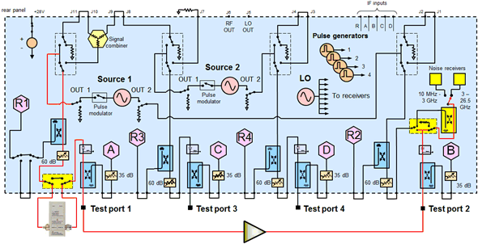 50 GHz Noise Figure Components are
shaded yellow

  * At test port 1 front-panel loops, a noise tuner bypass switch connects the noise tuner (ECal module) in series with Source1 providing several different input impedances.
  * At test port 2, a switch and coupler to route RF from the DUT output to two noise receivers. The appropriate receiver is automatically switched as required for the frequency being measured.

  
---  
  
## N524xx PNA-X Option 029 - Block Diagram with Noise Figure Components

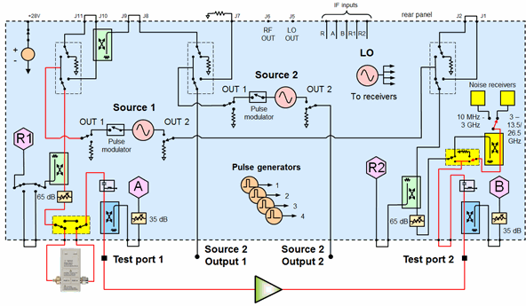 26.5 GHz Noise Figure Components are
shaded yellow

  * At test port 1 front-panel loops, a noise tuner bypass switch connects the noise tuner (ECal module) in series with Source1 providing several different input impedances. [Learn more about managing the Noise Tuner switch](Noise_Figure.md#NoiseTunerSwitch).
  * At test port 2, a switch and coupler to route RF from the DUT output to two noise receivers. The appropriate receiver is automatically switched as required for the frequency being measured.

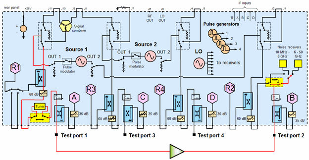 50 GHz Noise Figure Components are
shaded yellow

  * At test port 1, a noise tuner bypass switch connects the built-in noise tuner in series with Source1 providing several different input impedances. [Learn more about managing the Noise Tuner switch](Noise_Figure.md#NoiseTunerSwitch).
  * At test port 2, a switch routes RF from the DUT output to two noise receivers. The appropriate receiver is automatically switched as required for the frequency being measured. For using the noise receiver with an external test set, see [50 GHz Noise Figure with Opt. 029 and External Test Set](Noise_Figure_with_External_Testset.md).

See Also: [50 GHz Noise Figure - Built-in Tuner
switch](Noise_Figure.htm#NoiseTunerSwitch) below.  
---  
  
## Noise Figure Option S9x027B

Option S9x027B allows a VNA with a low-noise receiver to use specialized
mechanical tuners on the input port. These tuners are designed to have a large
number of impedance states that are broadly distributed on a Smith chart.
There are two situations in which a mechanical tuner is advantageous:

  1. When measuring noise figure at low frequencies. While Ecals are good general-purpose tuners, they tend to have a suboptimal spread of impedance states at low frequencies.

  2. When measuring NF of a device that is poorly matched. Ecal modules are well suited to measure the noise figure of devices with a match near 50 ohms, but do not perform as well with devices that have match far from 50 ohms.

Mechanical tuners also improve the quality of the Noise Parameter measurements
NFmin, GammaOpt, and Rho.

The following tuners are supported by Option S9x027B. All are manufactured by
Maury Microwave or Focus Microwaves. Use of a Focus Microwaves tuner is a
Licensed Feature. Learn more about [Licensed
Features](../Support/Software_Support.htm).

Maury Microwave Tuners

Model |  Description  
---|---  
MT981AL14 |  LXI TUNER, 0.227-4.0 GHZ, 7MM  
MT981BL10 |  LXI TUNER, 0.4-4.0 GHZ, 7MM  
MT981BL15 |  LXI TUNER, 0.4-2.5 GHZ, 7MM  
MT981BL18 |  LXI TUNER, 0.4-8.0 GHZ, 7MM  
MT981EL10 |  LXI TUNER, 0.8-8.0 GHZ, 7MM  
MT981HL13 |  LXI HGT, 0.8-8.0 GHz, 7MM  
MT981HL14 |  LXI HGT, 1.8-8.0 GHz, 7MM  
MT981HL15 |  LXI HGT, 0.65-6.0 GHz, 7MM  
MT981VL10 |  LXI TUNER, 0.65-6.0 GHZ, 7MM  
MT981WL40 |  LXI TUNER, 0.6-6.0 GHZ, 7MM  
MT982AL02 |  LXI TUNER, 1.8-18.0 GHZ, 7MM  
MT982BL01 |  LXI TUNER, 0.8-18.0GHZ, 7MM  
MT982EL30 |  LXI TUNER, 0.8-8.0 GHZ, 7MM  
MT982GL01 |  LXI TUNER, 0.65-18 GHZ, 7MM  
MT982GL30 |  LXI TUNER, 0.65-8.0 GHZ, 7MM  
MT983BL01 |  LXI TUNER, 2.0-26.5 GHZ, 3.5MM  
MT984AL01 |  LXI TUNER , 8-50 GHz, 2.4MM  
XT981AL14 |  LXI TUNER, 0.227-4.0 GHZ, 7MM  
XT981BL10 |  LXI TUNER, 0.4-4.0 GHZ, 7MM  
XT981BL18 |  LXI TUNER, 0.4-8.0 GHZ, 7MM  
XT981HL13 |  LXI HGT, 0.8-8.0 GHz, 7MM  
XT981HL14 |  LXI HGT, 1.8-8.0 GHz, 7MM  
XT981HL15 |  LXI HGT, 0.65-6.0 GHz, 7MM  
XT981VL10 |  LXI TUNER, 0.6-6.5 GHZ, 7MM  
XT982AL02 |  LXI TUNER, 1.8-18.0 GHZ, 7MM  
XT982GL01 |  LXI TUNER, 0.6-18 GHZ, 7MM  
XT982GL30 |  LXI TUNER, 0.6-8.0 GHZ, 7MM  
XT983BL01 |  LXI TUNER, 2.0-26.5 GHZ, 3.5MM  
  
Focus Microwaves Tuners

Model |  Description  
---|---  
C101 |  0.1-1 GHz, 7/16, APC-7, N  
C302 |  0.2-3 GHz, 7/16, APC-7, N  
C304 |  0.4-3 GHz, 7/16, APC-7, N  
C804 |  0.4-8 GHz, 7/16, APC-7, N  
C1804 |  0.4-18 GHz, APC-7, N  
C606 |  0.6-6 GHz, 7/16, APC-7, N  
C606S |  0.6-6 GHz, 7/16, APC-7, N (Shielded)  
C806 |  0.6-8 GHz, 3.5mm  
C806S |  0.6-8 GHz, 3.5mm (Shielded)  
C806R |  0.6-8 GHz, 7/16, APC-7, N  
C806RS |  0.6-8 GHz, 7/16, APC-7, N (Shielded)  
C1806 |  0.6-18 GHz, APC-7, N  
C1806S |  0.6-18 GHz, APC-7, N (Shielded)  
C1807 |  0.7-18 GHz, APC-7, N  
C308 |  0.8-3 GHz, 7/16, APC-7, N  
C807 |  0.8-7 GHz, 7/16, APC-7, N  
C808 |  0.8-8 GHz, 7/16, APC-7, N  
C1808 |  0.8-18 GHz, APC-7, N  
C1818 |  1.8-18 GHz, APC-7, N  
C1260 |  6-12 GHz,3.5mm  
  

To use a tuner supported by Option S9x027B, follow this procedure:

  1. If using a Maury tuner:

     1. Download driver files for the tuner at the Web address shown below:   
[https://www.maurymw.com/Support/downloads.php](https://www.maurymw.com/Support/downloads.php)

     2. Run the driver installation program.

     3. Power up the tuner and connect it to the VNA via a USB cable.

  2. If using a Focus Microwaves tuner:

     1. Download driver files for the tuner at the Web address shown below:   
<https://focus2501.sharefile.com/share/view/s653a869bcc8f44c8abe1052ebea6a718>

     2. Run the driver installation program.

     3. Power up the tuner and connect it to the VNA via a LAN to USB cable (USB-side connected to the VNA). Please see Focus Tuner documentation for set up and support. Once the tuner is defined in the FDCS Load Pull Explorer software, the VNA FW will automatically detect it.

  3. The tuner should now be available for use. To verify this, start the VNA application and create a Noise Figure or Noise Figure Converters channel. Start the Calibration Wizard, and expand the selections for the Noise Tuner combo box. The attached tuner should appear in the displayed list. In the example below, a Maury Microwave MT982BL01 tuner was used.  
  
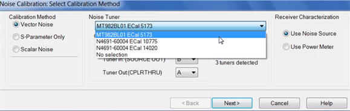

  4. Once the tuner has been recognized, it should be inserted into the signal path between port 1 and the DUT input. To increase measurement accuracy, it is best to have the tuner as close to the port 2 calibration plane as possible. This ensures that the spread of tuner impedances is as large as possible.

### Calibrating with a Mechanical Tuner

No special steps are required to use a mechanical tuner for noise figure
calibration. After verifying that the tuner is recognized by the PNA, simply
perform a noise figure calibration in the usual way. The PNA firmware will
measure all impedance states of the tuner during calibration. When the
calibration is complete, the number of states used in vector NF correction can
be set in the Noise Figure Setup dialog. In the example below, 15 states have
been chosen, but up to 21 states are available.

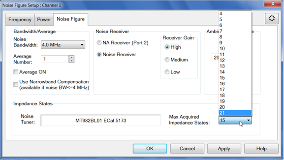

### Caveats when using a Mechanical Tuner

Mechanical tuners offer distinct advantages, but there are caveats to keep in
mind:

  * Mechanical tuners are slow. They take more time to move from one impedance state to another than Ecal modules do. This increases the amount of time required for corrected NF measurements.

  * Because of the increased measurement time, interference can be more of an issue. Any external signals that can interfere with a noise figure measurement, such as cell phone traffic, have more opportunity to intrude. This is important to keep in mind if you are making lengthy measurements in an unshielded environment.

  * The number of sweeps taken during a vector corrected measurement is usually equal to the number of impedance states, plus two (for the forward and reverse S-parameter measurements). If a mechanical tuner is used, the number of sweeps may be about twice as large. This is because (depending upon frequency range) the tuner may need to take two sweeps per impedance state, one for low band, the other for high band.

  * If a Noise sweep is aborted for any reason, such as a change in stimulus conditions, the dialog below may appear. This is because the PNA is waiting for the tuner to complete an operation. The dialog should disappear after the pending operation is complete.  
  
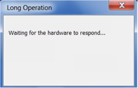

## The Noise Tuner Switch while making S-parameter measurements

Because of the built-in Noise Tuner in the Option 029 50 GHz noise figure
models, the Noise Tuner switch is managed differently than the 26.5 GHz noise
figure models.

#### N524xx 26.5 GHz Models

The default setting for the port 1 noise tuner switch is "External" as shown
in the above diagram. This setting provides incident power through the front
panel loops and the Noise Tuner when connected. When connected, the Noise
Tuner may NOT be in the THRU state, which is necessary for accurate
S-parameter measurements.

The switch is changed in any of the following ways:

  * Set the switch to INTERNAL for the S-parameter channel using the [path configuration](Noise_Figure.md#PathConfig) dialog.

  * Set the switch to INTERNAL for the S-parameter channel using the following commands:

  *     * SCPI \- [SENS:PATH:CONF:ELEM:STAT](../Programming/GP-IB_Command_Finder/Sense/Path.md#state) "Port1NoiseTuner", "Internal"

    * COM \- [PathConfiguration.Element](../Programming/COM_Reference/Properties/Element_Property.md)("Port1NoiseTuner").Value = "Internal"

  * Set the switch default to INTERNAL using a [preference setting](../System/Preferences.md).

  * Set the Noise Tuner (ECal module) to the THRU state using SCPI: [CONT:ECAL:MOD:PATH:STATE](../Programming/GP-IB_Command_Finder/Control.md#EcalPathState).

Important Note: On the 26.5 GHz Opt 029 models, once you set this switch to
"Internal", you must set it back to "External" to make noise figure
measurements. The switch is NOT automatically set to "Internal" during a noise
figure measurement.

#### N524xx 50 GHz Models

The switch for the built-in tuner (Opt. 029) is set to "Internal" (Tuner) ONLY
when making vector noise figure measurements. Otherwise, it is set to "Bypass"
(the tuner). Therefore, you should NOT need to make switch settings. However,
the switch can be changed in any of the following ways:

  * Using the [path configuration](Noise_Figure.md#PathConfig) dialog.

  * Using the following commands:

  *     * SCPI \- [SENS:PATH:CONF:ELEM:STAT](../Programming/GP-IB_Command_Finder/Sense/Path.md#state) "Port1NoiseTuner", "Bypass" (or "Internal")

    * COM \- [PathConfiguration.Element](../Programming/COM_Reference/Properties/Element_Property.md)("Port1NoiseTuner").Value = "Bypass" (or "Internal")

  * Manage the built-in Noise Tuner impedance states using the SCPI and COM commands and [Element / Value settings](../Programming/RF_PathConfig.md#50GHz).

## Using the Noise Figure Application

Use the following general procedure to make noise figure measurements:

  1. [Connect Tuner and Noise Source](Noise_Figure.md#Connection).

  2. [Create a Noise Figure Measurement](Noise_Figure.md#Create).

  3. [Make Noise Figure Settings](Noise_Figure.md#HowNoiseSetup).

  4. For Opt 029 and H29, copy your Noise Source ENR file to the VNA "C:\Program Files(x86)\Keysight\Network Analyzer\Noise folder"

  5. [Perform Calibration](Noise_Cal.md)

  6. Connect the DUT. [Learn more about DUT input and output ports.](Noise_Figure.md#Power)

  7. Measure Noise Figure.

  8. Optional Click File, then Save to save noise figure data. [Learn more](Noise_Figure.md#SaveNoiseData).

## N524xx Connect Noise Tuner and Noise Source

  * Connect the [noise source](Noise_Figure.md#NoiseSource) to the [28V connector](../Rear_Panel/XRtour.md#28) on the VNA rear panel. NOT required for Opt 028. The Noise Source is turned ON and OFF automatically as needed during a calibration. Connect the noise source to Port 2 reference plane when prompted during calibration.

  *   * 

  * Click Edit Commands to input commands for setting the noise source on into “Before sweep” and “After sweep”. Other settings are ignored for noise source control.  

  * Connect the noise tuner (ECal module). [See Noise Tuner requirements](Noise_Figure.md#Requirements). 

  *     1. On the VNA front panel, remove the Port 1 jumper cable SOURCE OUT / CPLR THRU. Opt 028 allows noise figure measurements using any two VNA ports.

    2. Connect the noise tuner to the front-panel jumpers for the source (DUT input) port.

See the [VNA Configuration
Guide](http://literature.cdn.Keysight.com/litweb/pdf/5990-7745EN.pdf) for
recommended ECal modules, cables, and adapters.

##### Setup 346C with 346CH08 USB Adapter

  1. Install the 346CH08 parser software. ([Download site](https://docs.keysight.com/kkbopen/how-to-configure-346ch08-usb-to-bnc-adapter-on-ena-x-to-perform-noise-figure-measurement-828860007.html) )

  2. Connect the 346C DC source and 346CH08 USB adapter.

  3. Connect the 346CH08 with the USB port on PC or analyzer.

  4. Launch the 346C-H08 SCPI Parser from Windows Menu

  5. Check "Auto Start" and Set the Instrument#. 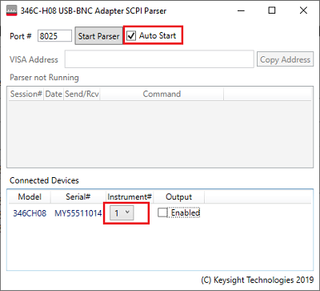

  6. Click "Start Parser" to start parser and click "Copy Address" 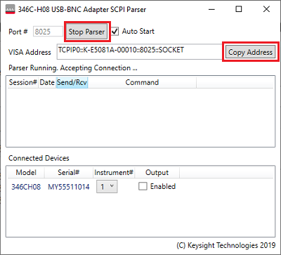

  7. Open or launch the VNA Firmware.

  8. Click Setup > External Hardware > External Device...

  9. Specify device name and select DC Source as Device Type. 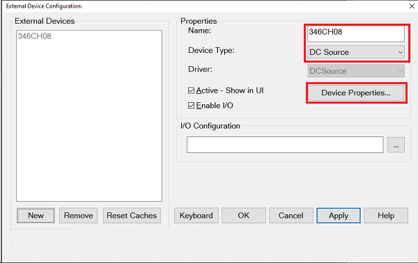

  10. Click Device Property. 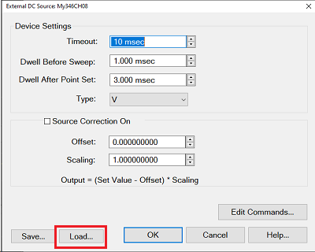

  11. Import 346CH08.xml. The xml file is located under C:\Users\Public\Documents\Network Analyzer\Drivers. Click OK to close this dialog box.

  12. Click ... in the IO Configuration.

  13. Paste the VISA Address from the SCPI parser or find the VISA address on LAN (Not USB). 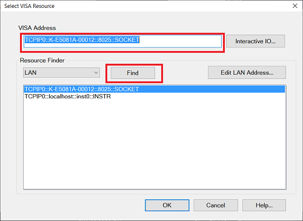

  14. Click OK to save the setup.  

## Create a Noise Figure Measurement

  1. On the VNA front panel, press Meas > S-Param > Meas Class....

  2. Select Noise Figure Cold Source, then either:

     * OK delete the existing measurement, or

     * New Channel to create the measurement in a new channel.

  3. A noise figure measurement is displayed. The following shows how to select or change displayed parameters.

Noise Parameters

Several noise parameters, as well as standard parameters, can be measured in
the same Noise channel.

#### How to add Noise Parameters

  1. Create a Noise Figure channel.
  2. Then do the following:

  
---  
Using Hardkey/SoftTab/Softkey |  Using a mouse  
  
  1. Press Trace > Trace N > Trace N.
  2. Press Trace > Trace Setup > Measure....

|

  1. Click Instrument
  2. Select Trace
  3. Select Add Trace
  4. Click Instrument
  5. Select Trace
  6. Select Measure...

  
  
#### How to CHANGE Noise Parameters

  1. Create a Noise Figure channel.
  2. Select the parameter to change.
  3. Then do the following:

  
  
  1. Select a trace by pressing Trace > Trace N > Trace N.
  2. Press Trace > Trace Setup > Measure....
  3. Select a parameter.

|

  1. Right-click on a trace.
  2. Select a parameter

  
  
  
## Noise Measurements that are offered

The following three categories of noise measurements can be made with the VNA:

  1. Noise Figure is the amount of noise that the DUT is adding in a 50 ohm test setup. This is explained in detail in [Noise Concepts](Noise_Figure.md#concepts).

  2. [Noise Power Parameters](Noise_Figure.md#NoisePowerParams) show the amount of noise coming out of the DUT in a 50 ohm test setup. With gain measurements of the DUT, these noise power parameters are used to calculate noise figure.

  3. [Noise Parameters](Noise_Figure.md#NoiseParams) are models of the noise that is generated in a DUT, similar to how S-parameters model how RF flows through a DUT.

* * *

  * Noise Figure (NF) \- Explained in [Noise concepts](Noise_Figure.md#concepts).

  * Excess Noise Ratio \- Select when measuring the noise source. Compare with the ENR table to validate accuracy of the system. ENR is calculated as:

ENR (in dB) = 10 log10((Thot - Tcold) / T0), where T0 = 290K.

Learn more about the ENR table and Noise Source. [Learn more about Noise
Source ENR measurements.](Noise_Cal.htm#Overview)

  * T-Effective \- The effective temperature, in Kelvin, of the measured noise level. For example:

290°° K = -174 dBm/Hz.

Te is the unknown variable  
---  
  
Available Gain Ga is a function of S11, S22, and Γs  
  
### Noise Power Parameters

The Noise Power parameters below are offered in the following two formats:

  * Available Noise Power The calculated power that is based on an ideal impedance match at the output of the DUT. These parameters have always been offered in the VNA noise figure App.

  * Incident Noise Power \- An 'I' is appended to the end of the Available Noise Power parameter. The calculated power into a perfect 50 ohm noise receiver, regardless of the output impedance of the DUT. 

* * *

  * SYSNPD / SYSNPDI \- System Noise Power Density: Total noise power available at the ADC, including the noise contributed by both the DUT and the internal noise receiver. This is generally expressed as an absolute power measurement in dBm, but can also be expressed in Watts or Kelvin. 

dBm = 10 log10(k * T * B * 1000)  
---  
where: |   
|  k = Boltzmann's constant  
|  T = the measured noise temperature  
|  B = bandwidth  
|  1000 = conversion from milliwatts  
  
  * SYSRNP / SYSRNPI \- System Relative Noise Power: The noise temperature of the combined DUT and receiver relative to 290 Kelvin. This is generally reported as a ratio in dB. Therefore a perfectly quiet device would render a trace at 0 dB.

dB = 10 log10(T/290)

  * DUTNPD / DUTNPDI \- DUT Noise Power Density: When correction is ON, this trace exhibits the available noise power, best described as the maximum power available from the DUT where the impedance of the noise port is equal to the output match of the DUT. To be more precise, this occurs when the noise port match is equal to the conjugate of the output match of the DUT. The noise power contributed by the receiver is removed.

When correction is OFF, the trace exhibits what is more accurately described
as delivered power. Delivered power is the power actually seen by the ADC. Any
mismatch between the receiver and the DUT is ignored. The noise power
contributed by the receiver is removed.

This measurement is generally expressed in dBm, normalized to a 1 Hz
bandwidth. For convenience, marker and trace readout shows dBm.

You could display the power in a different bandwidth using [Equation
Editor](../S4_Collect/Equation_Editor.htm).

dBm/Hz = 10 log10( k * (System Temperature - Receiver Temperature) * B * 1000)  
---  
where: |   
|  B = bandwidth  
|  1000 = conversion from milliwatts  
  
  * DUTRNP / DUTRNPI \- DUT Relative Noise Power: This measurement is rendered as a ratio of the DUT temperature to 290 Kelvin. It is generally expressed in dB. The same comments apply with respect to available versus delivered power as described above for DUTNPD.

dB = 10 log10 ((System Temperature - Receiver Temperature) / 290)

### Noise Model, Noise Parameters, and the Noise Correlation Matrix

Noise Parameters are models of the noise that is generated in a DUT, similar
to how S-parameters model how RF flows through a DUT.

### Noise Model

The noise wave model of any linear 2-port network may be represented by the
following image:

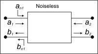

This shows a noiseless 2-port network with noise waves (an1 and bn1) added to
the input terminals. The a1 a2 and b1 b2 are standard S-parameter waves.

The noise correlation matrix relates to the noise waves as follows:

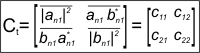

Where:

  * 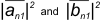 are time-averaged noise power in 1 Hz bandwidth.

  * 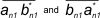 are time-averaged cross correlation terms, correlation of an1 to bn1.

  * Overbars represent time-averaging

  * Star superscripts represent complex conjugation

### Noise Parameters

  * GammaOpt (Optimum Complex Reflection Coefficient) - The optimal impedance for the noise figure measurement. Select the [data format](../S1_Settings/Data_Format.md) to display GammaOpt in terms of Log Mag, Lin Mag, Phase, Unwrapped Phase, Real, Imaginary, Polar, or on a Smith Chart.

  * NFmin \- The minimum noise figure that occurs at GammaOpt. NFmin is a scalar quantity that can be displayed as Log Mag, Lin Mag, or Real.

  * Rn (Noise Resistance) - Specifies the rate of change of the level of noise when varying the source impedance. Rn is a scalar quantity in units of ohms that should be displayed in Lin Mag or Real format.

Note: Rn, as a measurement parameter, is not normalized. When the value of Rn
is written to an S2P file, it is normalized (Rn / Zo). When an S2P file is
recalled, the normalized Rn is multiplied by the system impedance to obtain
Rn.

  * NCorr_11, NCorr_21, NCorr_12, NCorr_22 - The NCorr_11 and NCorr_22 terms are effective noise temperature, normalized to 290 K. Both terms are time-averaged, noise-wave powers referred to the input of the DUT, where NCorr_11 is the forward wave (noise going through the device towards the output), and NCorr_22 is the reverse noise wave (noise coming out of port 1 of the DUT, going back towards the source).

  *     * To convert to available noise power, multiply the terms by 290*k*B where:

    *       * k = Boltzmanns constant

      * B = system bandwidth

### Standard Parameters that are offered (Amplifiers-only)

  * S-parameters: S11, S21, S22, S12

  * Unratioed parameters using the following notation: (Receiver, source port). These parameters REPLACE the active measurement. To do this (from front-panel ONLY), press Meas, then [More], then [Receivers].

  *     * (R1,1), (R2,2), (A,1), (A,2), (B,1), (B,2)

### Save Noise Data

To save noise data, click File, then Save Data As Then select from the
following Save As Types:

  * (*.prn), (*.cti), (*.csv), (*.mdf) \- Noise Figure data can be saved ONLY with these choices. PRN saves only the active trace. CITI formatted, CSV Formatted, and MDF can save all displayed traces. [Learn more about these formats.](../S5_Output/SaveRecall.md#ASCII)

  * (*.s2p) \- Saves S-parameter data only after performing a Noise calibration. This data is saved regardless of which noise measurement is active or displayed. [Learn more about *.s2p data](../S5_Output/SaveRecall.md#sNp).

  * Trace and Noise parameter (*.s2p) \- Saves S-parameter data, then the [Noise Parameters](Noise_Figure.md#NoiseParams). This data is saved regardless of which noise measurement is active or displayed. When the vector calibration is not enabled or if the noise parameters are not realizable, then the noise parameters have no calculated value. In this instance, the following values are displayed instead:

  *     * GammaOpt = 0

    * NFmin = 50 ohm noise figure

    * Rn= Z0 / 4 * (F - 1). This equation is how Rn is currently calculated for ill-conditioned data. F is the noise factor where F is related to the noise correlation value ct11 and the normalized noise temperature Tn by F = 1 + ct11 = 1 + Tn so that Rn = (Z0 / 4) x ct11

  * NoiseCorr (*.nco) \- Saves Noise Correlation data regardless of which noise measurement is active or displayed. The *.nco file is a noise correlation matrix expressed in T-parameter form (Ct11, Ct21, Ct12, Ct22). These parameters are exactly the same as the [Noise parameters](Noise_Figure.md#NoiseParams) NCorr_11, NCorr_21, NCorr_12, NCorr_22 that can be displayed as traces.

  * When the vector calibration is not enabled, this data is set to -200 dBm.

#### How to start the Noise Figure Setup dialog  
  
---  
Using Hardkey/SoftTab/Softkey |  Using a mouse  
  
  1. Freq > Main > NF Setup....

|

  1. Click Stimulus
  2. Select NF Setup...

  
  
  
Noise Figure Setup dialog box help  
---  
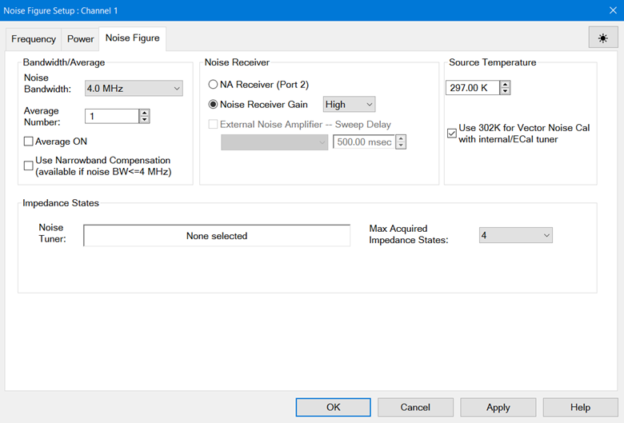 Note: In this topic, the term
Jitter is used to describe the trace-to-trace fluctuations in a measurement.
In other topics, this is called 'trace noise'.

### Bandwidth/Average

The following settings work together to achieve the optimum balance of measurement accuracy versus speed:  Noise Bandwidth  Increase the bandwidth to reduce the amount of trace noise on the noise power or noise figure measurement (jitter). However, a wider setting reduces the frequency resolution of the measurement. The noise bandwidth setting should always be smaller than the bandwidth of the DUT. The noise bandwidth setting is used only while measuring noise powers, and is independent from the [IF bandwidth setting](Noise_Figure.md#Frequency) used to measure S-parameters. Noise figure is calculated from noise power and S-parameter measurements. The calibration and measurement should be performed using the SAME noise bandwidth. When the noise bandwidth is changed after calibration, noise figure measurements can change by 0.5 dB or more, depending on the DUT frequency range, gain, and noise figure. Note: The Noise Bandwidth may be adjusted automatically at low frequencies according to the following table. At each data point frequency, if the specified Noise BW is higher than that shown in the table, the Noise BW is set to the max value in the table. |  |  RF Bands  
---|---  
|  10 to 25 MHz |  25 to 60 MHz |  60 to 150 MHz |  Above150 MHz  
Maximum Noise Bandwidths Allowed |  2 MHz |  4 MHz |  8 MHz |  36 MHz  
  
Note: [Use Power Meter calibration method](Noise_Cal.md#CalibratingReceiver)
is NOT available when the Noise Bandwidth is 8 MHz or 24 MHz.

Average Number Increase the number of averages to reduce jitter. This also
reduces measurement speed. For maximum accuracy, use the following
recommendations for the noise calibration.

When using the noise receivers, 10 noise averages is recommended. When using
the standard receivers, at least 100 averages are recommended.

During a measurement, the gain of the DUT helps overcome the noise of the VNA
receivers, so the number of noise averages can be reduced to improve
measurement speed with minimal or no degradation to measurement accuracy.

Use Narrowband Compensation

The mathematics of noise figure assumes that the gain of the DUT is constant
over the bandwidth of the noise receiver. The following image illustrates a
case in which the gain (S21) of the DUT falls off sharply outside the passband
region. When the VNA measures noise figure at the frequency indicated by the
solid vertical line using a 4 MHz noise bandwidth, standard noise figure
calculations assume the gain to equal its midpoint value (dashed horizontal
line) over the entire 4 MHz bandwidth. This assumption yields a composite
gain-bandwidth value that is lower than the actual value, which in turn
results in a noise figure value that is too high. This is the reason for the
bump in the displayed NF value at this frequency and surrounding frequencies.

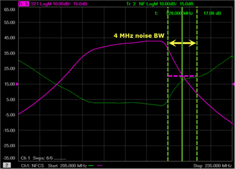

In the following image, Narrowband Compensation combines DUT measurements with
characteristics of the noise receiver, which accommodates changes in DUT gain
over the receiver bandwidth. The result is a better gain-bandwidth value of
the system. Notice how the peaks and valleys of the NF measurement disappear
when narrowband compensation is applied.

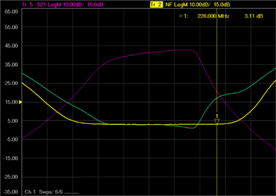

### Notes on using Narrowband Compensation:

  * Can be used with either option 028 (Noise figure measurements using standard receivers) or 029 (Fully Corrected Noise Figure).

  *     * With option 029 (NF receiver) Narrowband Compensation is available only for the 800 kHz, 2 MHz, and 4 MHz noise bandwidths.

    * With option 028 (Standard VNA receivers) you MUST re-configure the front panel loops. [Learn how](Noise_Figure.md#Opt028Tip).

  * Can be used with both Scalar and Vector NF calibrations, on either NF or NFX channels.

  * The ON / Off state has no effect on calibration. In other words, it does not matter if Narrowband Compensation is On or Off while a noise calibration is being performed.

  * Is applied only when corrected DUT measurements are made. If correction is turned off, it has no effect.

  * Can be ON or Off while the NF channel is in Hold mode, and it will modify the NF trace appropriately. There is no need to re-sweep.

### Noise Receiver (524xx models)

#### NA Receiver (Option 028)

Use a standard VNA receiver to measure noise figure.

  * Connect the DUT to any VNA ports. For vector noise figure measurements, [connect the noise tuner](Noise_Figure.md#Connection) to the source port.

  * The gain plus noise figure of the DUT minus cable loss must be at least 40 dB (G+ NF - Loss > 40 dB). This ensures that there is sufficient DUT noise power for the VNA to measure. [Learn more.](Noise_Figure.md#Opt028Tip)

  * Additional filtering may be required. [Learn more.](Noise_Figure.md#Filtering)

#### Noise Receiver (Option 029)

Use internal low-noise receivers to measure noise figure.

  * Opt 029 measures devices with noise figure values ranging from about 0 to 50 dB and devices with GAIN ranging from about -40 to +60 dB. [Learn more.](Noise_Figure.md#tips)

  * Amplifiers with higher gain can be measured by adding an attenuator to the output of DUT and using fixture de-embedding to remove the attenuator loss. An alternative for measuring high-gain devices is to use the standard receivers (Opt 028) as they have a higher compression level.

#### Noise Receiver Gain

This setting is NOT available when Noise Receiver is set to NA (Network
Analyzer) Receiver (Opt 028).

With knowledge of your DUT gain, set the appropriate amount of receiver gain
in order to optimize the power level at the noise receiver.

The following values reflect the SUM of the DUT gain (dB) PLUS NF (dB). For
example: DUT gain = 20 dB; NF = 10 dB; SUM = 30 dB.

  * Select High if the SUM is relatively low (<30 dB).

  * Select Medium if the SUM is about average (20 dB to 45 dB).

  * Select Low if the SUM is relatively high (>35 dB).

There is considerable overlap in these settings. Because all three gain
settings are calibrated with each Noise Calibration, this setting can be
changed after calibration to achieve the least amount of jitter without
overpowering the noise receiver.

One of following messages appears when too much power is detected at the noise
receiver:

  * Compression in noise receiver: excess signal \- The noise receiver is likely compressing. NF results are possibly not accurate. Select a lower gain setting.

  * Compression in noise receiver: gain has been limited \- The gain has been limited to avoid damage to the receiver. NF results are NOT accurate. Select a lower gain setting.

  * ADC over-range in noise receiver: excess signal \- Often caused by a CW signal, an oscillation, or LO feedthru during an NF measurement. Find and correct the cause, or try a lower gain setting.

Only ONE gain setting can be used for the entire frequency range of your noise
measurement. Therefore, it may be necessary to use two noise channels with
different frequency ranges and gain settings to achieve the very highest noise
figure accuracy.

#### External Noise Amplifier

Low Noise Amplifiers (LNAs) are often used to improve the system noise figure.
When a U7229G/M series LNA is connected to a USB 3.0 port located on the rear
panel, the External Noise Amplifier combo box will be populated with connected
devices. When an LNA is selected, the LNA switch path is automatically
configured in between the normal S-parameter and the noise measurement
acquisition such that during noise power measurements, the amplifier is in the
“Gain” state and during S-Parameter measurements, the amplifier is in the
“Thru” state. This automatic configuration allows all standard noise figure
calibrations to be performed in the usual manner. A Sweep Delay of 500 ms is
recommended to allow adequate time for the LNA to switch states. This value
can be adjusted via the spin control.

### Source Temperature

Note: This setting is only used for calibrated noise figure measurements, but
has no effect in an uncalibrated noise figure channel. The default value is
used for uncalibrated measurements.

Note: The 302 K value is based on the internal temperature of an ECal (304 K)
and assumes 1.5 dB of cable loss and a room temperature of 297 K. The ambient-
temperature field can still be set by the user, but the user-entered value is
ignored when using VNC with an ECal or the internal tuner (but not ignored for
SNC). Starting with firmware release A.15.55.08 (Jan 2022), the ambient
temperature field was renamed Source Temperature, and a check box labeled “Use
302 K for Vector Noise Cal with internal/ECal tuner” was added. When checked
(the default behavior), the ambient temperature field is ignored as before
when using VNC with either an external ECal module or the built-in tuner
available on higher-frequency models. Note that if the box is checked when
using an electromechanical tuner for measuring noise parameters, the default
or user-entered value in the field is used. When the box is cleared, the
default or user-entered value in the field is used. This allows the user to
enter a value for test setups that have higher cable loss or when the testing
environment is significantly hotter or colder than 297 K.

**Enter the equivalent port 1 temperature at the time of the measurement, in
Kelvin (K). One can use a thermometer to measure the temperature of the input
cable.**

**In the case of full vector correction, it is the temperature of the Ecal
Tuner (31 °C or 304.15K) minus the loss effect of the cable from the tuner to
the DUT; both internal and external Ecals used as tuners have the same
internal heater to heat to 31 °C.**

**F****or scalar it is the temperature of the internal load (such as the
internal step attenuator) minus the loss of the cable, typically around
297K.**

**The cable loss compensation is computed from
Tambient_setting=Tvna_source*|S21|^2+(1-|S21|^2)*Tcable where S21 is the loss
of the port 1 cable, Tcable is the temperature of the cable, and Tvna_source
is the temperature of the either the Ecal used as a tuner, for full vector, or
the temperature of the internal load for scalar calibration. Tecal is
typically 304.15K; the ****internal load****is typically around 297K(if the
attenuator internally is set to 10 dB or more) or 303K if the internal source
attenuator is set to 0. The attenuator is physically located near the input of
the air flow and so it is very close to the external ambient temperature, but
with 0 dB setting, the temperature of the internal source becomes the
effective input temperature and it is a little warmer at about 6 degrees rise
above ambient.**

**T****his temperature number has an inverse relationship to the noise figure.
When using the effective noise temperature (Te) format, a 3 degree increase in
the ambient temperature will make the calibration measurement result drop 3
degrees, which will then have an effect on subsequent noise figure
measurements. One can directly measure the port 1 equivalent temperature by
connecting port 1 to port 2 with a low loss through, and measuring the mean
value directly. Because the noise value is quite low, averaging or using trace
statistics should be used to find this value.**

**Use 302K for Vector Noise Cal with internal/ECal tuner When checked will use
302K as the source temperature when vector correction is applied and the tuner
is an ECal or internal tuner. When unchecked, the specified source temperature
will be used.**

### **I** mpedance States

Noise Tuner Displays the ECal module to be used as a noise tuner. Select the
Noise Tuner during calibration on the [Select Cal
Method](Noise_Cal.htm#SelectMethodDiag) dialog.

Max Acquired Impedance States Select the number of impedance states in which
to make noise measurements. At least FOUR impedance states are required.
[Learn more](Noise_Figure.md#How).  
  
Frequency Tab - Noise Figure dialog box help  
---  
 These
settings can also be made from the normal VNA setting locations. Click links
below to learn how.

### Sweep Type

Choose a sweep type. [Learn
more.](../S1_Settings/Sweep.htm#SelectingSweepType) Segment Sweep Notes:

  * The segment table shown on the dialog is 'READ-ONLY'.
  * Learn how to [Create and edit the Segment Sweep table](../S1_Settings/Sweep.md#segment).
  * Independent IFBW and Power are NOT available.
  * [X-axis point spacing](../S1_Settings/Sweep.md#X-AxisPoint) is available beginning with A.09.10.

### Sweep Settings

Click each to learn more about these settings.

  * [Number of points](../S1_Settings/DPoints.md)
  * [IF Bandwidth](../S2_Opt/Trce_Noise.md#Variable_IF_Bandwidth) This setting is important for improving noise measurement accuracy. [Learn more.](Noise_Figure.md#tips)
  * [Start / Stop](../S1_Settings/Frequency_Range.md#StartDiag), [Center / Span](../S1_Settings/Frequency_Range.md#CentDiag) frequencies.

  
  
Power Tab - Noise Figure dialog box help  
---  
 Note: S-parameter power settings are
critical for accurate noise figure measurements. [See Noise Figure Measurement
Tips.](Noise_Figure.htm#tips) Configures RF power settings for the S-parameter
measurements that occur before noise measurements. Input power to the DUT is
turned OFF during noise measurements. These settings can also be made from the
normal [Power setting](../S1_Settings/Power_Level.md) locations. Power ON
(All channels) Check to turn RF Power ON for all channels.

### DUT Input Port

Opt 028 - Select a VNA port to be connected to the DUT input. Opt 029 [Scalar
Noise Figure](Noise_Figure.htm#Scalar) \- Select a VNA port other than port 2.
Opt 029 Vector Noise Figure - The DUT input CAN be connected to any VNA port
other than port 2. However, without a noise tuner bypass switch, measurements
on other channels that use the same source port will always go through the
noise tuner. The noise tuner must be connected to the source loop of the
selected port. Note: Input power levels are critical for accurate noise figure
measurements. [Learn more.](Noise_Figure.md#tips) Power Level The input power
to the DUT during S-parameter measurements. Source Attenuator Auto Check to
automatically select the correct attenuation to achieve the specified input
power. Clear, then select attenuator setting that is used achieve the
specified Power Level. [Learn more about Source
Attenuation.](../S1_Settings/Power_Level.htm#Source_Atten) All VNA channels in
continuous sweep must have the same attenuation value. [Learn
more.](../S1_Settings/Power_Level.htm#Atten_Uncpld_Ports) Receiver Attenuator
Specifies the receiver attenuator setting for input port. (M938xA) Source
Leveling Mode Specifies the [leveling
mode](../S1_Settings/Power_Level.htm#Leveling). Choose Internal. Open Loop
should only be used when doing Wideband Pulse measurements (not available with
Noise figure measurements).

### DUT Output Port

Opt 028 - Select a VNA port to be connected to the DUT output. Opt 029 -
Connect the DUT output to VNA port 2. Output Power Sets power level in to the
output port for reverse sweeps. Port power is automatically uncoupled. Reverse
sweeps are always applied to the DUT when Full 2-port correction is applied.
[Enhanced Response Cal](../S3_Cals/Select_Cal.md#Enhanced) is NOT available
for noise figure measurements. Source Attenuator Specifies the source
attenuator setting for reverse power. Receiver Attenuator Specifies the
receiver attenuator setting for the output port. (M938xA: Receiver
Configuration) Source Leveling Specifies the [leveling
mode](../S1_Settings/Power_Level.htm#Leveling). Choose Internal. Path
Configuration Launches the path configuration dialog. Learn More.  
  
Noise Path Configurator - dialog box help  
---  
  
### N524xx 26.5-GHz Models

### N524xx 50-GHz Models (Opt. 029)

 Port 1 Noise Tuner Switch (Opt 029)

### N524xx 26.5-GHz Models

The orange line between CPLR THRU and SRC OUT represents the Noise Tuner.

  * External \- Selects the external Noise Tuner for making noise figure measurements.
  * Internal \- Bypasses the external Noise Tuner.

[See Important Notes about managing this
switch](Noise_Figure.htm#NoiseTunerSwitch).

### N524xx 50-GHz Models

  * **Tuner** \- Represents the built-in Noise tuner.
  * **Bypass** \- Bypasses the built-in tuner.

Port 2 Noise Receiver Switch allows you to make Noise Receiver measurements.
To prevent premature wear on the above two Noise switches, the VNA does not
allow these switches to be thrown when sweeping a Noise channel and non-Noise
channel. To make noise figure measurements and non-noise figure measurements
in different channels and continuously trigger both, set these switches to the
same state as the Noise channel:

  * With the non-noise figure channel active, go to [Noise Path Configurator](../S1_Settings/Path_Configurator.md).
  * Set Noise Tuner switch to External. This routes source power to the front-panel loops, and to the Noise Tuner when connected. Use [CONT:ECAL:MOD:PATH:STATE](../Programming/GP-IB_Command_Finder/Control.md#EcalPathState) to set the internal state of the Noise Tuner to THRU, which creates a small amount of additional loss in the source path.
  * Set Noise Receiver Switch to Noise Receiver.

  
  
Noise Figure Measurement Tips

Note: In this topic, the term Jitter is used to describe the trace-to-trace
fluctuations in a measurement. In other topics, this is called 'trace noise'.

### Option 029

[See Opt 028 (NF with Standard Receiver)](Noise_Figure.md#Opt028Tip)

  * Measures devices with noise figure values ranging from about 0 to 50 dB and devices with GAIN ranging from about -40 to +60 dB.

  * Highest noise figure accuracy is attained when the sum of device noise figure + GAIN is between 0 dB to +70 dB.

  * For highest noise figure accuracy and stability, there should be the least amount of electrical loss possible between the DUT output and VNA Port 2.

### Power level at the DUT Output - Opt 029

S-parameters are used to measure the gain of the DUT before each series of
noise measurements. Jitter in the S-parameter measurements corresponds
directly to jitter in the noise measurements.

For best noise figure accuracy, the power level out of the DUT should be
between 15 dB and 20 dB below the compression point of the DUT during the
S-parameter portion of the noise figure measurement.

To reduce jitter, the power level at the B receiver (port 2) should be above
approximately -20 dBm. Much below this level, S-parameter measurements have
more jitter. Power must be below +10 dBm as the B receiver starts to compress
at this point, although there is no warning or annotation that shows this
condition is occurring in S-parameter measurements.

The best way to monitor power at the B receiver is to display a [B,1
measurement](Noise_Figure.htm#parameters). With your DUT in place and powered
ON, change the input power to the device and note the power at the B receiver.

  * For low-gain DUTs, use 5 dB of source attenuation to improve the uncorrected match of port 1. 

  * For high-gain DUTs, source and receiver attenuation may be required. Use the lowest possible attenuation values.

Attaining the optimum power level during calibration can also be challenging
since calibration is performed without the DUT in place. Because of this, it
is often necessary to set source power higher during the calibration than
during the measurement. This will cause the '[CD'
annotation](../S3_Cals/Error_Correction_and_Interpolation.htm#Viewing) on the
status bar. Measurement results are accurate as long as the step attenuators
and other configuration switches are in the same position and all receivers
remain in their linear range (below +10 dBm).

It is best to find the optimum power and attenuation settings for both the
calibration and subsequent noise measurements before performing a calibration.

### IF Bandwidth

Jitter is further reduced by narrowing the IF bandwidth. If the calibration
needs to be performed at a low source power, or with receiver attenuation due
to high DUT gain, the IF bandwidth should be reduced during the calibration to
reduce jitter. The IF bandwidth can then be increased to improve measurement
speed. The [CD
annotation](../S3_Cals/Error_Correction_and_Interpolation.htm#Viewing) can be
ignored when changing IFBW after calibration.

### Noise Settings

See [Noise Figure dialog box help](Noise_Figure.md#Setupdiag) for a complete
description of these important settings.

### Temperature

Noise Figure measurements are extremely sensitive to temperature. As such,
there are two settings that require an accurate temperature measurement: At
the [DUT input](Noise_Figure.md#NoiseSettingDiag), and at the [Noise Source
connector.](Noise_Cal.htm#ConfigureNSDiag)

### Interference

When measuring the noise figure of an unshielded device, like an amplifier on
a printed-circuit board, it is very common to pick up interference from
external signals such as cellular phones, wireless LAN, or mobile radios. This
interference shows up as non-repeatable spikes in the measurement, as shown
below.

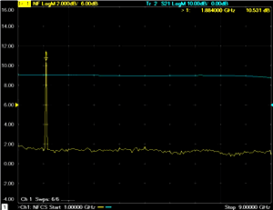

Usually, the interference adversely affects the noise figure measurement only
at the frequency where it occurs. However, if the interference is large enough
and present all of the time, it can cause the noise receivers to compress,
which results in inaccurate measurements at many frequencies. In this case,
the noise figure measurements should be done in a shielded environment like a
screen room.

### Option 028

Noise Figure of VNA receiver - Option 028 gives you the flexibility to measure
noise figure using a standard VNA receiver. For best measurement accuracy, the
DUT excess noise power, which is gain plus noise figure minus cable loss in dB
(G + NF - Loss), should meet or exceed the noise figure of the receiver. This
is generally not a problem with very high-gain devices such as converters with
approximately 60 dB of gain.

If your DUT is NOT a very high-gain device, you can re-configure the VNA front
panel loops to increase receiver sensitivity.

Re-configuring the front panel loops \- This configuration reverses the main
arm and coupled arm of the test-port coupler (see following images). This
increases the signal to the receiver port by about 15 dB, while lowering the
available port power by the same amount. This is a good tradeoff for noise
figure measurements.

 Block diagram showing port 2 thru coupler main arm to B receiver. |   Configure the receiver port front-panel loops to a vertical orientation as shown here.  
---|---  
  
The following table shows the excess noise that is required at various
frequencies. These values assume the front-panel loops have been re-configured
as shown above:

Frequency range |  Required Excess Noise Power  
---|---  
Up to 20 GHz: |  30 dB  
Up to 50 GHz: |  40 dB  
Up to 67 GHz: |  45 dB  
  
For devices that do NOT meet this requirement, a low-noise amplifier (LNA)
must be added to the receiver loop (see following image). This boosts the
noise power at the receiver by the gain of the LNA. The disadvantage is the
possibility of measurement drift and receiver compression. Any change in the
gain of the LNA will have an impact on measurements that use the receiver with
the LNA, so frequent calibration may be required. Care should also be taken
when setting the channel power (used during the S-parameter portion of the
calibration, and the gain portion of the DUT measurement) to ensure that the
added gain of the LNA does not cause receiver damage or compression. A filter
is also required on the output of the LNA. [Learn
more](Noise_Figure.htm#Filtering).

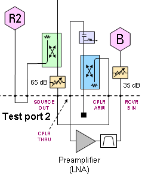

###  (Option 028)

Option 029 includes noise receivers with filtering to keep mixing-product
noise out of the low-noise receivers

## Using Noise Figure Traces in Equation Editor

In a [Noise Power](Noise_Figure.md#NoisePowerParams) trace, the underlying
unit is noise temperature.

10*log10( temperature * 1000mw/w * 1.38e-23)

(1.38e-23 is Boltzmanns constant)

Any time you use Equation Editor on a Noise Power trace, the LogMag formatting
will apply the above equation. Therefore, first select REAL format and then
generate the equation.

The following screen is an example showing three traces: DUTNPD (DUT Noise
Power Density), NF (Noise Figure), and S11 with the equation set to "***=10".
Note that formatting for noise figure measurements is different than noise
power measurements or temperature measurements. For regular receiver power
measurements, the conversion from linear magnitude to log magnitude uses
20*log10 (linear magnitude).

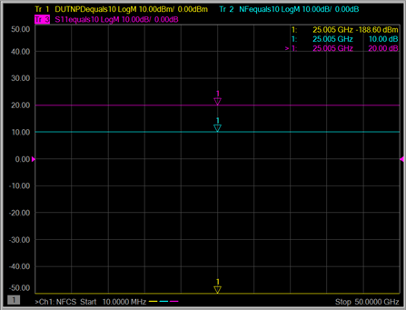

### Radio-Frequency Electromagnetic Field Immunity

When a 3Vm-1 radio-frequency electromagnetic field is applied to an PNA with
Opt 029 according to IEC 61000-4-3:1995, degradation of performance may be
observed. When the frequency of the incident field matches the frequency of a
measured noise figure or gain, the values displayed will deviate from those
expected. This phenomenon will only affect that specific frequency, and the
analyzer will continue to perform to the specification at all other frequency
sample points. The VNA with Opt 029 may be unable to calibrate a chosen
frequency sample point if the frequency matches that of an incident
electromagnetic field.  
---  
  
## Noise Figure Automatic Switch Control

Note: NF Automatic Switch Control is a Licensed Feature. Learn more about
[Licensed Features](../Support/Software_Support.md).

External switches may be used to improve noise figure measurement sensitivity.
The external source switch is controlled by the [Material Handler I/O
Connector](../Programming/HandlerIO_Connector.htm). The switches should be
configured so that path "a" should be selected during S-parameter measurement
and path "b" is selected during noise power measurement. Switches may be
configured using the [SENSe:NOISe:CONTrol:HANDler:PIN:FUNC](../Programming/GP-
IB_Command_Finder/Sense/Noise.htm#SENSe:NOISe:CONTrol:HANDler:PIN:FUNCtion)
SCPI command only.

Note: It is highly recommended that prior to starting calibration the channel
is placed into HOLD mode. This will prevent unnecessary sweeping of the
channel in between calibration steps, causing wear and tear on the switches.
User may want to add sweep delay to allow for the RF switch time to properly
change from one position to another. 0.5s is a good margin value for a TTL
relay. This can be done with the
[SENse:SWEep:DWELl:SDELay](https://na.support.keysight.com/vna/help/latest/Programming/GP-
IB_Command_Finder/Sense/Sweep_SCPI.htm#SweepDelay) command

Note: Noise Figure channels that use external switches cannot be calibrated
with [Cal All](../S3_Cals/Calibrate_All_Channels.md).

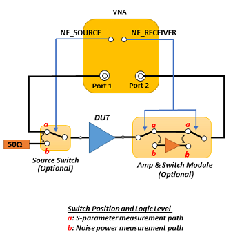

