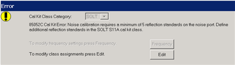
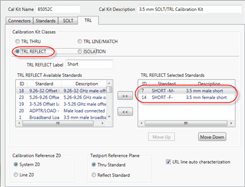
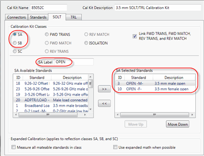
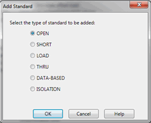
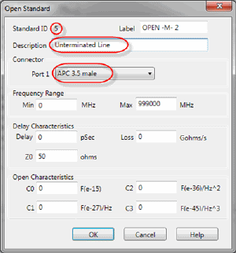

# Noise Figure and TRL Cal

* * *

When performing a TRL (or LRL, LRM) Cal as the 2-port S-parameter calibration
of a [Scalar or Vector Noise Figure](Noise_Figure.md#OptionsExplained)
measurement, you may see an error message that states that there are not
enough standards for the cal.

This appears because, during the TRL calibration, at least FIVE impedance
states must be presented to the Noise Receiver port. A typical TRL Cal Kit
does not have 5 standards with the same connector type and gender as the DUT
output port, and with different impedances.

To correct this situation, you must define additional standards for your TRL
Cal Kit using the [Edit Cal Kit dialog](../S3_Cals/TRL_Tab.md).

### Notes

  * Extra impedance standards are NOT required when you select and use an ECal module to perform the [De-embed noise source adapter](Noise_Cal.md#SelectDutConn). In this case the ECal module is used to present five different impedance states to the Noise Receiver port.

  * You can view the impedance match by measuring the standard over the frequency range of interest while viewing the Smith Chart format. Ideally, all five standards should have a response at different areas of the [Smith Chart](../S1_Settings/Data_Format.md#Smith_Chart).

### To Modify the Cal Kit

If the TRL Cal Kit is also defined as an SOLT kit, those Selected Standards
will also be searched for an appropriate Reflect Standard.

  1. Click Edit on the Error dialog, or Cancel.

  2. Press CAL > Cal Sets & Cal Kits > Cal Kit....

  3. Select the Cal Kit to be edited, then click Edit....

  4. On the Edit Kit dialog, click the TRL tab.

  5. For each of the following Calibration Kit Classes, note the ID number in the Selected Standards field: 

  1.      * TRL THRU

     * TRL REFLECT

     * TRL LINE/MATCH

For example, in the following image two shorts are defined as TRL REFLECT
standards: ID numbers 7 and 14. Because they are already being used, you can
NOT use these IDs for the additional standards required by the Noise Cal. You
must select other standards available in the kit or you can define new
standards.

  6. Select the SOLT tab, then select any of the following Calibration Kit Class definitions:

     1. SA (Open)

     2. SB (Short)

  7. In the Available Standards field, find a standard that is NOT one of the TRL IDs noted above. In this image, two opens are already assigned as SOLT standards, but because they are NOT assigned as TRL reflection standards, they are eligible to be additional standards.

  8. If necessary, click >> to add it to the Selected Standards.

Note: Be sure to choose standards with the same connector gender as the DUT
output port.

If no others exist, the following are good options:

  * Offset Short

  * Offset Open

### If your TRL Cal Kit does NOT have FIVE standards

You can create a new device by reusing the LINE standard. However, instead of
connecting both ends of the line, leave the line unterminated.

Although the following example creates an Open standard, during the
calibration you will connect any line standard to the Noise Receiver port. The
standard or definition is not important. It is simply another impedance state.

The following is an example of how to create this device.

  1. On the Standards tab, click Add.  
The following dialog appears:

  2. Select OPEN, then click OK.  
The following dialog appears:

  

  3. Change the description to Unterminated Line. This will provide a prompt during the calibration.

  4. Change Connector to match your physical line standard.

  5. Note the new Standard ID number.

  6. In the same manner as step 6 (above), on the SOLT tab, select SA.

  7. Assign the new standard ID to the Selected Standards.

Important: Leave the new standard at the bottom of the Available standards
list to which it was added. That way it will have no effect of the SOLT cals
using that kit.

* * *

