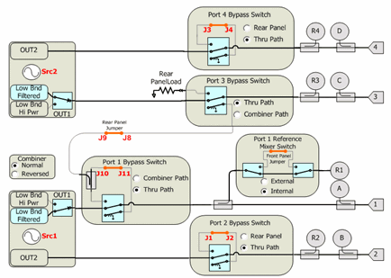
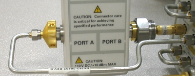
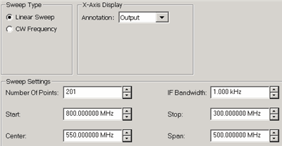
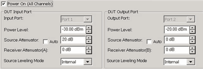
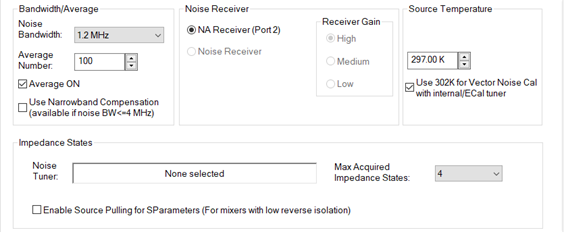

# Noise Figure on Converters (NFX) - Opt 028, Opt 029, and Opt S9x029A/B

* * *

This topic discusses Noise Figure on Converters:

  * Requirements and Limitations

  * How to Configure your Hardware

  * Create a NFX Measurement

  * NFX Parameters

  * Valid Mixer Configuration / Sweep Type Combinations

  *     * Frequency tab

    * Power tab

    * [Noise Figure Setup tab](Noise_Figure_on_Converters.md#NoiseSettingDiag)

    * [Mixer Frequency tab](MixerConverter_Setup.md#MixerFreqTab) (separate topic)

    * [Mixer Power tab](MixerConverter_Setup.md#MixerPowerTab) (separate topic)

    * [Mixer Setup tab](MixerConverter_Setup.md#MixerSetupTab) (separate topic)

The following general information (contained in [Noise Figure
Application](Noise_Figure.htm) for Amplifiers) is also relevant for NFX
measurements:

  * [Noise Figure Hardware and Software Options Explained](Noise_Figure.md#OptionsExplained)

  * [Features and Requirements](Noise_Figure.md#Requirements)

  * [Noise Concepts](Noise_Figure.md#concepts)

  * [How the Noise Figure Application Works](Noise_Figure.md#How)

  * [Scalar Noise Figure Measurements](Noise_Figure.md#Scalar)

  * [Perform Calibration](Noise_Cal.md)

  * [Noise Figure Measurement Tips](Noise_Figure.md#tips)

  * [Noise Model and the Noise Correlation Matrix](Noise_Figure.md#Model)

[Other Application Topics](Applications.md)

## Requirements and Limitations

Noise Figure on Converters requires [Noise Figure](Noise_Figure.md) (Option
0pt 028 or 029 and S9x029A/B).

[Learn more about Noise Figure requirements.](Noise_Figure.md#Requirements)

### Limitations

  * Upconverters OR downconverters ONLY (not both).

  * Image rejection is NOT provided in NFX.

The following VNA features are NOT available with NFX:

  * Analog Sweep ([Stepped sweep](../S1_Settings/Sweep.md#SweepSetupDiag) mode only)

  * Independent IFBW, Power Levels, or Sweep Time in a [segment table](../S1_Settings/Sweep.md#SegmentDiag) is NOT supported.

  * [Log frequency](../S1_Settings/Sweep.md#SweepTypeDiag) sweeps

  * [ECal User Characterization](../S3_Cals/ECal_User_Characterization.md)

  * [Time Domain](../Time/TimeDomain.md)

  * [Balanced measurements](../S1_Settings/Balanced_Measurements.md)

  * Save [Formatted Citifile](../S5_Output/SaveRecall.md#cti) data.

  * Some Fixturing Features

  * [External Test Set Control](../System/External_Testset_Control.md) (Option S93551A/B)

  * [External DC Devices](../System/Configure_a_DC_Device.md)

  * Pulse measurements

  * [See Frequency Limitations](Swept_IMD_and_IM_Spectrum_Concepts.md#LimitFreq)

  * Option [205](../Support/Configurations.md#205) or Option [425](../Support/Configurations.md#425-N5242B)

  * Segmented sweeps (an alternative is to set up a separate channel for each frequency band)

Embedded LO measurements ARE supported in NFX. [Learn more.](Embedded_LO.md)

## How to Configure your Hardware

The PNA-X is extremely versatile, and can be configured in many ways to make
NFX measurements. While not all conceivable configurations are documented
here, a few of the most common examples are provided to show the basic
concepts.

### DUT Configuration

[Learn more about connecting the DUT input and output to the
VNA.](Noise_Figure_on_Converters.htm#PowerTabDiag)

The DUT LO can be connected to an external source OR [VNA internal second
source (if available)](../S0_Start/Internal_Second_Source.htm).

Select an LO Source on the [Mixer Setup
tab](MixerConverter_Setup.htm#MixerSetupTab).

Note: Noise that is present on the LO source will be directly transferred to
the DUT output. This noise can NOT be calibrated out of the noise measurement.
Therefore, choose a low-noise source for the LO, such as an Keysight ESG or
PSG, which is better than the VNA internal source.

External LO Source though Port 3 or Port 4 (4-port PNA-X only)

  * Connect the DUT LO to PNA-X Port 3 or Port 4.

  * Connect external source to rear-panel J7 (Rear-panel load on below diagram) for Port 3; J3 for Port 4.

  *     * For Port 3, NO switching is required.

    * For Port 4, switch Port 4 Bypass Switch to Rear Panel.

PNA-X Internal LO Source

  * SRC 2 Out 1 or Out 2 on front-panel or 2-port / 2-source PNA-X

  * Port 3 or Port 4 on 4-port PNA-X

VNA Source 2 for LO on 4-port models
  
---  
Path Configurator - Default configuration on PNA-X [option
423](../Support/Configurations.htm#PNAX)

  * By default, Internal source2 (Src2) is supplied at ports 3 and 4.
  * Bypass switches must be in "Thru Path"

  
  
Using the Noise Figure Application

Use the following general procedure to make measurement with the Noise Figure
App:

  1. [Connect Tuner and Noise Source](Noise_Figure.md#Connection).

  2. [Create a Noise Figure Measurement](Noise_Figure.md#Create).

  3. [Make Noise Figure Settings](Noise_Figure.md#HowNoiseSetup).

  4. For Opt 029 and H29, copy your Noise Source ENR file to the VNA C:\Program Files(x86)\Keysight\Network Analyzer\Noise folder.

  5. [Perform Calibration](Noise_Cal.md)

  6. Connect the DUT. [Learn more.](Noise_Figure_on_Converters.md#PowerTabDiag)

  7. Measure Noise Figure.

  8. Optional Click File, then Save to save Noise Figure data in the following [formats](../S5_Output/SaveRecall.md#ASCII): (available ONLY when NF correction is ON.)

     * *.CTI Citifile

     * *.PRN

     * *.nco Noise Correlation Matrix data in S2P format. [See Noise Model.](Noise_Figure.md#Model)

See Also: [Measurement Tips](Noise_Figure.md#tips)

### Connect Noise Tuner and Noise Source

  1. Connect the noise source to the [28V connector](../Rear_Panel/XRtour.md#28) on the PNA-X rear panel. NOT required for Opt 028. The Noise Source is turned ON and OFF automatically as needed during a calibration. Connect the noise tuner to Port 2 reference place when prompted during calibration.

  2. Connect the noise tuner (ECal module). NOT required for [50 GHz models](Noise_Figure.md#50GHz) and [Scalar Noise Figure](Noise_Figure.md#Scalar) measurements.

     1. On the VNA front panel, remove the Port 1 jumper cable SOURCE OUT / CPLR THRU. Opt 028 allows Noise Figure measurements using any two VNA ports. Connect the noise tuner to the front-panel jumpers for the source (DUT input) port.

     2. Connect M-F tuner (N4691B-M0F) using the supplied cable (N5242-20137) and adapter (85052-60013).

     3. When using F-F ECal module (N4691B-00F), order a 3.5 mm M-M adapter (85052-60014).

### Create a Noise Figure Measurement

  1. On the VNA front panel, press Meas > S-Param > Meas Class....

  2. Select Noise Figure Converters, then either:

     * OK delete the existing measurement, or

     * New Channel to create the measurement in a new channel.

  3. A Noise Figure measurement is displayed. Do the following to add or change parameters to display.

## NFX Parameters

#### How to ADD NFX Parameters

  1. Create an NFX channel.
  2. Then do the following:

  
---  
Using Hardkey/SoftTab/Softkey | Using a mouse  
  
  1. Press Trace > Trace N > Trace N.
  2. Press Trace > Trace Setup > Measure....

|

  1. Click Instrument
  2. Select Trace
  3. Select Add Trace
  4. Click Instrument
  5. Select Trace
  6. Select Measure...

  
  
#### How to CHANGE NFX Parameters

  1. Create an NFX channel.
  2. Select the parameter to change.
  3. Then do the following:

  
  
  1. Select a trace by pressing Trace > Trace N > Trace N.
  2. Press Trace > Trace Setup > Measure....
  3. Select a parameter.

|

  1. Right-click on a trace.
  2. Select a parameter

  
  
  
The same Noise parameters that are available in the Noise Figure application
are also available in the NFX application. [Learn
more.](Noise_Figure.htm#ParamsOffered)

In addition, the following Mixer and Raw Receiver parameters are available in
an NFx channel:

### Mixer Parameters

  * SC21\- Conversion Loss

  * SC12 \- Reverse Conversion Loss

  * S11 \- Input match

  * S22 \- Output match

  * IPWR \- Input power to mixer/converter. Same as R1 (Source1)

  * OPWR \- Output power to mixer/converter. Same as B (Source1)

  * RevIPWR \- Power applied to mixer/converter Output. Same as R2 (Source2)

  * RevOPWR \- Power measured at mixer/converter Input. Same as A (Source2)

### Raw Receiver Parameters

Specify a receiver to measure at LO1 frequencies with the notation:

  * <Receiver>LO1

  * For example: ALO1 or R1LO1

Specify a receiver to measure using a source port, with the notation:

  * <Receiver>_<source port>

  * For example: A_3 or R1_1

#### How to start the Noise Figure Setup dialog  
  
---  
Using Hardkey/SoftTab/Softkey | Using a mouse  
  
  1. Freq > Main > NFX Setup....

|

  1. Click Stimulus
  2. Select NFX Setup...

  
  
  
## Valid Mixer Configuration / Sweep Type Combinations

The following are the Valid Mixer Configurations:

Sweep Type | Input | LO | Output  
---|---|---|---  
Linear | Swept | Swept | Fixed  
Swept | Fixed | Swept  
CW | Fixed | Fixed | Fixed  
Fixed | Swept | Swept  
  
For determining a valid mixer configuration with 2 LOs, one Fixed LO and one
Swept is equivalent to having a single-stage Swept LO.

If you create an invalid Sweep Type / Mixer Configuration, a red message
appears like the following:

If this occurs, change the Sweep Type on the
[Frequency](Noise_Figure_on_Converters.md#FreqTabDiag) tab.

[See other rules for configuring a mixer](MixerConverter_Setup.md#Rules).

The following tabs are available on the NFX Setup dialog:

  * [Frequency](Noise_Figure_on_Converters.md#FreqTabDiag)

  * [Power](Noise_Figure_on_Converters.md#PowerTabDiag)

  * [Noise Figure Setup](Noise_Figure_on_Converters.md#NoiseSettingDiag)

  * [Mixer Frequency](MixerConverter_Setup.md#MixerFreqTab) (separate topic)

  * [Mixer Power](MixerConverter_Setup.md#MixerPowerTab) (separate topic)

  * [Mixer Setup](MixerConverter_Setup.md#MixerSetupTab) (separate topic)

Frequency tab - NFX Setup dialog box help  
---  

### Sweep Type

Linear - Use for Swept Input parameters CW Frequency - Use for Fixed Input
parameters

### X-Axis Display

Annotation: Select the frequency range to display on the X-axis.

### Sweep Settings

Click to learn more about these settings.

  * [Number of points](../S1_Settings/DPoints.md)
  * [IF Bandwidth](../S2_Opt/Trce_Noise.md#Variable_IF_Bandwidth) For standard VNA receiver measurements. This setting is important for improving noise measurement accuracy. [Learn more.](Noise_Figure.md#tips)
  * [Start / Stop](../S1_Settings/Frequency_Range.md#StartDiag), [Center / Span](../S1_Settings/Frequency_Range.md#CentDiag) frequencies.

[Learn about the Load/Save *.mxr files](MixerConverter_Setup.md#AboutMxr),
and other buttons across the bottom of all NFX Setup tabs.  
  
###

Power Tab - NFX Setup dialog box help  
---  
 [Learn about this
dialog.](Noise_Figure.htm#Power) [Learn about the Load/Save *.mxr
files](MixerConverter_Setup.htm#AboutMxr), and other buttons across the bottom
of all NFX Setup tabs.  
  
Noise Path Configurator dialog box help  
---  
 [Learn about this and the Path
Configuration dialog for the 50 GHz models.](Noise_Figure.htm#PathConfig)  
  
NFx Noise Figure Setup dialog box help  
---  
 This dialog is identical to the Noise
Figure Setup for amplifier EXCEPT for the following setting. [Learn about the
rest of this dialog](Noise_Figure.htm#NoiseSettingDiag). Enable Source Pulling
for S-Parameters (For mixers with low reverse isolation). When checked, during
S22 (output match) measurements, the noise tuner is switched to present
different impedance states to the DUT input. From these measurements, S22 is
computed as though the input is seeing a 50 ohm match. This requires more
sweeps. Check this box when the converter has low reverse isolation, as is the
case when the NO output path is NOT padded with attenuation. Otherwise, clear
this checkbox as S22 measurements will not be improved. An accurate S22
measurement is essential when measuring S-parameters during an NFX
calibration. [Learn about the Load/Save *.mxr
files](MixerConverter_Setup.htm#AboutMxr), and other buttons across the bottom
of all NFX Setup tabs.  
  
Mixer Frequency tab - NFX Setup -dialog box help  
---  
 [Learn about this
dialog.](MixerConverter_Setup.htm#MixerFreqTab)  
  
Mixer (LO) Power tab - NFX Setup dialog box help  
---  
 [Learn about this
dialog.](MixerConverter_Setup.htm#MixerPowerTab)  
  
###

Mixer Setup tab - NFX Setup dialog box help  
---  
 [Learn about this
dialog.](MixerConverter_Setup.htm#MixerSetupTab)  
  
* * *

