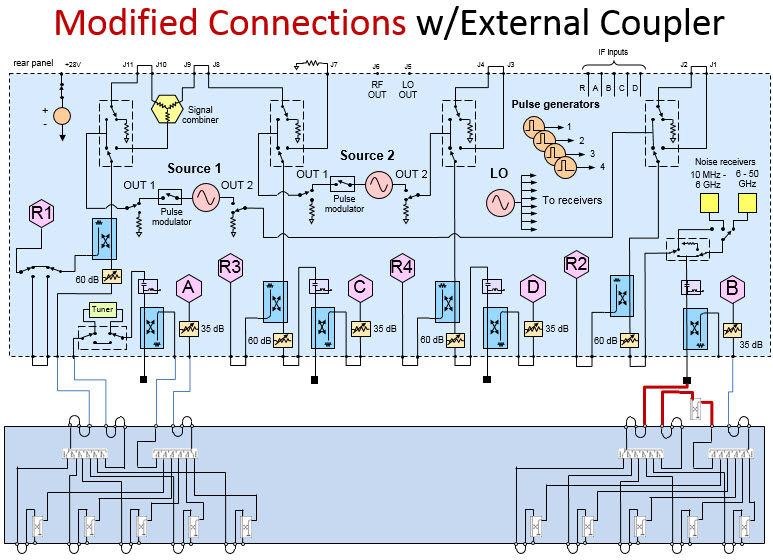
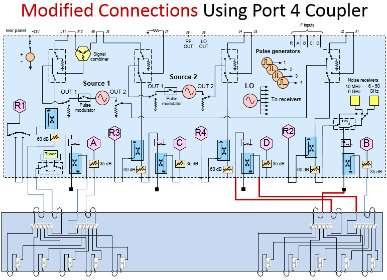

# 50 GHz Noise Figure with Opt. 029 and External Test Set

The low-noise receiver and the noise receiver path switch is added between the
port 2 CPLR THRU jumper connector and the port 2 bias tee as shown in the
images below.

When it is configured with a multiport test set (i.e. U3024AH10), the low-
noise receiver cannot be used with test ports on the test set with standard
multiport test set jumper connections. See the following modified test set
connections to use 50 GHz low-noise receiver with multiport test set.

  
---  
50 GHz 2-port Noise Figure Components (shaded in yellow)  
  
  
---  
Standard connections for 50 GHz Opt. 029 (low-noise receivers) with multiport
test set.  
  
  
---  
2-port coupler used with 50 GHz Opt. 029 (low-noise receivers) with multiport
test set.  
  
  
---  
4-port coupler used with 50 GHz Opt. 029 (low-noise receivers) with multiport
test set.

