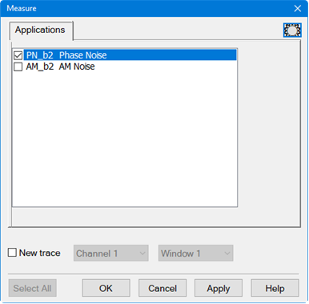
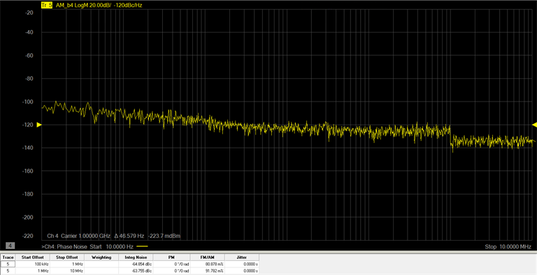

# AM Noise Measurement

Noise that modulates the phase of the carrier is referred to as amplitude
modulation of the carrier. The following procedure describes how to measure AM
Noise.

  1. Set up a Phase Noise measurement as described in [Setting Up a Phase Measurement](Setting_Up_a_Phase_Noise_Measurement.md).

  2. On the VNA front panel, press Meas > Main> AM_b2. The b2 is the VNA input and could be different depending on the hardware configuration.

  3. To create a new AM Noise trace, press Meas > Main> Other.... The Measure dialog is displayed:  
  

  4. In the Measure dialog, check AM_b2 AM Noise.

  5. In the Measure dialog, check New Trace then select the desired [Channel and Window](../../S0_Start/Traces_Channels_and_Windows.md).

  6. The following example displays an AM measurement at the b4 VNA input:  
  

  7. The FM/AM column displays the percentage of modulation of the carrier.

