# Configuring Phase Noise

The Phase Noise dialog settings are contained within five tabs: Sweep, RF
Path, Spurious, Integrated Noise, and Spot Noise.

In this topic:

  * Create a Phase Noise Channel
  * Opening the Phase Noise Dialog
  * Sweep Tab in Dialog
  * RF Path Tab in Dialog
  * Source Tab in Dialog
  * Spurious Tab in Dialog
  * Integrated Noise Tab in Dialog
  * Spot Noise Tab in Dialog

#### See Also

  * [Displaying Phase Noise Parameters](Displaying_Phase_Noise_Parameters.md)
  * [Spectrum Analyzer Settings](../Spectrum_Analyzer.md)
  * [Phase Noise Marker Search Functions](../../S4_Collect/Markers.md#Phase_Noise_Marker_Search)
  * Phase Noise Measurement Examples
    * [Setting Up a Phase Noise Measurement](Setting_Up_a_Phase_Noise_Measurement.md)
    * [Spurious Measurement](Spurious_Measurement.md)
    * [Integrated Noise Measurement](Integrated_Noise_Measurement.md)
    * [Spot Noise Measurement](Spot_Noise_Measurement.md)
    * [AM Noise Measurement](AM_Noise_Measurement.md)
  * Phase Noise SCPI Programming Examples
    * [Setting Up a Phase Noise Measurement](../../Programming/GPIB_Example_Programs/Setting_Up_a_Phase_Noise_Measurement.md)
    * [Setting Up a Source](../../Programming/GPIB_Example_Programs/Setting_Up_a_Source.md)
    * [Spurious Measurement](../../Programming/GPIB_Example_Programs/Spurious_Measurement.md)
    * [Integrated Noise Measurement](../../Programming/GPIB_Example_Programs/Integrated_Noise_Measurement.md)
    * [Spot Noise Measurement](../../Programming/GPIB_Example_Programs/Spot_Noise_Measurement.md)

## Create a Phase Noise Channel

  1. On the VNA front panel, press Meas > S-Param > Meas Class....

  2. Select Phase Noise, then either:

     * OK delete the existing measurement, or

     * New Channel to create the measurement in a new channel.

  3. In the Confirm Measurement Class Change dialog, click OK to proceed or Cancel to exit.

  4. The Phase Noise dialog is displayed.

## Opening the Phase Noise Dialog

#### Accessing Phase Noise Settings  
  
---  
Using Hardkey/SoftTab/Softkey | Using a mouse  
  
  1. Press Setup > Main > Phase Noise Setup....

|

  1. Click Stimulus.
  2. Select Phase Noise Setup....

  
  
Sweep Tab in dialog help |   
---|---  
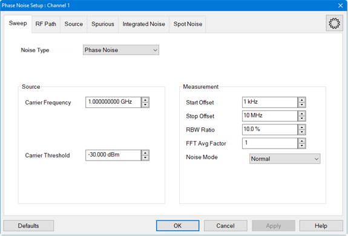 Noise Type \- Selects
between standard phase noise measurements and residual noise measurements.
Phase Noise \- (Default) - Measures phase noise of a DUT. Select for single
channel residual noise measurement when the input and output frequencies of
the DUT are not the same. For example, frequency converters. Residual Noise \-
Measures the additive phase noise of a DUT. This measurement is set up in the
RF Path tab using DUT Input and DUT Output. Select for 2-channel residual
noise measurement when the input and output frequencies of the DUT are the
same. For example, amplifiers. Carrier Frequency - Sets the carrier frequency.
The range of the phase noise measurement is determined by the start/stop
offset frequency which is relative to the carrier frequency. Carrier Threshold
- Sets the threshold to use during a carrier search.  Start Offset - Sets the
start frequency of the phase measurement. This is an offset relative to the
carrier frequency to position the measurement about the noise sideband to
measure power density in dBc/Hz. For example, if the Start Offset is set to 1
MHz with a carrier frequency of 1 GHz, then the dBc/Hz phase noise measurement
starts at 1.001 GHz. The minimum frequency is 0.1 Hz. Stop Offset - Sets the
stop frequency of the phase measurement. This is an offset relative to the
carrier frequency to position the measurement about the noise sideband to
measure power density in dBc/Hz. For example, if the Stop Offset is set to 10
MHz with a carrier frequency of 1 GHz, then the dBc/Hz phase noise measurement
stops at 1.010 GHz. The maximum frequency is 10 MHz. RBW Ratio - Sets the
resolution bandwidth ratio, which is the specified resolution bandwidth
percentage of every half decade offset frequency. Example: Start Offset = 1
kHz Stop Offset = 100 kHz RBW Ratio = 10% 1 kHz - 3 kHz: RBW = 100 Hz (10% of
1 kHz) 3 kHz - 10 kHz: RBW = 300 Hz (10% of 3 kHz) 10 kHz - 30 kHz: RBW = 1
kHz (10% of 10 kHz) 30 kHz - 100 kHz: RBW = 3 kHz (10% of 30 kHz) FFT Avg
Factor - Sets the FFT average factor number. The average factor is multiplied
by the default average count, which changes for each frequency range. The
default average count of the lower frequency range is 1 and at the higher
offset frequency range is a larger average count. Note: The minimum RBW Ratio
setting relative to the maximum FFT Avg Factor setting are limited based on
the frequency offset. The firmware restricts these settings if they exceed the
limits. Noise Mode\- Sets the measurement speed and noise floor.  Fast \-
Fastest measurement speed with highest noise floor. Normal \- Between fastest
and slowest measurement speed and noise floor. Best \- Slowest measurement
speed with lowest noise floor.  
  
The zone boundaries and decimation factors change with noise mode as shown in
the following example:  
  
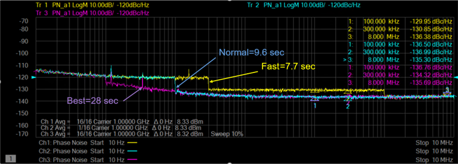 Defaults button -
Restores default phase noise settings. Apply button - Applies setting changes
and leaves the dialog box open to make more setting changes.  
  
RF Path Tab in dialog help |   
---|---  
Measurement Type: Phase Noise
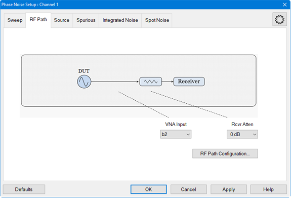 Measurement Type: Residual
Noise 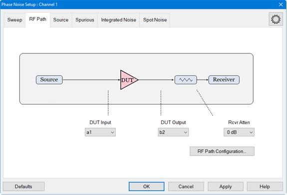 VNA Input \- Sets the
receiver input to use for the phase noise measurement. DUT Input/DUT Output \-
Displayed when Noise Type in the Sweep tab is set to Residual Noise. Sets up
ratios for residual phase noise measurements. For example, with DUT Input set
to a1 and DUT Output set to b2, the additive phase noise at b2 relative to a1
is measured. Rcvr Atten \- Sets the attenuator on the test receiver.  RF Path
Configuration... -[ Learn more](../../S1_Settings/Path_Configurator.md)
Defaults button - Restores default phase noise settings. Apply button -
Applies setting changes and leaves the dialog box open to make more setting
changes.  
  
Source Tab in dialog help |   
---|---  
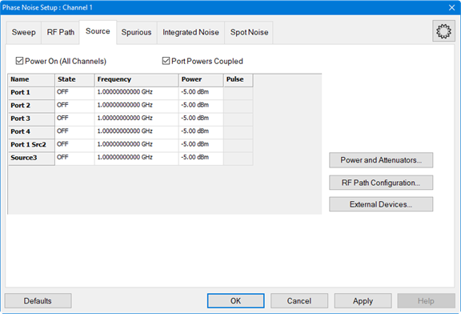 Power On (All Channels)
Check to enable source power for all channels. Only turns power ON if the port
State setting is ON. Port Powers Coupled

  * Coupled (checked) The power levels are the same at each test port. Set power at any test port and all test ports change to the same power level.
  * Uncoupled (cleared) The power levels are set independently for each test port. Uncouple power, for example, if you want to measure the gain and reverse-isolation of a high-gain amplifier. The power required for the input port of the amplifier is much lower than the power required for the output port. A power sweep can also be performed with uncoupled power. Learn more about [Setting Independent Port Power](../../S1_Settings/Power_Level.md#Atten_Uncpld_Ports).

Source Cells Name \- Lists the test ports through which an internal source is
available. If an external source has been configured, it will appear at the
bottom of the list. State

  * ON Source power is ALWAYS ON. Turning ON port 1 will also turn ON port 2 and vice versa. The same is true for port 3 and port 4. [Learn about internal second source restrictions](../../S0_Start/Internal_Second_Source.md).
  * OFF Source power is never ON, regardless of the measurement requirements. Use this setting to prevent damage to a sensitive DUT test port.

Frequency - Click in the cell, then click Edit, to start the Frequency
Settings dialog (below).
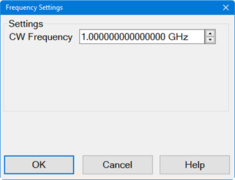 Power - Sets
the power level at the output of the source. Click in the cell, then click
Edit, to start the Power Settings dialog (below).
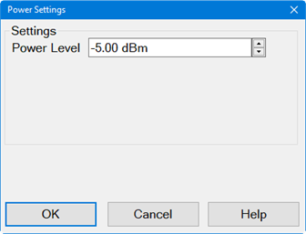 Pulse \-
Enable/disable pulse measurements. Learn more. Power and Attenuator... \-
[Learn more](../../S1_Settings/Power_Level.md#Advanced) External Devices...
\- [Learn more](../../System/Configure_an_External_Device.md) Defaults button
- Restores default phase noise settings. Apply button - Applies setting
changes and leaves the dialog box open to make more setting changes.  
  
Spurious Tab in dialog help |   
---|---  
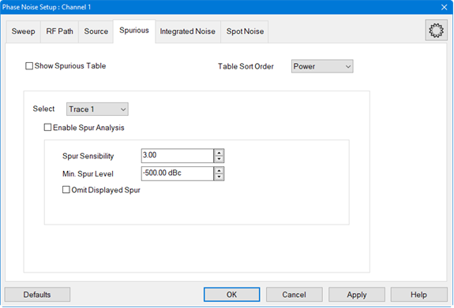 Show Spurious Table \-
Enable or disable displaying the spurious table below the trace display.
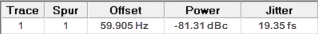 Trace \- Displays trace
number(s). Spur \- Displays the spur number(s) per trace. Offset \- Offset
frequency. Power \- Power level of the spur. Jitter \- The phase deviation in
the time domain. Table Sort Order \- Sets the spurious table sorting by power
or by offset. Select \-  Enable Spur Analysis \- Enables and disables spurious
analysis search markers. See [Spurious
Search](../../S4_Collect/Markers.htm#Phase_Noise_Marker_Search). Spur
Sensibility \- Sets the spurious sensibility value. The default is 3 (3 x
standard deviation (sigma)). Example of Spurious Judgement Using Spurious
Sensibility  Min. Spur
Level \- Spurious data larger than this minimum spurious level will be omitted
from the spurious data. 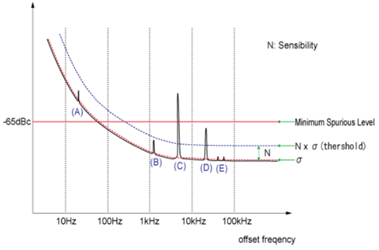
Omit Displayed Spur \- Omits all displayed spurs. Defaults button - Restores
default phase noise settings. Apply button - Applies setting changes and
leaves the dialog box open to make more setting changes.  
  
Integrated Noise Tab in dialog help |   
---|---  
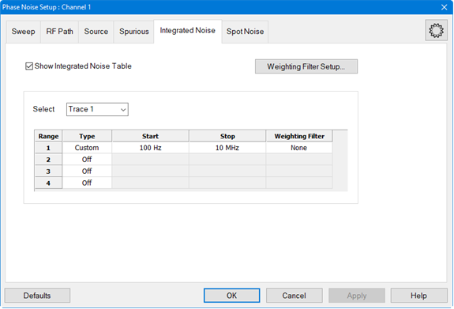 Show Integrated
Noise Table \- Enable or disable displaying the integrated noise table below
the trace display. Integrated noise is the single sideband noise integrated
over a measurement bandwidth from a start/stop frequency.
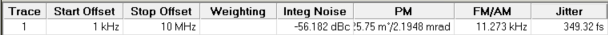 Trace \- Displays
trace number(s). Start Offset \- This is the same as the Start Offset defined
in the Sweep tab. Stop Offset \- This is the same as the Stop Offset defined
in the Sweep tab. Weighting Filter \- Displays the weighting filename or None
for no weighting. Integ Noise \- Noise over a measurement bandwidth from the
defined start/stop frequency. PM \- Phase Modulation measured in degrees and
radians. FM/AM \- The FM/AM column displays a value depending on the
measurement parameter. When the measurement parameter is Phase Noise (for
example, PN_b2), the residual FM (Hz) is shown in the FM/AM column. When the
measurement parameter is AM Noise (for example, AM_b2), the percentage of
modulation of the carrier is shown in the FM/AM column.  Jitter \- The phase
deviation in the time domain. Weighting Filter Setup... button - Accesses
Weighting Filter Table Setup dialog. The weighting filters compensate external
effects that affect the phase noise in the specified frequency ranges. When
the weighting filters are applied, the trace data are corrected by the filter
characteristics before the calculation of integrated noise. You must define at
least 2 frequencies when using the Weighting Filter.
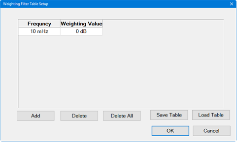 Add button -
Adds a frequency below existing entries. Delete button - Deletes the currently
selected frequency in the table. Delete All button - Deletes all frequencies
in the table. Save Table button - Saves the weighting filter table to a .csv
file. The file should be saved in the following directory:
C:\ProgramData\Keysight\Network Analyzer\WeightingFilter. All filters saved in
this directory are shown on the drop down list in the Weighting Filter column.
Load Table button - Loads a previously saved weighting filter table. Select \-
Selects an existing phase noise trace or allows you to add a new trace. Each
trace can have up to four defined ranges. See [Displaying Phase Noise
Parameters](Displaying_Phase_Noise_Parameters.htm). Range \- Sets the
integration range number.  Type \- Sets the integration range type of the
selected integration range defined as offset frequency from the carrier.  Off
\- Disables specific range and will not be measured. Full Span \- Enables the
measurement bandwidth to be the full offset range defined in the Sweep tab.
Custom \- Enables custom-defined start and stop offset range. Start \- Start
offset frequency for the integrated noise measurement. Stop \- Stop offset
frequency for the integrated noise measurement. Weighting Filter \- Selects
pre-defined weighting filter file. Select None when a weighting filter file
will not be used. Defaults button - Restores default phase noise settings.
Apply button - Applies setting changes and leaves the dialog box open to make
more setting changes.  
  
Spot Noise Tab in dialog help |   
---|---  
 Show Spot Noise Table \-
Enable or disable displaying the Spot Noise Table below the trace display.
 Trace \- Displays
trace number(s). Spot Frequency columns - Displays decade edges and/or
specified offset spot frequencies. Select Traces \- Select traces for
calculating the Spot Noise. New Traces... button - Add a new trace for
calculating Spot Noise. Define Spot Frequencies \- Select the check boxes and
enter specific spot frequencies to measure. A trace must be selected. If
Decade Edges is selected, the decade edges will also be measured. Duplicate
frequencies between Decade Edges and Spot Frequencies are shown only once.
Decade Edges \- Select to measure the decade edges based on the Start Offset
and Stop Offset settings defined in the Sweep tab. Deselect to measure only
the defined/selected spot frequencies. A trace must be selected. Defaults
button - Restores default phase noise settings. Apply button - Applies setting
changes and leaves the dialog box open to make more setting changes.

