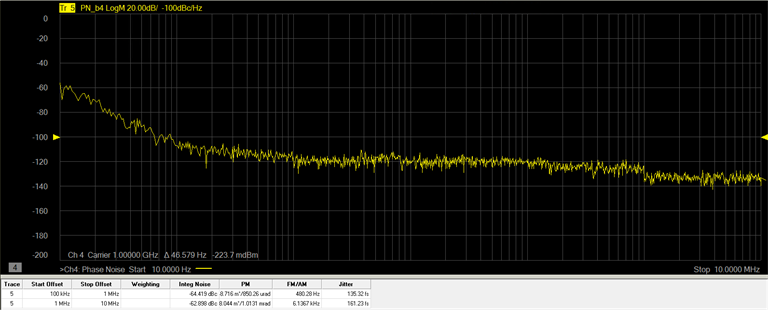

# Integrated Noise Measurement

Integrated noise is the single sideband phase noise integrated over a
measurement bandwidth from a start/stop offset frequency. Up to four offset
frequency ranges can be defined.

In this topic:

  * Define a New Trace

  * Set Up Measurement Ranges

  * Set Up Weighting Filter

  * Displaying the Integrated Noise Table

## Define a New Trace

When the Phase Noise Measurement Class is selected and a Phase Noise channel
is created, the default measurement parameter is PN_b2. This indicates that
the trace is a Phase Noise measurement that will be made at the b2 receiver of
the VNA. The VNA receiver can be changed using the VNA Input function in the
RF Path tab. Each defined trace can have independent settings.

  1. In the Integrated Noise tab, click on the Select drop down menu and select New Traces....

  2. In the New Trace dialog, select PN_bN, where "N" is the VNA receiver number set using the VNA Input function in the RF Path tab.

## Set Up Measurement Ranges

The following procedure describes how to set up multiple measurement ranges.

  1. In the Integrated Noise tab, click on the Select drop down menu and select the desired trace.

  2. Click in the Type column for Range 1, click on the down arrow, then select Custom.

  3. In the Start column for the range, set the frequency by either using the up/down arrows or by double-clicking in the data entry field and entering the frequency using the displayed keypad.

  4. In the Stop column for the range, set the frequency by either using the up/down arrows or by double-clicking in the data entry field and entering the frequency using the displayed keypad.

  5. Repeat steps 2 through 4 to add more ranges (up to four ranges).

  6. If Weighting Filter files have been set up and saved, click in the Weighting Filter column for a range, click on the down arrow, then select the file. See below for a procedure on how to set up a Weighting Filter file.

## Set Up Weighting Filter

The weighting filter allows weighting values to be entered at specified
frequencies. The weighting filters compensate external effects that affect the
phase noise in the specified frequency ranges. When the weighting filters are
applied, the trace data are corrected by the filter characteristics before the
calculation of integrated noise.

  1. In the Integrated Noise tab, click on the Weighting Filter Setup... button.

  2. Click on the Add button.

  3. In the Frequency column, set the frequency by either using the up/down arrows or by double-clicking in the data entry field and entering the frequency using the displayed keypad.

  4. In the Weighting Value column, set the value by either using the up/down arrows or by double-clicking in the data entry field and entering the value using the displayed keypad.

  5. Repeat steps 2 through 4 to add more weighting values.

  6. Click on the Save Table button to save the settings to a file (.csv).

## Displaying the Integrated Noise Table

The Integrated Noise Table can be displayed below the trace area of the
display showing trace number, start/stop offset, weighting filename (if used)
integrated noise, phase modulation measured in degrees and radians, residual
FM (Hz) or residual AM (%), and jitter. Residual FM (Hz) will be displayed
when the [PN_b2](Displaying_Phase_Noise_Parameters.md#Measurement_Parameters)
Phase Noise measurement parameter is selected; residual AM (%) will be
displayed when the
[AM_b2](Displaying_Phase_Noise_Parameters.md#Measurement_Parameters) Phase
Noise measurement parameter is selected.

  1. In the Integrated Noise tab, check Show Integrated Noise Table.

