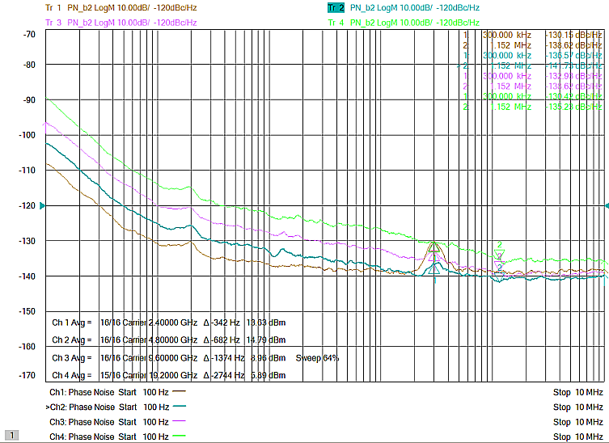
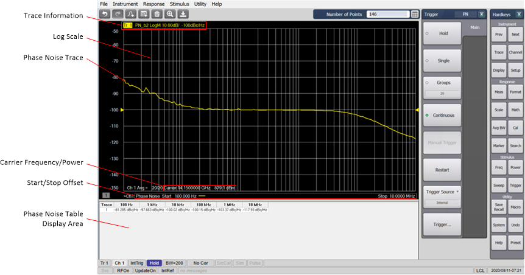
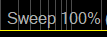
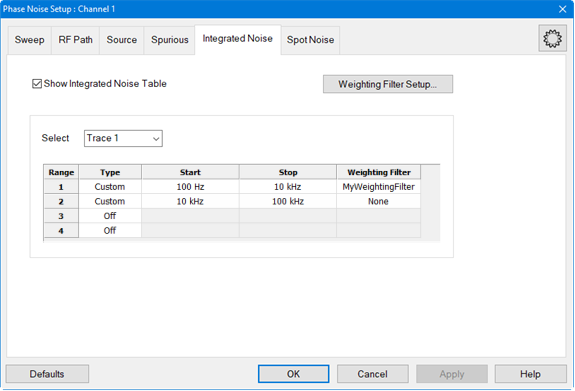
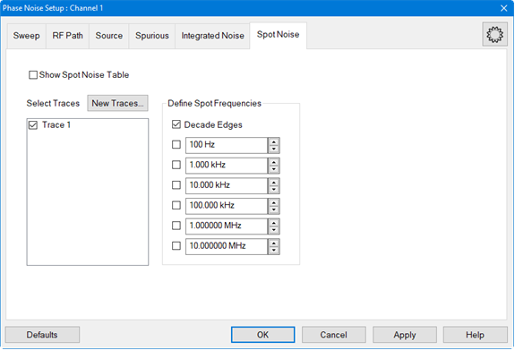

# Overview

Note: The Phase Noise Application applies ONLY to PNA/PNA-X instruments with
serial prefix 6021 and above.

The Option S93031xB Phase Noise application measures the phase noise of a
DUT's output signal within a specified offset frequency range.

In this topic:

  * Features and Requirements
  * Phase Noise Floor versus Frequency Plot
  * Hardware Setups
  * Phase Noise Display
  * Spurious Measurement
    * Spurious Sensibility
    * Spurious Threshold
    * Spurious Table
  * Integrated Noise Measurement
    * Integrated Noise Table
  * Spot Noise Measurement
    * Spot Noise Table
  * Phase Noise Graphical User Interface

#### See Also

  * [Starting and Exiting Phase Noise](Starting_and_Exiting_Phase_Noise.md)
  * [Configuring Phase Noise](Configuring_Phase_Noise.md)
  * [Displaying Phase Noise Parameters](Displaying_Phase_Noise_Parameters.md)
  * [Phase Noise Marker Search Functions](../../S4_Collect/Markers.md#Phase_Noise_Marker_Search)
  * [Calibration](../../S3_Cals/Calibrate_All_Channels.md)
  * Phase Noise Measurement Examples
    * [Setting Up a Phase Noise Measurement](Setting_Up_a_Phase_Noise_Measurement.md)
    * [Spurious Measurement](Spurious_Measurement.md)
    * [Integrated Noise Measurement](Integrated_Noise_Measurement.md)
    * [Spot Noise Measurement](Spot_Noise_Measurement.md)
    * [AM Noise Measurement](AM_Noise_Measurement.md)
  * Phase Noise SCPI Programming Examples
    * [Setting Up a Phase Noise Measurement](../../Programming/GPIB_Example_Programs/Setting_Up_a_Phase_Noise_Measurement.md)
    * [Setting Up a Source](../../Programming/GPIB_Example_Programs/Setting_Up_a_Source.md)
    * [Spurious Measurement](../../Programming/GPIB_Example_Programs/Spurious_Measurement.md)
    * [Integrated Noise Measurement](../../Programming/GPIB_Example_Programs/Integrated_Noise_Measurement.md)
    * [Spot Noise Measurement](../../Programming/GPIB_Example_Programs/Spot_Noise_Measurement.md)

## Features and Requirements

#### Features

  * Absolute Phase Noise measurements

  * AM noise measurement

  * Spur identification and removal

  * Automatic carrier search

  * Extensible to mm-Wave

#### Requirements

  * Phase Noise Option S93031xB 

  * 2-Port or 4-Port PNA/PNA-X instruments with serial prefix 6201 and above (new Direct Digital Synthesizers)

  * Windows 10 operating system

## Phase Noise Floor versus Frequency Plot

The noise floor for 2.4 GHz, 4.8 GHz, 9.6 GHz, and 19.2 GHz frequencies rises
at an offset frequency of 300 kHz as shown in the following plot:

## Hardware Setups

The following are typical hardware setups for measuring the phase noise of a
device. The Option S93031xB Phase Noise application is installed on the
PNA/PNA-X.

## Phase Noise Display

The Phase Noise application measures the power density of the noise sideband
relative to the power of the carrier over a start/stop offset frequency. The
offset frequency corresponds to the distance from the carrier frequency. The
log-transformed phase noise is displayed in dBc/Hz.

The bottom of the display area shows the carrier frequency, carrier power, and
the Phase Noise start and stop offset frequencies. The x-axis is the offset
frequency range displayed on a logarithmic scale to allow viewing the full
offset range. Also displayed is the delta frequency indicator next to the
Carrier Frequency. The delta frequency displays the frequency from the nominal
carrier frequency. The actual carrier is not tuned exactly to the nominal
carrier frequency. The delta indicator displays this frequency difference.

If the sweep time is greater than 2 seconds, a sweep indicator is displayed at
the bottom of the display area to provide sweep time percentage complete:

Noise tables showing Spurious, Integrated Noise, and Spot Noise data can be
displayed below the trace area.

## Spurious Measurement

Spurs can be analyzed using Spurious Sensibility or by defining Threshold
levels.

### Spurious Sensibility

Spurious Sensibility = Sensibility Value x Standard Deviation (or sigma).

### Spurious Table

The Spurious Table can be displayed below the trace area of the display
showing Trace and Spur number, Offset frequency, Power level, and Jitter.

## Integrated Noise Measurement

Integrated noise is the single sideband noise integrated over a measurement
bandwidth from a start/stop offset frequency. Up to four offset frequency
ranges can be defined.

A weighting filter can defined and saved to a file for later use. The
weighting filters compensate external effects that affect the phase noise in
the specified frequency ranges. When the weighting filters are applied, the
trace data are corrected by the filter characteristics before the calculation
of integrated noise.

### Integrated Noise Table

The Integrated Noise Table can be displayed below the trace area of the
display showing trace number, start/stop offset, weighting filename (if used)
integrated noise, phase modulation measured in degrees and radians, residual
FM (Hz) or residual AM (%), and jitter.

## Spot Noise Measurement

Spot Noise measurement are measurements made at specific frequencies. The
measurements can be made at each decade, determined by the start/stop offset
frequencies, up to six defined frequencies, or a combination of both decade
and defined frequencies.

### Spot Noise Table

The Spot Noise Table can be displayed below the trace area of the display
showing the specific measurement frequencies and the phase noise in dBc/Hz.

## Phase Noise Graphical User Interface

The GUI consists of setup dialogs accessed by clicking on their corresponding
tabs. In this way, configurations can be set up quickly. See [Configuring
Phase Noise](Configuring_Phase_Noise.htm) for information about these dialogs.

