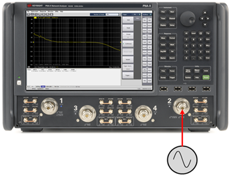
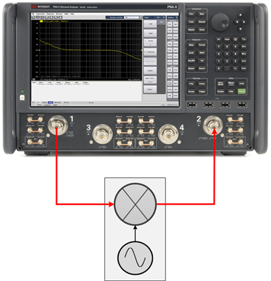
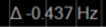

# Setting Up a Phase Noise Measurement

The following procedures describe how to set up a phase noise measurement
using the Option S93031xB Phase Noise application.

In this topic:

  * Hardware Setups

  * Create a Phase Noise Channel

  * Open the Phase Noise Setup dialog

  * Set Up the Carrier

  * Set Up the Measurement

  * Set Up the RF Path

  * Set Up the Source

  * Set Up an External Source

## Hardware Setups

The following are typical hardware setups for measuring the phase noise of a
device. The Option S93031xB Phase Noise application is installed on the
PNA/PNA-X.

## Create a Phase Noise Channel

  1. On the VNA front panel, press Meas > S-Param > Meas Class....

  2. Select Phase Noise, then either:

     * OK delete the existing measurement, or

     * New Channel to create the measurement in a new channel.

  3. In the Confirm Measurement Class Change dialog, click OK to proceed or Cancel to exit.

  4. The Phase Noise Setup dialog is displayed.  
  

  5. The default [Phase Noise Measurement Parameter](Displaying_Phase_Noise_Parameters.md#Measurement_Parameters) is PN_b2. This means that the displayed trace is a Phase Noise measurement trace. The "b2" corresponds to the VNA receiver input to use for the phase noise measurement.

## Open the Phase Noise Setup dialog

  1. If the Phase Noise Setup dialog is not displayed, press Freq> Main > Phase Noise Setup....

  2. The Sweep, RF Path, Source, Spurious, Integrated Noise, or Spot Noise tab can now be selected.

## Set Up the Carrier

  1. In the Sweep tab, set the Carrier Frequency by either using the up/down arrows or by double-clicking in the data entry field and entering the frequency using the displayed keypad. This is the nominal value of the carrier frequency.

  2. Set the Carrier Threshold by either using the up/down arrows or by double-clicking in the data entry field and entering the level using the displayed keypad. The carrier will be detected using this threshold value and will be compared to the specified Carrier Frequency. The delta indicator displays any frequency difference.  

## Set Up the Measurement

  1. In the Sweep tab, set the Start Offset and Stop Offset by either using the up/down arrows or by double-clicking in the data entry field and entering the frequency using the displayed keypad. This is an offset relative to the carrier frequency to position the measurement about the noise sideband to measure power density in dBc/Hz.

  2. Set the RBW Ratio by either using the up/down arrows or by double-clicking in the data entry field and entering the value using the displayed keypad. The RBW Ratio sets the resolution bandwidth ratio, which is the specified resolution bandwidth percentage of every half decade offset frequency.

  3. Set the FFT Avg Factor by either using the up/down arrows or by double-clicking in the data entry field and entering the value using the displayed keypad. The average factor is multiplied by the default average count, which changes for each frequency range.

  4. Select the desired Noise Mode using the drop down menu. Select Fast, Normal, or Best. The Fast selection has the highest noise floor and fastest measurement speed. The Best selection is the slowest measurement speed with lowest noise floor. Refer to the following example showing Fast, Normal, and Best differences:  
  

## Set Up the RF Path

  1. In the RF Path tab, select the VNA Input using the drop down menu. This selects the VNA receiver input to use for the phase noise measurement. Only one can be chosen.

  2. Set the Rcvr Atten using the drop down menu. This sets the VNA receiver attenuation of the selected VNA receiver.

  3. Click on the RF Path Configuration... button to configure hardware paths that are available with selected [PNA/PNA-X options](../../Support/Configurations.md#PNAX) as necessary. This ensures that the correct path has been selected for the source (for converter measurements) and receiver. [Learn more](../../S1_Settings/Path_Configurator.md).

## Set Up the Source

Set up a source when the DUT requires an RF source at its input.

  1. In the Source tab, select ON in the State column next to the desired source displayed in the list. This is the source used at the input of the DUT. 

  2. Set the Frequency for the selected source by clicking in the data entry field, clicking on the Edit button, then entering the frequency by either using the up/down arrows or by double-clicking in the data entry field and entering the frequency using the displayed keypad.

  3. Set the Power for the selected source by clicking in the data entry field, clicking on the Edit button, then entering the power by either using the up/down arrows or by double-clicking in the data entry field and entering the power using the displayed keypad.

  4. Click on the Power and Attenuator... button to define and control the source power and attenuation. [Learn more](../../S1_Settings/Power_Level.md#Advanced)

  5. Click on the RF Path Configuration... button to configure hardware components that are available with selected [PNA/PNA-X options.](../../Support/Configurations.md#PNAX) [Learn more](../../S1_Settings/Path_Configurator.md).

## Set Up an External Source

An external source can also be configured and selected as the source. Before
the external source is displayed in the list it must be set up as shown in the
following procedure.

  1. Click on the External Devices... button.

  2. Click on the New button.

  3. Click in the Name field and type a name for the source. For example, myMXG.

  4. For Device Type, select Source.

  5. Select the Driver. For example, MXG_Vector.

  6. Select Active - Show in UI.

  7. Ensure that Enable IO is checked.

  8. In the I/O Configuration field, type the VISA address of the external source.

  9. Click on the OK button. The following is an example:  
  

  10. The external source should be displayed in the list of sources displayed in the Source tab and can be selected using the Set Up the Source procedure.

