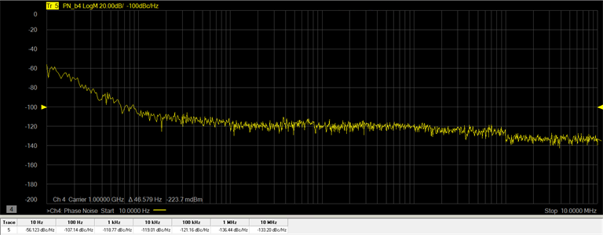
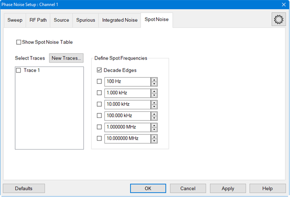
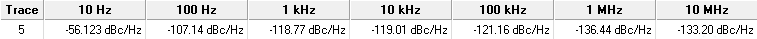

# Spot Noise Measurement

Spot Noise measurement are measurements made at specific frequencies. The
measurements can be made at each decade, determined by the start/stop offset
frequencies, up to six defined frequencies, or a combination of both decade
and defined frequencies.

In this topic:

  * Define a New Trace

  * Define Spot Frequencies

  * Displaying the Spot Noise Table

## Define a New Trace

When the Phase Noise Measurement Class is selected and a Phase Noise channel
is created, the default measurement parameter is PN_b2. This indicates that
the trace is a Phase Noise measurement that will be made at the b2 receiver of
the VNA. The VNA receiver can be changed using the VNA Input function in the
RF Path tab. Each defined trace can have independent settings.

  1. In the Spot Noise tab, click on the New Traces... button.

  2. In the New Trace dialog, select PN_bN, where "N" is the VNA receiver number set using the VNA Input function in the RF Path tab.

## Define Spot Frequencies

The following procedure describes how to define measurements at specific
frequencies and/or at the decade edges. The decade edges are determined by the
Start Offset and Stop Offset settings in the Sweep tab.

  1. In the Spot Noise tab, select the desired trace displayed under Select Traces.

  2. To measure phase noise at each decade, check Decade Edges and leave the other spot frequencies unchecked.

  3. To define specific frequencies to measure other than at the decade edges, perform the following steps:

     1. Uncheck the Decade Edges check box.

     2. In the data entry field, set the spot frequency to measure (up to six) by either using its up/down arrows or by double-clicking in its data entry field and entering the frequency using the displayed keypad.

     3. Check the corresponding box to enable the measurement at this specific frequency.

     4. Repeat steps a through c for each frequency to measure.

### Displaying the Spot Noise Table

The Spot Noise Table can be displayed below the trace area of the display
showing the trace number and corresponding measurement frequencies and the
phase noise in dBc/Hz.

  1. In the Spot Noise tab, check Show Spot Noise Table.

