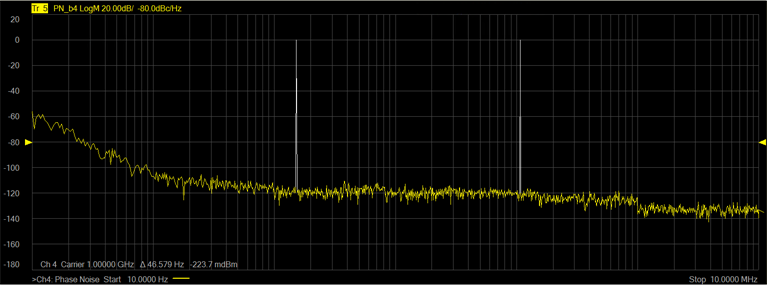
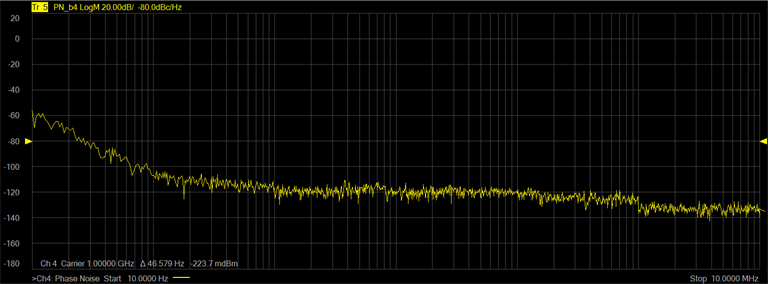
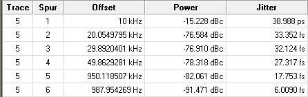
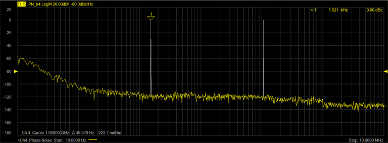

# Spurious Measurement

In this topic:

  * Spurious Criteria

  * Define a New Trace

  * Setting Minimum Spurious Level

  * Setting Spurious Sensibility

  * Setting Omit Displayed Spur

  * Displaying the Spurious Table

  * Enable Spur Analysis

## Spurious Criteria

The criteria used for a spurious measurement defines the threshold in terms of
the standard deviation ( σ ) value which is calculated from the measurement
result moving average.

The threshold can be set as the standard deviation ( σ ) × sensibility. When
the measured value exceeds the threshold, it is defined as a spur.

## Define a New Trace

When the Phase Noise Measurement Class is selected and a Phase Noise channel
is created, the default measurement parameter is PN_b2. This indicates that
the trace is a Phase Noise measurement that will be made at the b2 receiver of
the VNA. The VNA receiver can be changed using the VNA Input function in the
RF Path tab. Each defined trace can have independent spurious settings.

  1. In the Spurious tab, click on the Select drop down menu and select New Traces....

  2. In the New Trace dialog, select PN_bN, where "N" is the VNA receiver number set using the VNA Input function in the RF Path tab.

## Setting Minimum Spurious Level

If the spurious data is exceeds the minimum spurious level, it is omitted from
the spurious data, or it is displayed as Power (dBc).

For example, there are two peaks (C) and (D) which are detected as a spurious
in the figure below. When Power (dBc) is displayed, the peak (C) which is
above the minimum spurious level turns white in color.

  1. In the Spurious tab, click on the Select drop down menu and select the desired trace.

  2. Set the Min. Spur Level by either using the up/down arrows or by double-clicking in the data entry field and entering the level using the displayed keypad.

## Setting Spurious Sensibility

The following procedure describes how to set spurious sensibility.

  1. In the Spurious tab, click on the Select drop down menu and select the desired trace.

  2. Set the Spur Sensibility by either using the up/down arrows or by double-clicking in the data entry field and entering the value using the displayed keypad.

## Setting Omit Displayed Spur

This function will omit all displayed spurs.

  1. In the Spurious tab, click on the Select drop down menu and select the desired trace.

  2. Check Omit Displayed Spur. The following shows two spurs displayed in the top trace and, after checking Omit Displayed Spur, the bottom trace shows that the spurs are omitted.  
  
  

## Displaying the Spurious Table

The Spurious Table can be displayed below the trace area of the display
showing Trace and Spur number, Offset frequency, Power level, and Jitter.

  1. In the Spurious tab, check Show Spurious Table.

  2. To sort the table, click on the Table Sort Order drop down menu and select Power to sort by power or Offset to sort by offset frequency.

## Enable Spur Analysis

This function enables spurious analysis search markers. See [Spurious
Search](../../S4_Collect/Markers.htm#Phase_Noise_Marker_Search).

  1. In the Spurious tab, click on the Select drop down menu and select the desired trace.

  2. Check Enable Spur Analysis then click OK to exit the dialog.

  3. On the VNA front panel, press Search > Spurious > Spurious Search. A marker is displayed over the first spur:  
  

  4. Note the frequency and level from the carrier are displayed in the top-right corner of the display.

  5. To move the marker to the next spur on the right, press Spurious Right >> Search.

  6. To move the marker to a spur on the left, press Spurious Left >> Search.

  7. To place markers on all displayed spurs, press Multi Spurious Search.

  8. To turn off all markers, press Marker > Marker Setup > All Off.

