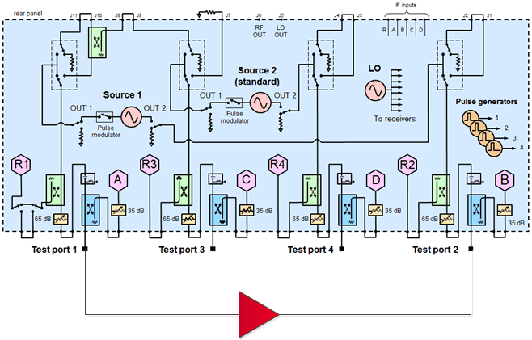
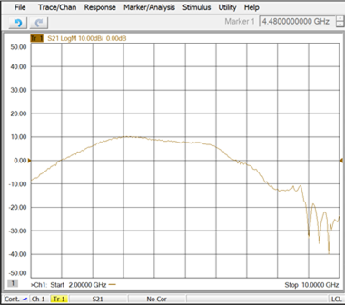
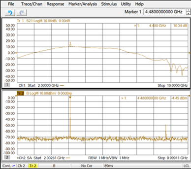
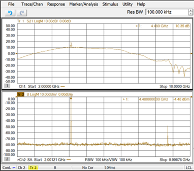
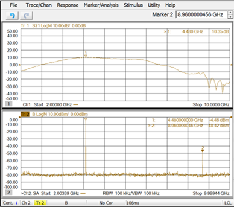
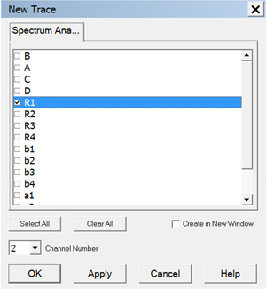
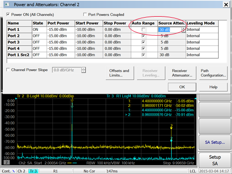

# SA Amplifier Harmonics Measurement

  * Physical Setup

  * Measurement Description

  * Step 1. Set Up Amplifier Harmonics Measurement

  * Step 2. Validate Receiver

  * Step 3. Validate Source

[See All Spectrum Analyzer
Examples](Spectrum_Analyzer.htm#Spectrum_Analyzer_Measurement_topics_)

## Physical Setup

## Measurement Description

This measurement example helps you understand the basic operation of the
Spectrum Analyzer application and how to optimize the measurement setup to
avoid instrument-generated spurious responses. This example measures the
harmonics at maximum gain of an amplifier and confirms that the harmonics are
solely caused by the amplifier, not by the PNA source or receivers.

## Step 1. Set Up Amplifier Harmonics Measurement

  1. On the PNA front panel, press Preset.

  2. Press Power > Port Power > Select and select Port 1.

  3. Press Power > Port Power > Power Level and set the Port 1 source power to be in a linear region of the amplifier's output response.

  4. Press Freq and set the start/stop frequency to measure the gain across the amplifier's frequency range.

  5. Press Meas > S-Param > S21. You should see the amplifier's frequency response as shown in the following example.

  6. Press Search > Main > Max Search to place a marker on the maximum gain.

  7. Press Marker > Marker -> Functions > Marker -> SA to view the amplifier's spectrum at the maximum gain. Note that a second channel with Spectrum Analyzer mode is created as shown in the following example.

  8. Press Setup > Main > SA Setup... then Resolution Bandwidth and adjust (narrow) the resolution bandwidth to lower the noise floor. The following example shows the lowered noise floor after changing the resolution bandwidth from 1 MHz to 100 kHz.

  9. Press Marker > Marker 1-7 > Marker 2 and place the marker on the second harmonic level as shown in the following example.

## Step 2. Validate Receiver

The receiver will be validated by monitoring the amplitude of the 2nd harmonic
while increasing the receiver B attenuator. The resolution bandwidth will be
adjusted if necessary to lower the noise floor. The receiver B attenuator will
only affect the power input to the receiver thus affecting the receiver
harmonics. However, it does not affect the DUT’s 2nd harmonic. Therefore, if
the measured 2nd harmonic does not change when the receiver B attenuator is
changed, the receiver B is not contributing the 2nd harmonic measurement.

  1. Press Setup > Main > SA Setup....

  2. Increase the Receiver B Attenuator then click Apply.

  3. Monitor the 2nd harmonic amplitude for any changes.

## Step 3. Validate Source

To validate the source, an R1 trace is added and source attenuation is
increased to verify if a 2nd harmonic signal is being generated from the Port
1 source.

When source attenuation increases but the set Port 1 output power remains the
same, the source outputs more power to maintain the set Port 1 output power.
The R1 coupler is before the source attenuator thus it sees higher power from
the source than that with the lower source attenuator setting. At a certain
point, R1 is compressed and starts generating the 2nd harmonic.

As the R1 receiver has no step attenuators, to verify if it is the source or
the R1 receiver generating the harmonic, measure the same harmonic signal with
receiver B but without the DUT (using a Thru connection from Port 1 to Port
2). Attenuators may be added to the receiver B to avoid compression and the
resolution bandwidth can be adjusted to lower the noise floor. If receiver B
sees the harmonic signal, it is from the source (or both); If the R1 receiver
sees the harmonic but receiver B does not, the harmonic is due to the R1
receiver compression.

  1. From the menus across the top of the display, press Trace > Trace Setup > Measure..., select R1 to add an R1 trace, then click OK. Refer to the following example.

  2. Press Freq > Main > SA Setup..., Source tab, then Power and Attenuator... button.

  3. Deselect Auto Range for Port 1, increase Source Atten to 20 dB, click OK, then click OK in the Source tab. Refer to the following example.

  4. Monitor the 2nd harmonic on the R1 trace for any changes.

  5. Press Freq > Main > SA Setup..., Source tab, then Power and Attenuator... button.

  6. Increase Source Atten to 30 dB, click OK, then click OK in the Source Setup tab. Refer to the following example.

  7. Monitor the 2nd harmonic on the R1 trace for any changes.

