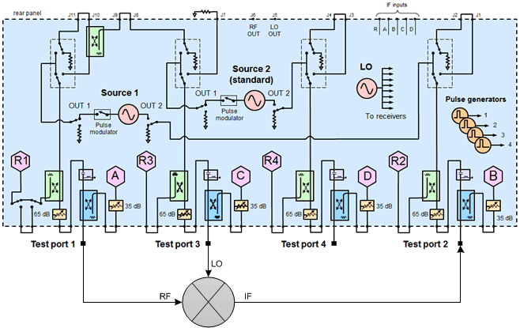
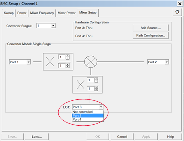
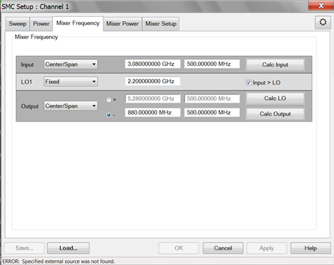
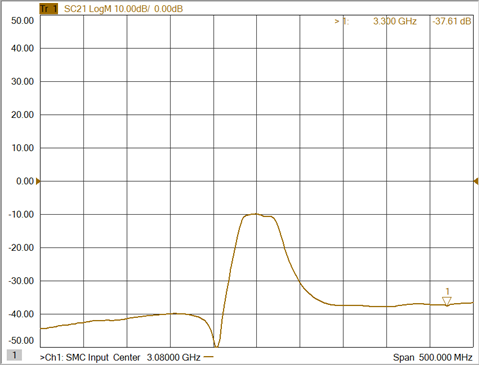
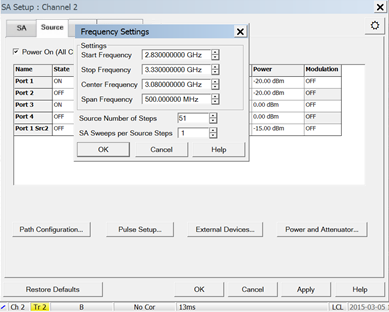
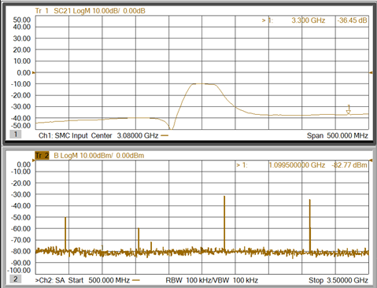
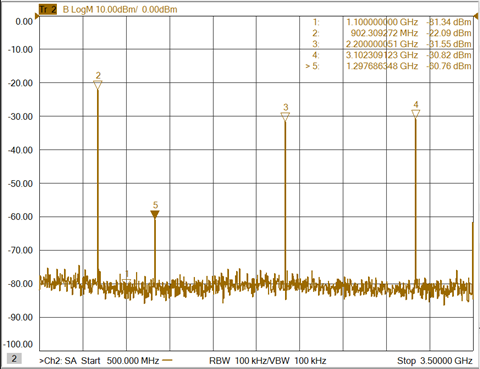
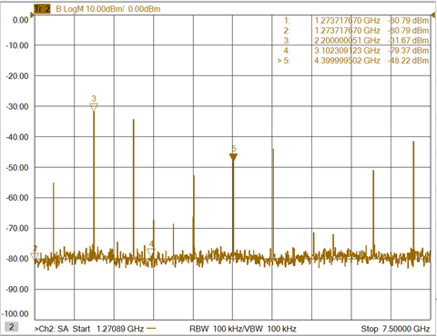
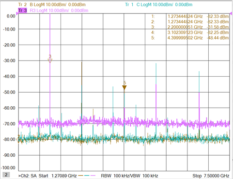
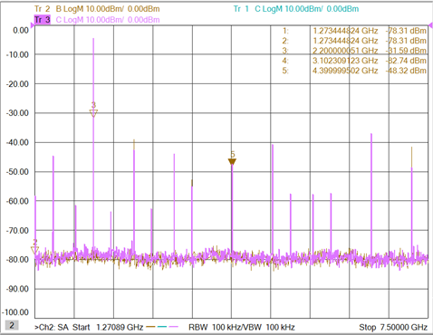

# SA Converter Spurious Measurement

  * Physical Setup

  * Measurement Description

  * Step 1. Set Up the Converter SC21 Measurement

  * Step 2. Analyze Spurious Signals at IF Output

  * Step 3. Analyze Signals Using Markers

[See All Spectrum Analyzer
Examples](Spectrum_Analyzer.htm#Spectrum_Analyzer_Measurement_topics_)

## Physical Setup

## Measurement Description

This measurement example sets up a converter Scalar Mixer/Converter (SMC) +
Phase measurement, monitors the spurious response on SC21 at specific
frequencies, then shows how to use the Spectrum Analyzer application for
analysis.

## Step 1. Set Up the Converter SC21 Measurement

  1. On the VNA front panel, press Preset.

  2. Press Meas > S-Param > Measurement Class, select Scalar Mixer/Converter + Phase, then click OK.

  3. In the SMC Setup dialog that appears, select the Mixer Setup tab to configure the SMC setup.

  4. Select Port 3 for LO1. Refer to the following example.

  5. Select the Mixer Power tab, set LO1 Power to 0 dBm, the click Apply.

  6. Select the Mixer Frequency tab, set converter frequencies, then click Apply. Refer to the following example.

  7. Select the Power tab, set Port 1 Power Level, check Power On (All Channels), then click OK.

  8. Place a marker on any unknown signal of the SC21 trace as shown in the following example. (Note that the DUT used in this example has an amplifier stage and a filter.)

## Step 2. Analyze Spurious Signals at IF Output

The following Spectrum Analyzer measurement example will show the IF signal at
1.1 GHz at the output of the converter when the RF is at CW 3.3 GHz. Typical
symptoms include an unstable IF response or intermittent spurious on converter
output. To find the cause, the IF, LO, and RF frequency ranges must be
analyzed.

  1. Press Marker > Marker -> Functions > Marker -> SA. The following shows an RF and IF response and is an example of a spurious signal.

  2. Press Freq > Main > SA Setup... then select the Source tab.

  3. Change the Port 1 Type from CW to Linear (the source will sweep from start to stop frequency).

  4. Change the Port 1 Frequency range to be the same as the SMC channel, set Source Number of Steps to 51, set SA Sweeps per Source Step to 1, then click OK. Refer to the following example.

  5. Ensure that Port 3 is set to CW 2.2 GHz then click OK.

  6. Observe the IF response while sweeping the input (RF) signal.

  7. Select Freq > Main > SA Setup..., set Start frequency to 500 MHz, and set Stop frequency to 3.5 GHz.

  8. Deselect Resolution Bandwidth Auto, change bandwidth to 100 kHz, then click OK. This allows the IF, LO, and RF signals to be viewed on the spectrum as shown in the following example. Note that the signals from the IF port are sweeping as the RF signal sweeps.

## Step 3. Analyze Signals Using Markers

  1. Press Trigger > Main > Hold to freeze the sweep, then apply markers to signals as shown in the following example.

  2. Observe the signals shown in the example above:

     * Marker 4: RF, 3.1 GHz

     * Marker 3: LO, 2.2 GHz

     * Marker 2: IF, 902 MHz

     * Marker 5, spur,1.3 GHz

The spur frequency can be derived from the marker information:

LO - IF = LO - (RF - LO) = 2LO - RF

  3. Press Freq > Main > SA Setup..., set the stop frequency to 7.5 GHz then click OK to observe higher-order components.

  4. Press Trigger > Main > Continuous to sweep the channel. The frequency components are sweeping in accordance with the RF sweep.

  5. Press Trigger > Main > Hold to investigate the signals. Note that in the following example, the marker 5 frequency is 2LO.

  6. Press Trace > Trace Setup > Measure..., select R3, select C, then click OK. This adds an R3 and C receiver measurement to determine if an LO harmonic is from the Port 3 LO source or from the converter circuit. If the signal appears in the R3 reference receiver measurement, then the spur is generated by the Port 3 LO source. If the signal appears in the C test receiver measurement, then the spur is generated by the DUT, Refer to the following examples.

