# Spectrum Analyzer

* * *

The Spectrum Analyzer function is available with Sx090A/B.

In this topic:

  * [Features, Requirements, and Limitations](Spectrum_Analyzer.md#Features)
  * Specificities versus legacy Spectrum Analyzer setups
  * [Spectrum Analyzer Setup Overview](Spectrum_Analyzer.md#Overview)
  * [How to make SA Measurements](Spectrum_Analyzer.md#HowStart)
  *     * [SA Setup Dialog](Spectrum_Analyzer.md#SetupTab)
    * [Source Setup Dialog](Spectrum_Analyzer.md#SourceSetupTab)
    * Coherence Setup Dialog

    * Trig. & Pulse Dialog

    * [Advanced Settings Dialog](Spectrum_Analyzer.md#AdvancedSettings)
    *       * IF Dialog
      * Processing Dialog
      * ADC & LO Dialog
      * Data Dialog
    * [Source Frequency Settings Dialog](Spectrum_Analyzer.md#SourceFreqSettings_Dialog)
    * Source Power Settings Dialog
    * [Measurement Parameters](Spectrum_Analyzer.md#HowMeasParams)
  * Marker -> SA
  * [SA Analysis Markers](../S4_Collect/Markers.md#Spectrum_Analyzer_Marker_Search) (Separate topic)
  * Calibrating an SA Channel
  * Gated SA
  * SA Warning Messages
  * Spectrum Analyzer Measurement Examples (Separate topics)
  *     * [Amplifier Harmonics Measurement](SA_Amplifier_Harmonics_Measurement.md)
    * [Converter Spurious Measurement](SA_Converter_Spurious_Measurement.md)
    * [Gated Measurement](Gated_Measurement.md)

#### See Also

[Programming commands](../Programming/MixerTopic.md#SAsetup)

[Spectrum Analyzer mmWave
Measurements](../IFAccess/External_Test_Head_Configuration.htm#Spectrum_Analyzer_Measurements)

[Noise Power Ratio (NPR)
Measurement](../Tutorials/Noise_Power_Ratio_\(NPR\)_Measurement.htm)

[Other VNA Applications](Applications.md)

## Features, Requirements, and Limitations

#### Features

  * General purpose spectrum analysis for component measurements
  * Add multi-channel spectrum analysis (multiple receivers/frequencies)
  * Perform fast spurious search in broad frequency band
  * Enable spectrum analysis at calibration plane using VNA calibration and Fixturing (de-embedding)
  * Single-connection, multiple measurements
  * Internal, manual, and external triggering - [learn more](../S1_Settings/Trigger.md#source)
  * Marker -> SA available in Standard, SMC, and Swept IMD channels
  * Gating - learn more
  * Coherence Image Rejection for multi-tones and repetitive test signals
  * Export data
  * All VNA  are supported. 
  * Broadband and Banded millimeter-wave systems are supported - learn more
  * External DC meter configuration is supported for a SA measurement channel.

#### Requirements

  * Spectrum Analyzer Option S930900A/B.

  * Windows 10 operating system

  * Option S930909A/B (10 MHz to ≤ 90 GHz) for broadband spectrum analyzer millimeter-wave measurements

  * Option S93093A/B (10 MHz to ≤ 120 GHz) for broadband spectrum analyzer millimeter-wave measurements

  * Option S93094A/B (> 110 GHz) for banded spectrum analyzer millimeter-wave measurements

  * [IF Response Adjustment](../Support/Adjust_Overview.md) required after installing Option S93090xA/B, S93093A, or S93094A/B

#### Limitations

  * For PNA-L 4-port models, only one reference receiver can be used at a time
  * For PNA-L models, millimeter-wave measurements are not available

## Specificities versus legacy Spectrum Analyzer setups

This Spectrum Analyzer application works on VNA hardware:

  * There is no hardware pre-selector filter (it used to be a slow Yig filter in legacy Spectrum analyzer hardware).

  * The IF bandwidth is limited by hardware design to 30 MHz (can be increased with advanced settings to 38 MHz). This is because PNA ADCs are baseband running at 100 MHz.

  * Image rejection in IF band is not based on hardware filtering but on software comparison of different acquisitions of the same RF frequencies with different analyzer internal LOs.

This has some consequences:

  * Sweep time is very fast for low resolution bandwidth compared to legacy spectrum analyzers (they have to wait for Yig filter stabilization).
  * Real time wideband signals can only be accurately acquired if they fit in the instantaneous IF bandwidth: 30 MHz. Real communication signal or random noise signals can then be measured with no Image rejection mode (None, LO Low or None, LO High Image Reject Type).
  * Repetitive wideband test signals can be measured accurately if the RBW is set low enough, or if the Coherent mode is enabled. Then, any signal bandwidth is possible, up to several GHz wide. If the coherent mode is not possible, then we recommend to set the RBW equal or lower to 1/10 of 1/signal repetition rate. Example: for a 1 ms repetitive test signal, set the RBW to 100 Hz or lower.

Note: The wideband repetitive test signal case is a very important and common
one, as a VNA is a component test tool, not a signal analysis tool. NPR, and
ACPR measurements of active devices can be performed accurately with this
Spectrum Analyzer Application.

## SA Setup Overview

  1. Configure SA settings.

  2. Set up the SA source frequency and power.

  3. Define the measurement parameters.

  4. Select markers.

  5. **Calibrate** the SA channel using the Cal All wizard.

## How to make SA Measurements

### Create a Spectrum Analysis Channel

  1. On the VNA front panel, press Meas > S-Param > Meas Class....

  2. Select Spectrum Analysis, then either:

     * OK delete the existing measurement, or

     * New Channel to create the measurement in a new channel.

  3. A Spectrum Analysis measurement is displayed.

#### Configure SA settings  
  
---  
Using Hardkey/SoftTab/Softkey |  Using a mouse  
  
  1. Press Freq > Main > SA Setup....

|

  1. Click Stimulus
  2. Select SA Setup...

  
  
SA Setup Dialog tab help |    
---|---  
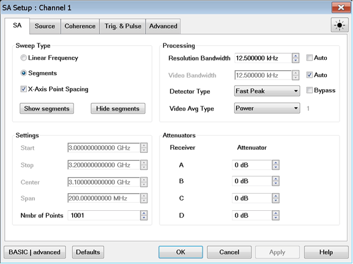 Sweep Type \- Sets the spectrum analysis
sweep type. See Type (Sweep). Show segments \- Displays the segment table at
the bottom of the display. Number of points for each segment cannot be
specified. Hide segments \- Hides the segment table. Processing Resolution
Bandwidth - Provides the ability to resolve, or see closely spaced signals.
The narrower (lower) the Resolution Bandwidth, the better the spectrum
analyzer can resolve signals. In addition, as the Resolution Bandwidth is
narrowed, less noise is measured by the spectrum analyzer ADC and the noise
floor on the display lowers as a result. This allows low level signals to be
seen and measured. However, as the Resolution Bandwidth is narrowed, the sweep
speed becomes slower. Auto \- Check to couple Resolution Bandwidth to the
frequency span in a ratio based on the Span/RBW setting. As the frequency span
is narrowed, the Resolution Bandwidth is also narrowed providing increased
ability to resolve signals. Clear to uncouple the settings. Video Bandwidth -
Sets the video averaging factor. The averaging operation is applied after the
DFT (Discrete Fourier Transform) and before the image rejection. The trace
data is smoothed with the method selected by the Video Averaging Type. More
smoothing occurs as the Video BW is set lower. However, as the Video BW is
narrowed, the sweep speed becomes slower. The Video Bandwidth can be set from
3 Hz to 3 MHz when Auto is deselected. The VBW feature is emulated with
averaging (see below the Averaging count). The averaging factor is computed
with this equation: Round(0.8 + 0.38 * RBW / VBW). Auto - Check to couple the
Resolution Bandwidth to the Video Bandwidth in a ratio based on the RBW/VBW
setting. Clear to uncouple the settings. Detector Type - A "detector" is an
algorithm used to map DFT bins into display buckets. There are typically
several DFT bins in a single display bucket, and the detector determines how
to translate the multiple DFT values into a single display value. Peak -
Displays the maximum value of all the measurements in each bucket. This
setting ensures that no signal is missed. However, it is not a good
representation of the random noise in each bucket. Average - Displays the Root
Mean Squared (RMS) average power of all the measurements in each bucket. This
is the preferred method when making power measurements. Sample - Displays the
center measurement of all the measurements in each bucket. This setting gives
a good representation of the random noise in each bucket. However, it does not
ensure that all signals are represented. Normal - Provides a better visual
display of random noise than Positive peak and avoids the missed-signal
problem of the Sample Mode. Should the signal both rise and fall within the
bucket interval, then the algorithm classifies the signal as noise. An odd-
numbered data point displays the maximum value encountered during its bucket.
An even-numbered data point displays the minimum value encountered during its
bucket. If the signal is NOT classified as noise (does NOT rise and fall) then
Normal is equivalent to Positive Peak. NegPeak- Displays the minimum value of
all the measurements in each bucket. Peak Sample - Attempts to determine if
the display bucket contains an actual signal, or just noise. If a signal is
present, the Peak detector is used, otherwise Sample is applied. Peak Average
- Attempts to determine if the display bucket contains an actual signal, or
just noise. If a signal is present, the Peak detector is used, otherwise
Average is applied. Fast Peak \- Keeps the x-axis grid untouched and indicates
the value of the largest DFT bin from the bucket behind each display point.
Bypass - Check to bypass the Detector Type to view all display points from the
DFT. This is only available if the total number of DFT points can be handled
by the display. Video Averaging Type - Determines how to compute the video
average. When Auto is selected, the optimum type of averaging for the current
instrument measurement settings is selected. It averages the magnitude of the
DFT bins. Averaging only applies if the video bandwidth is less than the
resolution bandwidth. Voltage - Selects averaging of the detected signal's
magnitude and returns the result. Power - Selects averaging of the detected
signal's squared magnitude and returns the square root of the result. Log -
Selects averaging of the detected signal's natural logarithm of the magnitude
and returns the exponentiated value of the result. Voltage Max - Returns the
maximum voltage (signal magnitude) measured during the averaging period.
Voltage Min - Returns the minimum voltage (signal magnitude) measured during
the averaging period. Averaging Count \- Reads the number of Video bandwidth
sweeps that are averaged together. This readout is displayed to the right of
the Averaging Type selection (the small "1" shown in the dialog above). It can
be read with the remote interface using the
[SENS:SA:BAND:VID:AVER:COUNt?](../Programming/GP-
IB_Command_Finder/Sense/SA.htm#vidAverCount) command. Settings Sets the SA
(receiver) frequency range when running Linear Frequency sweep type. Use
either of the following pairs of settings to determine the frequency range.
Start /Stop - Specifies the beginning and end frequency of the swept receiver
range. Start is the beginning of the X-axis and Stop is the end of the X-axis.
When the Start and Stop frequencies are entered, then the X-axis annotation on
the screen shows the Start and Stop frequencies. Center /Span \- Specifies the
value at the center and frequency range. The Center frequency is at the exact
center of the X-axis. The Frequency Span places half of the frequency range on
either side of center. When the Center and Frequency Span values are entered,
then the X-axis annotation on the screen shows the Center and Span
frequencies. Number of Points - Selects the number of trace points on the
display. When the Detector is bypassed, the number of display points is read
only, it shows the current DFT points to cover the RF span. **Note: When
running Segments, the frequency ranges are set by the segment table.**

#### Attenuators

Receiver Attenuation is used to protect the test port receivers from damage or
compression. Receiver attenuation causes the applied power at the receiver to
be less than the power at the test port by the specified amount of
attenuation. Receiver Attenuators are offered as an option. [Learn
more](../Support/Configurations.htm). Type or select independent attenuation
values for each test port receiver. A preference can be set to mathematically
offset (or NOT) the reported power at the test port receivers by the amount of
receiver attenuation. By default, All VNA models offset the display. Learn how
to [set the preference](../System/Preferences.md#recAttenOffset).  
  
SA Source Setup tab help |    
---|---  
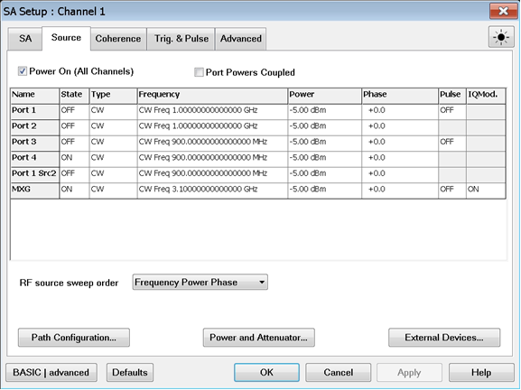 Power On (All Channels) Check to
enable source power for all channels. Only turns power ON if the port State
setting is ON. Port Powers Coupled

  * Coupled (checked) The power levels are the same at each test port. Set power at any test port and all test ports change to the same power level.
  * Uncoupled (cleared) The power levels are set independently for each test port. Uncouple power, for example, if you want to measure the gain and reverse-isolation of a high-gain amplifier. The power required for the input port of the amplifier is much lower than the power required for the output port. A power sweep can also be performed with uncoupled power. Learn more about [Setting Independent Port Power](../S1_Settings/Power_Level.md#Atten_Uncpld_Ports).

Source Cells Name \- Lists the test ports through which an internal source is
available. If an external source has been configured, it will appear at the
bottom of the list. State

  * ON Source power is ALWAYS ON. Only one port can be turn on unless the unit has the second source. [Learn about internal second source restrictions](../S0_Start/Internal_Second_Source.md).
  * OFF Source power is never ON, regardless of the measurement requirements. Use this setting to prevent damage to a sensitive DUT test port.
  * No Control Available ONLY on external sources. The SA application will NOT control the external source.

Type (Sweep) CW - The source is set to a CW frequency. LinFreq - The source is
set to sweep from the Start to Stop frequency. Power \- The source is set to a
power sweep. Phase \- The source is set to a phase sweep. LinF+Pwr, Freq+Pha,
Pow+Pha, Fr+Pw+Ph \- Multi-parameter sweep for the specified parameters. Set
the range of sweep for each parameter. Frequency - Click in the cell, then
click Edit, to start the [Frequency
Settings](Spectrum_Analyzer.htm#SourceFreqSettings_Dialog) dialog (below).
Power - Sets the power level at the output of the source. Click in the cell,
then click Edit, to start the Power Settings dialog (below). Phase \- Control
source phase of a VNA source or external source. Enable multitone and Compute
Phase should be turned on.  [Learn more](../S1_Settings/Phase_Control.md).
Pulse \- Enable/disable pulse measurements. Learn more. IQMod. \- Modulated
I/Q file. Clicking Edit accesses a dialog for setting up an I/Q modulated file
that is sent to a source for measuring Noise Power Ratio (NPR). Refer to the
[Noise Power Ratio (NPR)
Settings](../S1_Settings/Noise_Power_Ratio_\(NPR\)_Settings.htm) topic for
descriptions of the modulation dialogs.

#### RF source sweep order

Frequency Power Phase - Sweep from Start to Stop frequency first then sweep
power then sweep phase. Power Frequency Phase - Sweep power first then sweep
from Start to Stop frequency then sweep phase. Phase Frequency Power - Sweep
phase first then sweep from Start to Stop frequency then sweep power. Phase
Power Frequency - Sweep phase first then sweep power then sweep from Start to
Stop frequency. Frequency Phase Power - Sweep from Start to Stop frequency
first then sweep phase then sweep power. Power Phase Frequency - Sweep power
first then sweep phase then sweep from Start to Stop frequency.

#### Buttons

[ Learn more](../S1_Settings/Path_Configurator.md) Power and Attenuator
[Learn more](../S1_Settings/Power_Level.md#Advanced) External Devices [Learn
more](../System/Configure_an_External_Device.htm)

####  
  
SA Coherence Setup tab help |    
---|---  
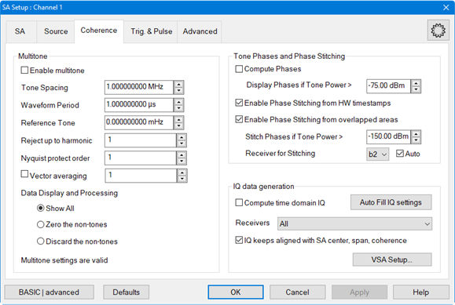 **Multitone** The set of Multitone
properties enable an enhanced Image Rejection mode that takes benefits of the
stimulus test signal knowledge. If the stimulus test signal is repetitive with
a repetition rate of x seconds, it only contains tones that are on a 1/x
frequency grid. Example: if the test signal out of an arbitrary wave generator
repeats every 1 ms, then it only contains frequencies on a 1 kHz grid (noise
is not considered here). We will take this into account here to make the PNA-
SA DFT analysis grid landing exactly on the same grid. Moreover we will use
the test signal knowledge to adjust the PNA-SA LO frequencies in order to
avoid having 2 tones from the multitone stimulus signal landing at the same
location at the PNA IF side. This makes the image rejection process
deterministic. **Enable multitone image rejection**

  * **Enabled** (checked) The other parameters of the Multitone dialog are taken into account. Enabling this mode will set the DFT mode to arbitrary, the RBW shape to No Window, the RBW grid to a set of suitable values, and the list of analysis LOs accordingly. This setting is not compatible with the advanced settings “Force ADC record size” or “Force LO to frequency”.
  * **Disabled** (cleared) Legacy stochastic image rejection mode of the PNA-SA application. When disabled, the window type is set back to what it was before enabling, and the RBW list is also set to the previous setting.

**Tone Spacing** \- The tone spacing of the multitone signal (Hz). **Waveform
Period** – 1 over the tone spacing. This is the test signal repetition rate
(seconds). **Reference Tone** – If the multitone grid does not start from 0
Hz, its offset is set here. To make this more convenient, this dialog accepts
as well the frequency of any tone of the multitone grid (Hz). **Reject up to
harmonic** – Set the number of test signal harmonics you want to be protected
against. This adds constraints to the list of LOs used to cover the span.
Nyquist protect order – Enhancement for the deterministic coherent image
reject mode. It ensures the Nyquist images of the signal tones in the IF
bandwidth are not falling back on top of real signal frequencies. To be able
to enable Nyquist protection, the tone spacing of the coherent signal cannot
be an integer divider of the ADC sampling clock (100MHz for a PNA). Enabling
this option often results in a larger ADC recordsize (or a smaller DFT tone
spacing) at SA receiver side. Vector Averaging - Average ADC samples by the
specified number (≥1) in FPGA memory before the DFT processing. For example,
if an ADC record size of 1,000 samples is acquired and Vector Averaging is set
to 2, then 1,000 samples will be averaged to 1,000 samples and the result
(1,000 samples) will be stored in FPGA memory. In other words, we acquire
2,000 samples form ADCs and send 1,000 averaged samples to the next processing
stage. Vector averaging helps to reduce noise and increase dynamic range.
However, this feature should only be used when the stimulus frequencies are
known and coherent with the current ADC record size. A value of 1 means no
averaging. Note this feature behaves like ADC Stacking+1. The maximum vector
averaging value is 65536 or below. It depends on the RBW and the decimation.
Check box- Check to enable the ADC sample Vector Averaging to be specified
manually. Note: Vector Averaging and Video Bandwidth averaging cannot be set
together. When enabling vector averaging, if the coherent mode is enabled then
Video Bandwidth is turned off . The ADC Record Size x Vector Averaging must be
≤ 64 Mega Samples (or ≤ 32 Mega for some multiple receivers configurations).
**Note:** Vector Averaging is a great averaging method when Coherent Multitone
mode is enabled. We recommend increasing it in Coherent Multitone mode instead
of reducing the RBW to reduce the noise floor. Note: Coherent mode (and Vector
Averaging too) will work well if and only if the signal source and the PNA
have their reference clocks synchronized. This is usually done by connecting a
10 MHz reference BNC cable between the signal source and the PNA. Note: Vector
Averaging is also known as Stacking. In fact, Vector Averaging = stacking +1.
**Data Display**

  * **Show All** \- Legacy behavior, shows the noise or the spurious between the tones. Note the RBW shape for multitones (No Window) makes the noise or the out of grid spurious amplitude values not accurate.
  * **Zero the non-tones** \- All the span frequencies that are not on the multitone grid have their amplitudes set to -200 dBm before correction. This makes band power marker measuring only the power for multitone frequencies, and not the noise power.
  * Discard the non-tones \- Deletes span frequencies that are not on the multitone grid.

Multitone settings are valid \- Displays status of multitone settings. Tone
Phases and Phase Stitching Compute Phases \- Check to enable phase
computation. Note: In the SA tab, Detector Type muse be set to Bypass to
compute phases. Display Phases if Tone Power > \- Set the phase display
minimum level. Phase Stitching Phase stitching is performed for wide band
signals to maintain phase continuity across the entire span when running the
SA coherent mode with Compute Phases enabled. Wide band signals use many LO
acquisitions across the span. Each LO has its own phase and each RF frequency
is seen by two LO acquisitions. Phase stitching is performed from the energy
in the overlapping area between two LO acquisitions. If energy exists in the
two LOs, the phase of the first LO is measured, then the phase of the second
LO is measured, then phase correction is performed. This is repeated across
the entire span to maintain phase continuity. Note: The Image Reject Type in
the Advanced tab must be set to Min, LO High (2 overlaps on same IF side) for
wideband phase stitching. Enable Phase Stitching from HW timestamps \-
Enables/disables phase stitching using hardware time stamps to determine the
phase of each LO acquisition and stitch them back together with phase
consistency. Compute Phases must be enabled. Enable Phase Stitching from
overlapped areas \- Enables/disables phase stitching across the entire span.
Stitch Phases if Tone Power > \- If power in the overlapping areas between 2
LOs is below a specified level, then phase stitching will not be performed
between these 2 LOs. It is still performed in other areas if there is enough
energy. This ensures that noise is never used for phase stitching. Receiver
for Stitching \- This function is used to manually select a receiver for phase
stitching. Auto \- Check to allow the receiver used for phase stitching to be
selected automatically. Multiple receivers can be involved in a measurement
but the one with the highest energy in the overlap area is used for phase
stitching. This receiver selection is performed independently for each
overlapping area across the RF span. IQ data generation

#### Compute time domain IQ \- Enables/disables computing time domain IQ.

Auto Fill IQ settings button - Fills in the IQ settings automatically. Keep
whole sweep data (Processing tab), Compute time domain IQ, Enable multitone,
and Compute Phases (Coherence tab) must be enabled before selecting the Auto
Fill IQ settings button. If the settings are valid, the Valid IQ Settings
under Info (Processing tab) displays OK. Time domain IQ will not be computed
until the IQ settings are valid. Receivers \- The receiver list can be either
ALL, or a specific valid receiver. This selection determines which receiver
data will be transferred to the 89600 VSA. IQ keeps aligned with SA center,
span, coherence \- Check to recompute the advanced IQ parameters (IQ center,
IQ sample rate, IQ number of points) automatically if a SA sweep parameter
change is performed. VSA Setup... button - Accesses the VSA 89600 Link Setup
dialog for connecting the VNA to the VSA. Refer to the [Link VNA to 89600
VSA](Modulation_Distortion/Link_VNA_to_89600_VSA.htm) topic for information.  
  
Trig. & Pulse Dialog tab help |    
---|---  
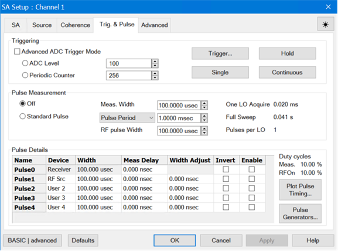 ADC Triggering Advanced Trigger Mode
\- Check to enable a measurement trigger based on the ADC Level or a period of
time. ADC Level \- Initiate a measurement trigger event whenever the ADC level
of any of the receivers at work is greater than this specified value (0 ≤ ADC
Level ≤ 1683). A level of 100 is recommended as a default value. The ADC level
is an uncalibrated value that reflects signal peak amplitude. It will detect
RF energy only within the current IF bandwidth, so it would make sense to use
this feature associated with a Forced LO value or a narrow SA span. Periodic
Counter \- Initiate a measurement trigger event based on the specified period.
For example, if Periodic Counter is set to 1,000,000, then an acquisition
occurs every 0.01 sec (1,000,000 x ADC Sampling Frequency (10 nsec)).
Trigger... \- Accesses the Trigger dialog for setting up triggering. Hold \-
The channel accepts NO trigger signals. Single \- The channel accepts ONE
trigger signal, then goes into Hold. Continuous \- The channel accepts an
infinite number of trigger signals. Pulse Measurements Off \- Turns pulse off.
Standard Pulse \- Turns pulse on. Duty cycle \- Displays the duty cycle
relative to the current settings for Pulse Period and Pulse Width (Pulse
Width/Pulse Period). Meas. Width \- Sets the time the measurement pulse is on.
Pulse Period pulldown - Allows the selection of the following: Pulse Period \-
The time to make one complete pulse. Pulse Frequency \- The reciprocal of
Period (1/ Period). Pulse Duty Cycle - Pulse Width divided by the Pulse
Period. RF Pulse Width \- Sets the width of the RF Source pulse. One LO
Acquire \- The ADC acquisition time required to measure the data for a single
FFT. Full Sweep \- Complete cycle time of measurement including background
sweeps. Pulses per LO \- Number of pulses which will occur during the sweep
for each LO. Pulse Details Name \- Pulse generator outputs in numerical order.
Device \- Indicates the device being controlled by the pulse generator output.

  * Pulse0 \- Always set to Receiver. Sets the amount of time to wait before triggering the ADC to begin acquisition and is always selected for Pulse0 and cannot be changed. Pulse0 adds (ADC Delay) + (Modulator Delay). The ADC will begin measuring data 250 ns before the rising edge of Pulse0. This delay is indicated in the Fixed ADC Delay = 250 ns annotation.
  * Pulse1 through Pulse4 \- Pulse outputs can be set to the following:
    * RF Src \- Selecting RF Src indicates that the pulse signal is used to drive the RF modulator. Only one pulse generator output can be used to drive an RF source. If you try to set more than one pulse generator output to RF Src, then the other one will be set to User N (where "N" is the pulse generator number).
    * User 1, User 2, User 3, User 4 - Labels for user convenience. These labels do not connect the pulse generator to any specific hardware. These selections may be used to control a DUT, DC biases, or other signals. 
    * Activity \- This selection outputs a signal on Pulse4 when the ADC is active. This is the same as Pulse4 Output Indicates ADC Activity on the Pulse Generators Setup dialog. If ADC is selected for Pulse4, then the pulse width and delay entries are grayed out because Pulse4 is no longer a pulse output.

Width \- RF Source pulse width. This setting is the same as Pulse Width under
RF Pulse. Meas Delay \- Sets the time before each pulse begins. Width Adjust
\- Adjusts the measurement pulse width. Invert \- Check to cause the pulse ON
time to be active low and OFF to be active high. Enable \- Check to enable
individual pulse generators. Plot Pulse Timing... \- Accesses Pulse Timing
display to evaluate the pulse timing setup. Pulse Generators... \- Accesses
the Pulse Generator Setup dialog for setting up pulse measurements.  
  
Advanced Settings Dialog tab help |    
---|---  
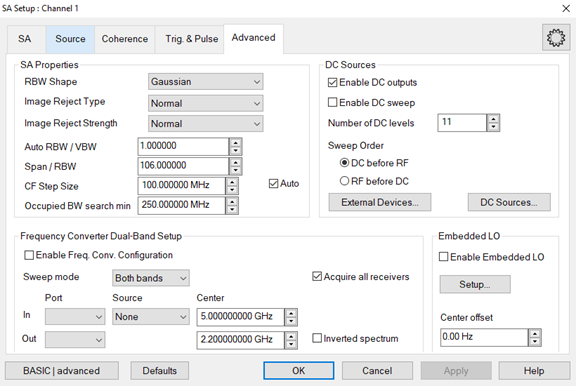 Properties RBW Shape - Selects the
digital filter (window) to apply to the time domain IF signal. The filter
effectively "shapes" the signal before application of the DFT to help avoid
discontinuities which add unwanted frequency content to the spectrum. Each
filter has its own advantages and disadvantages. Gaussian - Selects a Gaussian
window. The Gaussian window has good frequency separation and moderate
amplitude accuracy. This window provides higher dynamic range because it has
much lower side lobes. It is used for general-purpose measurements and when
high dynamic range is required. Flat Top - Selects the flat top window for
amplitude measurement of sinusoidal frequency components. The flat top window
has moderate frequency separation and excellent amplitude accuracy. It is
typically used for narrowband signals when measuring the amplitude of a
particular frequency component with greater amplitude accuracy. Kaiser -
Selects the Kaiser window which is an approximation of a Slepian window using
Bessel functions. This window has a relatively high dynamic range and is
similar to the Blackman window. Blackman - Selects the Blackman window. This
window has a relatively high dynamic range and is similar to the Kaiser
window. No Window - The No Window selection does not modify the time-domain
data in any way before applying the DFT. This selection is very fast but may
yield a significant number of side lobes in the frequency domain because of
spectral leakage. This selection has a rectangular shape and does not
attenuate any portion of the time record. Image Reject Type \- **Sets the
minimum number of distinct DFT acquisitions to use when computing an actual
signal.** _As the number of DFT acquisitions increases from the**None, LO
Low** setting to the **Max** setting, an increased number of erroneous signals
are eliminated. Therefore, the Better and Max settings provide the highest
confidence that what remains are actual signals, at the expense of slower
measurements._ None, LO High - Selects 1 acquisition with the LO higher than
the receiver frequency. Note: Selecting None, LO High with full span is not
possible. See SA Warning Messages. None, LO Low - Selects 1 acquisition with
the LO lower than the receiver frequency. Note: Selecting None, LO Low with
full span is not possible. See SA Warning Messages. Min - Selects 2
acquisitions. Min, LO High - Selects 2 acquisitions (like Min) and both
acquisitions consider that the LO is higher than the receiver frequency. Min,
LO Low- Selects 2 acquisitions (like Min) and both acquisitions consider that
the LO is lower than the receiver frequency. Normal - Selects 4 acquisitions.
Better - Selects 6 acquisitions. Max - Selects 8 acquisitions. Image Reject
Strength \- Sets the image rejection strength. During the image rejection
process, several LO acquisitions overlap at the same RF frequency (depending
on the Image Reject Type). As a result, different RF signal values can be
returned. This feature sets the acceptable power differences between
measurements performed with different LOs in determining actual signals.
Possible values are Weak, Normal, Strong. Weak accepts more difference between
measurements, and strong less difference. Auto RBW/VBW - Sets the ratio of
Resolution Bandwidth to Video Bandwidth when the Video Bandwidth is in Auto
mode. Span/RBW - Sets the ratio of Span to Resolution Bandwidth when the
Resolution Bandwidth is in Auto mode. CF Step Size \- Manually sets the amount
Center frequency change that occurs when ▲|▼ is clicked (next to the value).
Auto \- Each press of the ▲|▼ arrows increments or decrements the Center
frequency by 5% of the current frequency span.

#### Occupied BW search min \- Sets the minimum search frequency to use during
an Occupied BW search measurement. Power below this frequency is ignored. See
Occupied BW Ratio for information about setting up this measurement type.

#### DC Sources

DC source control allows the spectrum to be measured at multiple DC source
settings. Enable DC Outputs \- Enables all DC source outputs that are turned
ON in the DC Source dialog. This same selection is found in the DC Source
Dialog. Enable DC Sweep \- Enables the DC sources to sweep between their start
and stop voltages. If not selected, then the DC sources will be set to their
start voltages. Number of DC levels \- Defines the number of voltage levels in
the DC sweep. The following settings apply to the measurement loop order. The
SA may be programmed to loop through a series of spectrum measurements at
multiple RF source frequencies, multiple RF source powers, and multiple DC
voltages. These radio buttons determine whether the DC sources are swept
before the RF power and frequencies are swept, or whether the DC sources are
swept after the RF power and frequencies are swept. Sweep Order DC before RF
\- Sweep through each DC voltage step first then sweep through the next
frequency. RF before DC \- Sweep through each frequency step first then sweep
through the next DC voltage. External Devices... button - [Learn
more](../System/Configure_an_External_Device.htm). DC Sources... - Configure
internal DC sources. [Learn more](../S1_Settings/DC_Control.md). Embedded LO
Enable Embedded LO \- Check to enable measurements of mixers that have a fixed
LO inside the DUT. Note: Embedded LO does not support signals with a tone
spacing of less than 1 kHz. Center offset \- LO offset value. Setup... \-
Opens the Embedded LO dialog.
 Enable Embedded LO \-
Check to enable measurements of mixers that have a fixed LO inside the DUT.
Tuning Method \- These settings determine the amount of time spent versus the
degree of accuracy to which the LO Frequency is measured. Accuracy is
compromised when noise starts to appear on the measurement trace. Broadband
and Precise Does the entire tuning process for each background sweep. Precise
Only Does NOT perform broadband tuning on each sweep. Use this setting when
the embedded LO is stable. The signal (after broadband) must be within ½ the
tuning IFBW. If the signal will always be within ½ the IFBW, broadband tuning
is not needed. Most satellite components are within 3 kHz absolute so might
not need broadband tuning. Disable Tuning Only the previously measured LO
Frequency Delta is applied to the reference mixer LO and VNA receivers. Tune
every \- Set the interval at which tuning is performed before a measurement
sweep. 'Tune every 3 sweeps' means that every third measurement sweep is
preceded by tuning sweeps. If the embedded LO drifts, or if regularly changing
DUTs, use 'Tune every 1 sweep'. Broadband Search \- Set the frequency span
over which to measure the embedded LO frequency. Noise BW \- Noise Bandwidth
used for Broadband and Precise tuning sweeps. This sets the resolution in the
Broadband sweeps. Max Iterations \- The maximum number of Precise sweeps to
make. When this number is reached, the final measurement is used. Tolerance \-
When two consecutive Precise measurements are made within this value, the
final measurement is used. If this is not achieved within the Max Iterations
value, then the last measurement is used. This is the best of the 'Tunings
settings' to change to improve accuracy. LO Frequency Delta \- The absolute
difference between the measured embedded LO frequency and the LO setting that
is entered in the Mixer Tab dialog. Find Now \- The VNA finds and measures the
actual LO frequency using the current dialog settings. This data is displayed
in the Status box. Default \- Resets the LO Frequency Delta and Tuning
parameters to their default settings. Advanced >> button - Accesses the IF,
Processing, ADC & LO, and Data dialogs.  
  
IF Dialog tab help |    
---|---  
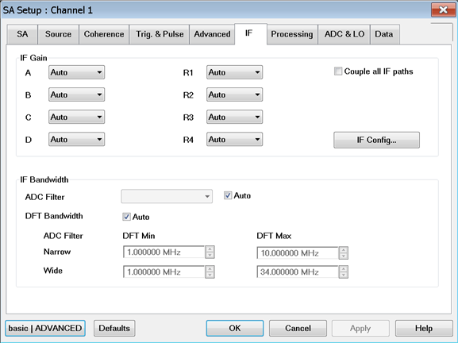

#### IF Gain

Auto \- Selects the appropriate amount for gain versus RF frequency bands for
each receiver IF Path. Or select a specific amount of gain (in dB) for IF
receiver paths. Couple all IF paths \- When checked, all receivers assume the
same setting. When cleared, each receiver can assume an individual setting.
IFConfig \- Accesses the IF Path Configuration dialog. Learn all about [IF
Path Configuration](../IFAccess/IF_Path_Configuration.htm#HowIF PathConfig).
IF Bandwidth ADC Filter - Selects between a narrow and wide IF filter anti-
aliasing path. Narrow 11MHz - Selects the ADC 11 MHz IF filter path. A warning
message will appear if the Narrow IF filter path is selected and the
Resolution Bandwidth is > 1 MHz. See SA Warning Messages. Wide 38MHz - Selects
the ADC 38 MHz IF filter path. Auto - Check to automatically set the ADC
Filter setting based on the ADC Sampling Frequency. DFT Bandwidth Auto \-
Enables the default values for DFT bandwidth. With Auto checked, the default
values are: Narrow \- 1 MHz to 10 MHz Wide \- 1 MHz to 34 MHz With Auto
unchecked, the values can be entered manually. The ranges are: Narrow \- 500
kHz to 11 MHz Wide \- 500 kHz to 44 MHz  
  
Processing Dialog tab help |    
---|---  
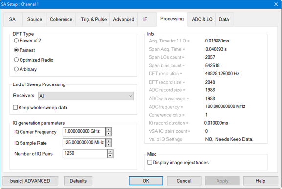 DFT Type - Sets the DFT record
size type. The types include: Power of 2 \- Sets the DFT record size to the
next power of 2 greater than or equal to the current ADC record size. This is
the fastest DFT processing available; the power of 2 record size allows for
very efficient computation shortcuts (also known as the FFT algorithm).
Fastest \- Sets the DFT record size as close as possible to the ADC record
size (larger or equal) while optimizing processing speed. Optimized Radix \-
Sets the DFT record size to the minimum integer number larger or equal than
the ADC record size that can be decomposed with 2,3,5,7,11,13 radixes (also
known as the 13-smooth numbers). The Intel CPUs have shared-coded
trigonometric values for 2, 3, 5, 7,11, 13 fractional angles; the DFT code
takes benefits from that for efficient DFT processing. Arbitrary \- Sets DFT
record size equal to the ADC record size. If the current ADC record size is a
large prime number, then the DFT can be very slow. Sometimes, the record size
will be increased more than the minimum number required to match the 13-smooth
condition, if the whole processing of the sweep is faster with a record size
that has a faster DFT time. There is a trade-off here: increasing the record
size to speed up the DFT will increase the amount of data to process for the
further steps of the SA processing (image rejection, detection). Additional
comments: There is a given ADC record size that gives a given RBW (for a given
window type), the RBW evolves as 1/ADC record size. If the DFT record size
must be greater, depending on the DFT mode, some zeros will be added to the
ADC record size. This is the difference that can be noted between the ADC
record size and the DFT record size on the Advanced Processing dialog. When
running the coherent mode of SA, the Arbitrary mode will always be selected,
to make sure the DFT bins frequencies exactly land on the coherent signal
tones. The Power of 2, Optimized Radix, and Fastest mode have the same
behavior regarding the RBW setting: These 3 modes are increasing the ADC
record size to the next best match. This is more sensitive with Power of 2
mode, as the density of available ADC record size is sparse. The Power of 2
mode makes the SA computation behave exactly like some tools based on FFT
processing; this is a use case of this mode. The other use case is to get the
fastest processing time that can be useful for intensive spurious search
measurements. The penalty is the small number of RBW values available. The
Optimized Radix mode is currently the default mode, this is the one that gives
the most accurate RBW setting. The Fastest is to be tried if speed matters for
a given non-coherent SA setting. For example: running 100 kHz RBW with
Gaussian filter, the ADC record size must be 1988 samples. Here are the DFT
lengths for the different algorithms:

  *     * Power of 2: 2048
    * Fastest: 2048
    * Optimized Radix: 2000
    * Arbitrary: 1988

End of Sweep Processing The End of Sweep Processing function is used to keep
the memory buffer of the last full sweep in memory for further processing.
This is not done by default because keeping the whole data in memory requires
large amounts of memory and processing (for example, in the case of wide span
or low RBW). Before the implementation of this function, raw data could be
sent to a file (ascii or binary) or the fifo, as this can be done while
sweeping with no need to keep the whole data in memory. This option is still
available. With each sweep, the data buffers are filled, and are erased if a
new speed is started. In other words, this feature works well in the logic of
“Single” sweep. You must ensure that a full sweep is in the buffers before
pulling out raw data. Receivers \- The receiver list can be either ALL, or a
specific valid receiver. Only the receivers currently defined for measurement
traces can be kept in memory. Keep whole sweep data \- Check to keep last full
sweep data in memory. IQ generation parameters IQ Carrier Frequency \- Sets
the IQ carrier frequency. IQ Sample Rate \- Sets the IQ sample rate. Number of
IQ Pairs \- Sets the number of IQ pairs. Info Acq. Time for 1 LO \- Displays
the LO acquisition time which is the ADC Record Size x ADC Sampling Frequency
(10 nsec or 40 nsec) x (1 + Stacking) x (Video Averaging Coefficient). When
settings affecting this value are changed, the displayed value is not updated
automatically and will become grayed out. To update the value, close then open
this dialog. The analyzer must be sweeping to update values. Span Acq. Time \-
Displays the total acquisition time to perform a SA sweep. For simple cases,
it is the acquisition time of one LO multiplied by the number of LOs. When
running Multiple recording coherent pulse mode, the acquisition time here
takes into account the duty cycle of the pulses. Span LOs count \- Displays
the number of LO acquisitions determined by the Image Reject selection and the
span. When settings affecting this value are changed, the displayed value is
not updated automatically and will become grayed out. To update the value,
close then open this dialog. The analyzer must be sweeping to update values.
Span bins count \- Displays the current span DFT bin count, the number of DFT
points processed across the total RF span. When the Detector is bypassed, this
is the number of points that are sent to the display. DFT resolution \-
Displays the DFT resolution. DFT record size \- Displays the current DFT
record size. ADC record size \- Displays the ADC record size value. ADC with
average - Displays the ADC acquisition time of one LO multiplied by the
averaging (vector averaging or video averaging) factor. It is the straight ADC
acquisition time that has to go into the ADC memory for further processing.
ADC frequency \- Displays the ADC frequency. Coherence ratio \- Displays the
coherence ratio value. IQ record duration \- Displays the current duration of
the IQ record. VSA IQ pairs count \- Displays the number of IQ pairs
transferred to the VSA. Valid IQ Settings \- Displays whether the IQ settings
are valid or not. If valid, OK is displayed. Display image reject traces -
Check to display the data acquired by each LO. The minimum number of
meaningful traces is determined by the "Image Reject" setting (described in
the Advanced dialog above).

### About Image Reject Traces

These traces display the spectral content of the measured signal for each LO
frequency used in the acquisition. The number of ImageReject traces you want
to look at is tied to the 'Image Reject' setting. For example, 'Normal'
setting is at least 4 ImageReject traces, and 5 more generally. This function
is intended to be used as a diagnostic tool if something looks suspicious.
Note: Mixer calibration and user calibration are not applied to the image
rejection traces, thus the amplitude readout value is not accurate.

### About Acquisition Time and Sweep Time

The Acquisition time for 1 LO is really the duration of the ADC acquisition
run for one LO setting. Depending on the SA span and the image rejection mode,
the number of LOs required for a given SA frequency span changes. This number
is reported as Span LOs count. So the total ADC acquisition time for a given
span, aka Sweep Acq. Time, is the product of Acquisition time for 1 LO x Span
LO count (unless Multiple Recording mode is running, then the Multiple
Recording multiplication factor is to be considered). The entire sweep time is
a significantly larger number than the Sweep Acq. Time. Each time the LO is
moved, there is a settling time required for LO stabilization. Then each time
some raw ADC data is acquired, there is some time to move the data across the
buses (the data amount is multiplied by the number of ADCs at work, when
several RF receivers are acquired). All the further processing (windowing,
DFT, IF calibration, Image Rejection, User calibration) is CPU time consuming,
the lowest the RBW the more time it takes to process the DFT samples (there
are more DFT samples). The Image Rejection mode MIN instead of Normal (when
not running coherent mode) is a popular way to speed up the sweep time, as
roughly half of the LOs count is required, at the cost of higher likelihood of
false spectrum spurious (but real signal spurious are still always detected).
The video averaging is digital, it runs several times the ADC acquisitions and
windowing and DFT and then averages. The number of times this extra processing
is done for video averaging is indicated at the Video averaging count at the
SA main page. When available, the vector averaging is done at the FPGA side,
it multiplies by the averaging factor the ADC acquisition time, and it doubles
the data amount across the data buses (32 bits instead of 16 bits ADC data
representation). The following parts of the processing are not impacted, the
quantity of data to process at host CPU side is not increased. Thus the vector
averaging is a very efficient way to get lower noise floor with minimum
additional CPU time. The display processing is a very significant part of the
sweep time. The number of display points can be set (defaults to 1001), then
the code often has to do a data reduction to go from millions of DFT points to
1001 display points. This is the so-called detector processing. This process
is CPU intensive, especially the Peak detector that recomputes an X-axis
frequency grid each sweep to align each x-axis point to the local interpolated
peak. FastPeak is less frequency accurate for the peak points positions but
very significantly faster. If the span is narrow, bypassing the detector can
speed up the sweep. Turning off the display is another option, it bypasses
most detection and display algorithms, thus speeds up the sweep in remote
programming modes. The status bar of the channel shows the last measured SA
sweep time, and if some settings are changed, the first sweep after a change
shows an estimate with a ~ preceding the timing.  
  
ADC & LO Dialog tab help |    
---|---  
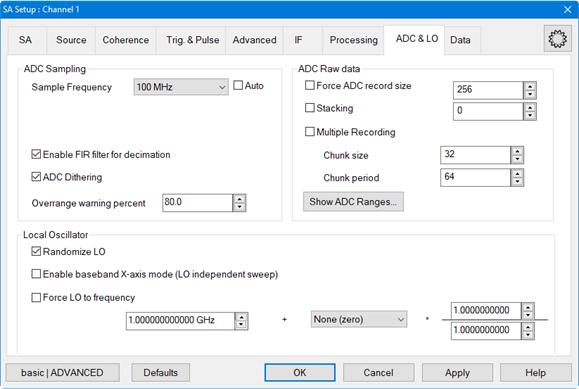 ADC Sampling ADC Sample Frequency \-
Select between 100 MHz and 25 MHz. Auto - Check to automatically set the ADC
Sampling Frequency. Enable FIR for 25 MHz - Enables the FIR filter for 25 MHz
decimation: reduces the noise floor. Dithering \- Check to allow ADC dithering
to average out the characteristic "stair steps" produced during the ADC
conversion process. Overrange warning percent \- Sets the percentage of the
ADC input full scale. SA sweeps require thousands (or millions) of ADC samples
processed by the FFT. The maximum ADC sample value is kept for the whole
sweep, as it is an image of the peak voltage in the IF chain of the
instrument. Instead of calibrating this value to Volts, a percentage value of
the ADC input full scale is used. If the value is too high, reduce the IF gain
or add RF attenuation to maintain the linearity of the instrument. If the
value is too low, the signal amplitude to too low and under-utilizing the ADC
range. Increasing the IF gain may increase the measurement quality (reducing
the noise floor). Show ADC Ranges... \- Displays the ADC ranges of the current
receivers from the last sweep if the Trigger mode is currently on Hold.
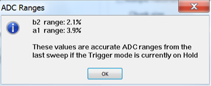 ADC Raw data Force ADC record size \-
Sets the ADC record size which is dependent on the Resolution Bandwidth and
ADC Sampling Frequency: 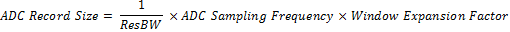
Check box \- Check to enable the ADC record size to be specified manually.
Doing so sets the resolution bandwidth. The size range is 64 Samples to 32 or
64 MegaSamples depending on the selected receivers. The DFT size will be
recomputed accordingly to the DFT Type setting. When not checked, the value
displayed is the current ADC record size. This feature is not compatible with
Coherent Multitone mode. Stacking - Stack ADC samples by the specified number
(≥1) and store result in memory. For example, if an ADC record size of 1,000
samples is acquired and Stacking is set to 1, then 1,000 samples will be added
to 1,000 samples and the result (1,000 samples) will be stored in memory. In
other words, we acquire 2,000 samples form ADCs and send 1,000 stacked samples
to the next processing stage. Stacking helps to reduce noise and increase
dynamic range. However, this feature should only be used when the stimulus
frequencies are known and coherent with the current ADC record size. A value
of 0 means no stacking. Check box- Check to enable the ADC sample stacking to
be specified manually. Note: Stacking and Video Bandwidth averaging cannot be
set together; Video Bandwidth has precedence. The ADC Record Size x (Stacking
+ 1) must be ≤64 Mega Samples. **Note:** Stacking is a great averaging method
when Coherent Multitone mode is enabled. We recommend increasing the stacking
in Coherent Multitone mode instead of reducing the RBW in order to reduce the
noise floor. Multiple Recording \- Check to allow the ADC Record Size to be
divided and acquired in smaller "chunks" and also specify a wait period
between these acquisitions. Chunk Size \- Sets the size to acquire the ADC
record in smaller "chunks". For example, if the ADC Record Size is 2048 and
the Chunk Size is set to 256, then the ADC record is acquired in 8 chunks (1 ≤
Chunk Size ≤ ADC Record Size). Chunk Period \- Set the period to wait between
ADC record chunks. Note: This feature is compatible with Coherent Multitone
mode. LO Randomized LO - Check to allow dithering of the LO values used when
taking a sweep. Allowing randomized LO makes it less likely that erroneous
signals will appear in the final measurement. Enable baseband X-axis mode (LO
independent sweep) \- Enables baseband sweep independent of the LO sweep to
allow signals down to 1 Hz to be analyzed. This function is called baseband
because it operates without LO conversion and also does not use the mixer path
in the IF. The frequency range that can be measured is 1 Hz to 38 MHz due to
the IF filter. Therefore, spectrum analysis can be done within this range. The
following is a procedure for using this function:

  1. Check the Enable baseband X-axis mode (LO independent sweep) check box.
  2. Connect the signal through one of the IF Path Inputs on the rear panel. [Learn more](../Rear_Panel/XRtour.md#IF).  
.  
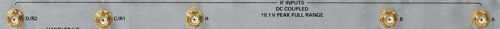

  3. Go to the SA tab and change the Stop frequency to 38 MHz. Notice the Start frequency changes to 10 MHz. Change the Start frequency if necessary.
  4. Go to the IF tab, click on the IF Config... button, then under IF Path for the IF inputs you want to consider, select External.  
  
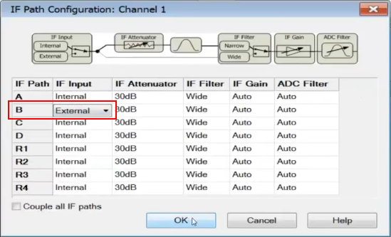

Note: The SA baseband mode only allows you to run one R receiver. Any R
receiver selection (R1 to R4) will get the signal from the R IF input.

  5. In the IF tab under IF Bandwidth, deselect ADC Filter Auto and select Wide 38MHz. This allows you to change the Wide frequency range if necessary. If the SA current span is larger than the IF bandwidth, -200 dBm will be displayed outside of the IF filter area.  
  
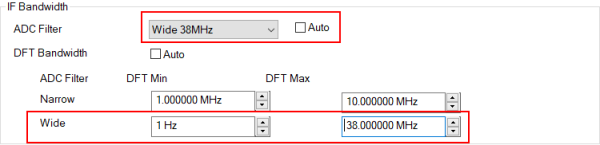

Force LO to Frequency - Sets the LO to a specified frequency. This check box
can only be set if Image Reject is set to None, LO Low or None, LO High or
Enable baseband X-axis mode (LO independent sweep) is checked. Check box -
Check to enable the LO frequency to be specified manually. This function
allows the LO source to be used mostly like another source that can be set up
relative to a source port. For example, if Port 1 in the Source tab is set to
a frequency of 1 GHz and the Force LO to frequency is set up as shown below,
then the LO will track 1 MHz after the Port 1 source frequency.
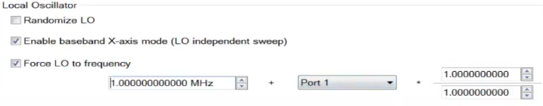  
  
Data Dialog tab help |    
---|---  
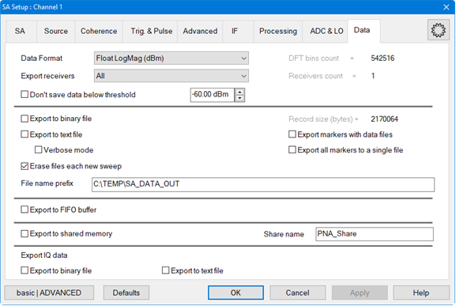 Data Format - Float LogMag (dB) \- Sets
the data format to log magnitude in dBm. Float LinMag \- Sets the data format
to linear magnitude in volts. Integers - Sets the data format to Packed
Integers (each value is a short 16 bit integer, the equation to compute the
dBm value is: dBm = Xshort/200.0 - 36.165. Export receivers \- Select the data
to export from a specific receiver or all receivers. Don't save data below
threshold \- Set data level threshold mode and threshold level in dBm. For
text file output with verbose mode, only the frequencies with power greater
than this threshold setting will be written to the file. DFT bins count \-
Displays the current DFT bin count, the number of DFT points processed across
the total RF span. When the Detector is bypassed, this is the number of points
that are sent to the display. Receivers count \- Displays how many receivers
are currently being exported. The number here can be less than the number of
receivers specified in Export Receivers, if some of them at not selected in
the channel. Export to binary file \- Set data to be exported to a binary
file. Data is not exported until the next new sweep occurs. Export to text
file \- Exports data only. Data is not exported until the next new sweep
occurs. Verbose mode \- Exports frequency and data. Data is not exported until
the next new sweep occurs. Erase files each new sweep \- Selecting this option
will erase the data after each sweep. If this option is not checked, the data
from each sweep will continue to be appended to the output data file which can
create a very large file size (and fill the disk, with many unwanted
consequences). File name prefix \- The receiver selected in Export receivers
will be appended to the prefix name specified in this field with either ".txt"
if a text file is exported or ".bin" if a binary file is exported. For
example, if C:\Temp\SA_DATA_OUT is entered into the File name prefix field and
the "B" receiver data is exported to a text file, the data will be exported to
a file called SA_DATA_OUT_B.txt. Record size (bytes) \- This is the byte size
of binary data output. Export markers with data files \- Adds marker data and
data to the text file (*.txt) output. Export all markers to a single file \-
Adds all marker data to a single text file (*.txt) output. Export to FIFO
buffer \- Exports data to the [FIFO (First-IN, First-OUT) data
buffer](../IFAccess/FIFO_and_other_Antenna_Features.htm#FIFO). FIFO is a
circular buffer that allows very fast Read-Write access. Export to shared
memory \- Exports data to shared memory (Microsoft Windows feature) which is
the fastest way to transfer data between applications. The application that is
retrieving data has to register itself to Microsoft Windows with the same
share name. Share name \- Assigns a specified name to the shared data. Export
IQ data Export to binary file \- Enables/disables the IQ data to be output to
a binary file (*.bin). Export to text file \- Enables/disables the IQ data to
be output to a text file (*.txt).  
  
(Source) Frequency Settings dialog help |    
---|---  
In the SA Setup Source Tab (above): > When (Sweep) Type = CW, set the CW
Frequency. 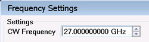 > When (Sweep) Type = Linear,
the following dialog appears: 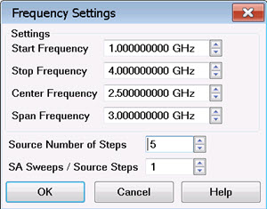

#### Settings

Sets the source frequency range. Use either of the following pairs of settings
to set the frequency range. Start /Stop - Specifies the beginning and end
frequency of the swept range. Center /Span \- Specifies the value at the
center and frequency range. Source Number of Steps \- Sets the number of steps
the source will make across the specified source frequency range. SA Sweeps /
Source Step \- Sets the number of SA (receiver) sweeps for each Source Step.
This setting is common to all sources.  
  
(Source) Power Settings dialog help |    
---|---  
In the SA Setup Source Tab (above): > When (Sweep) Type = CW, or LinFreq, the
following dialog appears: 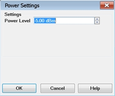 >
When (Sweep) Type = Power or LinF+Pwr, the following dialog appears:
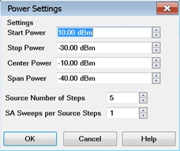

#### Settings

Sets the source power range. Use either of the following pairs of settings to
set the power range. Start /Stop - Specifies the beginning and end power of
the swept range. Center /Span \- Specifies the value at the center and power
range. Source Number of Steps \- Sets the number of steps the source will make
across the specified source power range. SA Sweeps / Source Step \- Sets the
number of SA (receiver) sweeps for each Source Step. This setting is common to
all sources.  
  
Phase Settings dialog help |    
---|---  
In the SA Setup Source Tab Phase column (above): > When (Sweep) Type = CW or
LinFreq, Power, or LinFreq+Pwr, the following dialog appears:
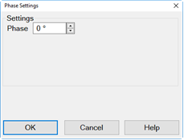 > When (Sweep) Type = Phase,
Freq+Pha, Pow+Pha, or Fr+Pw+Ph the following dialog appears:
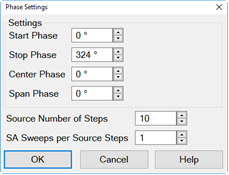

#### Settings

Sets the source phase range. Use either of the following pairs of settings to
set the phase range. Start /Stop - Specifies the beginning and end phase of
the swept range. Center /Span \- Specifies the value at the center and phase
range. Source Number of Steps \- Sets the number of steps the source will make
across the specified source phase range. SA Sweeps / Source Step \- Sets the
number of SA (receiver) sweeps for each Source Step. This setting is common to
all sources.  
  
## Measurement Parameters

#### How to select and configure Measurement Parameters  
  
---  
Using Hardkey/SoftTab/Softkey |  Using a mouse  
  
  1. Select a trace by pressing Trace > Trace N > Trace N.
  2. Press Trace > Trace Setup > Measure....
  3. Select a parameter.

|

  1. Right-click on a trace.
  2. Select a parameter

  
  
### Measure Dialog

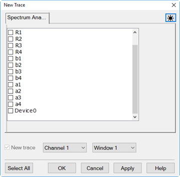

Select one of the test port receivers to make a measurement. Test ports are
identified in both traditional VNA notation and Receiver Notation. [Learn
more](../S1_Settings/Measurement_Parameters.htm#RecNotation).

Or select an ImageReject measurement, if the Display Image Reject Traces
checkbox has been set.

New Trace \- Add a new trace.

Channel N \- Select a channel number for the new SA trace.

Window N \- Select to create the new trace in an existing window or new
window.

Select All \- Select all measurement parameters.

Note: Configuring an external DC meter for a SA channel is supported. DC is
read at the end of a sweep. Only one point is read and the entire trace is
filled with this point reading regardless of the number of channel points.

Marker -> SA |    
---|---  
The following marker-related features are unique to SA.

### Marker -> SA

This feature is supported in Standard, SMC, Swept IMD or MOD measurement
classes (channels) ONLY. In this section, these are called NA channels. On a
standard channel with a marker residing on a trace in an NA channel, Marker ->
SA creates a new SA channel in full frequency span and provides access to the
[SA Analysis
Markers](../S4_Collect/Markers.htm#Spectrum_Analyzer_Marker_Search). Refer to
the following for swept IMD and SMC: Swept IMD: span = 10 * delta frequency
SMC: SA channel uses receiver frequency range A marker is created on the trace
at the same frequency as the NA channel marker. This is a quick way to see the
frequency spectrum of the NA channel at a specific frequency.

  * The same source that is used for the trace in the NA channel is turned ON in the SA channel in CW mode at the marker frequency.
  * The same receiver that is used for the NA channel is used for the SA channel.
  * For each new NA channel, a new SA channel is created. Subsequent markers in the same NA channel use the same SA channel.
  * In general, Marker -> SA creates a new measurement on the SA channel only if the measurement does not already exist. For example, if a marker is used on an S11 measurement in a standard channel, Marker -> SA creates a measurement using test receiver "A" with port 1 as the source. If Marker -> SA on an S12 measurement is then performed, the same test receiver "A" is used except that port 2 becomes the source. In this case, a new SA trace will not be created.

How to use Marker ->SA With a marker residing on a trace in a standard
channel...

  * With a mouse: Right-click on a marker, then select Functions, then Marker -> SA.
  * With a keyboard: With the relevant marker active (selected), Alt+M, F, A.
  * Without mouse or keyboard: With the relevant marker active (selected), Press Marker, Marker -> Functions, then Marker -> SA.

### Band Markers

Once an SA channel has been created using Marker -> SA, the Band Markers are
accessed by selecting the SA Analysis softtab. The following marker types
provide a readout of the total power, noise, or density within a selectable
frequency span. The span is marked by vertical posts that appear on either
side of the marker.

  * Band Power \- These markers provide a readout of the total power within a specified frequency span defined by Band Span.  
.  
The Average detector type makes the display more consistent with Band Power
markers. With this detector type the marker readouts and the estimated power
values or delta from the display have a good match. Many legacy spectrum
analyzers need to set the detector type to average to do band power
measurements. PNA-SA does not need to select the average detector to compute
the right band power measurements, it’s only useful to check the values
between marker readouts and display estimates.

  * Band Density \- Select Off, Noise (dBm/Hz), Power (dBm/Hz), Tone (dBm/Tone), NPR, or ACPR.

Refer to [SA Analysis
Markers](../S4_Collect/Markers.htm#Spectrum_Analyzer_Marker_Search) for a full
description of the marker types and their settings. Band Power and Band
Density Noise Markers Note: If a Band Power or Band Density Noise marker is
selected, [Discrete](../S4_Collect/Markers.md#discrete) mode is turned OFF to
allow precise measurements over the desired frequency range. The span is
marked by vertical dotted lines that appear on either side of the marker. The
marker's y-axis value is set to the measured power value.
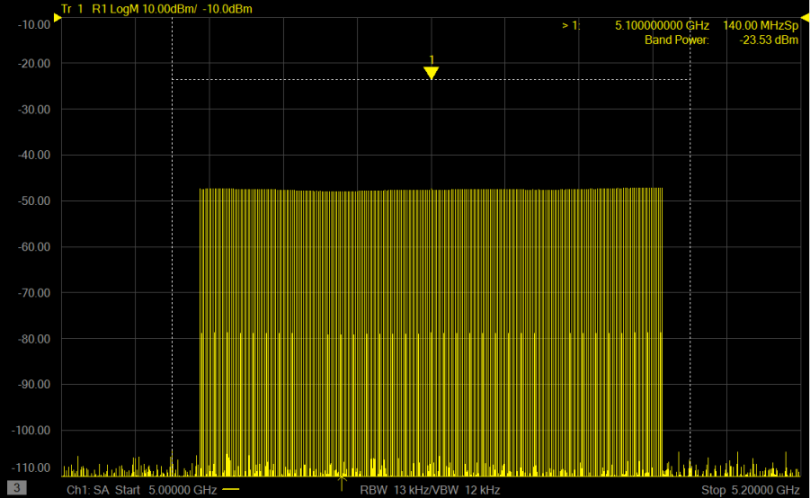 If a Band Power or Band Density
Noise marker is in [Delta mode](../S4_Collect/Markers.md#reference), the
difference between the Band Power or Band Noise marker and the reference
marker is displayed with a leading delta symbol.
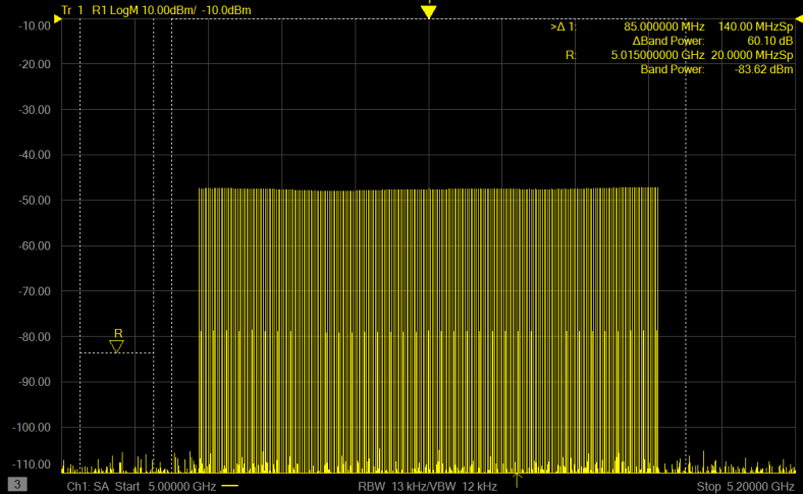 Band Density Power Markers The ∆
1 marker displays the notch frequency relative to the center frequency. In
this example the notch is in the center so the frequency is 0 Hz. Also
displayed is the notch span (100 MHz). The ∆Tones is the difference between
the average tone power a the Reference (> R) marker and the average tone power
at the bottom of the notch. The > R marker displays the center frequency (16
GHz) and the signal span (1.5 GHz). The Band Power displays the total power
within the signal span. The Tones (1.40 GHz) displays the average tone power
across the 1.5 GHz signal span minus the average tone power across the notch
(1.5 GHz - 100 MHz = 1.4 GHz) The total modulation span defined by Band Span
is marked by the outer vertical dotted lines.
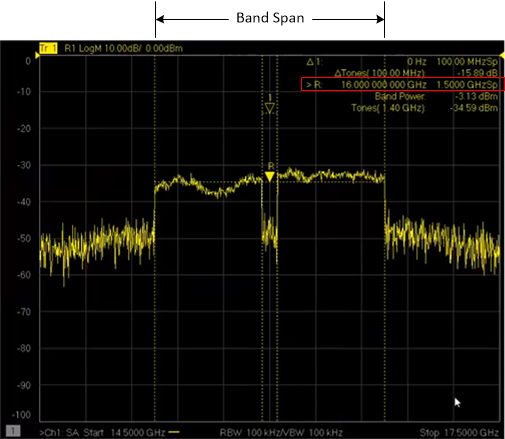 Each notch is also marked with
vertical dotted lines defined by Density BW.
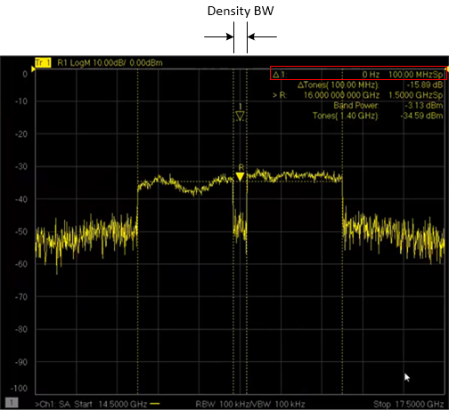

#### How to select Band Markers

  1. Press Marker > SA Analysis.
  2. Another method of selecting band markers is to right-click on a marker on the display then select Search then Search... from the menu. The following dialog appears:

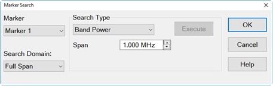

  3. For information on the settings for different SA search types, refer to [SA Analysis Markers](../S4_Collect/Markers.md#Spectrum_Analyzer_Marker_Search).

_If a Band Power or Band Noise measurement cannot be made, the marker readout
will display -999 dBm (for Band Power), or -999 dBm/Hz (for Band Noise). There
are two reasons why this may happen:_

  1. _The band span (from marker frequency – span/2 to marker frequency + span/2) is outside the frequency range of the channel._
  2. _The Band Power or Noise marker was created while the channel was in Hold mode. At least one sweep must be taken after creating such a marker. The marker can be moved taking a sweep while in Hold mode. However,_ the marker readout will not change. To update the marker readout to the new marker location, a re-sweep is required.

### Occupied BW Ratio

The Occupied BW Ratio is the frequency range that contains a defined
percentage of the overall band power as specified by OBW Percent. The marker
readout provides the occupied band center frequency, percentage of the band
span to measure, and the occupied band power. See also Occupied BW search min
for setting the minium frequency to start a search.
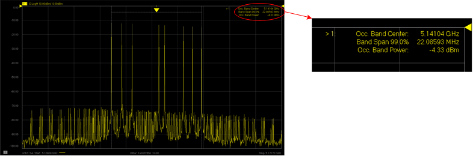 The span is marked by vertical
dotted lines that appear on either side of the marker indicating the
percentage of span. The marker's y-axis value is set to the measured power
value. 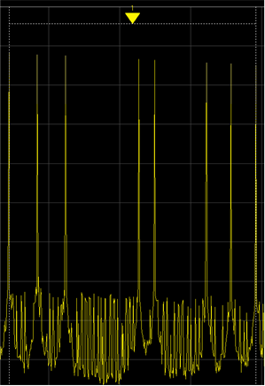

#### How to select Occupied BW Ratio

  1. Select one of three ways to enable Occupied BW Ratio:
     1. Move the cursor on a marker, right-click on the marker, select Search, then Occupied BW.
     2. Press Marker, then SA Analysis, then Occupied BW ON.
     3. Select Response, then Search...  
The following dialog appears  
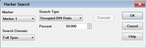

  2. If the Marker Search dialog is used, perform the following steps:
     1. Select an existing marker.
     2. For Search Type, select Occupied BW Ratio.
     3. For Percent, enter a percentage of the band span to search.
     4. For Search Domain, either select Full Span (default) or define a User Span by selecting User N then speciWrong dialog inserted when branch was createdfying the Start and Stop frequencies.
     5. Click OK.

  
  
## Calibrating an SA Channel

A calibration can be performed on the SA Channel using the [Cal All
Wizard](../S3_Cals/Calibrate_All_Channels.htm) when corrected results are
required to improve amplitude accuracy.

Note: Calibration is performed over the currently specified spectrum analyzer
frequency range only.

Another method of calibration is to import an existing Cal Set. An imported
Cal Set must contain the Receiver Response terms for the measurement port on
the SA channel. In addition, if the imported Cal Set covers a narrower
frequency range than the SA channel, the error terms in the imported Cal Set
are extrapolated.

The Cal Plane Manager can be used to characterize adapters, cables, and
fixtures used to connect a DUT to the VNA to remove their effects from the
measurement. [See the detailed
procedure](../S3_Cals/CPM_Direct_Receiver_Calibration.htm).

##  Gated SA

Gated spectrum analyzer measurements are triggered measurements that capture
data for the duration of the active level of the trigger. Thus, only level
external triggers can be used (High level, Low level) for gated measurements.
Edge triggers can be used to start SA measurements, but will not gate them. It
is not recommended to use level triggers to start measurements: if the active
level is shorter than the required acquisition time (that depends on the RBW
and other settings), then the measurement will abort.

A given SA sweep needs a given number of LOs (this depends mainly on the span
and on the Image Reject setting). This number can be retrieved at the SA
Processing dialog. Each LO needs one ADC acquisition and the duration of one
ADC acquisition can be retrieved at the SA Processing dialog. The time for
each LO acquisition is based on the ADC Record Size times the ADC Sampling
Frequency (defaults to 10 nsec). For gated SA, it is meaningful to gate each
individual ADC acquisition. This can be done with the [Trigger Setup
dialog](../S1_Settings/Trigger.htm#TriggerDiag), with the external trigger
configured per channel (Trigger Scope) in point mode (channel trigger state
mode), and [Meas Trigger](../S1_Settings/External_Triggering.md#ExternalDiag)
set to Level.

For example, if the ADC Record Size is 663, the time required for a full DFT
acquisition would be 663 x 10 nsec = 6.63 usec. As long as the width of the
measurement trigger is greater than 6.63 usec, measurement data will be
acquired. If the measurement trigger width is set to less than 6.63 usec, then
no measurement data will be acquired. If the width of the measurement trigger
is much larger, for example 20 usec, then up to 3 ADC acquisitions with 663
samples can occur during the active status of the trigger.

Note: Internal Pulse0 pulse generator is not suitable for gated SA because the
pulse width cannot be set. Instead, use Pulse3 as shown in the [Gated
Measurement](Gated_Measurement.htm) example (pulse 1 to pulse 4 would work
too, but without the direct Trigger source to Pulse3 internal connection).

Refer to [Gated Measurement](Gated_Measurement.md) for an example of how to
set up a gated spectrum analyzer measurement.

## SA Warning Messages

Warning messages appear when the measurement cannot be performed with the
current settings. Messages are displayed in blue for three seconds and the
channel is placed in hold (not sweeping).

SA Warning: Image Reject Max and Better are not allowed if RBW > 1MHz and
Narrow IF Filter.

SA Warning: Image Reject Max is not allowed if RBW > 1MHz.

SA Warning: Image Reject Better is not allowed if RBW > 2MHz.

SA Warning: Image Reject Max and Better are not allowed below 20 MHz if RBW >
1MHz and Wide IF Filter.

SA Warning: Cannot run Image Reject None LO High at high end of RF
frequencies.

SA Warning: Cannot run Image Reject None LO Low at low end of RF frequencies.

SA Warning: Cannot force Narrow IF Filter if RBW > 1MHz.

