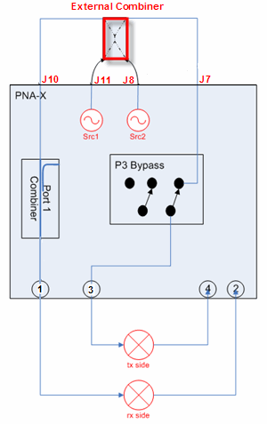

## Limited Port Mapping

* * *

The [IMD](Swept_IMD.md), [IMDx](Swept_IMDx.md),
[IMSpectrum](IMSpectrum.md), and
[IMxSpectrum](IM_Spectrum_for_Converters.md) Apps have a limited port mapping
capability. This would allow you, for example, to simultaneously measure two
2-port DUTs in different channels. You could input the 2-tone signal to port 1
and port 3. The DUT output would be connected to port 2 and port 4.

Port selections are made on the Power Tab for each Application.

Note: This setup requires an external combiner connected to the rear-panel.
The external combiner that is shown has two inputs and two outputs. This can
also be accomplished by using two components.

This example setup shows a 4-port transceiver connected to the VNA ports as
follows:

VNA Port |  DUT Port  
---|---  
1 |  Rx In  
2 |  Rx Out  
3 |  Tx In  
4 |  Tx Out  
  
### Notes

  * When DUT Input = VNA port 1, then DUT Output = VNA port 2 (default) OR port 4.

  * When DUT Input = VNA port 3, then DUT Output = VNA port 4.

  * Each port mapping configuration must be setup in separate channels.

  * The input and output frequencies for each channel can be at different frequencies.

  * The [Path Configuration settings](../Programming/RF_PathConfig.md) are made automatically.

  * Calibration is performed normally using the [IMD](Swept_IMD.md#CalOverview) [Cal Wizard.](../S3_Cals/Calibration_Wizard.md)

  * Because an external combiner is used, input power to the DUT must be monitored by you to ensure that the DUT is not being overdriven.

  * Both input tones must be supplied by the internal VNA sources.

  * A mixer LO can be a VNA internal source, an external source, or an [embedded LO](Embedded_LO.md).

* * *

