# Swept IMD for Amplifiers (Opt S9x087A/B)

* * *

  * Features and Limitations

  * [Create a Swept IMD Measurement](Swept_IMD.md#CreateIMDMeas)

  *     * [Frequency tab](Swept_IMD.md#FreqTabDiag)

    * [Power tab](Swept_IMD.md#PowerTabDiag)

    * [Configure tab](Swept_IMD.md#ConfigureDiag)

    * [How to specify IMD Parameters](Swept_IMD.md#HowParams)

  * [IMD Calibration](Swept_IMD.md#cal)

  * [Saving Swept IMD Power Data](Swept_IMD.md#Saving)

[Other IMD (Opt S9x087A/B) Topics](IMD_App.md)

## Features and Limitations

[See requirements.](IMD_App.md)

### Features

  * Fast and easy setup for the measurement of a variety of distortion related parameters up to 9th order.

  * Measurement at both input and output of a DUT.

  * Supports a variety of sweep-modes for the main-tones: center-frequency linear and segment sweep, tone-separation sweep, power sweep, or CW sweep (fixed main-tone).

  * Make very fast, accurate measurements using the VNA sources with high-power, high linearity, and low harmonics.

  * Supports calibration and correction of Swept IMD parameters.

  * Independently set IFBW for measuring main-tones versus product tones.

### Limitations

  * 2-port non-frequency converters ONLY. For frequency converters, use [Swept IMDx](Swept_IMDx.md).

  * DUT to VNA port mapping is limited. Port selections are made on the Power tab. [Learn more.](Swept_IMD.md#PowerTabDiag)

  * When using Integrated Pulse application, the IF Filter setting for the relevant receiver must be changed to 'Wide'. [Learn how](../IFAccess/IF_Path_Configuration.md#HowIF PathConfig). The default IF Filter setting in Swept IMD is 'Narrow' in order to avoid spurs and harmonics. The IF Attenuator setting (on the same dialog) may also require adjusting.

The following features are NOT available with Swept IMD:

  * [Number of points limited to 20,001](Swept_IMD_and_IM_Spectrum_Concepts.md#LimitedAcq)

  * Independent IFBW, Power Levels, or Sweep Time in a [segment table](../S1_Settings/Sweep.md#SegmentDiag) is NOT supported.
  * Analog Sweep ([Stepped sweep](../S1_Settings/Sweep.md#SweepSetupDiag) mode only)

  * [Log frequency](../S1_Settings/Sweep.md#SweepTypeDiag) sweeps

  * [Unratioed receiver measurements](../S1_Settings/Measurement_Parameters.md#Unratioed_Power) (A, B, R)

  * [ECal User Characterization](../S3_Cals/ECal_User_Characterization.md)

  * [Time Domain](../Time/TimeDomain.md)

  * [Balanced measurements](../S1_Settings/Balanced_Measurements.md)

  * Save [Formatted Citifile](../S5_Output/SaveRecall.md#cti) data.

  * [Save SnP data](../S5_Output/SaveRecall.md#An *.s3p).

  * [Port extensions](../S3_Cals/Port_Extensions.md)

  * Some Fixturing Features

  * [External Test Set Control](../System/External_Testset_Control.md) (Option S9x551A/B)

  * Integrated Narrowband or [Narowband Pulse App](Narrowband_Pulsed_Application.md)

  * [External DC Sources](../System/Configure_a_DC_Device.md) (DC Meters ARE supported).

  * [See Frequency limitations in a Swept IMD channel.](Swept_IMD_and_IM_Spectrum_Concepts.md#LimitFreq)

  * Option [205](../Support/Configurations.md#205) or Option [425](../Support/Configurations.md#425-N5242B)

## Create a Swept IMD Measurement

  1. Press Meas > S-Param > Meas Class....

  2. Select Swept IMD, then either:

     * OK delete the existing measurement, or

     * New Channel to create the measurement in a new channel.

  3. A Swept IMD measurement is displayed. To select additional parameters to display, click Response, then Meas, then select a parameter from the list.

#### How to start the Swept IMD Setup dialog  
  
---  
Using Hardkey/SoftTab/Softkey |  Using a mouse  
  
  1. Press Freq > Main > IMD Setup....

|

  1. Click Stimulus
  2. Select IMD Setup...

  
  
Frequency tab - IMD Setup dialog box help  
---  
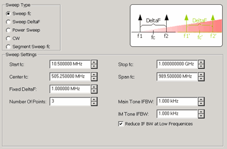 Configures the Sweep Type and
frequency range for SweptIMD and [Swept IMDX](Swept_IMDx.md) measurements.

### Sweep Type and Sweep Settings

|  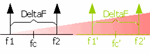 |  Sweep fc (center frequency) Maintaining a constant tone spacing (Fixed DeltaF) and tone power, fc is swept from Start fc to Stop fc. Center Frequency can also be specified as Center fc and Span fc. At each fc, the receivers are tuned to all of the required frequencies to measure the power of the appropriate tones.  
---|---  
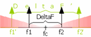 |  Swept DeltaF (tone spacing) The specified fc (center frequency) and tone power is held constant. The tone spacing is increased from Start DeltaF to Stop DeltaF in the specified number of points.  
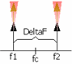 |  Power Sweep The main tone frequencies are specified as either f1 and f2, or as fc and DeltaF. These frequencies are held constant while the power of each main tone is varied from the Start-Power to Stop-Power in the specified number of power points. The power of each tone can be set (on the Power tab) individually or as a pair by checking Coupled Tone Power.  
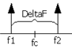 |  CW The main tone frequencies and power levels are held constant. Measurements are taken for the specified Number of Points. The X-axis is number of points.  
 |  Segment Sweep fc (Swept IMD ONLY) Same as Sweep fc except that the center frequencies are constructed using the standard segment table. [Learn how.](../S1_Settings/Sweep.md#segment)  
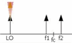 |  LO Power Sweep (Swept IMDX ONLY) The main tone frequencies and power levels are held constant. Measurements are taken for the specified number of points. The X-axis is LO Power.  
  
Segment Sweep Notes: (Swept IMD ONLY)

  * The segment table shown on the dialog is 'READ-ONLY'.

  * Learn how to [Create and edit the Segment Sweep table](../S1_Settings/Sweep.md#segment).

  * Independent IFBW and Power are NOT available.

  * [X-axis point spacing](../S1_Settings/Sweep.md#X-AxisPoint) is available beginning with A.09.10.

Number of Points Enter the number of data points for each sweep. See Limited
Number of Acquisitions.

### IFBW

The [Narrowband IF path](../IFAccess/IF_Path_Configuration.md) is used for
IMD measurements to help reduce spurious responses. Because the narrowband
filter has a bandwidth of about 28 kHz, using an IFBW greater than 30 kHz does
nothing to improve measurement accuracy.

Main Tone and IM Tone IFBW IF Bandwidth is specified separately for the main
tones (f1 and f2) and for the intermodulation tones. This allows the higher-
power main tones to be accurately measured at a higher - and faster - IFBW,
while the lower-power product tones to be accurately measured a lower - and
slower - IFBW.

Note: The IFBW is limited to 600 kHz when performing Swept IMD measurements
even if the [Wide IF path](../IFAccess/IF_Path_Configuration.md#IFFrquencies)
is selected.

Reduce IF BW at Low Frequencies \- On the VNA, the trace noise becomes worse
below 748 MHz. This is especially obvious between 10 MHz and 45 MHz. When this
box is checked, the VNA uses a smaller IF Bandwidth than the selected value at
frequencies below 748 MHz. [Learn more about the selected
values.](../S2_Opt/Trce_Noise.htm#ReduceIFBW)

Note: For Main Tone IFBW settings of 1 kHz and below, and when the center
frequency of the VNA is an exact multiple of 10 MHz, then the tone frequencies
are shifted UP by (10* IFBW) for the entire IFBW sweep. If those frequencies
would exceed the maximum frequency of the analyzer, then the frequency is
shifted DOWN by (10 *IFBW). This is done to avoid interference with 10 MHz
reference signals.  
  
Power tab - IMD Setup dialog box help  
---  
 Configures RF power and Power Sweep
settings for IMD measurements. Power ON (All channels) Check to turn RF Power
ON or clear to turn power OFF for all channels.

### DUT Input Port

Input Port Choose Port 1 or Port 3. When using Port 3, an external combiner is
required. [Learn more.](SweptIMDLimitedPortMapping.md) Source Attenuator
Specifies the port 1 attenuator. This attenuator affects the range of
available power into the DUT [Learn more about Source
Attenuation.](../S1_Settings/Power_Level.htm#Source_Atten) Receiver Attenuator
This attenuation setting protects the A receiver from damage.

### DUT Output Port

Output Port  Choose Port 2 or Port 4 (with limitations), [Learn
more.](SweptIMDLimitedPortMapping.htm) Source Attenuator This setting is used
to improve the load match at the DUT output. Select 0 dB for power levels up
to 10 dBm, and increase by 10 dB for every 10 dBm more output power. Receiver
Attenuator Specifies the attenuator setting for port 2. When the power into
the receiver test port is around +10 dBm, the VNA receiver may be in
compression. However, with receiver attenuation, lower input power levels may
become too noisy to make accurate power measurements. In this case, lower IFBW
for the IM tones to reduce noise. [Learn more about Receiver
Attenuation.](../S1_Settings/Power_Level.htm#Receiver_Atten)

### Tone Powers

Coupled Tone Power Check to set the same power level for each main tone using
the f1 Power setting. Clear to set different f1 and f2 power levels. ALC On
Check to use internal ALC hardware (default). Clear to use Open Loop hardware.
Open Loop leveling should only be used when doing Wideband Pulse measurements.

### Power Leveling

Because the gain of the DUT can be different for the f1 and f2 tone
frequencies, you can set tone power at either the input of the DUT OR the
output using the following methods. Receiver Leveling will cause slower
sweeps. Set Input Power (Default) The specified f1 and f2 power levels are set
at the DUT input. Input power level accuracy is based ONLY on the source power
cal that is performed during the IMD cal. The input and output tones may NOT
be equal or flat. Set Input Power, receiver leveling The specified f1 and f2
power levels are set at the DUT input using receiver leveling at the input
reference receiver. This ensures the tone power levels are equal at the DUT
input. However, the output tones may NOT be flat due to variations in the gain
of the DUT at different frequencies. Set Input Power, equal tones at output
The specified f1 and f2 power levels are set at the DUT input and a
measurement is made at the output. The inputs are adjusted once at each
frequency to ensure the tone power levels are equal at the DUT output.
However, the output tones may NOT be flat due to variations in the gain of the
DUT at different frequencies. Set Output Power, receiver leveling The
specified f1 and f2 power levels are set at the DUT output. Receiver Leveling
at the output receiver is used to accurately set the specified power level of
each tone within the tolerance value that is set in the [Receiver Leveling
dialog](../S1_Settings/Receiver_Leveling.htm#RecLevelDiag). This setting
results in the output tones being equal and flat across the frequency range.
Note: Enabling [Safe
Mode](../S1_Settings/Receiver_Leveling.htm#Enable_Safe_Mode_while_leveling)
when using receiver leveling may be necessary to ensure stable results.

### f1 / f2 Power

Fixed f1 Power Specify the power level for f1 at either the DUT input or
output depending on the Power Leveling setting. Choose a value between -30 dBm
and +30 dBm. When "Coupled Tone Power" is checked, power is set for both f1
and f2 tones. Fixed f2 Power Available when Coupled Tone Power is NOT checked.
Specify the power level for f2 at either the DUT input or output depending on
the Power Leveling setting. Choose a value between -30 dBm and +30 dBm. Start,
Stop, and Step f1 and f2 Power  Available when Power Sweep is selected on the
[Frequency tab](Swept_IMD.md#FreqTabDiag). Sets the Start and Stop power
levels for f1 and f2, either individually or together with Coupled Tone Power
checked. Path Configuration click to launch the [RF Path
Configuration](../S1_Settings/Path_Configurator.htm) dialog. Highlighted Note:
RF2 tone power offset to compensate for combiner loss. This message appears
when the f2 tone is being supplied by an external source. The tone power has
been increased on the external source to compensate for loss through the
internal combiner. For example, if the tone power at the DUT should be 0 dBm,
the power out of the source will be about 15 dB higher.  
  
Configure tab- IMD Setup dialog box help  
---  
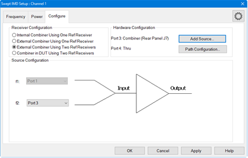

### Receiver Configuration

Note: Multiple Receiver Configurations is a Licensed Feature. Learn more about
[Licensed Features](../Support/Software_Support.md). Internal Combiner Using
One Ref Receiver \- This configuration is supported on the PNA-X only and is
the default mode. This configuration is one reference receiver + internal
combiner mode. External Combiner Using One Ref Receiver \- This configuration
is one reference receiver without internal combiner on the PNA-X.  External
Combiner Using Two Ref Receivers \- This configuration uses two reference
receivers for two input tones. Each port uses its own reference receiver.
Combiner in DUT Using Two Ref Receivers \- This configuration uses two
reference receivers for two input tones applied to a combiner inside the DUT.
Each port uses its own reference receiver.

### Source Configuration

To accommodate single-source VNA models, an external source can be used for
the f2 tone. Learn how to [configure an external source and
combiner](Swept_IMD_Configure_External_Source_and_Combiner.htm) to make Swept
IMD and IMDx measurements. f1 Always uses VNA internal source 1. f2 Select a
source to be used for the f2 tone. This selection is available when an
external source is configured and the Active box is checked on the [External
Source Configuration dialog.](../System/Configure_an_External_Device.htm)

### Hardware Configuration

Add Source Click to configure an external source using the [External Source
Configuration dialog.](../System/Configure_an_External_Device.htm) Path
Configuration Click to launch the [Path Configuration
dialog](../S1_Settings/Path_Configurator.htm) (PNA-X models only).  
  
###

#### How to add IMD Parameters  
  
---  
Using Hardkey/SoftTab/Softkey |  Using a mouse  
  
  1. Press Trace, then select trace.
  2. Press Meas, then select a parameter.

|

  1. Click Instrument, Trace, Add Trace.
  2. Click Response, Meas, then select a parameter.

  
  
IMD New Trace dialog box help  
---  
 Use this dialog to select IMD and
[IMDx](Swept_IMDx.md#HowParams) parameters to measure and display. Up to five
parameters can be selected at a time, then click Apply to create those traces.
Then select more without closing the dialog. There is no limit to the [number
of traces and windows](../S0_Start/Traces_Channels_and_Windows.htm) allowed in
the VNA. Note: Calculations are NOT performed to determine if the frequency of
a selected intermod (Order) product will be within the frequency range of the
VNA. Measurements that fall outside of the frequency range of the VNA are
displayed as -200 dB. Param Name This name is built from the selected Type,
Tone Select, Order, and Measure At settings. Once built, check to measure this
parameter.

### Type

Select the type of Swept IMD measurement to make. The characters below (in
parenthesis) are used in the Param Name.

  * Tone Power (Pwr) Measures the absolute power of the specified (ordered) tone. [Learn more.](Swept_IMD_and_IM_Spectrum_Concepts.md#TonePower)
  * IMD Relative to Carrier (IM) Measures the power of the specified (ordered) tone relative to the power of the f1 or f2 tone. [Learn more.](Swept_IMD_and_IM_Spectrum_Concepts.md#IMDParam)
  * Input Referred Intercept Point (IIP) From DUT measurements, calculates the theoretical power level at which the specified (ordered) intermod product will be the same power level as the carrier at the output of the DUT. The input power to the DUT at which this output power occurs is reported and displayed. [Learn more.](Swept_IMD_and_IM_Spectrum_Concepts.md#InterceptPointParam)
  * Output Referred Intercept Point (OIP) From DUT measurements, calculates the theoretical power level at which the specified (ordered) product will be the same power level as the main tone at the output of the DUT. This value is reported and displayed. [Learn more.](Swept_IMD_and_IM_Spectrum_Concepts.md#InterceptPointParam)
  * CTB Band-Edge Distortion (CTBE) Composite 'Triple Beat' Distortion - 3rd order DUT OUT only. [Learn more.](Swept_IMD_and_IM_Spectrum_Concepts.md#CTB)
  * CTB Mid-Band Distortion (CTB)  Composite 'Triple Beat' Distortion - 3rd order DUT OUT only. [Learn more.](Swept_IMD_and_IM_Spectrum_Concepts.md#CTB)
  * CSO Distortion (CSO) 2nd order DUT OUT only. [Learn more.](Swept_IMD_and_IM_Spectrum_Concepts.md#CSO)
  * XMOD 3rd Order Crossmod (XMOD)  3rd order DUT OUT only. [Learn more.](Swept_IMD_and_IM_Spectrum_Concepts.md#XModulation)
  * Tone Gain (ToneGain) From tone power measurements, calculates the Output Tone power / Input Tone power for the specified tones. [Learn more.](Swept_IMD_and_IM_Spectrum_Concepts.md#ToneGain) The Input and Output tones are different frequencies.
  * Gamma Measures receiver ratios to compute input match of the DUT or load match seen at the output of the DUT. For example, when using port 1 for DUT input and port 2 for DUT output, GammaIn = b1/a1,1 and Gamma = a2/b2,1. Under Correction Methods, requires Power Correction Type = Actual Waves, and the box checked for Enable 8-term Error Correction Model. [Learn more](../S3_Cals/Guided_Power_Calibration.md#8-term_error_correction).
  * AI1 Analog input pin on the Power I/O connector.
  * AI2 Analog input pin on the Power I/O connector.
  * AIG Analog ground (common) pin on the Power I/O connector.
  * AOS1 DC output, AUX OUT 1.
  * AOS2 DC output, AUX OUT 2.

### Tone Select

Select the tone (High, Low, or Both) to be measured and displayed [(See
image)](Swept_IMD_and_IM_Spectrum_Concepts.htm#Concepts).

  * High Measure and display the power of the specified (ordered) tone on the High side of the main tones.
  * Low Measure and display the power of the specified (ordered) tone on the Low side of the main tones.
  * Avg Measure the specified (ordered) tones on both the High and Low sides. Then calculate and display the Average power level. Note: The Avg power level is actually the mean dB value of the high and low side tones - NOT the true average power level which would be calculated from linear power (watts). This is done to be consistent with the [Power Leveling algorithm](Swept_IMD.md#powerLeveling) that is used to set the tone powers equal at the DUT input or output, which is also based on the dB values.
  * Max Measure the specified (ordered) tones on both the High and Low sides. Then find and display the Maximum power level.
  * Min Measure the specified (ordered) tones on both the High and Low sides. Then find and display the Minimum power level.

Used to build the parameter name:

  * Hi, Lo, Max, and Min are appended to the Param Name when selected.
  * Nothing is appended to the Param Name when Avg (default setting) is selected.

|  Important Notes - 2nd-order products

  * 2nd-order products are likely to be outside of the VNA frequency range. When that occurs, trace data will show all zeros (linear) or -200 dB (log magnitude).
  * If either the High or Low side falls outside the frequency range of the VNA, then Avg is NOT allowed.
  * When displaying 2nd-order traces, Avg is NOT allowed, even when both the Lo and Hi products are displaying valid data. This is because 2 Low and 2 High products are usually very different from one another.
  * When performing a calibration that is meant to include 2nd-order products, be sure [Include 2nd Order Products](Swept_IMD.md#CalSelectTones) is checked in the first Calibration dialog box.

  
---  
  
### Order

Specify the intermodulation product to measure. Choose from 1, 2, 3, 5, 7, 9.

  * Main is appended to the Param Name when 1 is selected.

  * Otherwise, the tone number is appended to the parameter name.

### Measure At

Measure the selected parameter at either:

DUT Input

  * In is appended to the Param Name (ex: PwrMainIn).

  * The input port reference receiver is used to measure the fundamental tones and the required products.

DUT Output

  * Nothing is appended to the Param Name (ex: PwrMain).

  * The output port measurement receiver is used to measure the fundamental tones and the required products.

  
  
## IMD Calibration

### Overview

  1. At the first page of the IMD Cal Wizard, you tell the calibration routine the frequencies at which the calibration is to be performed. Optionally, you can choose to perform the source power cal at only the center frequency midway between the main tones. For IMDx ONLY, you can also choose to perform a source power cal of the LO source.

  2. The VNA calculates an array of source and receiver frequencies that incorporate all the main tone frequencies (low and high) and the specified product tone frequencies.

  3. Using a power meter at port 1, a source and receiver calibration is performed to calibrate the R1 reference receiver to be a fast and 'tunable' power meter. 

  4. The R1 reference receiver is then used to perform a source power cal of the main tone frequencies: first the Source 1 / Low tone then the Source 2 / High tone. Both sources are left ON while each tone is measured in order to duplicate the impedance match under which the measurement will be performed.

  5. Then a standard 2-port SOLT cal is performed at all frequencies using either an ECal module or mechanical standards. The 2-port cal is used to correct the source calibration R1 tracking terms for the match of the power sensor. It is also used to transfer the R1 tracking term to the B receiver.

### Notes

  * If the main tone frequencies change but are within the frequency range in which the calibration was performed, then the calibration becomes interpolated C*. This can occur by changing the start/stop/center/span frequencies, the number of points, or the sweep type. Learn more about [Interpolation.](../S3_Cals/Error_Correction_and_Interpolation.md#Interpolation)

  * A Preference setting can be made which allows a Swept IMD and IMDx calibration to exceed the stop frequency limit of an ECal module. [Learn more](Swept_IMD.md#ECalExtrap).

  * [Receiver calibrations](../S3_Cals/PwrCalibration.md#ReceiverPowerCal) that are performed in a standard channel can be applied to a Swept IMD channel. However, [Source Calibrations](../S3_Cals/PwrCalibration.md#SourcePowerCal) can NOT be applied.

### External Combiner Using Two Reference Receivers Calibration

The Cal All wizard supports calibration of the two reverence receiver
configurations (external combiner and combiner in DUT).

  1. In the Configure tab, select External Combiner Using Two Ref Receivers:  
  
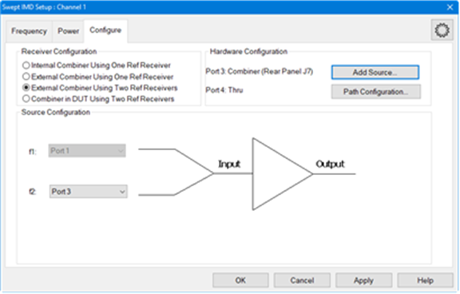

  2. Press Cal > Other Cals > Cal All.... The Calibrate All Selected Channels dialog is displayed:  
  
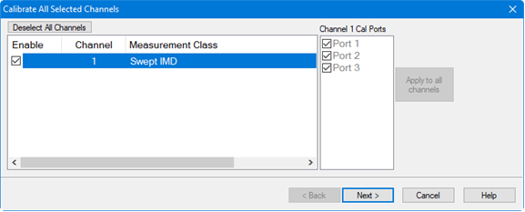

  3. Receiver Calibration: Connect the power sensor to the Cal Plane (Cal Plane is the output of the external combiner). The R1 and R3 receivers will be calibrated with the power sensor.

  4. Source Calibration: After the R1 and R3 receivers are corrected, both Port 1 and Port 3 are turned on, then Port 1’s source is calibrated with corrected R1 and Port 3’s source is calibrated with corrected R3.

  5. S-Parameter Calibration: Because Port 1 and Port 3 share one Cal Plane, Thru 1-3 is removed by the software and only keeps two Thrus:  
  
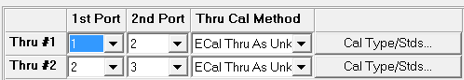

  6. The following shows an actual measurement with leveling turned on.  
  
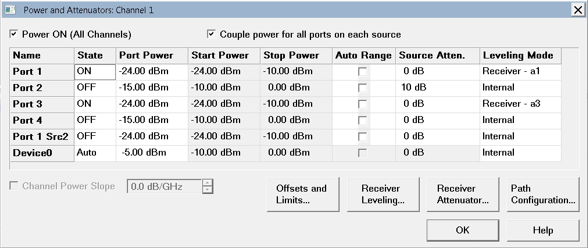

### See Also

[IM Spectrum Calibration](IM_Spectrum_for_Converters.md#Calibration)

#### How to start a Swept IMD Calibration  
  
---  
Using Hardkey/SoftTab/Softkey |  Using a mouse  
  
  1. Press CAL > Main > Smart Cal....

|

  1. Click Response
  2. Select Cal
  3. Select Smart Cal...

  
  
  
Select Tone Products - IMD Cal dialog box help  
---  
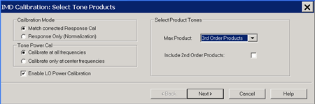

### Calibration Mode

Match corrected Response Cal This selection performs a full IMD calibration as
described in the above [Calibration 'Overview'](Swept_IMD.md#CalOverview).
Response ONLY (Normalization) This IMD Cal does NOT correct for the mismatch
of the power sensor. Choose this if you have a test configuration that does
not easily accommodate making match measurements. Instead of a standard 2 port
SOLT cal ([Step 5 above](Swept_IMD.md#CalOverview)), only the transmission
tracking term is measured and used to transfer the R1 receiver tracking term
(produced by the power sweep) to the B receiver. Note: For the Response
(Normalization) Cal, it is assumed that a [zero-length THRU
standard](../S3_Cals/Calibration_THRU_Methods.htm#Flush) is being used to
connect port 1 to port 2. If an adapter is used, there is NO compensation for
delay or loss of the adapter. This can NOT be changed.

### Tone Power Cal

Calibrate only at center frequencies The source power cal portion is performed
at only the center frequency, which is midway between the main tones. This
cuts the source power calibration time (the slowest part of the calibration)
in half. The measurement is interpolated although the C* annotation is not
shown in the status bar. Calibrate at all frequencies The source power cal
portion is performed at all main tone frequencies. Enable LO Power Calibration
(IMDx ONLY) Check to perform a standard power calibration of the LO source as
part of the calibration process.

### Select Product Tones

Max Product Select the highest product that you will be measuring. The low and
high frequencies for that product, and all lower 'odd' order products will be
calibrated. For example, when 5th Order Product is selected, the frequencies
for the Main Tones, and the Low and High order products for the 3rd and 5th
order products will be included in the calibration. Include 2nd Order Products
Check to calibrate the 2nd-order products in the frequencies to be calibrated.
The frequencies of these products are usually far from the main tones.

### Extrapolated ECal Calibration

A [Preference setting](../System/Preferences.md) can be made which allows a
Swept IMD and IMDx calibration to exceed the stop frequency limit of an ECal
module. The error terms beyond the ECal stop frequency are extrapolated. The
setting is designed to provide correction for order products (especially 2nd
order) when the frequencies exceed the ECal module stop frequency.

  * The accuracy of the extrapolated error terms is not as good as those that were measured.
  * This feature is NOT allowed when using [Cal All Channels](../S3_Cals/Calibrate_All_Channels.md).
  * The ECal Extrapolation state and frequencies are saved to the Cal Set and visible in the [Cal Set Properties](../S3_Cals/Cal_Sets.md#CalSetProps) dialog.

  
  
Select DUT Connectors and Cal Kits - IMD Cal dialog box help  
---  
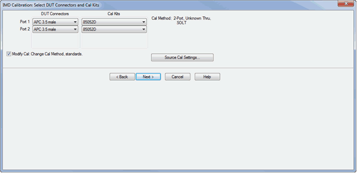 If Response Only is selected on
the previous page, click Source Cal Settings... to change the Source Cal
settings, or click Next> to continue. Otherwise, this is a [standard VNA Cal
Wizard](../S3_Cals/Calibration_Wizard.htm) page except for the following:
Modify Cal Check, then click Next, to Modify Cal (Standards AND Thru Method).
Source Cal Settings Click to launch the [Source Cal
Settings](../S3_Cals/Power_Cal_for_Apps.htm#SourceCalApps) (for Apps) dialog.
[Learn more about IMD Calibration](Swept_IMD.md#CalOverview)  
  
Power Cal Settings - IMD Cal dialog box help  
---  
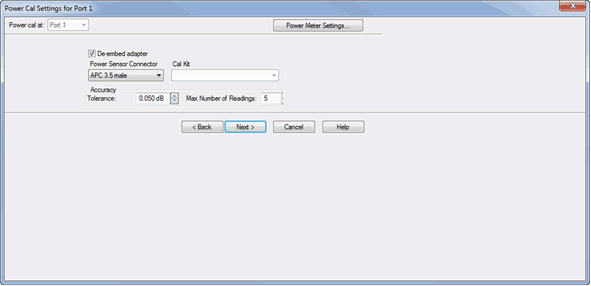 A power calibration is performed
on port 1. This is done to simplify subsequent IMD calibrations since the
power calibration will not need to be repeated. For highest accuracy, connect
the power sensor directly to the test port with no adapter. [Learn more about
these settings.](../S3_Cals/Guided_Power_Calibration.htm#PowerCalSettings)  
  
IMD Calibration Step 1 dialog box help  
---  
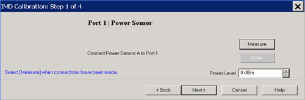 Power Level at which to perform the Port
1 Source Power Cal. It is usually best to perform the Source Power Cal at 0
dBm because the power sensor is calibrated at that level. However, if a
component is used between the VNA source and the calibration reference plane,
then adjust the power level so that the power at the sensor is about 0 dBm if
possible. [Learn more about IMD Calibration](Swept_IMD.md#CalOverview)  
  
The remaining dialog pages are the same as [the standard Cal
Wizard.](../S3_Cals/Calibration_Wizard.htm#Calibration_Wiz_help)

## Saving Swept IMD Power Data

Swept IMD power data, Log Mag ONLY, can be saved to a *.csv file. This data
type can be read by spreadsheet programs, such as Microsoft Excel. Data from
the last complete sweep is saved to the specified *.csv file.

### How to save Swept IMD (and IMDx) data

With a Swept IMD or IMDx channel active...  
---  
Using Hardkey/SoftTab/Softkey |  Using a mouse  
  
  1. Press Save Recall > Save Other > Save Data....
  2. File Type= CSV Formatted Data (*.csv).

|

  1. Click File
  2. Select Save Data
  3. File Type= CSV Formatted Data (*.csv).

  
  
  
Notes:

  * For every tone, six power levels are saved in this order: OUT Avg | OUT Lo | OUT Hi | IN Avg | IN Lo | IN Hi

  * Power levels for the Main tones are always saved, regardless of the active measurement.

  * All tones that are displayed are also saved. For example, any displayed 3rd order tone parameter causes the 3rd tone power levels to be saved.

  * Only tone powers are saved. Calculated parameters, such as IMD Relative to Carrier (IM) are NOT saved.

  * If calibration is turned ON when the file is saved, then all data is calibrated. Otherwise, raw data is saved.

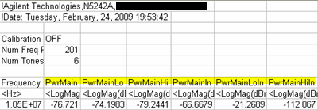

This image shows the 6 Main tone power levels that are always saved.

In the power parameter labels, Output and Avg are implied as in the [parameter
selection](Swept_IMD_and_IM_Spectrum_Concepts.htm#IMDParam). For example:
PwrMain = Average Output power of the main tones.

* * *

