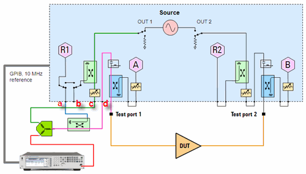
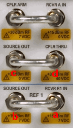
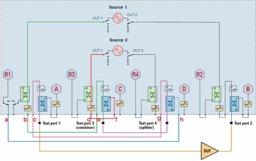
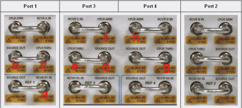
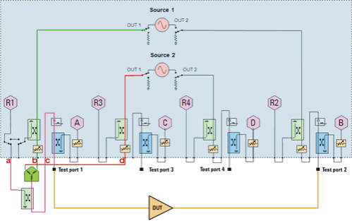
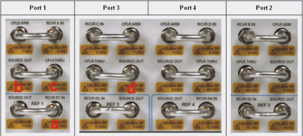

# Configure an External Source and Combiner for Swept IMD Measurements using
the N522xB Models

* * *

The following configurations can be used on the N522xB models for use with the
[IMD Apps](IMD_App.md) (Swept IMD, IMDx, IM Spectrum, and IMx Spectrum).

  * [N522xB 2-port models](Swept_IMD_Configure_External_Source_and_Combiner.md#2port)

  * N522xB 4-port models using Internal Components

  * N522xB 4-port models using External Components

These are NOT the only supported configurations, but are intended to be used
as examples. However, base N522xB models (without front-panel jumpers) are NOT
supported with the IMD Apps.

### See Also

[N522xB Specs](../Specs/ManualChoice.md) \- Block diagrams appear in the last
pages.

[N522xB Models and Options](../Support/Configurations.md#N522x)

* * *

### N522xB 2-port models (Single source; no internal combiner)

### Required

  * External Source \- [see list of supported sources](../System/Configure_an_External_Device.md#Supported).

  * Combiner \- Used to combine f1 (from internal source) and f2 (from external source).

  * Coupler \- Used to route input tones to R1 receiver.

  * Cables \- Used to make connections as shown in image.

### Notes

  * The R1 reference switch MUST be set to "External". Press Setup > External Hardware > External Testset.

  * R1 receiver is used to measure both the f1 and f2 tones. R1 is inferred by the VNA when you select Port 1 as the DUT input on the [IMD Setup dialog Power tab](Swept_IMD.md#PowerTabDiag).

  * Connection at 'd' above is to measure DUT input reflections at receiver A.

### Procedure

  * Remove the front-panel jumpers with labels in above image.

  * Configure the setup as shown in above image.

  * In the [External Source Configuration](../System/Configure_an_External_Device.md) dialog, configure the external source.

  * In the [IMD Setup dialog; Configuration](Swept_IMD.md#ConfigureDiag) tab, select the external source as f2 tone.

* * *

### N522xB 4-port models using internal VNA components

  * Port 3 coupler is used to combine f1 and f2.

  * Port 4 coupler is used as a splitter to route the tones to the R1 receiver.

You can also use external components for one or both of these functions for
less loss or better power-handling capability.

This configuration can also be used for 4-port PNA-X models with no internal
combiner.

### Required

  * Cables \- Used to make connections as shown in image.

### Notes

  * R1 receiver must measure both the f1 and f2 tone. R1 is inferred by the VNA when you select Port 1 as the DUT input on the [IMD Setup dialog Power tab](Swept_IMD.md#PowerTabDiag).

  * Connection at 'c' above is to measure DUT input reflections at receiver A.

### Procedure

  * Remove the front-panel jumpers that have labels in above image. Not all front-panel connectors will be cabled when finished.

  * Configure the setup as shown in above image. Be sure to make connections to ALL four VNA test ports as shown in about image.

* * *

### N522xB 4-port models using External Components

This configuration can also be used for 4-port PNA-X models with no internal
combiner.

### Required

  * Combiner \- Used to combine f1 and f2.

  * Coupler \- Used to route input tones to R1 receiver.

  * Cables \- Used to make connections as shown in image.

### Notes

  * R1 receiver is used to measure both the f1 and f2 tones. R1 is inferred by the VNA when you select Port 1 as the DUT input on the [IMD Setup dialog Power tab](Swept_IMD.md#PowerTabDiag).

  * Connection at 'c' above is to measure DUT input reflections at receiver A.

### Procedure

  * Remove the front-panel jumpers with labels in above image.

  * Configure the setup as shown in above image.

* * *

* * *

