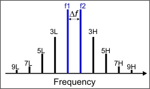
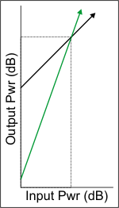
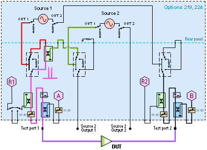
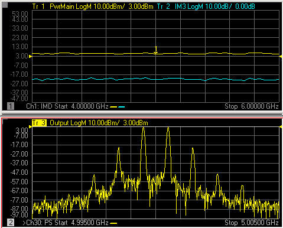

# Swept IMD and IM Spectrum Concepts

* * *

  * [Swept IMD Concepts](Swept_IMD_and_IM_Spectrum_Concepts.md#Concepts)

  * [Swept IMD for Converters](Swept_IMDx.md#Concepts) (separate topic)

  * [Swept IMD Parameters](Swept_IMD_and_IM_Spectrum_Concepts.md#Parameters)

  * [How the VNA Measures IMD](Swept_IMD_and_IM_Spectrum_Concepts.md#HowItWorks)

  * [How an IM Spectrum Channel Works](Swept_IMD_and_IM_Spectrum_Concepts.md#HowIMSpectrum)

  * [IM Spectrum Parameters](Swept_IMD_and_IM_Spectrum_Concepts.md#IMSpectParams)

[Other IMD topics](IMD_App.md)

##  Swept IMD (Intermodulation Distortion) Concepts

When a device or system is subjected to multiple input frequencies, the non-
linearity of the DUT can generate undesired outputs at other frequencies.
Typically, two input tones of equal power separated in frequency by a
specified amount are used to stimulate the device while observing the
resulting frequency spectra at the output. A variety of measurements can then
be utilized to determine the intermodulation distortion characteristics of the
device.

The frequencies of the resulting distortion products are predictable. While
many mixing products can be generated, the high and low signals of the "odd
order" products (3rd, 5th, and so forth) are close enough to the original two
signals to potentially interfere with adjacent communication channels. With
the exception of the 2nd order product, the higher "even order" products are
usually far enough away to be of no interest.

The following image and table shows two equal-power main-tones and the nearby
odd-order distortion products, as well as the 2nd order product (not shown in
the image). Notice that the frequency separation between adjacent odd-order
products is the same as the separation of the main tones (Delta F) frequency.
For most devices, these distortion products become worse as the device is
pushed further into compression.

  
---  
Two main tones (f1 and f2) with odd order intermodulation products.  
  
The following table shows the calculations and example frequencies (Blue text)
of the intermodulation products that are closest to the two main tones.

Product | Low (L) | High (H)  
---|---|---  
Main  
tones | f1 100 MHz | f2 120 MHz  
3 | 2f1-f2 80 MHz | 2f2-f1 140 MHz  
5 | 3f1-2f2 60 MHz | 3f2-2f1 160 MHz  
7 | 4f1-3f2 40 MHz | 4f2-3f1 180 MHz  
9 | 5f1-4f2 20 MHz | 5f2-4f1 200 MHz  
2 | f2-f1 20 MHz | f1+f2 220 MHz  
  
[Learn about Swept IMDx for Converters Concepts](Swept_IMDx.md#Concepts)

## Swept IMD Parameters

The following basic parameters, offered for both Amps and Converters, are
expanded to over 150 by selecting specific product tones (2,3,5,7,9), the Low-
side, High-side, or Average of these tones, measured at the Input or Output of
the DUT.

  * [Tone Power](Swept_IMD_and_IM_Spectrum_Concepts.md#TonePower)

  * [Tone Gain](Swept_IMD_and_IM_Spectrum_Concepts.md#ToneGain)

  * [Intermodulation Distortion](Swept_IMD_and_IM_Spectrum_Concepts.md#IMDParam)

  * [Intercept Point Parameters](Swept_IMD_and_IM_Spectrum_Concepts.md#InterceptPointParam)

  * [Composite Triple Beat (CTB)](Swept_IMD_and_IM_Spectrum_Concepts.md#CTB)

  * [Composite Second-order Beat (CSO)](Swept_IMD_and_IM_Spectrum_Concepts.md#CSO)

  * [Cross-Modulation Distortion](Swept_IMD_and_IM_Spectrum_Concepts.md#XModulation)

[Learn how to select these IMD parameters.](Swept_IMD.md#HowParams)

### Tone Power Parameters

Tone Power parameters measure the absolute power level of the main tones, odd-
order product tones up to the 9th order, and the 2nd order product tones.
These tone powers can be measured at the input and output of the DUT. Because
the tones come in pairs, the Low tone, High tone, and the Average of the two
can be measured and displayed.

The Average Tone Power is calculated as follows:

Avg = (High tone (dBm) + Low tone (dBm) ) / 2

When measuring the 2nd order products, only the Low tone and High tones are
allowed. When the main tones are separated by less than 10 MHz, the Low tone
(f2-f1) is below the frequency range of the VNA.

### Tone Gain

Tone Gain (in dB) calculates the main tone Output Tone power / Input Tone
power. Because the tones come in pairs, Tone Gain can be calculated for the
Low tone, High tone, and the Average of the two as indicated in the Average
Tone Power calculation.

For IMDx for Converters, the Input and the Output tones are typically at
different frequencies.

### Intermodulation Distortion Parameters

IMD parameters measure the difference in power level between the specified
product tone and the main tones. These IMD parameters are calculated from the
Tone Power measurements. IMD parameters can measure the odd-order product
tones up to the 9th order, and the 2nd product tones, at the DUT Input or
Output. For each specified product, the difference between the Low product and
main tone, difference between the High product and main tone, and difference
between the Averages of the product and main tone can be measured and
displayed.

Swept IMD supports IMD parameters which are calculated as follows:

IMxLo = IMxHi = IMx = IMxLoIn = IMxHiIn = IMxIn = | PwrxLo-PwrMainLo PwrxHi-PwrMainHi Pwrx-PwrMain PwrxLoIn-PwrMainLoIn PwrxHiIn-PwrMainHiIn PwrxIn-PwrMainIn  
---|---  
  
where:

  * x = the IM product of interest (2, 3, 5, 7, 9)

  * Avg is implied if Hi or Lo is not stated

  * Output is implied when In is not stated

[Learn how to select IMD parameters.](Swept_IMD.md#HowParams)

### Intercept Point Parameters

As the main tone output power increases (black arrow), output power in the
specified product tone increases at a predictable, and steeper, rate (green
arrow). At some point, the power in the product tone will be equal to the
power in the main tone. The power level at which this occurs is known as the
intercept point. Measuring this point directly is typically not possible.
Therefore, it is calculated by measuring the main tone power and the specified
product tone power.

The Swept IMD App can display either the DUT Input power or DUT Output power
that is required to achieve the theoretical intercept point. This is called
either Input Referred (IIP) or Output Referred (OIP).

This measurement can be made for the 2nd, 3rd, 5th, 7th, and 9th order
intercept points. In addition, the measurements can be made for either the Low
tone, the High tone, or the Average of the two. However, for the 2nd order
intercept point, only Low and High tone parameters are supported; not Average.

Swept IMD supports Intercept Point parameters which are calculated as follows:

OIPxHi = OIPxHiIn = OIPxLo = OIPxLoIn = OIPx = OIPxIn = IIPxHi = IIPxHiIn = IIPxLo = IIPxLoIn = IIPx = IIPxIn = | PwrMain \- IMxHi/(x-1) PwrMain - IMxHiIn/(x-1) PwrMain - IMxLo/(x-1) PwrMain - IMxLoIn/(x-1) PwrMain - IMx/(x-1) PwrMain - IMxIn/(x-1) PwrMainIn - IMxHi/(x-1) PwrMainIn - IMxHiIn/(x-1) PwrMainIn - IMxLo/(x-1) PwrMainIn - IMxLoIn/(x-1) PwrMainIn - IMx/(x-1) PwrMainIn - IMxIn/(x-1)  
---|---  
  
where:

  * x = the IM product of interest (2, 3, 5, 7, 9)

  * PwrMain = average power of the main tones at the DUT Input or Output

  * IMx = product tone power - main tone power (from above IMD parameter)

  * Avg is implied if Hi or Lo is not stated

  * Output is implied if In is not stated

[Learn how to select IMD parameters.](Swept_IMD.md#HowParams)

### Composite Triple Beat (CTB)

From the NCTA Standard, composite triple beat is defined as the modulation
beat of the target channel signal caused by triple beat resulting from the
nonlinear characteristic of the DUT. Composite triple beat is expressed as the
ratio of the target channel signal level to the maximum mean level of beat
components dispersed around the carrier of that target channel.

Swept IMD supports two parameters of this type:

  * CTB is based upon an approximation for the number of beats in mid-band

  * CTBE is based upon an approximation for the number of beats at the band edge.

The equations for these two parameters are as follows:

Mid-Band CTB(dB)=-2(Pi-Ps)+6+10Log(3N2/8)+CTB Offset

Band Edge CTBE(dB)=-2(Pi-Ps)+6+10Log(N2/4)+CTB Offset

Where:

  * Pi = Output power level at the third order intercept point (dBm): OIP3 (Lo | Hi)

  * Ps = One of the following values based upon the Composite Normalization Mode:

  *     * For PDBM or PDBMV mode, Ps = CompositeNormalizedCTBPower

    * For Number of Carriers mode, Ps = PwrMain (AVG) – 10Log(N/2)

    * For None mode, Ps = PwrMain (AVG)

  * CTB OFFset = Offset value for CTB calculation

  * N = Total number of carriers.

Note: CTB OFFset and N values can ONLY be set using [SCPI or COM
commands](../Programming/MixerTopic.htm#IMDNorms).

[Learn how to select IMD parameters.](Swept_IMD.md#HowParams)

### Composite Second-Order (CSO)

From the NCTA Standard, composite second order is defined as the modulation
beat of the target channel signal caused by second order beat resulting from
the nonlinear characteristic of the DUT. Composite second order beat is
expressed as the ratio of the target channel signal level to the maximum mean
level of beat components dispersed around 0.75 MHz and 1.25 MHz above and
below the carrier of that channel.

Swept IMD supports a CSO parameter which is calculated as follows:

CSO(dB)=(Pi-Ps)+10Log(N)+CSO Offset

Where:

  * Pi = Output power level at 2nd order intercept point: OIP2 (Lo | Hi)

  * Ps = One of the following values based upon the Composite Normalization Mode:

  *     * For PdBm or PdBmV mode, Ps = CompositeNormalizedCSOPower

    * For Number of Carriers mode, Ps = PwrMain (AVG) – 10Log(N/2)

    * For None mode, Ps = PwrMain (AVG)

  * CSO OFFset = Offset value for CSO calculation

  * N = Number of distortion products.

Note: CSO OFFset and N values can ONLY be set using [SCPI or COM
commands](../Programming/MixerTopic.htm#IMDNorms).

[Learn how to select IMD parameters.](Swept_IMD.md#HowParams)

### Cross-Modulation Distortion

From the NCTA Standard, cross modulation is defined as the distortion that
causes modulated carrier components of undesired channels to amplitude-
modulate the target channel carrier due to the nonlinear characteristic of the
unit under test. Cross modulation distortion is expressed as the ratio of the
target channel carrier level to the level of modulated components of the
carrier of the target channel resulting from modulated signals of undesired
channels.

Swept IMD supports an XMOD parameter which is calculated as follows:

XMOD=-2(Pi-Ps)+6dB+20Log(N)

Where:

  * Pi = Output power level at third order intercept point: OIP3 (Lo | Hi)

  * Ps = Power level of each carrier: PwrMain (AVG)

  * N = Total number of carriers.

Make Cross Modulation settings using [SCPI or COM
commands](../Programming/MixerTopic.htm#IMDNorms).

## How the IMD Application Works

The following diagram illustrates how the VNA is configured to generate the
two main tones.

This shows a PNA-X with dual sources and the internal combiner. A 2-port or
4-port N522xA model can also be used. Learn how to [Configure External Source
and Combiner](Swept_IMD_Configure_External_Source_and_Combiner.htm).

  
---  
2-port PNA-X generates the f1 and f2 main tones.  
  
Depending on the specified parameters and sweep type, the sources and
receivers are tuned to the appropriate frequencies in order to measure all of
the required main and product tone powers. For example, an IM3 parameter
requires the measurement of both main tones, and the 3rd order High and Low
tone powers.

The [Narrowband IF path](../IFAccess/IF_Path_Configuration.md) is used for
IMD measurements to help reduce spurious responses. Because the narrowband
filter has a bandwidth of about 28 kHz, using an IFBW greater than 30 kHz does
nothing to improve measurement accuracy. [Learn how to set IFBW for
IMD.](Swept_IMD.htm#FreqTabDiag)

### Limiting Stimulus Settings and Out of Range Product Tones

Because the main tones are generated by the VNA internal sources and external
sources, the frequencies of the main tones must always be within the frequency
range of the VNA or external source. Sweep parameter values are adjusted when
necessary to ensure that f1 and f2 frequencies are within these limits.

However, the VNA DOES allow you to make settings that cause the selected IM
products to fall outside the frequency range of the VNA. For example, with the
main tones at 10 MHz and 15 MHz, the VNA will allow you to select the
parameter IM3Lo (3rd low side product tone). However, the frequency of this
product will be at 2f1-f2 or 5 MHz, which is below the frequency range of the
VNA. In these cases, the trace data is set to zero, which converts to -200 dB
in Log Mag format.

### Limited Number of Acquisitions

The total number of acquisitions per sweep can not exceed 10,003 points. The
number of acquisitions is determined by multiplying the number of trace
points, by the number of tones frequencies, then by 2 (for both Input and
Output frequencies). The VNA will automatically reduce the number of trace
points to ensure the total number of acquisition points does not exceed
10,003.

## How an IM Spectrum Channel Works

Before reading this topic, you should become familiar with [IMD
Concepts](Swept_IMD_and_IM_Spectrum_Concepts.htm#Concepts).

The IM Spectrum channel provides a traditional spectrum analyzer view of the
intermodulation distortion behavior of a device. Unlike the Swept IMD channel,
the main tones (F1 and F2) are fixed while the receiver is swept over a
frequency range of interest in order to generate a display as shown below.

  
---  
IM Spectrum trace (bottom) with Swept IMD traces (top)  
  
A typical spectrum analyzer does NOT have a signal source. This one does. The
signal source, or stimulus, settings for the F1 and F2 main tones can be set
in either the IM Spectrum channel or the Swept IMD channel. These settings
include the frequencies and power levels of the main tones.

### Receiver Settings

The settings for the IM Spectrum receiver can be set ONLY in the IM Spectrum
channel. These settings include how many tone products to view - which
determines the center and frequency span - and the Resolution Bandwidth.

You can choose from several Resolution Bandwidths which also determines the
number of data points used in the channel. The higher the Res BW, the fewer
the number of data points. The formula for determining the number of points
is:

N = (Span/ResBW) * 3

The IM Spectrum channel performs multiple measurements for each data point in
order to reject unwanted images which are generated by the VNA internally.
This provides a high degree of confidence that signals captured in a trace are
real and are not spurious responses generated in the measurement process.

## IM Spectrum Parameters

You can select from three different IM Spectrum parameters.

  1. The tones OUT of the DUT (default parameter).

  2. The tones IN to the DUT (to be sure that the input signals are pure). NOT supported in IMx Spectrum

  3. Reflected tones off the DUT input. NOT supported in IMx Spectrum

Learn how to select IM Spectrum parameters for
[Amplifiers](IMSpectrum.md#Parameters) or
[Converters](IM_Spectrum_for_Converters.md#Parameters).

Learn all about IM Spectrum for [Amplifiers](IMSpectrum.md) or
[Converters](IM_Spectrum_for_Converters.md).

[See list of all IMD topics.](IMD_App.md)

* * *

