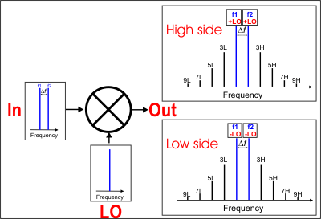
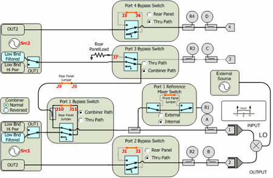
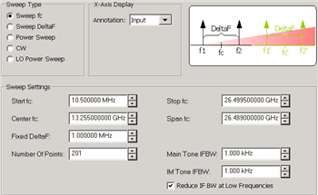
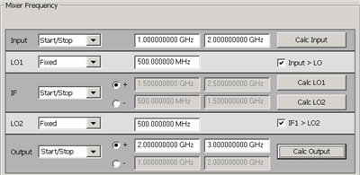
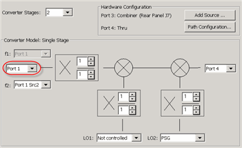
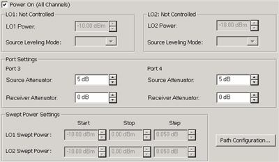
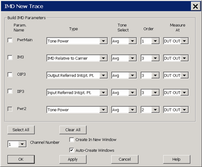

# Swept IMD for Converters (IMDx)

* * *

  * [IMDX Concepts](Swept_IMDx.md#Concepts)

  * [Requirements and Limitations](Swept_IMDx.md#Features)

  * [How to Configure your Hardware](Swept_IMDx.md#Hardwareconfig)

  * [Create a Swept IMDx Measurement](Swept_IMDx.md#Create)

  * [Valid Mixer Configuration / Sweep Type Combinations](Swept_IMDx.md#MxrSwpCombos)

  * [Setup Dialog](Swept_IMDx.md#SetupDiag)

  * How to specify IMDx Parameters

  * [IMDx Calibration](Swept_IMDx.md#calIMDx)

  * [Saving IMDx Data](Swept_IMD.md#Saving) (Swept IMD topic)

[Other IMD Topics](IMD_App.md)

## IMDx Concepts

Conceptually, Swept IMD for Converters (IMDx) is like [IMD for
Amplifiers](Swept_IMD_and_IM_Spectrum_Concepts.htm#Concepts), except that
there are two sets of products on the DUT output.

This image shows the simplest measurement configuration: the Input, LO, and
Output are all CW frequencies.

  * DUT INPUT \- two fundamental tones (f1 and f2)

  * DUT LO \- a single frequency.

  * DUT OUTPUT \- two sets of frequencies

With IMDx, you can view EITHER the High side or Low side products; NOT BOTH.

Make this selection on the [Mixer Frequency
tab](MixerConverter_Setup.htm#MixerFreqTab).

 | High side (Input PLUS LO and all ordered products)  
---|---  
Low side (Input MINUS LO and all ordered products)  
  
## Requirements and Limitations

Swept IMDx requires [Swept IMD](Swept_IMD.md) (Opt S9x087A/B).

  * When using Integrated Pulse application, the IF Filter setting for the relevant receiver must be changed to 'Wide'. [Learn how](../IFAccess/IF_Path_Configuration.md#HowIF PathConfig). The default IF Filter setting in Swept IMD is 'Narrow' in order to avoid spurs and harmonics. The IF Attenuator setting (on the same dialog) may also require adjusting.

The following VNA features are NOT available with Swept IMDx:

  * Analog Sweep ([Stepped sweep](../S1_Settings/Sweep.md#SweepSetupDiag) mode only)

  * [Log frequency](../S1_Settings/Sweep.md#SweepTypeDiag) sweeps

  * [Unratioed receiver measurements](../S1_Settings/Measurement_Parameters.md#Unratioed_Power) (A, B, R)

  * [ECal User Characterization](../S3_Cals/ECal_User_Characterization.md)

  * [Time Domain](../Time/TimeDomain.md)

  * [Balanced measurements](../S1_Settings/Balanced_Measurements.md)

  * Save [Formatted Citifile](../S5_Output/SaveRecall.md#cti) data.

  * [Save SnP data](../S5_Output/SaveRecall.md#An *.s3p).

  * [Port extensions](../S3_Cals/Port_Extensions.md)

  * Some Fixturing Features

  * [External Test Set Control](../System/External_Testset_Control.md) (Option S93551A/B)

  * Integrated Narrowband or [Narowband Pulse App](Narrowband_Pulsed_Application.md)

  * Independent IFBW, Power Levels, or Sweep Time in a [segment table](../S1_Settings/Sweep.md#SegmentDiag) is NOT supported.

  * [External DC Sources](../System/Configure_a_DC_Device.md) (DC Meters ARE supported).

  * [See Frequency Limitations](Swept_IMD_and_IM_Spectrum_Concepts.md#LimitFreq)

  * Option [205](../Support/Configurations.md#205) or Option [425](../Support/Configurations.md#425-N5242B)

Note: Beginning with A.09.00, Embedded LO measurements are allowed in IMDx and
IMSpectrum. Configure the measurement as you would with SMC. [Learn
how.](Embedded_LO.htm#How)

## How to Configure your Hardware

The VNA is extremely versatile, and can be configured in many ways to make
IMDx measurements. While not all conceivable configurations are documented
here, a few of the most common examples are provided to show the basic
concepts.

### DUT Configuration

  * The DUT Input must be connected to VNA Port 1 which supplies the f1 and f2 tones.

  * The DUT Output must be connected to VNA Port 2 which uses the VNA B receiver.

  * See LO Source configuration below.

### Source Configuration

Three sources are required to make IMDx measurements: Two sources are VNA
internal; the third is an external source.

  * F1 tone \- Must come out VNA Port 1 Default is Src 1

  * F2 tone \- Must come out VNA Port 1 through the internal combiner. This source can come from an internal or external source. Default is the internal Src 2.

  * LO \- Can come from internal or external source. Default is Not controlled, set to 0 Hz.

  1.      * If using the internal Src 2 source, the f2 tone must come from an external source through the rear-panel.

     * If using an external source, it can be connected directly to the DUT, or through the VNA Port 3 or Port 4 using the Path Configurator.

### Configuration Examples

Three configurations are shown below to illustrate how to use the [Path
Configurator](../S1_Settings/Path_Configurator.htm) to manually make switch
settings.

IMDx and IMx Spectrum channels are ALWAYS configured using the default
configuration switch settings shown in the image below. This is NOT the same
default configuration that is used for an S-parameter channel. A manual switch
setting is required whenever a custom configuration is used.

The manual switch setting, which must be done every time an IMDx or IMx
Spectrum channel is created, can be saved using the Store button in the Path
Configurator. Then save the entire IMDx setup as an [Instrument
State.](../S5_Output/SaveRecall.htm#SaveAsDiag) This will load the custom Path
Configuration when the Instrument State is recalled.

1\. Default Configuration No manual switching required.

  * f1 \- Internal Src1 

  * f2 \- Internal Src2 through combiner in Normal

  * LO \- Connect external source directly to the DUT LO.

2\. External LO though Port 3 or Port 4 (4-port VNA only)

Use this configuration to monitor LO power using R3 or R4. (Future parameters)

  * f1 \- Internal Src1

  * f2 \- Internal Src2 through combiner in Normal

  * LO \- Connect external source through the rear-panel ( J7 for Port 3; J3 for Port 4 ).

  *     * Connect the DUT LO to VNA Port 3 or Port 4.

    * For Port 3, NO switching is required.

    * For Port 4, switch Port 4 Bypass Switch to Rear Panel.

3\. Internal LO through Port 3 or Port 4; External f2 through rear-panel
(4-port VNA only)

This configuration is commonly used for FCA measurements where the internal
second source is used as the LO.

  * f1 \- Internal Src1

  * f2 \- External f2 through rear-panel J9. No switching required.

  * LO \- Internal Src2 through:

  *     * Port 3 Switch Port 3 Bypass Switch to Thru Path.. Connect the DUT LO to VNA Port 3

    * Port 4 Switch Port 4 Bypass Switch to Thru Path. Connect the DUT LO to VNA Port 4

## Create a Swept IMDx Measurement

  1. Press Meas > S-Param > Meas Class....

  2. Select Swept IMD Converters, then either:

     * OK delete the existing measurement, or

     * New Channel to create the measurement in a new channel.

  3. A Swept IMDx measurement is displayed. To select additional parameters to display, click Response, then Measure, then select a parameter from the list.

#### How to start the Swept IMDx Setup dialog  
  
---  
Using Hardkey/SoftTab/Softkey | Using a mouse  
  
  1. Press Freq > Main > IMDX Setup....

|

  1. Click Stimulus
  2. Select IMDX Setup...

  
  
  
## Valid Mixer Configuration / Sweep Type Combinations

### Tips

Although you will soon become comfortable navigating these tabs, at first it
may be best to complete the dialog in the following order:

  1. On the [Tone Frequency tab](Swept_IMDx.md#FreqTabDiag), set the Sweep Type and Tone Frequencies.
  2. On the [Mixer Frequency tab](Swept_IMDx.md#MixerFreqTab), set a valid mixer configuration.

  * Input center / fixed frequency CAN be set on both the [Tone Frequency tab](Swept_IMDx.md#FreqTabDiag) and the [Mixer Frequency tab](Swept_IMDx.md#MixerFreqTab). When you set one, the other is updated automatically.

  
---  
  
The following are the Valid Mixer Configurations in table format:

Sweep Type | Input | LO | Output  
---|---|---|---  
Swept Input (Fixed Tones)  
Sweep fc | Swept | Swept | Fixed  
Swept | Fixed | Swept  
All Ranges Fixed  
CW Sweep Delta F (Tone) Power Sweep LO Power Sweep | Fixed | Fixed | Fixed  
Fixed Input / Swept LO & Output  
CW | Fixed | Swept | Swept  
  
For determining a valid mixer configuration with 2 LOs, one Fixed LO and one
Swept is equivalent to having a single-stage Swept LO.

If you create an invalid Sweep Type / Mixer Configuration, a red message
appears like the following:

  * If this occurs, change the Sweep Type on the [Tone Frequency](Noise_Figure_on_Converters.md#FreqTabDiag) tab.

  * [See other rules for configuring a mixer](MixerConverter_Setup.md#Rules).

  * The following is an explanation of the table:

SWEPT Input \- Sweeps the center frequency of the tones, but the tone spacing
remains fixed.

On the [Tone Frequency](Noise_Figure_on_Converters.md#FreqTabDiag) tab,
select Sweep fc

  * Either the LO or Output MUST also be swept.

  * On the Mixer Frequency tab, select Start/Stop, or Center/Span for each range to be swept.

FIXED Input \- The center frequency of the tones is fixed.

On the Tone Frequency tab select Fixed for the following sweep type:

  * CW \- Tones do NOT change. The LO and Output frequencies CAN be swept.

All Ranges FIXED \- The center frequency of the tones is fixed.

On the Tone Frequency tab select Fixed for the following sweep types:

  * Sweep Delta F Tone separation changes.

  * Power Sweep \- Tone power changes.

  * LO Power Sweep \- The LO power is swept.

  * CW \- Tones do NOT change.

## Setup Dialog

The following tabs are shared with the Swept IMD Setup dialog:

  * [Tone Frequency tab](Swept_IMD.md#FreqTabDiag)

  * [Tone Power tab](Swept_IMD.md#PowerTabDiag)

The following tabs are shared with all Mixer / Converter Applications

  * [Mixer Frequency tab](MixerConverter_Setup.md#MixerFreqTab)

  * [Mixer (LO) Power tab](MixerConverter_Setup.md#MixerPowerTab)

  * Mixer Setup tab (NOT shared)

Tone Frequency tab - Swept IMDx Setup -dialog box help  
---  
 [Learn about this
dialog.](Swept_IMD.htm#FreqTabDiag)  
  
Tone Power tab - Swept IMDx Setup -dialog box help  
---  
 [Learn about this
dialog.](Swept_IMD.htm#PowerTabDiag)  
  
Mixer Frequency tab \- Swept IMDx Setup -dialog box help  
---  
 [Learn about this
dialog](MixerConverter_Setup.htm#MixerFreqTab)  
  
Mixer Setup tab - Swept IMDx Setup -dialog box help  
---  
 Converter Stages Choose from 1 or 2
stage DUT (# of LOs).

### Converter Model

Learn how to [configure an external source and
combiner](Swept_IMD_Configure_External_Source_and_Combiner.htm) to make Swept
IMD and IMDx measurements. f1 Always uses VNA internal source 1. (DUT Input)
Port N (Red circle in image) Normally Port 1 is used. This selection is
available to allow the two tones to be routed through port 3 on 4-port VNA
models. [Learn more](SweptIMDLimitedPortMapping.md). f2 Select a source to be
used for the f2 tone. This selection is available when an external source is
configured and the Active box is checked on the [External Source Configuration
dialog.](../System/Configure_an_External_Device.htm) LO1 (and LO2 for 2-stage
DUTs) Select the source to use for the specified LO. Available for selection
when an external source is configured and the Active box is checked on the
[External Source Configuration
dialog.](../System/Configure_an_External_Device.htm) (DUT Output) Port N
Available for selection on 4-port VNA models. Select the VNA port to connect
to the DUT Output. Fractional Multipliers \- [Learn
more](MixerConverter_Setup.htm#Multplier).

### Hardware Configuration

Add Source Click to configure an external source using the [External Source
Configuration dialog.](../System/Configure_an_External_Device.htm) Path
Configuration Click to launch the [Path Configuration
dialog](../S1_Settings/Path_Configurator.htm) (PNA-X models only).  
  
Mixer (LO) Power tab \- Swept IMD Setup -dialog box help  
---  
 [Learn about this
dialog](MixerConverter_Setup.htm#MixerPowerTab)  
  
###

#### How to add Swept IMDx Parameters  
  
---  
Using Hardkey/SoftTab/Softkey | Using a mouse  
  
  1. Press Trace, then select trace.
  2. Press Meas, then select a parameter.

|

  1. Click Instrument, Trace, Add Trace.
  2. Click Response, Meas, then select a parameter.

  
  
IMDx New Trace dialog box help  
---  
 This dialog is shared with Swept IMD
for Amplifiers. [Learn about this dialog.](Swept_IMD.md#HowParams)  
  
## IMDx Calibration

Calibration for IMDx is exactly the same as [calibration for
IMD](Swept_IMD.htm#cal) with the following exception:

  * You can choose to perform a source power cal of the LO source. If the LO is a fixed frequency, this step is performed very fast.

The results of an IMDx calibration are very similar to the results that are
achieved from an [SMC
calibration](../FreqOffset/SMC_Measurements.htm#CalOverview).

* * *

