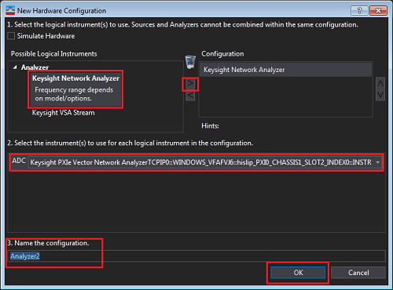
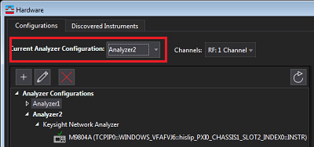

# Connecting with PathWave Vector Signal Analysis (89600 VSA)

Connecting to the 89600 VSA software allows for greater signal evaluation and
troubleshooting.

#### Supported Models

  * PNA-B VNA

#### Requirements

  * The 89600 VSA Version 2020 Update 0.1 or later is required.

  * VNA

    * Firmware A.14.60.xx and above for PNA-B VNA

    * S93090xA/B (PNA-B VNA) Spectrum Analysis software

#### Limitations

  * Negative Trigger Delay is not supported

    * Generally, VSA supports negative delay, in case of connecting with SA or Scope. But, VNA connection case, the negative delay is not supported because VNA trigger system hardware does not support negative delay. This is further follow-on feature.

  * 100MHz Reference Input is not supported. (Only 10 MHz Reference Input is supported.)

    * The External Reference Frequency field is always grayed out in the reference source selection under Utilities > Frequency Reference .. 100MHz external input cannot be selected. 

  * User Cal for SA channel

    * SA channel is used for the VSA-VNA connection. When establish connection between VSA and VNA, VSA creates hidden SA channel on VNA. Then, VSA queries IQ data from the SA channel on VNA. During the connection, the user should not control the hidden VNA SA channel, otherwise, the VSA-VNA connection might be broken. VNA SA channel has the user cal function, but in the 89600 VSA-VNA connection, user cal on the hidden SA channel is not supported.

  * VSA 89600 software installed on an external PC does not work with the PNA

## Connecting with the 89600 VSA Software

Before connection, make sure that the VSA Software and its license are
installed.

####  
VNA Application

  1. Launch Network Analyzer application from Windows Start or Shortcut on the desk top.

  2. Click System > System Setup > Remote Interface....

  3. Check the HiSlip.   

#### IO Connection Expert

  1. Execute IO Connection Expert from Windows Start.

  2. Click +Add, then select LAN instrument.

  3. Add LAN device dialog box is displayed.

  4. Select Enter Address Tab.

  5. Type your host name in Hostname or IP Address in Set LAN Address

  6. Select HiSlip in Set Protocol

  7. Type your remote name in Remote Name: (TCPIP0::::hislip

)

  8. Check Allow *IDN Query.

  9. Click Test This VISA address, then confirm if your address is verified correctly.  

  10. Click OK.

#### VSA Application

  1. Execute 89600 VSA application from Windows Start.

  2. Select Utilities > Hardware > Discovered Instruments...

  3. Open SIM option and make sure that  the Vector Network Analyzer entry matching your hardware is displayed in the list. If not, check the VSA version.

  4. Click Rediscover icon to find TCPIP0 connection, then the VNA connection will be displayed,.

  5. Select Configurations tab.

  6. Click +, then select "Keysight Network Analyzer" and click ">" to register your VNA.   

  7. Select your VNA in “Current Analyzer Configuration” option. Then, VSA will connect with VNA to start measurements byVNA.   

