# iTMSA (Integrated True Mode Stimulus Application)

* * *

This application is integrated into the VNA firmware as S9x460A/B.

  * [Features, Requirements, and Limitations](iTMSA.md#Features)

  * [True Mode Stimulus Concepts](iTMSA.md#Concepts)

  * [Using iTMSA](iTMSA.md#UsingiTMSA)

  *     * [Create a Measurement](iTMSA.md#Create)

    * [Set Power Level](iTMSA.md#Power)

    * [Calibrate](iTMSA.md#Calibrate)

    * [Ratioed Receiver Measurements](iTMSA.md#Ratioed)

    * [Differential Input and Output Power Measurement](iTMSA.md#DiffInOut)

[Other VNA Applications](Applications.md)

Important Note When the first iTMSA measurement is created, an IFMUX Cal is
performed, which takes a couple of minutes. When finished, Exit then restart
the VNA App. If an IF board is replaced, this Cal should be performed again.
To make this happen, delete c:\users\public\network analyzer\IFMUX.txt. When
the next iTMSA measurement is created, the file will be recreated with new
data.  
---  
  
## Features, Requirements, and Limitations

### Features

  * A seamless extension of existing VNA Balanced Measurement, but with True Mode stimulus.

  * True Mode Stimulus measurements are performed in a standard S-parameter channel.

### Requirements

  * PNA-X and VNA (N522x) 4-port models

  * Opt S9x460A/B (software option only); [must be enabled](../Support/Option_Enable.md).

### Limitations with iTMSA

  * Direct Receiver Access configuration of the front-panel loops is NOT allowed. This bypasses the coupler making it no longer possible to perform return loss measurement of the DUT (needed to align the two sources). However, inserting amplifiers or other components into the standard source path configuration at the front-panel loops IS allowed.

  * Reversing the port couplers is NOT recommended due to the increased noise on the [initial sweep](iTMSA.md#HowItWorks) for match correction. Good reflection measurements on all four ports is necessary to ensure adequate accuracy.

  * Does not support 1-port measurements.

  * Using true mode and measuring [ADC inputs](../S1_Settings/ADC_Measurements.md) simultaneously may not result in accurate ADC measurements. In this case, adding two more [ADC measurements](../S1_Settings/Measurement_Parameters.md#Auxiliary) to the display will result in accurate ADC measurements.

  * 

The following standard VNA features are NOT available with iTMSA measurements:

  * [External Multiport Test Set Control](../System/External_Testset_Control.md) (Option S9x551A/B)

  * Time Domain Pulse measurements in Wideband Pulse are NOT supported.

  * [Segment Sweep](../S1_Settings/Sweep.md#segment)

  * [Frequency Offset Measurements](../FreqOffset/Frequency_Offset_Mode.md) (opt S9x080A/B)

  * [mmWave Measurements](../IFAccess/External_Test_Head_Configuration.md) are allowed but with differential and S-Parameter measurements only. Absolute power measurements are not possible.

## True Mode Stimulus Concepts

A balanced device is designed to receive input simultaneously across two
ports. Standard VNA Balanced measurements apply stimulus to one port at a
time, measures the responses, and calculates the theoretical balanced
responses. [Learn more about balanced
measurements.](../S1_Settings/Balanced_Measurements.htm)

True Mode Stimulus uses two VNA sources to apply either truly differential
(180 degree out-of-phase) or truly common (in-phase) signals across the input
of a balanced device. VNA receivers measure the single-ended response at the
output of the device and calculate the balanced response.

When operating in non-linear regions, a device may respond differently to
single-ended stimulus than to True Mode Stimulus. Thus, True Mode Stimulus
capability allows you to understand when, and if, True Mode Stimulus is
required.

For more detailed information on this measurement technique, see the following
white papers (internet connection required):

  * [New Methods & Non-Linear Measurements for Active Differential Devices](http://na.support.keysight.com/pna/help/ActiveDiff.pdf)

  * [New Measurement Results and Models for Non-linear Differential Amplifier Characterization](http://na.support.keysight.com/pna/help/NonLinDiffAmpChar.pdf)

### How iTMSA Works - Overview

The following is an overview of how iTMSA gathers and displays True Mode
Stimulus data:

  1. Initial sweep is performed to gather the initial phase deviation between the two sources at the reference plane.

  2. Measurement The phase deviation between the two sources is set to the required value and the response is measured. For a differential sweep, the phase deviation of the two sources is set to 180° at the reference plane. For a common sweep, the phase deviation is set to 0° at the reference plan.

A forward direction measurement requires 2 sweeps for differential and 2
sweeps for common. A reverse direction measurement requires the same.
Therefore, a complete measurement in both directions requires 8 sweeps. The
iTMSA traces are updated when all of the necessary data is gathered in each
direction.

iTMSA computes the raw S parameters with the following matrix:

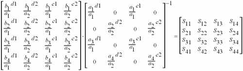

Legend:

d1: differential stimulus in balanced port 1.

d2: differential stimulus in balanced port 2

c1: common stimulus in balanced port 1.

c2: common stimulus in balanced port 2.

## Using iTMSA

A Standard (default) S-Parameter channel is used for iTMSA measurements.

#### How to create an iTMSA trace:

  1. Preset the VNA
  2. Then do the following:

  
---  
Using Hardkey/SoftTab/Softkey  
  
  1. Press Meas > Balanced > Topology....

  
  
Balanced DUT Topology / Logical Port Mapping (with iTMSA Option S9x460A/B)
dialog box  
---  
Learn about iTMSA.

### Topology

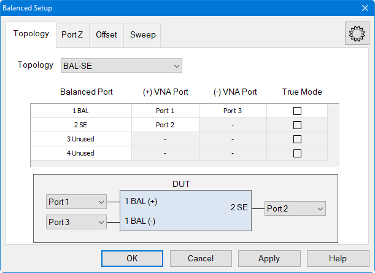 The following topologies are
available in True Mode Stimulus.

  * **BAL** DUT has a single balanced port. 
  * **BAL-BAL** DUT has two balanced ports. 
  * **BAL-SE** DUT has one balanced port and one single-ended port. 
  * BAL-SE-SE \- DUT has one balanced port and two single-ended ports.
  * **SE-BAL** DUT has one single-ended port and one balanced port. 
  * SE-SE-BAL \- DUT has two single-ended ports and one balanced port.

  * All SE  
(Changes all entries to Single-ended)

  * All BAL  
(Changes all entries to Balanced)

  * All Unused (Changes all entries to Unused) This is a convenience feature to help set up custom topologies, but it is not possible to have only Unused ports. If the OK button is clicked and all ports are listed as Unused, the topology will be set up to have 1 SE Port.
  * Custom  
(Maps the physical VNA ports to a device of balanced and single-ended logical
ports for multi-port systems with greater than 4 ports.)

A balanced port can be any one of four physical port combinations: 1 - 3 1 - 4
2 - 3 2 - 4

### Port Z

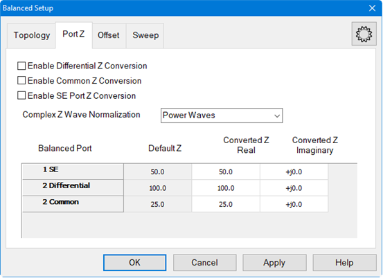 Provide an enable for
both Common and Differential Conversion and SE Port Z Conversion.  Complex Z
Wave Normalization \- Selects the wave normalization method. Power Waves \-
Waves are computed according to Kurokawa's power wave definition. Traveling
Waves \- Waves are computed according to a traveling wave definition. Balanced
Port Shows all ports defined on the balanced topology page.  Default Z Shows
the default impedances that will be applied if the port Z conversions are not
enabled. The SE Default Z always equals the System Zo defined for the VNA. The
Differential and Common Default Z will display values calculated from the
single-ended port impedances. Converted Z User may enter the real or imaginary
component of the impedance. 
Warning Dialog The dialog is displayed if "Conversion" is enabled and "Apply
Fixtures" is currently disabled.

### Offset

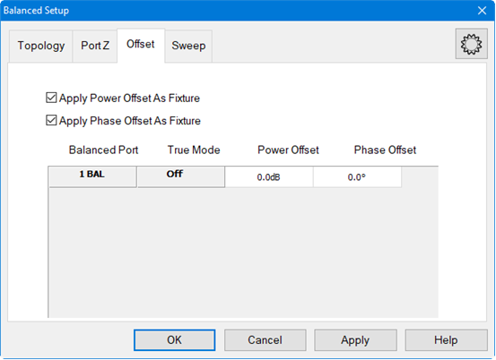 Balanced Port Set the
phase or power offset for the balanced port.  True Mode Shows whether True
Mode is On or Off. Power Offset Specify power offset. Range is +/- 20 dB. This
is in addition to the power level that is specified using the [Power and
Attenuators dialog](iTMSA.htm#Power). Offset Power is NOT reflected on the
power dialog nor on the X-Axis during a power sweep. A power offset may only
be applied to a True Mode port. Apply Power Offset as Fixture When unchecked,
output calculations are performed and displayed as though there is no stimulus
power offset. When checked, output calculations are performed and displayed
using the power offset that is applied to the DUT. Use this setting to
compensate for a component or fixture that may present a magnitude loss before
the DUT. Phase Offset Specify offset for the balanced INPUT port. This is in
addition to the standard offsets, which are 180° offset for the differential
stimulus sweeps, and 0° for the common stimulus sweeps. A phase offset may
only be applied to a True Mode port. Apply Phase Offset as Fixture When
unchecked, output calculations are performed and displayed as though there is
only the standard offset. Although additional Phase Offset is applied to the
stimulus, it is ignored in the calculations of balanced differential and
common mode output signals. When checked, output calculations are performed
and displayed using the actual phase offset that is applied to the DUT. Use
this setting to compensate for a component or fixture that may present a phase
delay before the DUT.

### Sweep

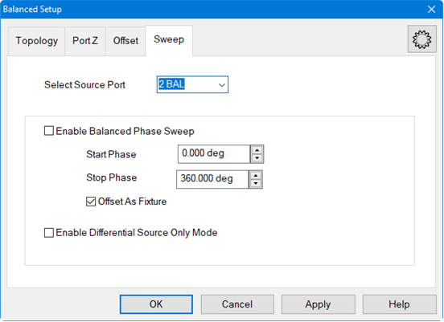

  * Available only when [Sweep type](../S1_Settings/Sweep.md#SweepTypeDiag) = CW.
  * Available ONLY for balanced pairs.

The phase of the selected active source port is swept relative to the phase of the other source port in the balanced pair. The active source port uses the logical port number. Phase Sweep is similar to phase offset, except that for each data point, the phase 'offset' is incremented. For example, with the topology that is selected in the above image: (Bal-Bal) Logical port 1 = VNA ports 1 and 3. For a phase sweep with 7 data points, from 0° to 180°, the phase difference between port 1 and port 3 increments 30° with each data point: | Data point | 1 | 2 | 3 | 4 | 5 | 6 | 7  
---|---|---|---|---|---|---|---  
Delta phase | 0° | 30° | 60° | 90° | 120° | 150° | 180°  
  
Enable Balanced Phase Sweep Check to enable phase sweep for the specified
port. If enabled and the VNA sweep type is not CW, the following dialog is
displayed to turn on CW Sweep Type.

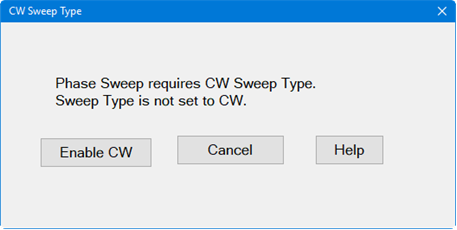

Start / Stop Phase Enter phase values in degrees. Each sweep will start and
stop at these settings.

Offset as Fixture

In the following image, the VNA phase sweep is shown as a phase shifter that
is "virtually" located EITHER before the reference receiver (top) OR after the
reference receiver (bottom) - NOT BOTH. This image is useful as a model ONLY.

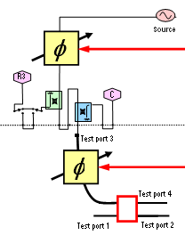 | NOT checked - The phase shift occurs at each data point and the reference receiver measurement sees the same phase shift as the DUT. The response is measured as though a true phase sweep is stimulating the differential input to the DUT. | 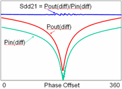  
---|---|---  
Checked - The phase shift occurs at each data point, but the reference receiver measurement does NOT see the shift. Use this setting to compensate for a component or fixture that may present a phase shift before or after the DUT. | 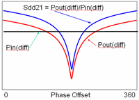  
  
Note: Beginning with firmware version A.14.00, the Enable Differential Source
Only Mode feature has been changed to a SCPI-only feature.

### One use for Phase Sweep

Do the following to find the best operating point:

  1. Phase sweep port 3, from 0° to 180°. Note the peak of Sdd21. This finds the phase offset of the input differential port. 

  2. Set port 3 fixed offset to the phase that has the highest Sdd21.

  3. Then, phase sweep port 4 (balanced port 2) to find the phase offset of the output differential port.

  4. Then set the port 4 to fixed phase offset found. 

This measures the best possible case Sdd21 for the DUT.  
  
### Power and Attenuators Settings

Set stimulus power levels using the standard VNA Power and Attenuators dialog.

To set power, press Power > Main > Power and Attenuators....

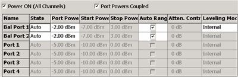

Power and Attenuation (with True Mode Stimulus) dialog box help  
---  
When a True Mode Stimulus is selected in the [Balanced DUT Topology
dialog](iTMSA.htm#BalancedTopDiag), the balanced ports are shown on the top
rows of the dialog. The individual VNA port settings are displayed but can not
be changed directly. Port Powers Coupled Check to couple all power settings
for Balanced Port 1 and Balanced Port 2. Clear this box to make independent
power settings for these logical ports. State Should be left in Auto for iTMSA
measurements. [Learn more about his
setting.](../S1_Settings/Power_Level.htm#Advanced) Port Power Set power for
the balanced port. Power for VNA ports, shown below balanced ports, are set to
3 dB less, or half power. [Power Offset](iTMSA.md#Offset) is made in addition
to this setting, and on only VNA port 3 and port 4. Offset Power is NOT
reflected on this dialog nor on the X-Axis. Start and Stop Power Available
when sweep type is set to [power sweep](../S1_Settings/Sweep.md#power). Auto
Range Check to allow the VNA to select the [optimum attenuation
value](../S1_Settings/Power_Level.htm#Optimum) to achieve the specified test
port power. Clear to manually set the attenuation for each port. Type or
select the attenuation value in the adjacent Attenuator Control box. When the
attenuator setting of a logical port is changed, then the attenuators of the
VNA ports associated with that logical port change to the same value. Leveling
Mode Open Loop leveling is available only on ports 1 and 3. [Learn
more.](../S1_Settings/Power_Level.htm#Leveling) Note: The range of leveled
power (ALC range) for balanced ports is 3 dB higher than it is for each
individual VNA port. For example, if a VNA source port with 0 dB attenuation
will supply leveled power from -30dBm to +15dBm, then the balanced logical
port has a range of -27dBm to +18dBm. [Learn more about Leveled
Power.](../S1_Settings/Power_Level.htm#Unleveled)  
  
### Calibration with iTMSA

Note: Uncalibrated True Mode Stimulus are NOT at all accurate.

Perform or recall a SMART Cal exactly like any other 3 or 4-port cal.

Press Cal > Main > Other Cals > Smart Cal....

  * All Cals are performed as single-ended.

  * Supports all Fixturing and Port Extension features.

  * Supports [Guided Power Cal](../S3_Cals/Guided_Power_Calibration.md).

  * Supports [Enhanced Response Cal](../S3_Cals/Select_Cal.md#Enhanced) and [Source Power Cal](../S3_Cals/PwrCalibration.md#Source).

### Receiver Measurements

Any pair of receivers can be viewed as a ratio using the following dialog.

To select these measurements, press Meas > Receivers.

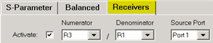

Create / Change Receiver Measurements (with True Mode Stimulus) dialog box
help  
---  
Click Activate

  * For RATIOED measurements, Select a receiver for the Numerator and select a receiver for the Denominator.
  * For UNRATIOED measurements, Select a test port receiver (A, B, C, or D) for the Numerator. Reference receiver measurements are NOT accurate. Select 1 for the Denominator.

For example, with a Bal-Bal topology, the above selections show a R3/R1
measurement. R (reference) receivers measure the stimulus to the DUT. An R3/
R1 trace shows the difference between the two sources that comprise logical
port 1. With Log format, a power offset between the two sources is visible.
With Phase format, a phase offset is visible. Source Port Specifies whether a
Differential stimulus or Common mode stimulus is used for the measurement.

  * With Source Port 1 or 2 selected, then Differential stimulus is used for the unratioed measurement which causes 180° offset between the sources.
  *     * Source Port 1 = Differential stimulus on BAL1 port
    * Source Port 2 = Differential stimulus on BAL2 port
  * With Source Port 3 or 4 selected, then Common mode stimulus is used for the unratioed measurement which causes 0° offset between the sources.

  * Source Port 3 = Common-mode stimulus on BAL1 port
  * Source Port 4 = Common-mode stimulus on BAL2 port

  
  
### Differential Input and Output Power Measurement

Equation Editor is used to calculate and display the Differential Input and
Output power levels.

This procedure assumes a Bal-Bal topology which requires the following port
assignments:

  * Balanced Port 1 = VNA ports 1 and 3

  * Balanced Port 2 = VNA ports 2 and 4

### Procedure

  1. Preset the VNA

  2. Perform a 4-port [Guided Power Calibration](../S3_Cals/Guided_Power_Calibration.md) if desired.

  3. Then press Trace, select Trace Setup, then select Receivers.

  4. Complete the dialog as follows, then click OK.  

  5. The above FIVE traces and the default (S11) trace should be visible on the VNA screen.

  6. Click Tr1 (S11). This is the 'dummy' trace that will become an equation trace.

  7. Then press Math > Analysis > Equation Editor....

  8. In the Equation field, enter (Tr2-Tr4) / sqrt(2)

  9. Press OK to close Equation Editor. The Tr1 trace is now showing Differential Output power.

  10. For Differential Input power, activate Tr3 (C receiver).

  11. In Equation Editor, enter (Tr5-Tr6) / sqrt(2). Press OK.

  12. The Tr3 trace is now showing Differential Output power.

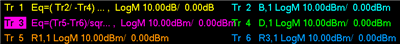  
The traces used to calculate and display Differential Input and Output Power

* * *

