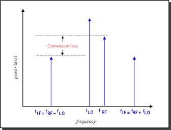
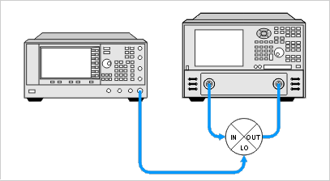
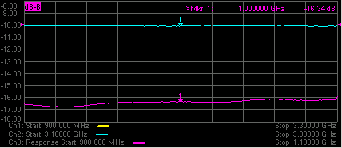

# Conversion Loss (or Gain)

* * *

  * [What is Conversion Loss?](Conversion_Loss.md#conv_loss_what_is)

  * [Why Measure Conversion Loss?](Conversion_Loss.md#conv_loss_why_meas)

  * [How to Measure Conversion Loss](Conversion_Loss.md#conv_loss_how_meas)

[See other Frequency Converting Device
Measurements](Frequency_Converting_Device_Measurements.htm)

What is Conversion Loss?

Conversion loss is defined as the ratio of the power at the output frequency
to the power at the input frequency with a given LO (local oscillator) power.
This is illustrated in the graphic below. A specified LO power is necessary
because conversion loss varies with the level of the LO, as the impedance of
the mixer diode changes.

Why Measure Conversion Loss?

Conversion loss (or gain in the case of many converters and tuners) is a
measure of how efficiently a mixer converts energy from the input frequency to
the output frequency. If the conversion loss response of a mixer or converter
is not flat over the frequency span of intended operation, valuable
information may be lost from the resulting output signal.

How to Measure Conversion Loss

Conversion loss is a transmission measurement. It is measured by applying an
input signal (stimulus) and an LO signal at specific known power levels, and
measuring the resulting output signal level. Because the output frequency is
different from the input frequency, [frequency
offset](Frequency_Offset_Mode.htm) mode (option S93080A) must be used for this
measurement.

Note: This measurement is made much easier if your VNA has the [Frequency
Converter Application](FCA_Use.htm)

### Equipment Setup

### Example: A calibrated Conversion Loss (Down-converter) measurement

### Swept Input with Fixed LO = Swept Output

  * RF Input: 3.1 - 3.3 GHz

  * LO: 2.2 GHz

  * IF Output: 900 - 1100 MHz

### VNA setup and calibrate on channel 1

  1. On channel 1 create an [unratioed](../S1_Settings/Measurement_Parameters.md#Unratioed_Power) R measurement over the ENTIRE input and output frequency span (.9 \- 3.3 GHz). This will be the base source power cal that will be copied to the R and B channel measurements.

  2. Perform a [source calibration](../S3_Cals/PwrCalibration.md#PerformSourcePowerCal) using a power meter. This makes the power level at the input of the mixer very accurate.

### Setup Reference measurement on channel 2

  1. [Copy channel](../S1_Settings/CopyChannels.md) 1 to channel 2 which will display the reference input to the mixer. The channel 1 source power cal is copied with the other channel settings.

  2. Change measurement to R1 unratioed. 

  3. Change RF Input frequency to 3.1 - 3.3 GHz. The source power cal becomes interpolated.

  4. Perform [receiver power cal](../S3_Cals/PwrCalibration.md#ReceiverPowerCal). Do not need to make physical connections. The VNA source is internally connected to the R1 receiver. Makes the R receiver read the source power level.

### Setup B measurement on channel 3

  1. Copy channel 1 to channel 3. This channel will display the output of the mixer. The channel 1 source power cal is copied with the other channel settings.

  2. Change measurement to B unratioed.

  3. Change IF Output frequency to .9 - 1.1 GHz. This causes the source power cal becomes interpolated.

  4. Connect thru line from port 1 to port 2.

  5. Perform receiver power cal. This makes the B receiver read the source power at the IF Output frequencies.

  6. [Turn OFF receiver power cal](../S3_Cals/PwrCalibration.md#ReceiverDiag). This prevents an error when changing to input frequencies (next step).

  7. Change RF Input frequency to 3.1 - 3.3 GHz. This changes the channel back to the mixer RF Input frequencies.

  8. [Enable Frequency Offset](Frequency_Offset_Mode.md#FreqOffsDiag).

  9. Change Offset to (-2.2 GHz). This tunes the B receiver to the IF Output frequencies .9 to 1.1 GHz. Note: The minus sign indicates a down-converter measurement.

  10. Turn ON receiver power cal.

### Measure the Mixer

  1. Connect the mixer.

  2. Adjust [scale](../S1_Settings/Scale.md) to suit your needs.

  3. Enable [markers](../S4_Collect/Markers.md) to read power levels for each trace.

The display below shows:

  * Ch3 B receiver (bottom trace) absolute output power.

  * Ch2 R1 receiver measurement (top trace) absolute input power to the mixer.

With this method, the conversion loss math (B/R1) can be performed with
[Equation Editor](../S4_Collect/Equation_Editor.md) (not shown). The B/R1
ratio measurement is not supported with receiver power Cal turned on. However,
conversion loss (C21) measurements can be made directly and are much easier
using the Frequency Converter Application, FCA (Opt S93083A/B).

