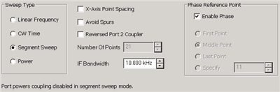
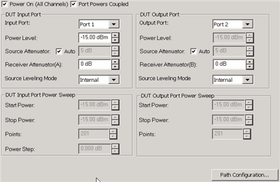
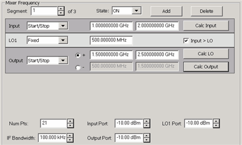
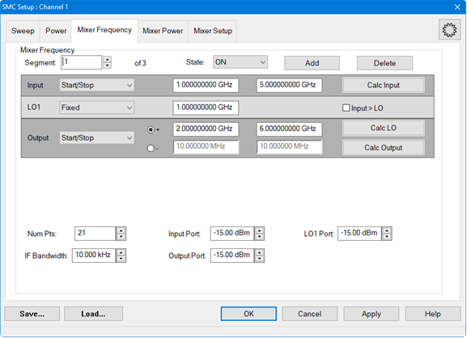
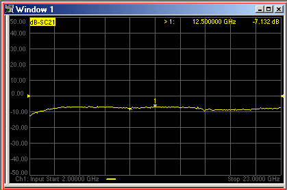

# Frequency Converter Application

* * *

FCA includes both Scalar (SMC) and Vector (VMC) measurements and calibrations.

In this topic:

  * [FCA Options Explained](FCA_Use.md#FCAOptions)

  * [Comparison of VMC and SMC](FCA_Use.md#Comparison)

  * SMC Overview

  * [Requirements and Limitations](FCA_Use.md#Requirements)

  * [How to make SMC or VMC Measurements](FCA_Use.md#procedure)

  *     * Create a Measurement

    * [Make Measurement Settings](FCA_Use.md#HowSettings)

    *       * [Sweep Tab](FCA_Use.md#SweepTab)

      *         * [Segment Sweep](FCA_Use.md#SegmentSweep)

      * [Power Tab](FCA_Use.md#PowerDiag)

      * [Mixer Setup Tabs](../Applications/MixerConverter_Setup.md) (separate topic)

      * [Select X-axis Display](FCA_Use.md#Xaxis)

      * [Save Trace Data](FCA_Use.md#Save)

      * [Avoid Spurs](FCA_Use.md#Avoid)

### See Also

  * [SMC Measurements and Calibrations](SMC_Measurements.md)

  *     * [SMC + Phase](SMC_plus_Phase.md)

  * [VMC Measurements and Calibrations](VMC_Measurements.md)

  * [Configure an External LO Source](../System/Configure_an_External_Device.md)

  * [SMC with a Booster Amp](SMC_with_a_Booster_Amp.md)

  * [Measure a DUT with an Embedded LO](../Applications/Embedded_LO.md)

  * For a detailed understanding of FCA, see our [Mixer Measurements App Notes](../Tutorials/App_Notes.md).

### Examples

  * [How to make a VMC Measurement](How_to_make_a_VMC_Fixed_Out_measurement.md)

  * [How to make an SMC Measurement](How_to_make_an_SMC_Fixed_Output_Measurement.md)

[Other Application topics](../Applications/Applications.md)

## FCA Options Explained

  * Option S93083A/B provides FCA which includes [Scalar Mixer (SMC)](SMC_Measurements.md) and [Vector Mixer (VMC)](VMC_Measurements.md) Measurements.

  * Option S93082A/B provides ONLY SMC measurements. This is the ONLY FCA option that is allowed on the N5230C.

  * Option S93084A/B provides [Embedded LO](../Applications/Embedded_LO.md) measurements. This option requires one of the [Converter Applications](../Applications/MixerConverter_Setup.md).

  * [See all PNA-X Options and Configurations](../Support/Configurations.md).

## Comparison of SMC and VMC

| Scalar Mixer Calibration [See Hardware setup](SMC_Measurements.md#HardwareSetup) | Vector Mixer Calibration [See Hardware setup](VMC_Measurements.md#HardwareSetup)  
---|---|---  
Overview | Provides highest Scalar accuracy for measurements of conversion loss/gain. [Optionally measures phase](SMC_plus_Phase.md#SMCPhase) Combines SOLT and power-meter calibration. Simpler setup than Vector Mixer Calibration. | Provides unparalleled accuracy for measurements of relative phase and absolute group delay. Uses combination of SOLT standards and a reciprocal mixer/filter pair during calibration. More complicated setup and calibration procedure than Scalar Mixer Calibration. After calibration, both reciprocal and non-reciprocal mixers and converters can easily be measured.  
Measurements Offered | Both forward and reverse directions. DUT can be connected to any VNA ports. | Amplitude response VC21 Phase response Group delay DUT input must be connected to VNA port 1. DUT output can be connected to any other VNA port.  
Equipment Required | Power meter and sensor | [Reference mixer](VMC_Measurements.md#Reference) [Calibration mixer/filter](VMC_Measurements.md#calibrationMixer) combination (must be reciprocal S21 = S12.)  
Common equipment for both SMC and VMC

  * Mechanical cal kit or ECal module

  
  
[See Comparison of Mixer Characterization using New Vector Characterization
Techniques](http://literature.cdn.Keysight.com/litweb/pdf/5988-7827EN.pdf).

### Requirements and Limitations

The following VNA features are NOT available with FCA:

  * Analog Sweep ([Stepped sweep](../S1_Settings/Sweep.md#SweepSetupDiag) mode only)

  * [Log frequency](../S1_Settings/Sweep.md#SweepTypeDiag) sweeps

  * [ECal User Characterization](../S3_Cals/ECal_User_Characterization.md) (can NOT be created in FCA channel)

  * [Time Domain](../Time/TimeDomain.md)

  * [Balanced measurements](../S1_Settings/Balanced_Measurements.md)

  * [Port extensions](../S3_Cals/Port_Extensions.md)

  * Some Fixturing Features

  * [External Test Set Control](../System/External_Testset_Control.md) (Option S93551A/B)

  * [PMAR (Power Meter As Receiver)](../System/Configure_a_Power_Meter_As_Receiver.md)

## How to make SMC or VMC Measurements

The following is an overview of how to make an FCA measurement:

  1. DECIDE to use either a SMC or VMC measurement. [See a comparison of these two measurement types](FCA_Use.md#Comparison).

  2. CREATE an SMC or VMC Measurement.

  3. [SETUP](FCA_Use.md#HowSettings) the measurements.

  4. CALIBRATE your SMC or VMC measurement.

### Create an SMC or VMC Measurement

  1. Press Setup > Main > Meas Class....

  2. Select SMC or VMC, then either:

  1.      * OK delete the existing measurement, or

     * New Channel to create the measurement in a new channel.

  3. The default SMC or VMC measurement is displayed.

  4. See [SMC measurements](SMC_Measurements.md#offered) or [VMC measurements](VMC_Measurements.md#offered) to learn about the parameters that are offered in each.

### How to make SMC or VMC settings  
  
---  
  
### Using Hardkey/SoftTab/Softkey

| Using a mouse  
  
  1. Press Freq > Main > SMC Setup... or VMC Setup....

|

  1. Click Stimulus
  2. Select Frequency
  3. Select SMC or VMC Frequency...

  
  
  
## Valid Mixer Configuration / Sweep Type Combinations

Configuring the SMC and VMC Setup dialog can be challenging at first. RED
messages like this one appear at the bottom of the Setup dialog to notify you
of an invalid setup.

At least one range (Input, LO, or Output) MUST be Fixed.

The following are the Valid Mixer Configurations:

Sweep Type | Input | LO | Output  
---|---|---|---  
Linear | Swept | Swept | Fixed  
Swept | Fixed | Swept  
Fixed | Swept | Swept  
CW Time Power | Fixed | Fixed | Fixed  
  
### Tips

Although you will soon become comfortable navigating these tabs, at first it
may be best to complete the dialog in the following order:

  1. For 2-stage mixers, select [Mixer Setup](../Applications/MixerConverter_Setup.md#MixerSetupTab) settings.
  2. Select [Sweep tab](FCA_Use.md#SweepTab) settings.
  3. Select [Mixer Frequency](FCA_Use.md#MixerFreqTab) settings.
  4. Select [Power](FCA_Use.md#PowerDiag) settings.
  5. Select [Mixer (LO) Power](FCA_Use.md#MixerPowerTab) settings.

  
---  
  
The following FCA settings are common to VMC and SMC:

Sweep Tab - SMC and VMC dialog box help  
---  

### Sweep Type

Linear Sweep frequency. Measurements are displayed on a standard grid with ten
equal horizontal divisions. Learn how to [select the range to display on the
X-Axis](FCA_Use.htm#Xaxis). CW Time All ranges are set to a Fixed (CW)
frequency, and the data is displayed versus time. Segment Sweep Sweep user-
defined segments. [Learn more.](FCA_Use.md#SegmentSweep) Power Sweep Input or
LO power. X-axis Point Spacing (Available only with Segment Sweep) - [Learn
about this feature](../S1_Settings/Sweep.htm#X-AxisPoint) Avoid Spurs \- Learn
about this feature. Reversed Port 2 Coupler (SMC ONLY) Check when making SMC
measurements with the Port 2 coupler reversed. [Learn
how](Phase_Reference_Calibration.htm#Setup). Do this to increase power at low
frequencies. Checking this box has the following effects:

  * The measurement is faster because Reduce IFBW is no longer performed on SC21 measurements.
  * The SMC Calibration no longer attempts to level the Port 2 power (it is not possible to level the power through the coupler at those low frequencies). This keeps the VNA from producing “source unleveled” errors on Port 2.

Number of Points [Learn about this feature](../S1_Settings/DPoints.md). IF
Bandwidth [Learn about this
feature.](../S2_Opt/Trce_Noise.htm#Variable_IF_Bandwidth)

### Phase Reference Point (SMC ONLY) [Learn about this
feature.](SMC_plus_Phase.htm#SMCPhase)  
  
 [Learn about these
buttons.](../Applications/MixerConverter_Setup.htm#AboutMxr)  
  
Power Tab - SMC and VMC dialog box help  
---  
Note: Set LO Power on the [Mixer (LO) Power
tab](../Applications/MixerConverter_Setup.htm#MixerPowerTab).
 Configures Input and Output power
settings for an FCA measurement. Use the [Mixer Power
tab](FCA_Use.htm#MixerPowerTab) to set LO power. Power ON (All channels) Check
to turn RF Power ON or clear to turn power OFF for all channels. Port Powers
Coupled Check to set the same power level at the DUT Input and Output ports.
The LO power is NOT coupled. Clear to set power levels independently for each
test port. Uncouple power, for example, to apply more power in the reverse
direction than in the forward direction Learn more about [Setting Independent
Port Power](../S1_Settings/Power_Level.htm#Atten_Uncpld_Ports)

### DUT Input / Output Port

Select the VNA port that is connected to the DUT Input and Output. For VMC,
the DUT input must always be connected to VNA port 1 because of the need for a
[reference mixer](VMC_Measurements.md#Reference) on port 1. Power Level Set
the power level to the DUT Input port. To set power at the Output port, clear
the Port Powers Coupled checkbox. Source Attenuator Auto Check to
automatically select the correct attenuation to achieve the specified input
power. Clear, then select attenuator setting that is used achieve the
specified Power Level. [Learn more about Source
Attenuation.](../S1_Settings/Power_Level.htm#Source_Atten) All VNA channels in
continuous sweep must have the same attenuation value. [Learn
more.](../S1_Settings/Power_Level.htm#Atten_Uncpld_Ports) Receiver Attenuator
Specifies the receiver attenuator setting for the DUT port. Source Leveling
Choose from: Internal (normal operation), Open Loop (used only for Wideband
Pulse measurements), or Receiver \- R1 for [Receiver
Leveling](../S1_Settings/Receiver_Leveling.htm).

### DUT Input and Output Port Power Sweep

Available when Power (sweep) is selected on the [Sweep
tab](FCA_Use.htm#SweepTab). Input Start and Stop Power To set Start and Stop
power at the Output port, clear the Port Powers Coupled checkbox. Note: If
your DUT requires more input power than this setting allows below 3.2 GHz, use
the PNA-X Hi-power mode, available from the [RF Path
Configuration](../S1_Settings/Path_Configurator.htm) dialog. The disadvantage
to this is higher harmonic content. Power Points Number of power points to
measure. Power Step (Size) Calculated value from current Start, Stop, and
Points settings. This setting can NOT be changed directly. Path Configuration
click to launch the [RF Path
Configuration](../S1_Settings/Path_Configurator.htm) dialog.  
 [Learn about these
buttons.](../Applications/MixerConverter_Setup.htm#AboutMxr)  
  
The following tabs are shared with all [Mixer / Converter
Applications](../Applications/MixerConverter_Setup.htm):

  * [Mixer Frequency tab](../Applications/MixerConverter_Setup.md#MixerFreqTab)

  * [Mixer (LO) Power tab](../Applications/MixerConverter_Setup.md#MixerPowerTab)

  * [Mixer Setup tab](../Applications/MixerConverter_Setup.md#MixerSetupTab)

Mixer Frequency tab \- SMC and VMC Setup -dialog box help  
---  
  
### 

[Learn about this
dialog](../Applications/MixerConverter_Setup.htm#MixerFreqTab)  
  
Mixer Setup tab - SMC and VMC Setup -dialog box help  
---  
 [Learn about this
dialog](../Applications/MixerConverter_Setup.htm#MixerSetupTab)  
  
Mixer (LO) Power tab \- SMC and VMC Setup -dialog box help  
---  
 [Learn about this
dialog](../Applications/MixerConverter_Setup.htm#MixerPowerTab)  
  
## FCA Segment Sweep

The following settings appear on the Mixer Frequency tab when Segment Sweep is
selected on the [Sweep tab](FCA_Use.md#SweepTab).

Mixer Frequency tab - Segment Sweep - SMC and VMC dialog box help  
---  

### How to configure a segment using the GUI:

  1. Click Add. Click Delete to remove a segment and renumber all subsequent segments.
  2. State is ON by default. Click OFF and that segment will not be included in the sweep.
  3. Configure Frequency settings for Input, LO, and Output ranges.

  * For each segment, the same [sweep requirements](FCA_Use.md#ValidSweep) apply as a standard (non-segment) sweep. For example, at least one range MUST be Fixed (Start = Stop frequencies).
  * The Input, Output, and LO frequencies of segments ARE allowed to overlap other segments.
  * All segments must sweep in either the forward (Start<Stop) or reverse (Start>Stop) directions. Mixed sweep directions are NOT allowed.
  * The following settings can be set independently for each segment:
  *     * [Number of Points](../S1_Settings/DPoints.md) \- Total number of points for all segments is limited to the [Max allowed by the VNA](../S1_Settings/DPoints.md#PointsDiag).
    * [IF Bandwidth](../S2_Opt/Trce_Noise.md#Variable_IF_Bandwidth)
    * Port Powers: (Input, Output, LO 1, LO2). These settings override the settings on the [Power tab](FCA_Use.md#PowerDiag).

  * The following settings apply to ALL segments:
  *     * Number of Converter/Mixer Stages (1 or 2).
    * LO Source Selections
    * [All Input and LO Multipliers and Dividers](../Applications/MixerConverter_Setup.md#Multplier)
    * [Source and Receiver Attenuator Settings](FCA_Use.md#PowerDiag)
    * [Source Leveling](FCA_Use.md#PowerDiag)
    * [Avoid Spurs](FCA_Use.md#Avoid)
    * [Nominal Incident Power](SMC_Measurements.md#UseNominal) (SMC only)
    * [X-Axis Display](FCA_Use.md#Xaxis) (Input, LO1, LO2, Output) There must be at least two data points for this setting to be available.
    * [X-Axis Point Spacing](../S1_Settings/Sweep.md#X-AxisPoint) (vs Normal point spacing).
    * [SMC \+ Phase](SMC_plus_Phase.md#SMCPhase)
  * Mixer Segment sweep data can be saved to a *.S2PX file (NOT *.S2P).
  * Mixer Segment setup information is saved to a *.MXRX or *.CSV file. [Learn more](../Applications/MixerConverter_Setup.md#AboutMxr).

### How to add multiple segments using the GUI and Excel *.csv file:

Start with the GUI to set up mixer settings and to create the first segment
then save it as a *.csv file. The *.csv file will then be opened in Excel and
the additional segments will be entered. [Learn
more](../Applications/MixerConverter_Setup.htm#CSV_Files).

  1. Click Add.
  2. State is ON by default. Click OFF and that segment will not be included in the sweep.
  3. Configure Frequency settings for Input, LO, and Output ranges.
  4. Click on the Save... button.
  5. Select CSV (Comma delimited) (*.csv) to save the settings and first segment to a *.csv file.
  6. Open the *.csv file in Excel.  
  

  7. Highlight the segment row then copy it.
  8. Paste the copied segment row to add the desired number of segments into the Excel file.
  9. Modify the settings for each added segment as necessary. The following is an example showing 3 segments:  
  

  10. Save the *.csv file.
  11. In the GUI, load this *.csv file.  
  

  
 [Learn about these
buttons](../Applications/MixerConverter_Setup.htm#AboutMxr)  
  
## Apply and Interpolate FCA Cal Sets

In general, when a Cal Set covers a wider frequency range than the channel,
the VNA will offer to interpolate the Cal Set when it is applied. [Learn
more.](../S3_Cals/Cal_Sets.htm#ApplyingCalSet) However, with FCA measurements
the LO frequency range may also be considered.

  * [VMC measurements](VMC_Measurements.md) ALWAYS CONSIDER the LO frequency range and performs interpolation if possible. If the LO frequency range of the measurement is NOT within the LO frequency range of the Cal Set, than the Cal Set can NOT be applied.

  * [SMC measurements](SMC_Measurements.md) ALWAYS IGNORE the LO frequency range. Therefore, if the Input and Output frequency ranges of the measurements are within those of the Cal Set, then the Cal Set is interpolated if necessary and applied. For example, this would allow you to perform ONE SMC calibration with Input range = the VNA frequency span, LO at 0 Hz, and Output range \+ the VNA frequency span. This Cal Set could be applied to ALL SMC measurements. [Learn more about applying SMC Cal Sets.](SMC_Measurements.md#Apply)

These same general concepts apply to [segment
sweeps](FCA_Use.htm#SegmentSweep). However, if ALL applicable frequency ranges
(SMC: Input and Output and VMC: Input, Output, and LO) are NOT within those
ranges of the measurement for ONE segment, then the Cal Set is NOT applied for
ANY segment.

## Select X-axis Display for FCA Measurements

Click Sweep > Main > X-Axis Type, then select the desired type.

When Sweep Type = Linear, you can choose to show the frequency range of any of
the swept parameters on the X-axis.

For example, the following image shows an SMC Fixed Output response with the
Input frequency range on the X-axis:

Output: 100 MHz (data trace)

Input: 2 GHz to 23 GHz (X-axis)

LO: 1.9 GHz to 22.9 GHz (not shown)

Marker annotation shows Output power at Input frequency.

Save Trace Data

You can save your FCA measurement data in several standard formats.

Click Save Recall > Save Other > Save Data....

The following shows how CSV and SNP files are saved.

### Mixer Trace Data

When you select Mixer Trace Data, the FCA data is saved to a CSV file in the
following format:

#MIXER TRACE FILE,A.01.00

SegIndex, InputFreq, OutputFreq, LO1Freq, InputPower, LO1Power, SC21 Mag (dB),
SC21 Phase (Deg)

### SNP Format

Each record contains 1 stimulus value and 4 parameters (total of 9 values) as
follows:

Stim Real(p1) Imag(p1) Real(p2) Imag(p2) Real(p3) Imag(p3) Real(p4) Imag(p4)

where pX is the parameter depending on measurement type:

Measurement Type | p1 | p2 | p3 | p4  
---|---|---|---|---  
Scalar | S11 | SC21 (FWD) | SC12 (REV) | S22  
Vector | S11 | VC21 | VC12 | S22  
Mixer Characterization | Directivity | Source Match | Reflection Tracking | M21  
  
  * If correction is OFF, data is only saved for the active parameter. Zeros are saved for all other parameters.

  * If correction is ON, data is saved for all of the parameters.

All files contain the following Header Information: Brackets [ ] contain
parameters.

!Keysight [Instrument Model Number]: [version]  
!Mixer S2P File: [Mixer Measurement Type]  
!Parameters: [Parameter List]  
!Calibration State: [On/Off]  
  
!# Begin Mixer Setup  
![Mixer Setup parameters listed here]  
![Mixer Parameter 1]  
.  
.  
![Mixer Parameter n]  
!# End Mixer Setup  
  
# [S2P data here]

Avoid Spurs

On the [Mixer Setup](../Applications/MixerConverter_Setup.md#CM) dialog box,
check Avoid Spurs

The Avoid Spurs feature of the Frequency Converter Application attempts to
prevent unwanted mixing products from appearing on the VNA screen. The Avoid
Spurs feature does not significantly impact measurement speed.

Note: The Avoid Spurs feature is OFF by default for FCA calibrations. For
highest accuracy, make measurements with the Avoid Spurs feature at the same
state (ON or OFF) as was used when calibrating.

### Description

A spur, or spurious signal, is a term used to describe the unwanted product of
two signals mixing together. When you configure the mixer setup dialog box for
a desired Output, the VNA computes the frequencies of potential unwanted
signals. By manipulating internal VNA hardware, these signals are avoided and
do not appear on the VNA display. This means you do not need to use external
filters to prevent spurious signals from appearing on the VNA display.

The time required for the VNA to compute the frequencies of unwanted spurious
signals MAY be noticeable depending on the number of data points in your
measurement. However, once computed, the time required for the VNA to avoid
the spurs is usually insignificant.

### Limitations

The Avoid Spurs utility cannot avoid every spur. However, when there is a
choice of spurs to avoid, it will avoid the largest spur.

### The Computation of Avoided Spurs

The Avoid Spur computer avoids the following spurs:

  * LO, and its interaction with internal VNA components, and 16 of its harmonics.

  * Input frequencies and 16 of its harmonics.

  * Undesired Image frequencies (Sum or Difference) and 16 of its harmonics.

* * *

