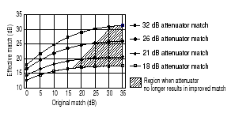
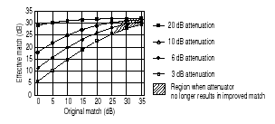

# Frequency Offset Measurement Accuracy

* * *

This topic discuss methods that can be used to make accurate frequency offset
measurements.

  * [Calibrations](Frequency_Offset_Calibration.md#Calibrations)

  * [Mismatch Errors](Frequency_Offset_Calibration.md#Mismatch)

  * [Accurate and Stable LO](Frequency_Offset_Calibration.md#Accurate)

[See other Mixer Measurement
topics](Frequency_Converting_Device_Measurements.htm)

Calibrations

With Frequency Offset measurements, the stimulus and response frequencies are
different. Standard calibration error terms are calculated using reference
measurements. Therefore, traditional calibration methods such as full 2-port
SOLT cannot be used with frequency offset.

[Source and Receiver Power calibrations](../S3_Cals/PwrCalibration.md) can be
used to calibrate your Frequency Offset measurements.

[Frequency Converter Application](FCA_Use.md) offers fully calibrated scalar
and vector frequency offset measurements.

### Source Power calibration:

  * Sets accurate power level at stimulus frequencies regardless of the receiver that will be used in the measurement.

  * Can be copied to other channels with copy channels feature.

  * Can be interpolated.

### Receiver Power Cal:

  * Requires a source cal to have already been performed and applied.

  * Cannot be copied to other channels.

### Therefore:

  * Start by performing a [source power cal](../S3_Cals/PwrCalibration.md#SourcePowerCal) over the combined stimulus and response frequencies.

  * [Copy the channel](../S1_Settings/CopyChannels.md) to other needed channels and the source power cal is copied.

  * Change the frequency range of the copied channel to response frequencies.

  * Perform a [receiver cal](../S3_Cals/PwrCalibration.md#ReceiverPowerCal) at the response frequencies on individual channels.

  * Change the frequency range to stimulus frequency and switch [frequency offset ON](Frequency_Offset_Mode.md#FreqOffsDiag).

  * On [Status Bar](../S3_Cals/Quest_Cal.md#validate), ensure that source and receiver cals are ON (source cal will be interpolated).

See [Frequency Offset Conversion Loss Measurements](Conversion_Loss.md) to
see a step-by-step example.

Mismatch Errors

Mismatch errors result when there is a connection between two ports that have
different impedances. With S-parameter measurements, these mismatches are
measured and mathematically removed during a full 2-port calibration. This is
much more difficult with frequency offset measurements. A much easier solution
is to use high-quality attenuators on the input and output of the mixer.

By adding a high-quality attenuator to a port, the effective port match can be
improved by up to twice the value of the attenuation. For example, a 10-dB
attenuator, with a port match of 32 dB, can transform an original port match
of 10 dB into an effective match of 25 dB. However, as the match of the
attenuator approaches the match of the original source, the improvement
diminishes.

Note: The Frequency Converter Application (option S93083A/B) uses calibration
techniques that correct for mismatch errors.

The larger the attenuation, the more nearly the resulting match approaches
that of the attenuator, as shown in the following graphic. However, excessive
attenuation is not desired because that will decrease the dynamic range of the
measurement system.

Accurate and Stable LO

When using frequency offset mode, if the LO signal is not accurate and stable,
the output signal will not be at the expected response frequency. As a result,
the output signal can fall on the skirts of the VNA receiver IF filter, or
fall completely outside of the receiver filter passband.

Also, the LO power level is critical in mixer measurements. Be sure to monitor
these power levels closely.

