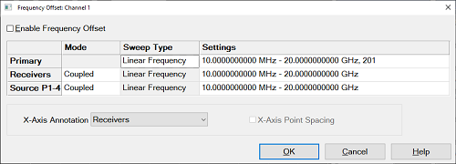
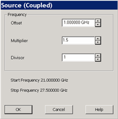
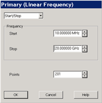

# Frequency Offset Mode

* * *

Frequency Offset Mode (FOM) provides the capability to have the VNA Sources
tune to frequencies that are different (offset) from the VNA Receivers.

VNA Option 080 or S9x080A provides you with the hardware and basic software
capability to make Frequency Offset Measurements. This topic discusses the VNA
settings that are relevant to making these types of measurements. See
[Frequency Converting Device
Measurements](Frequency_Converting_Device_Measurements.htm) for more
information on making specific device measurements.

  * [Frequency Offset Dialog Box](Frequency_Offset_Mode.md#FreqOffsDiag)

  * [Setup Examples](Frequency_Offset_Mode.md#Setup)

  * [ RF Path Config (Reference Switch) Dialog Box](Frequency_Offset_Mode.md#TestSet)

[Other Frequency Offset topics](Home_Frequency_Offset_Measurements.md)

#### How to make Frequency Offset settings  
  
---  
Using Hardkey/SoftTab/Softkey  
  
  1. Press Sweep > Source Control > Frequency Offset....

  
  
  
Frequency Offset dialog box help  
---  
 |  The following are major changes to FOM:

  * Stimulus and Response are now called Sources and Receivers.
  * Sources and Receivers settings can be made in two ways:

  1.      1. By Coupling to the Primary (Channel) settings. This is the only method used in previous releases.
     2. By Uncoupling and setting Sources and Receivers values independently. This is the new, simplified method.

  * External sources appear here and can be controlled from this dialog. [Learn more.](../System/Configure_an_External_Device.md)

  
---  
  
Note: Source2 supplies power for ports 3 and 4. Turn Source2 power ON using
the [Power and Attenuators dialog](../S1_Settings/Power_Level.md#Advanced).
This (Frequency Offset) is the only dialog for controlling the frequency of
Source 2. Learn more about [Source2](../S0_Start/Internal_Second_Source.md).

Note: Source3 is an RF signal to the rear-panel connector. Turn Source3 power
ON using the [Power and Attenuators
dialog](../S1_Settings/Power_Level.htm#Advanced). This (Frequency Offset) is
the only dialog for controlling the frequency of Source 3. Learn more about
[Source3](../Rear_Panel/XRtour.md#SRC3_Connector).

Frequency Offset (ON/OFF) Enables Frequency Offset Mode on ALL measurements
that are present in the active channel.

When FOM is NOT enabled, all frequencies are the same as the active channel.

Tip: First make other settings on this dialog box, then click Frequency Offset
ON.

Primary The current Active Channel settings. When a Source or Receiver is
coupled to the Primary settings, its Sweep Type is the same as that of the
Primary. The frequency settings of the coupled range are mathematically
derived from the Primary settings using the [Multiplier, Divisor, and Offset
values](Frequency_Offset_Mode.htm#Coupled). With this approach, only the
Primary settings need to be changed in order to affect change in the coupled
Sources and Receivers. Changes to the Primary channel settings occur when
Frequency Offset is checked ON. [See example using Primary and Coupled
setting](Frequency_Offset_Mode.htm#PowerSweep).

Tip: Primary settings are ONLY used when Sources and Receivers are Coupled. It
is often easier to Uncouple, then set Sources and Receivers independently.

Source and Source2 if available. [Learn more about Internal Second
Source](../S0_Start/Internal_Second_Source.htm).

Receivers All receivers that are used in the channel, including Reference
receivers, are tuned to the specified frequency settings.

Mode

Coupled Source and Receiver settings are mathematically derived from the
Primary settings using Multiplier, Divisor, and Offset values. [Learn
more.](Frequency_Offset_Mode.htm#Coupled)

Uncoupled Source and Receiver settings are entered independently, without
reference to Primary settings. When Uncoupled, Source and Receiver Ranges can
use separate sweep types.

Sweep Type Click to change the type of sweep for each range. Only available
for Primary and Uncoupled Sources and Receivers.

Unsupported Sweep Type combinations

  * Power Sweep and Segment Sweep can NOT be used together.
  * Uncoupled Log Sweep yields invalid data whenever the sources are offset from the receivers.
  * Coupled Log Sweep is allowed only for the following two conditions:

  1.      1. The offset = 0, the multiplier = 1, and the divisor = 1.
     2. The multiplier = 0

  
---  
  
Settings  To change settings, click IN the appropriate Settings cell, then
click Edit.

  * If coupled, invokes the [Coupled dialog.](Frequency_Offset_Mode.md#Coupled)

  * If uncoupled or Primary invokes the [Uncoupled settings dialog](Frequency_Offset_Mode.md#Uncoupled).

X-Axis Annotation Select the settings to be displayed on the X-Axis:

X-Axis Point Spacing Only available when a Segment Sweep Type is selected as
the X-Axis display. [Learn more.](../S1_Settings/Sweep.md#X-AxisPoint)

Note: When Frequency Offset is enabled, ALL receivers on the channel,
including the reference receivers, tune to the new offset frequencies,
Therefore the source and reference receiver will be at different frequencies.
Therefore, FOM measurements that include a reference receiver, which includes
all S-parameters, display invalid data. To measure and display measurements at
both the source and receiver frequencies, you must use two channels. Use
[Equation Editor](../S4_Collect/Equation_Editor.md) to calculate the
conversion loss. [See a calibrated FOM conversion loss
example.](Conversion_Loss.htm) [Learn how to calibrate frequency offset
measurements.](Frequency_Offset_Calibration.htm)  
---  
  
Coupled settings dialog box help  
---  
 Coupled Formulas: Range Start =
[Primary Start x (Multiplier / Divisor)] + Offset Range Stop = [Primary Stop x
(Multiplier / Divisor)] + Offset Where: Offset Specifies an absolute offset
frequency in Hz. For mixer measurements, this would be the LO frequency. Range
is +/- 1000 GHz. Offsets can be positive or negative. Multiplier Specifies
(along with the divisor) the value to multiply by the stimulus. Range is +/-
1000.

  * Negative multipliers cause the stimulus to sweep in decreasing direction. For downconverter mixer measurements, this would be for setups requiring the Input frequency to be less than LO frequency. [See an example](Frequency_Offset_Mode.md#InputGTlo).
  * 0 (zero) as the multiplier nulls the Primary setting. Then the Offset value adds to zero.

Divisor Specifies (along with the multiplier) the value to multiply the
stimulus. Range is 1 to 1000.  
  
Primary and Uncoupled settings dialog box help  
---  
 This dialog will vary depending on
the sweep type:

### Linear and Log frequency

Uncoupled Log sweep yields invalid data whenever the sources are offset from
the receivers. Select Start/Stop or Center/Span Frequency Enter values Points
(Primary only) Enter number of data points for the sweep.

### Power

CW Freq Enter frequency in Hz. Points (Primary only) Enter number of data
points for the power sweep.

### CW Time

CW Freq Enter frequency in Hz. Sweep Time Enter time to complete one sweep.
Enter 0 for the fastest sweep.

### Segment Sweep Edits are made exactly like the [standard segment
table](../S1_Settings/Sweep.htm#segment).

For Advanced Users: Uncoupled Segment Sweep offers great flexibility in
configuring measurements. In segment sweep mode:

  * The OK button is NOT available until the total number of data points for all segments matches the number of Primary data points.
  * [Independent IF Bandwidth](../S1_Settings/Sweep.md#SegmentDiag) and [Independent Sweep Time](../S1_Settings/Sweep.md#SegmentDiag) are available ONLY on the Primary (channel) and the Uncoupled Receivers \- NOT Sources.
  * [Independent Power](../S1_Settings/Sweep.md#SegmentDiag) is available ONLY on the Primary (channel) and the Uncoupled Sources \- NOT Receivers.

  
  
Setup Examples

Although the Frequency Offset settings can be used with many types of devices,
these examples include mixer terminology.

[See a Mixer Compression and Phase (AM-PM) Measurement using
FOM](http://na.support.keysight.com/pna/help/Mixer_AM_PM_Procedure.pdf).

[See a calibrated FOM conversion loss example.](Conversion_Loss.md)

### 1.

|

### Fixed LO - Upconverter

  * Swept Stimulus (Mixer Input): 1000 MHz - 1200 MHz
  * Fixed LO: 1500
  * Swept Response (Mixer Output): 2500 MHz to 2700 MHz

Make the following settings on the FOM dialog Source: Uncoupled Sweep Type:
Linear Click Settings, then Edit. In the Source dialog: Start Frequency = 1000
MHz Stop Frequency = 1200 MHz Receiver: Uncoupled Sweep Type: Linear Click
Settings, then Edit. In the Receiver dialog: Start Frequency = 2500 MHz Stop
Frequency = 2700 MHz LO Settings Set external source to CW - 1500 MHz.
Source2: Uncoupled (Only with [Second VNA Internal
Source](../S0_Start/Internal_Second_Source.htm)) Sweep Type: CW Time Click
Settings, then Edit. In the Source2 dialog: CW Frequency = 1500 MHz  
---|---  
  
### 2.

|

### Fixed LO - Downconverter (Input < LO)

  * Swept INCREASING Stimulus (Mixer Input): 1000 MHz to 1100 MHz
  * Fixed LO: 2500 MHz
  * Swept DECREASING Response (Mixer Output) 1500 MHz to 1400 MHz

Make the following settings on the FOM dialog Primary: Not used Source
(Input): Uncoupled Sweep Type: Linear Click Settings, then Edit. In the Source
dialog: Start Frequency = 1000 MHz Stop Frequency = 1100 MHz Receiver
(Output): Coupled Sweep Type: Linear Click Settings, then Edit. In the
Receiver dialog: Offset: 2500 MHz Multiplier: -1 (Minus one) LO Settings

  * If using external source, set to CW: 2500 MHz.
  * If using Source2: Set to Uncoupled, then:

Sweep Type: CW Time Click Settings, then Edit. In the Source2 dialog: CW
Frequency = 2500 MHz [See a calibrated FOM conversion loss
example.](Conversion_Loss.htm)  
  
### 3.

|

### Swept LO - Fixed Output - Upconverter

Swept External LO measurements in Frequency Offset Mode can be very difficult.
The external LO source must be synchronized with the swept output or input (as
in this case). See [Synchronizing and External Source
Control](../Tutorials/Synchronize_an_External_PSG_Source.htm) to see how this
is done. The [Frequency Converter Application Opt S9x083A/B](FCA_Use.md)
performs makes these measurements easily.

  * Swept Stimulus (Mixer Input): 1000 MHz to 1100 MHz
  * Swept LO: 1500 MHz to 1400 MHz
  * Fixed Response (Mixer Output): 2500 MHz

Make the following settings on the FOM dialog Source: Uncoupled Sweep Type:
Linear Click Settings, then Edit. In the Source dialog: Start Frequency = 1000
MHz Stop Frequency = 1100 MHz Receiver: Uncoupled Sweep Type: CW Time Click
Settings, then Edit. In the Receiver dialog: CW Frequency = 2500 MHz LO
Settings

  * If using external source, set to sweep from 1500 - 1400 MHz.
  * If using Source2 ([Second Internal Source](../S0_Start/Internal_Second_Source.md)):set to Uncoupled, then:

Sweep Type: Linear Click Settings, then Edit. In the Source2 dialog: Start
Frequency = 1500 MHz Stop Frequency = 1400 MHz  
  
### 4.

|

### Power Sweep for Mixers

To measure the gain compression of a mixer, the input power to the mixer is
swept. The input and output frequencies are fixed but offset from one another.
This is a good use of Coupled settings because the same compression test can
be performed at several different frequencies. With coupled Source and
Receiver ranges, the Primary (channel) frequency can be easily changed from
the front panel. The coupled source and receiver frequencies will update
accordingly.

  * Swept Input Power: -10 dBm to 0 dBm
  * Fixed Input Frequency: 1500 MHz
  * Fixed LO: 500 MHz
  * Fixed Output: 2000 MHz

Make the following settings on the FOM dialog Primary: Sweep Type: Power Sweep
Click Settings, then Edit. In the Primary dialog: CW Frequency = 1500 MHz
Source: Coupled Default settings make CW Frequency: 1500 MHz (same as Primary)
Receiver: Coupled Default settings make Sweep Type: CW Time Click Settings,
then Edit. In the Receiver dialog: Offset = 500 MHz LO Settings

  * If using external source, set to CW: 500 MHz.
  * If using Source2 ([Internal Second Source](../S0_Start/Internal_Second_Source.md)),:set to Coupled, then:

Sweep Type: Power Sweep Click Settings, then Edit. In the Source2 dialog: CW
Frequency = 500 MHz  
  
Test Set Reference Switch

PNA-X and N522x models have a switch in the test set that allows you to bypass
the port 1 reference receiver through the front panel Reference 1 connectors.
This switch lets you easily switch between standard S-Parameter measurements
and measurements using a reference mixer. You could use this feature to make
standard S11 measurements and converter transmission measurements relative to
a reference ("golden") mixer.

Note: The Frequency Converter Application [Option
S93083A/B](../Support/Configurations.htm#options) simplifies the task of
making extremely accurate phase measurements on MOST frequency converting
devices.

#### How to access the RF Path Config dialog box  
  
---  
Using Hardkey/SoftTab/Softkey |  Using a mouse  
  
  1. Press Setup > Internal Hardware > RF Path Config....

|

  1. Click Instrument
  2. Select Setup
  3. Select Internal Hardware
  4. Select RF Path Config

  
  
  
RF Path Config dialog box help  
---  
 Note: This feature is
available on PNA-X and N522x models. R1 Input Path Internal Connects the port
1 source directly to the R1 receiver. External Allows direct access to the R1
receiver through the Reference 1 front-panel connectors. See
[specifications](../Specs/ManualChoice.md) which include a block diagram of
reference switch.  
  
* * *

