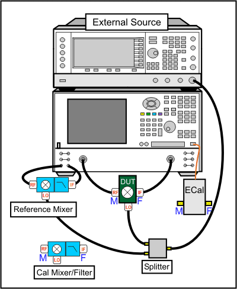
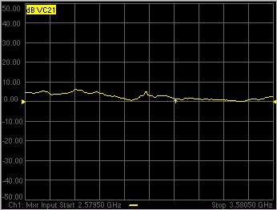
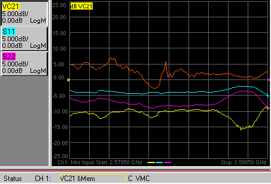

# How to make a VMC Fixed Output Measurement

* * *

The following is a step-by-step example illustrating how to measure a mixer in
swept LO mode using FCA Vector Mixer Calibration.

There are fewer components required for
[SMC](How_to_make_an_SMC_Fixed_Output_Measurement.md) as compared to VMC, and
fewer measurement steps. You can now make relative phase measurements with
SMC. Also, ONLY SMC (not VMC) can measure the reverse conversion loss of the
mixer.

This procedure can also be used for making fixed LO measurements, which is
quite similar. Although the LO source is still required, the physical
triggering cables that connect the VNA and External Source are not required.

### Required Equipment

  * PNA-X or VNA 'C' models

  *     * with option S93083A/B (FCA)

  * GPIB External Source (Keysight ESG or PSG works best). This source is NOT necessary when using PNA-X with Internal Second source.

  * Reference Mixer ([see requirements](VMC_Measurements.md#Reference))

  * Calibration Mixer/Filter ([see requirements](VMC_Measurements.md#calibrationMixer))

  * Power splitter - Not necessary when using PNA-X with Internal Second source.

  * ECal module with connectors that match the Input and Output connectors of the DUT. You can use adapters to make the ECal module match the DUT connectors, but first perform an [ECal user-characterization](../S3_Cals/ECal_User_Characterization.md) with the adapters attached. ECal makes the FCA calibration much easier.

  * Cables and adapters

  * Optional GPIB Power meter and sensor (for LO power calibration)

## The example mixer

The example device is a mixer with the following characteristics:

  * LO and Input Frequency Range: 2 GHz to 4.2 GHz

  * Output Frequency Range: DC to 1.3 GHz

We will measure:

  * Fwd Conversion Loss (VC21)

  * Input match (S11)

  * Output match (S22)

  * Rev Conversion Loss is NOT possible because of the reference mixer.

### VMC Setup

Connect the devices as shown in the following diagram:

Note: This setup can also be used for SMC measurements, allowing you to make
VMC and SMC measurements simultaneously on separate channels. The Reference
Mixer is automatically switched during SMC measurements. The Cal Mixer/Filter
is not used.

Notes:

  * When using a PNA-X with an Internal Second Source, the external source is NOT necessary.

  *     * [See note regarding LO power out both second source ports](../Applications/MixerConverter_Setup.md#SelectSource)

    * [Learn which VNA ports can be used for the LO.](../S0_Start/Internal_Second_Source.md)

  * The low-pass filter on the output of the Reference Mixer is recommended, but NOT required. [Learn more.](VMC_Measurements.md#Reference)

  * When using 4-port models, the mixer input must be connected to VNA port 1. The mixer output can be connected to any other VNA port.

### Make Connections on the Instrument rear panels:

  1. Connect the Source to the VNA GPIB Controller port using a GPIB cable.

  2. Using two BNC cables, connect the Source and VNA Trigger connectors as shown in the following image. This is not necessary when making fixed LO measurements, or using a PNA-X with Internal Second Source.

  3. Using a BNC cable, connect the VNA 10 MHz Reference Output to the Ext. Source 10 MHz Reference Input.

## Create the Measurement

  1. Connect the DUT.

  2. Press Preset to make sure you are starting with a known state.

  3. Press Meas > Main > Meas Class....

  4. Select Vector Mixer/Converter then OK. At the Confirm... dialog, click OK. An S11 trace is created.

  5. Press Meas > Main > VC21 to replace the S11 trace.

### Configure the Mixer settings

  1. Press Freq > Main > VMC Setup... to start the VMC Setup dialog.
  2. On the Sweep tab, no changes from the default settings are required. The Avoid Spurs feature is useful for eliminating spurs in test setups with excessive LO leakage.

  3. On the Power tab, change the DUT Input Port Power Level to -17 dBm.

  4. On the Mixer Frequency tab, enter the frequency values as shown in the following image:

  1.      1. You can enter the Input and the Output frequencies, then click Calc LO.

     2. If Input > LO is NOT checked, the VNA assumes you want the Input < LO frequencies, and higher LO frequencies are calculated as a result.

### External Source Configuration

When using a PNA-X with Internal Second Source, the external source is NOT
necessary.

  * [See note regarding LO power out both source ports](../Applications/MixerConverter_Setup.md#SelectSource)

  * [Learn which VNA ports can be used for the LO.](../S0_Start/Internal_Second_Source.md)

  1. On the Mixer Setup tab, click Add Source to start the External Source Configuration dialog. [Learn how to configure an external source.](../System/Configure_an_External_Device.md)

  2. On the External Source Configuration dialog, click Device Properties.

     1. Click Hardware List (BNC), which is the fastest measurement method. This method requires the BNC Trigger cables that connect the VNA and source. If not available, Software CW can be used, but measurements are much slower.

     2. If necessary, select the Interface (usually GPIB), then Refresh, then select the Available IO Configuration.

     3. Click OK to close the Device Properties dialog, then OK to close the External Source Configuration dialog.

  3. Next to LO1, select the configured external source name.

### Complete Mixer Setup

  1. On the Mixer Power tab, change LO1 Power to 0.00 dBm. This setting specifies the power out of the external source (not at the DUT) unless an LO power cal is performed.

  2. When the settings are valid, the Save, Apply and OK buttons are available to click. To save the mixer settings in a file so you can recall them easily, click Save , then type a descriptive filename. Then click OK.

  3. Click OK to close the VMC Setup dialog.

  4. To change the X-axis values from the default Output selection (800 MHz), press Sweep > Main > X-Axis Type > Input.

  5. The trace is updated as the external source steps in frequency. It should look something like the following image. Because of the reference mixer, the uncorrected VMC measurement can look like it has gain.

### Problems?

Not sweeping:

  * On the VNA, press Trigger > Main > Continuous to start the VNA sweeping. Watch for error messages on the VNA and source.

Problems communicating with the source:

  * Press Setup > External Hardware > External Device.... On the External Device Configuration dialog, select the external source, then click Device Properties. Next to Trigger Mode: select Software CW trigger, then close the dialog. Again, press Trigger > Main > Continuous to start the VNA sweeping. If this works, then something is wrong with Hardware (BNC). Check the trigger cables on the rear panel.
  * As a last resort, try rebooting the VNA. First, [save the entire setup to a .csa file](../S5_Output/SaveRecall.md#file_save). When the VNA preset measurement appears, recall the .csa file to resume at this step.

If the source is sweeping, and the VNA Input is sweeping, but there is still
no output.

  * Check power levels at the LO and Input.
  * Check the DUT by making a fixed LO measurement which is much easier.

  
---  
  
### Perform a VMC Calibration

  1. Disconnect the DUT.

  2. Connect the ECal module to a VNA USB port.

  3. Press Cal > Main > Smart Cal.... Because the VC21 measurement is active, the Cal Wizard automatically begins a VMC Calibration.

  4. At the Calibration Setup dialog, click Next. Or check Enable LO1 Power Cal to perform a [Source Power Cal](../S3_Cals/PwrCalibration.md#SourcePowerCal) to specify the LO Power at the DUT. This requires a power meter or USB power sensor be connected.

  5. At the Calibration Mixer Characterization dialog, click Next. We will perform characterization of the Calibration mixer as part of the VMC cal. Later we will save the Calibration mixer characterization so that, in future VMC calibrations that use this same frequency range, we can recall the Calibration mixer characterization by clicking Load Characterization from file.

  6. At the Select DUT Connectors and Cal Kits dialog, for Port 1 select the connector type and gender of your DUT INPUT. For Port 2 select the connector type and gender of your DUT OUTPUT. Then select ECal as the Cal Kit to use for each connector. Click Next.

  7. At the Select the ECal Port to be Connected dialog, ensure that Port A is selected for Port 1, then click Next.

  8. At the Vector Mixer Calibration Step 1 of 3 dialog, connect the ECal module Port A to the Port 1 cable, and Port B to the Port 2 cable. Then click Measure. This portion of the calibration gathers the linear (non-frequency-translating) error terms of the test setup at the input and output frequencies.

  9. At the Vector Mixer Calibration Step 2 of 3 dialog, connect the following, then click Measure. This portion of the calibration will connect reflection standards to characterize the S-parameters of the calibration mixer/filter.

  1.      * Port 1 cable to the Input of the calibration mixer.

     * LO cable to the LO port of the calibration mixer.

     * ECal module to the Output of the calibration mixer/filter.

  10. At the Vector Mixer Calibration Step 3 of 3 dialog, disconnect the ECal module and connect the Port 2 cable to the output of the calibration mixer/filter, then click Measure. This step completes the calibration using the characterized mixer/filter as a Thru standard.

  11. At the Save Mixer Characterization dialog, click Browse, then type a unique filename and click OK. Then click Next. This saves the Calibration Mixer characterization to an S2P file. This file can be recalled for subsequent VMC calibrations.

  12. At the Calibration completed dialog, you can choose to save the VMC calibration as a User Cal Set. Otherwise, click Finish to complete the VMC calibration. Correction is turned ON and applied to the VMC trace that we set up earlier.

### What is happening?

When an external source is sweeping, the measurements are much slower. When
correction is ON, you will see that there are times when nothing is happening
on the screen. This is because there are background measurements being made
but not displayed.

This is exactly the same as when full 2-port correction is applied to an
S-parameter. All four parameters are measured, then correction is applied,
then all four measurements are updated. This occurs much faster when there is
no external source. With a VMC measurement, there is no VC12 (reverse
transmission measurement), so there are only three background measurements.
With correction OFF, the traces are updated as the data is measured. You can
see this taking place by creating the following measurements.

### Create S11 Input and S22 Output Match

  1. Right-click in the window and add new traces to the same channel. Add S11 and S22 measurement traces.

  2. While the source is sweeping, watch the source port indicator on the front of the VNA. First, the port 1 indicator will light for two sweeps, then the port 2 indicator will light for 1 sweep while all 3 traces update.

  3. Press Cal > Main > Correction Off. Notice that the relevant traces will update as the sweep is occurring.

The following image shows the corrected Conversion Loss (VC21), Input Match
(S11), Output Match (S22) and the uncorrected Conversion Loss (VC21), which is
a memory trace.

* * *

