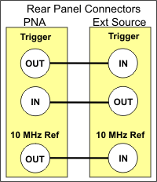
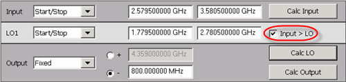
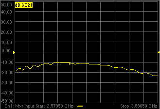
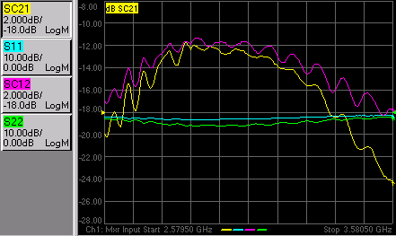

# How to make an SMC Fixed Output Measurement

* * *

The following is a step-by-step example illustrating how to measure a 1-stage
mixer in swept LO mode using FCA Scalar Mixer Calibration.

There are fewer components required for SMC as compared to
[VMC](How_to_make_a_VMC_Fixed_Out_measurement.md), and fewer measurement
steps. You can now make [relative phase
measurements](SMC_plus_Phase.htm#SMCPhase) with SMC. Also, ONLY SMC (not VMC)
can measure the reverse conversion loss of the mixer.

This procedure can also be used for making fixed LO measurements, which is
quite similar. Although a second source is still required, when using an
external source, the physical triggering cables between the VNA and External
Source are not required.

### Required Equipment

  * PNA-X or PNA 'C' models

  *     * with option S93083A/B (FCA) or option S93082A/B (SMC)

  * GPIB External Source. Not necessary when using PNA-X with Internal Second source.

  * ECal module with connectors that match the Input and Output connectors of the DUT. You can use adapters to make the ECal module match the DUT connectors, but first perform an [ECal user-characterization](../S3_Cals/ECal_User_Characterization.md) with the adapters attached. ECal makes the FCA calibration much easier.

  * GPIB or USB power meter / sensor

  * Cables and adapters

Note: This procedure refers to an External Source to control the LO. If using
a PNA-X with an [Internal second
source](../S0_Start/Internal_Second_Source.htm), an external source is not
necessary. Connect the LO directly to the second source output.

## The example mixer

The example device is a down-converter mixer with the following
characteristics:

  * LO and Input Frequency Range: 2 GHz to 4.2 GHz

  * Output Frequency Range: DC to 1.3 GHz

We will measure:

  * Fwd Conversion Loss (SC21)

  * Input Match (S11)

  * Output Match (S22)

  * Reverse Conversion Loss (SC12)

### SMC Setup

Connect the devices as shown in the following diagram:

The DUT can be connected to any VNA ports. [Learn more.](FCA_Use.md#dutPorts)

This procedure uses DUT input to VNA port 1 and output to VNA port 2.

This procedure refers to an External Source to control the LO. If using a
PNA-X with an [Internal second
source](../S0_Start/Internal_Second_Source.htm), an external source is not
necessary. Connect the LO directly to the second source output (port 3 or port
4 on a PNA-X).

### Make Connections on the rear panels:

  1. If using a GPIB power meter, connect the power meter to the external source GPIB connector. If using a USB power meter, connect it to any unused USB port.

  2. If using a PNA-X with an [Internal second source](../S0_Start/Internal_Second_Source.md), the following three steps are not necessary. Connect the LO directly to the second source output.

  3. Using a GPIB cable, connect the VNA GPIB controller port to the external source GPIB connector.

  4. Using two BNC cables, connect the Source and VNA Trigger connectors as shown in the following image. This is not necessary when making fixed LO measurements.

  5. Using a BNC cable, connect the VNA 10 MHz Reference Output to the Ext. Source 10 MHz Reference Input.

## Create the Measurement

  1. Connect the DUT.

  2. Press Setup > External Hardware > Power Meter Setup....

  3. Under Interface, select GPIB, then enter the power meter address. Or select USB, then select the USB power meter that is connected to the VNA.

  4. Press Preset to make sure you are starting with a known state.

  5. Press Meas > S-Param > Meas Class....

  6. Press Meas > S-Param > SC21 to replace the S11 trace.

### Configure the Mixer settings

  1. Press Freq > Main > SMC Setup... to start the SMC Setup dialog.

  2. On the Mixer Frequency tab, enter the Mixer setup values as shown in the image below.

Notes:

  1.      * Rather then enter ALL of the frequency settings, you can enter the Input and the Output frequencies, then click Calculate LO.

     * If Input>LO is NOT checked, the VNA assumes you want the Input < LO frequencies, and higher LO frequencies are calculated as a result.

     * The LO power level setting specifies the power out of the external source; not at the DUT) unless an LO power cal is performed.

     * When the settings are valid, the background color around the Apply button is available.

### Configure the LO Source

  1. On the Mixer Setup tab:

  2. Change LO1 to either an internal VNA source or a pre-configured external source.

  3. To configure an external source:

     1. Click Add Source in the upper-right corner of the Mixer Setup dialog.

     2. Complete the [External Source Configuration](../System/Configure_an_External_Device.md) dialog.

     3. If there is a problem communicating with the source, the VNA will display an error. [See Problems?](How_to_make_an_SMC_Fixed_Output_Measurement.md#Problems)

     4. Click OK to return to the Mixer Setup dialog.

     5. The new external source is now available as an LO1 selection.

  4. Save the mixer settings in a file so you can recall them easily. Click Save , then type a descriptive filename, such as “FixedOutputMixer”.

  5. The trace should begin to sweep as the external source steps in frequency. It should look something like this:

### Problems?

Not sweeping:

  * On the VNA, press Trigger > Main > Continuous to start the VNA sweeping. Watch for error messages on the VNA and source.

Problems communicating with the source:

  * Press Setup > External Hardware > External Device.... In the External Device Configuration dialog, select your LO source, click on Device Properties..., then click Software CW as the Trigger Mode, then close the dialog. Again, press Trigger > Main > Continuous to start the VNA sweeping. If this works, then something is wrong with Hardware (BNC). Check the trigger cables on the rear panel.
  * Can the VNA communicate with the power meter? If not, there is something wrong with the GPIB or USB communication.
  * As a last resort, try rebooting the VNA. First, [save the entire setup to a .csa file](../S5_Output/SaveRecall.md#file_save). When the VNA preset measurement appears, recall this .csa file and continue at this step.

If the source is sweeping, and the VNA Input is sweeping, but there is still
no output.

  * Check power levels at the LO and Input.
  * Check the DUT by making a fixed LO measurement \- much easier.

  
---  
  
Tip: You can optionally calibrate the LO Power level at the DUT using a
standard [Source Power
Calibration](../S3_Cals/PwrCalibration.htm#SourcePowerCal). Select the source
port in the Source Power Cal dialog.

### Perform an SMC calibration

  1. Disconnect the DUT.

  2. Connect the ECal module to a VNA USB port.

  3. Press Cal > Main > Smart Cal.... Because the SC21 measurement is active, the Cal Wizard automatically begins an SMC calibration.

  4. At the Calibration Setup dialog, click Next.

  5. At the Select DUT Connectors and Cal Kits dialog, for DUT Port 1 select the connector type and gender of your DUT INPUT. For DUT Port 2 select the connector type and gender of your DUT OUTPUT. Then select ECal as the Cal Kit to use for each connector. Click Next.

  6. At the Scalar Mixer Calibration Step 1 of 2 dialog, connect the power sensor to the Port 1 test cable, then click Measure. The data will be used to correct for input mismatch errors.

  7. At the Scalar Mixer Calibration Step 2 of 2 dialog, connect the ECal module Port A to the Port 1 cable, and Port B to the Port 2 cable. Then click Measure. This portion of the calibration gathers the linear (non-frequency-translating) error terms of the test setup at the input and output frequencies.

  8. At the Calibration completed dialog, you can choose to save the SMC calibration as a User Cal Set. Otherwise, click Finish to complete the SMC calibration. Correction is turned ON and applied to the SMC trace.

### What is happening?

When an external source is sweeping, the measurements are much slower. When
correction is ON, you will see that there are times when nothing is happening
on the screen. This is because there are background measurements being made
but not displayed.

This is exactly the same as when full 2-port correction is applied to an
S-parameter. All four parameters are measured, then correction is applied,
then all four measurements are updated. This occurs much faster when there is
no external source. With correction OFF, the traces are updated as the data is
measured. You can see this taking place by creating the following
measurements.

### Create S12 Upconverter, S11 Input and S22 Output Match

  1. Right-click in the window and add new traces to the same channel. Add S11, SC12, and S22 measurement traces.

  2. While the source is sweeping, watch the source port indicator on the front of the VNA. First, the port 1 indicator will light for two sweeps, then the port 2 indicator will light for 2 sweeps. During the last sweep, all 4 traces update.

  3. Press Cal > Main > Correction Off. Notice that the relevant traces update as the sweep is occurring.

With the SC12 measurement you can see the reciprocity of the mixer.

SMC forward and reverse measurements can reside in the same channel and are
calibrated automatically at the same time.

* * *

