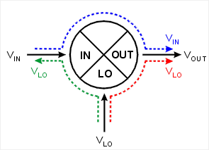
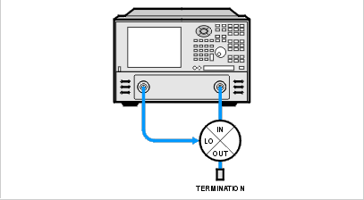
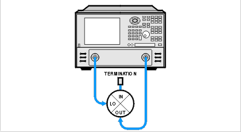

# Isolation Measurements of Frequency Converting Devices

* * *

  * [What is Isolation?](Isolation.md#iso_what_is)

  * [Why Measure Isolation?](Isolation.md#iso_why_meas)

  * [How to Measure Isolation](Isolation.md#iso_how_meas)

[See other Frequency Converting Device
Measurements](Frequency_Converting_Device_Measurements.htm)

What is Isolation?

Isolation is a measure of the leakage, or feedthrough, from one port to
another. The more isolation a mixer provides, the lower the amount of
feedthrough. Isolation is measured at the same frequency as the stimulus, not
the converted or shifted frequency. Therefore, Frequency Offset capability is
not necessary for these measurements.

Three main isolation terms are of interest for mixer measurements:

  * LO-to-OUT isolation (VLO)

  * LO-to-IN isolation (VLO)

  * IN-to-OUT feedthrough (VIN)

Why Measure Isolation?

Any unwanted signal "leaking" through the device will mix with the desired
output signal creating intermodulation products, adding to intermodulation
distortion. These unwanted signals may be difficult to filter out.

How to Measure Isolation

Use the following setups to measure the isolation of a mixer:

Note the following:

  * The Input to Output isolation is very dependent on the LO power level. Isolation should be measured with the LO power at its normal operating level.

  * Each of the ports not being tested should be terminated with an impedance typical of actual operation. This may not always be the characteristic impedance, Z0 (usually 50 or 75 ohms). For example, if the OUT port of a mixer is intended to be directly connected to a filter, then this filter should be used when measuring the LO-to-IN feedthrough.

LO-TO-IN ISOLATION

LO-TO-OUT ISOLATION

IN-TO-OUT ISOLATION

### Measuring Converters vs. Mixers

Measuring IN-to-OUT feedthrough of a converter is identical to that of a
mixer. The IN-to-OUT feedthrough is generally very small for a converter due
to the inclusion of an IF filter in the device. Because of this, the
measurement may require the VNA to have increased [dynamic
range.](../S2_Opt/Dyn_Rge.htm)

Measuring LO leakage (LO-to-OUT and LO-to-IN) of a converter requires a
different technique because the LO port is typically not accessible:

  * The VNA can be tuned to the frequency of the LO signal and either the OUT or IN port connected to the VNA receiver port. The VNA source port is not connected.

  * A spectrum analyzer can be connected to either the OUT or IN port and tuned to the frequency of the LO signal.

