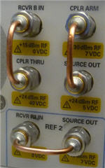
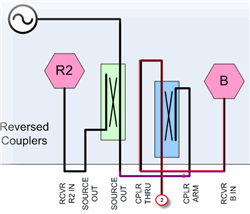
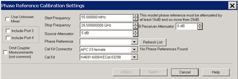
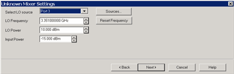
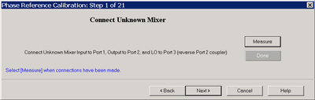
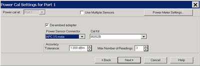
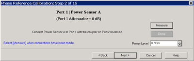
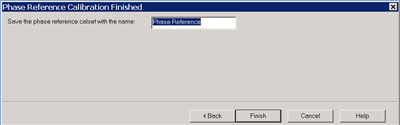
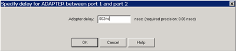

# Phase Reference Calibration

* * *

A Phase Reference calibration is performed to simplify the SMC+Phase or MODX
(Modulation Distortion Converters) calibration process.

In this topic:

  * Features, Requirements, and Limitations

  * How it Works

  * Hardware Setup

  * Phase Reference Calibration Summary

  * How to Perform the Phase Reference Calibration

[Other FCA Topics](FCA_Use.md)

### Features

  * Greatly simplified phase measurements on mixers.

  * A Reference Mixer or Calibration Mixer is NOT required.

  * Works well with segmented sweeps, and mixers with 2-stage LOs.

### Requirements

  * One of the following Keysight Comb Generators (Phase Reference):

  *     * U9391C (26.5 GHz)

    * U9391F (50 GHz)

    * U9391G (67 GHz) \- Receiver attenuation must be used.

Note: The **_U9391-60009 sine-to-square wave is recommended when using the
instrument’s 10 MHz reference output as the driving source to the comb
generator. Connect between the instrument’s 10 MHz output and the input to the
comb generator._** See the [U9391 Technical
Overview](http://literature.cdn.Keysight.com/litweb/pdf/5989-7619EN.pdf) for
more information.

  * Power meter or USB power sensor.

  * S-parameter Cal Kit (mechanical or ECal module).

  * For measurements below 55 MHz, an additional 'Unknown mixer' is required. [Learn more](Phase_Reference_Calibration.md#UnknownMixerHow).

  * For measurements between 50 GHz and 67 GHz, an additional high-pass filter is required. Two back-to-back Keysight V281A waveguide-to-coax adapters is recommended.

Note: The 67 GHz comb generator creates a large pulse for generating useful
harmonics up to 67 GHz. At low frequencies, receiver attenuation must be used
to prevent overloading the VNA receiver due to the large signal. However,
above 67 GHz, the extra receiver attenuation causes degradation in the signal-
to-noise ratio (SNR) of the high harmonics, which would result in noisy phase
calibrations. In order to prevent overloading and get good SNR, the receiver
attenuation is removed and a high-pass filter is inserted between the comb
generator and the VNA's test port. The calibration wizard provides extra steps
to guide the user to insert the filter.

### Limitations

  * Available with opt. S93083A/B (NOT with opt. S93082A/B) Opt S9x083A/B ONLY

  * Swept LO measurements are NOT allowed.

  * Lowest frequency for Phase Reference Cal is 10 MHz.

  *   * 

### How it Works

A Phase Reference Cal is performed, saved, and later recalled during a SMC or
MODX Calibration. This is sometimes referred to as a 'tier 1" calibration. Due
to stability of the VNA, the Phase Reference Cal can be performed
infrequently. It is typically performed over the full frequency range of the
VNA or Phase Reference so that it can be applied to all SMC or MODX
calibrations that will be needed in the future.

The Phase Reference is a comb generator which produces signals at the multiple
of its input frequency. By driving it with the VNA 10 MHz reference output,
the Phase Reference produces signals at multiples of 10 MHz with a flat phase
response.

During the tier 1 calibration, the VNA port 2 (B) receiver measures the phase
at each 10 MHz comb frequency in order to generate correction values. These
correction values are stored to a Phase Reference Cal Set which can be
recalled and applied to correct subsequent SMC+Phase or MODX measurements.

Although only the B receiver is phase calibrated, an S-parameter calibration
is performed at specified test ports and used to transfer the characterization
to other VNA receivers.

A power calibration is also performed on port 1 as part of the Phase Reference
Cal.

###  Unknown Mixer Calibration (extends the phase reference calibration below
55 MHz

By itself, the phase reference can only be used to calibrate down to 55 MHz.
With one additional unknown mixer connection, the phase reference calibration
can be extended to the lower limit frequency which is 10 Mhz and maximum
frequency range of the VNA.

With the unknown mixer process, the phase of the unknown mixer is measured as
a down converter with the output frequencies set between 10 MHz and 600 MHz.
By using the data acquired using the phase reference, the system is able to
make produce calibrated measurements of the mixer above 300 MHz. The phase
response of the unknown mixer is assumed to be linear, so the expected phase
response of the mixer is extrapolated down to 10 MHz. The variation in the
measurements versus the expected phase response is attributed to, and used to
correct, the phase response of the VNA receivers from 10 MHz to 300 MHz.

Unknown Mixer Properties

  * The mixer must be able to output a signal from DC to 1GHz.

  * Over these frequencies, the delay response of the mixer should be constant. Therefore, the unknown mixer must be passive, with no filtering or amplification.

  * Add a 10 dB attenuator on the mixer input and output to minimize mismatch effects.

  * 

### Hardware Setup

  1. Connect the U9391 Phase Reference to a DC power supply by one of the following cables. See the [U9391 Technical Overview](http://literature.cdn.Keysight.com/litweb/pdf/5989-7619EN.pdf) for more information.  
  

  * The black wire is “ground”.

  * The red wire is + 15Vdc. The U9391C and U9391F only require +15 Vdc.

  *   * 

  2. Connect a cable from the VNA [Reference signal](../S1_Settings/Reference.md) output to the U9391 input. The cable should be as short as possible.

Note: The **_U9391-60009 sine-to-square wave is recommended when using the
instrument’s 10 MHz reference output as the driving source to the comb
generator. Connect between the instrument’s 10 MHz output and the input to the
comb generator._** See the [U9391 Technical
Overview](http://literature.cdn.Keysight.com/litweb/pdf/5989-7619EN.pdf) for
more information.

.

  3. Connect the U9391 output directly to the VNA test port 2.

  4. Insert the U9391 USB connector into any of the VNA USB ports.

  5. Because of its low-frequency roll off, the coupler on Port 2 must be reversed which bypasses the coupled arm. Flip the port 2 front loops as shown in the following image. This increases power to the receiver by approximately 16 dB at low frequencies and removes noise from the measurement.

 Configure the Port 2 'B' receiver port front-panel loops to a vertical orientation as shown here. |   Block diagram showing port 2 thru coupler main arm to B receiver.  
---|---  
  
### Phase Reference Calibration Summary

The Phase Reference Cal Wizard steps will show the appropriate prompts.

When Unknown Mixer is enabled (Start Frequency is 10 MHz)

  * Reverse the Port 2 loops.

  * The input and output match of the unknown mixer is measured. Then SC21 is measured using 100 averages.

Phase Reference measurement above and S-Parameter calibration below 50 GHz.

  *   *   * S-parameter cal is NOT performed when Omit Coupler Measurements is checked.

  * Reverse the Port 2 loops.

  * When using the 67 GHz phase reference, use receiver attenuator or external attenuator.

When mixer output is above 50 GHz, Phase Reference measurement and S-Parameter
calibration.

  * Connect 50 GHz high pass filter to phase reference output.

  * Reverse the Port 2 loops.

  * Receiver attenuator or external attenuator is NOT used.

Full band power sensor measurement.

  * Connect Power Sensor to Port 1. 

  * Port 2 coupler in normal position.

Full band S-parameter calibration.

  * Connect standards to Port 1.

  *   * Port 2 coupler in normal position.

  * High-pass filter is NOT used.

  * Receiver attenuator or external attenuator is NOT used.

  *   * 

Full band Port1-2 thru calibration.

  *   * 

#### How to start the Phase Reference Calibration

With an Scalar Mixer / Converter + Phase or MODX measurement active...  
---  
  
### Using Hardkey/SoftTab/Softkey

|  Using a mouse  
  
  1. Press Cal > Main > Other Cals > Phase Reference Wizard....

|

  1. Click Response
  2. Select Cal
  3. Select Other Cals
  4. Select Phase Reference Wizard...

  
  
  
Phase Reference Cal Settings dialog box help  
---  

### Use Unknown Mixer

Check to use an Unknown Mixer to calibrate the VNA receivers below 55 MHz. The
Start Frequency becomes 10 MHz and can not be changed. [Learn how it
works](Phase_Reference_Calibration.htm#HowPhaseRefWorks).

### Ports

  * Ports 1 and 2 are always selected.
  * Select port 3 and more to perform an S-parameter (SOLT) cal at those ports. The phase correction is transferred to all checked ports.

### Start / Stop Frequency

Select the start and stop frequency of the Phase Reference Cal. Subsequent
SMC+Phase or MODX calibrations MUST be the same or a subset of these
frequencies. Interpolation is performed when the 10 MHz 'grid' of
characterized frequencies is off from measurement frequencies.

  * When Unknown Mixer is NOT checked, the lowest start frequency is 55 MHz. The lowest stop frequency is 1 GHz.
  * When Unknown Mixer IS checked, the start frequency is 10 MHz and can NOT be changed. The lowest stop frequency is 5 GHz.

### Source Attenuation

Select the attenuation value for the VNA source port. |  Important Source Attenuation Notes

  * This setting should match the port 1 source attenuator setting used for subsequent SMC+Phase. If the settings are the same, only an S-parameter cal need be performed with the SMC+Phase wizard to complete the calibration process. If the settings are different, a [Cal All calibration](../S3_Cals/Calibrate_All_Channels.md) must be performed, which requires both an S-parameter cal and another power-sensor cal. As an alternative, if you plan to make SMC+Phase measurements with different input attenuator settings, you may want to perform a couple of Phase Reference cals using these different attenuator settings.
  * The phase reference cal is not as good when using input attenuation. You will get a better calibration if you use 0 dB of source attenuation. Then use the [Cal All](../S3_Cals/Calibrate_All_Channels.md) feature to perform the 2nd tier calibration with the required input attenuation. This is because the Cal All feature includes an attenuator calibration that will properly move the phase reference cal from the 0 dB attenuator plane to the new (required) attenuator plane.

  
---  
  
### Phase Reference

When the Phase Reference is detected by the VNA, it should appear in this
field. If it does NOT appear here, try a different USB port, then click
Refresh.

Phase Reference Connector type and gender. When the Phase Reference does NOT
mate directly with the test port, you can add a well-behaved, broadband (no
filters, waveguide, etc.) adapter to the Phase Reference and ignore it. That
is because the adapter will stay with the Phase Reference and the calibration
plane will still be the VNA test port connectors. The adapter adds constant
delay; the deviation in delay is what is being calibrated out. Loss in the
adapter is not a concern because the adapter is not used during the
S-parameter and the power meter portion of the cal.

Cal Kit Connector

Select the connector type and gender of your Cal Kit.

Only ONE connector type and gender is specified. This is because the entire
Phase Reference cal is performed at the VNA test ports to reduce the effects
of cable flex in the characterization.

There may be times when an adapter or connector-savers are used to connect the
phase reference and cal standards to the test ports. In these cases, for
highest accuracy use that adapter style and gender for ALL connections to ALL
test ports. The effects of the adapter will be de-embedded automatically
during subsequent SMC+Phase or MODX calibrations.

Note: For highest accuracy, perform the phase reference cal at the test ports.

Cal Kit Select the Cal Kit that will be used to perform the S-parameter Cal.

### B Receiver Attenuation

The 67 GHz (U9391G) phase reference outputs too much power and overloads the
VNA Port 2 (B) receiver. Use at least 16 dB and not more that 20 dB of
receiver attenuation to make accurate measurements using that phase reference.

This message is shown when a 67 GHz phase reference is connected to USB.

The B receiver attenuator control is shown if your VNA has receiver
attenuators. Otherwise, connect external attenuation to the U9391G output when
prompted.

### Omit Coupler Measurements

This choice can be selected when the stop frequency is less than or equal to
50 GHz. Enabling the checkbox simplifies the calibration procedure by reducing
the number of calibration steps required, with some tradeoffs. Clearing the
checkbox will always result in the most accurate phase-reference calibration.

With the checkbox selected:

  * Port 2 can NOT be used as the input to the DUT when setting up subsequent SMC+Phase or MODX measurements.

  * The power-sensor calibration is performed at the end of a test cable connected to Port 1, which may degrade the accuracy of conversion loss/gain measurements due to cable movement during the calibration. This problem can be minimized by using a high-quality cable and avoiding cable movement between calibration steps.

  
  
Unknown Mixer Settings (Phase Reference Cal Wizard) dialog box help  
---  
The following wizard pages appear when Unknown Mixer is checked on the
previous page:  Select LO source
The LO can be an internal 2nd source or an external source. Sources Click to
start the [External Devices
dialog](../System/Configure_an_External_Device.htm#ExtDevConfig) where you can
select or configure an external RF source. LO Frequency Select a frequency
that results in the unknown mixer output of 10 MHz to 600 MHz using this
formula: Input = LO + Output. Note: For best results, use the default LO
frequency which avoids the VNA input (source) frequency band crossings.
 The Port 2 coupler must be
reversed for these measurements. [Learn
how](Phase_Reference_Calibration.htm#Setup).

  * Connect the unknown mixer input to the between port 1 and port 2. For best results, connect the mixer output as close as possible to port 2.
  * Connect the LO of the unknown mixer. 
  * Click Measure.
  *     * The input and output match of the unknown mixer is measured, then, SC21 using is measured using an averaging count of 100.
    * The data point spacing of the calibration is decreased to 156 kHz. This point spacing is necessary to accurately characterize all the low frequency band breaks of the VNA.

  
  
Power Cal Settings (Phase Reference Cal Wizard) dialog box help  
---  
 A power calibration is performed
on port 1. This is done to simplify subsequent SMC since the power calibration
will not need to be repeated. For highest accuracy, connect the power sensor
directly to the test port with no adapter. [Learn more about these
settings.](../S3_Cals/Guided_Power_Calibration.htm#PowerCalSettings)  
  
Phase Reference Calibration Steps dialog box help  
---  

  * Connect the Phase Reference directly to the port 2 test port.
    1. If an adapter is necessary, then that adapter must be left in place for the SOLT cal at port 2.
    2. When using a 67 GHz phase reference, attenuation or high-pass filter is required.
  * Ensure that the port 2 coupler is reversed. Learn how.
  * Press Measure.
  * The VNA will make a series of measurements which can take several minutes:
    1. First, the match of the phase reference is measured.
    2. Then, a sweep is made at multiples of 10 MHz across the entire frequency span. Each measurement is repeated 100 times and averaged to reduce the noise in the measurement.
    3. An error is reported if the approximate power level is not detected.
  * 5\. When finished, press Next>

### Power sensor A

 Connect the power sensor
to port 1 test port.

### SOLT cals are performed at the test ports.

  * The THRU standard always performs an [Unknown Thru](../S3_Cals/Calibration_THRU_Methods.md#UnknownThru).
  *   * Follow the prompts to complete the Phase Reference Cal.

### Phase Ref Cal Finished

 Enter a name for the Phase Ref
Cal, then click Finished. During subsequent SMC or MODX calibrations, select
the Phase Reference Cal Set at the SMC or MODX Cal setup dialog. [Learn
more](SMC_plus_Phase.htm#HowEnableSMCPhase).

### Specify Delay

 If you know the delay value of the
Unknown Thru connection, enter it here. Otherwise, click OK to accept the
calculated value.  
  
* * *

