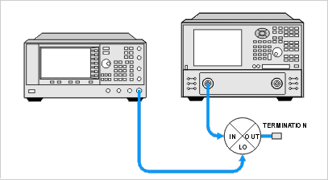
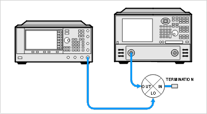

# Return Loss and VSWR

* * *

  * [What are Return Loss and VSWR?](Return_Loss_and_VSWR.md#vswr_what_is)

  * [Why Measure Return Loss and VSWR?](Return_Loss_and_VSWR.md#vswr_why_meas)

  * [How to Measure Return Loss and VSWR](Return_Loss_and_VSWR.md#vswr_how_meas)

[See other Frequency Converting Device
Measurements](Frequency_Converting_Device_Measurements.htm)

What is Return Loss and VSWR?

Return loss and VSWR are both linear reflection measurements, even when
testing frequency conversion devices, because the reflected frequency is not
converted. These measurements are essentially the same as for filters and
amplifiers. Learn more about [Reflection
Measurements](../Tutorials/Reflection_Measurements.htm).

Why Measure Return Loss and VSWR?

Devices which have poor return loss and VSWR result in loss of signal power or
degradation of signal information.

How to Measure Return Loss and VSWR

Setup the VNA measure return loss and VSWR as you would any two-port device.
Connect your frequency converting device as shown in the following diagrams:

RETURN LOSS AND VSWR OF MIXER INPUT PORT

RETURN LOSS AND VSWR OF MIXER OUTPUT PORT

RETURN LOSS AND VSWR OF MIXER LO PORT

