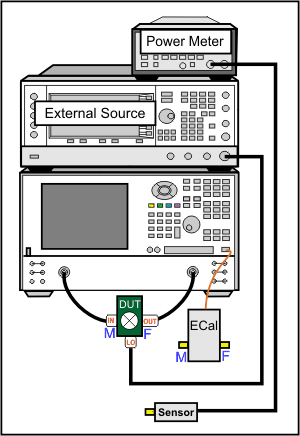
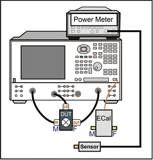
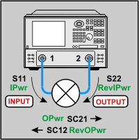
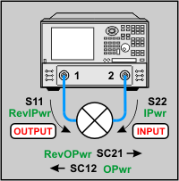
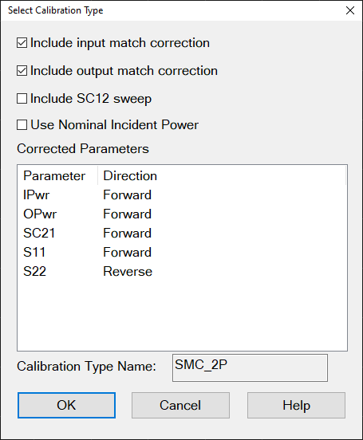
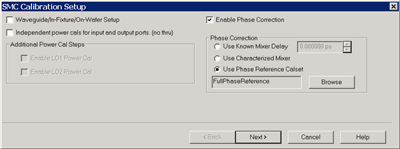
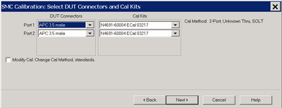
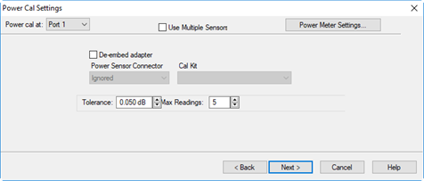
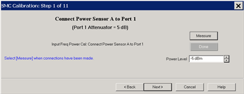

# Scalar Mixer/Converter Measurements (SMC)

* * *

SMC Setup and Calibration is very similar to [VMC](VMC_Measurements.md). See
[FCA Overview](FCA_Use.md) to learn about the features that are common to
these two applications.

The following information is unique to SMC:

  * [SMC Hardware Setup](SMC_Measurements.md#HardwareSetup)

  * [Create an SMC Measurement](SMC_Measurements.md#Create)

  * [SMC Parameters Offered](SMC_Measurements.md#offered)

  * [The SMC Mixer Setup dialog](SMC_Measurements.md#SMCMixerSetup)

  * [Speed Up SMC Measurements](SMC_Measurements.md#SpeedUp)

  *     * [Use Nominal Incident Power](SMC_Measurements.md#UseNominal)

    * [Apply a Cal Set or SMC Cal Type](SMC_Measurements.md#Apply)

    * [Reverse Port 2 Coupler below 55 MHz](SMC_plus_Phase.md#MeasBelow55) (separate topic)

  * [SMC Calibration](SMC_Measurements.md#CalOverview)

  * [SMC + Phase](SMC_plus_Phase.md) (separate topic)

### See Also

[Embedded LO](../Applications/Embedded_LO.md)

[How to make an SMC Fixed Output
Measurement](How_to_make_an_SMC_Fixed_Output_Measurement.htm)

[SMC with a Booster Amp](SMC_with_a_Booster_Amp.md)

[Programming Commands](../Programming/MixerTopic.md)

* * *

## SMC Hardware Setup

SMC requires a power meter/sensor, two sources, and a Cal Kit or ECal module

  * Your DUT can be connected to any VNA ports. [Learn more.](FCA_Use.md#dutPorts)

  * When using a PNA-X with an Internal Second Source, the external source is NOT necessary. [Learn which VNA ports can be used for the LO.](../S0_Start/Internal_Second_Source.md)

  * For 2-port VNAs, connect External Source to the VNA GPIB Controller port. Learn how to [Configure an External Source](../System/Configure_an_External_Device.md).

  * Connect the [10 MHz reference signal](../Rear_Panel/XRtour.md#10M) of an external source to the VNA. This is especially important with SMC + Phase measurements.

Use either a GPIB power meter or USB power sensor. How to configure two power
sensors to cover the SMC measurement frequency range. Using a dual channel
power meter, with both sensors connected:

  1. At the SMC [Select DUT Connectors](SMC_Measurements.md#Select_dut_connectors) dialog, click Source Cal Settings
  2. At [Source Calibration Settings](../S3_Cals/Power_Cal_for_Apps.md#SourceCalApps) dialog, click Power Meter Config
  3. At [Power Meter Settings](../S3_Cals/PwrCalibration.md#MeterSettings) dialog, click Sensors
  4. At [Power Sensor Settings](../S3_Cals/PwrCalibration.md#SensorDiag) dialog, clear the "Use this sensor only..." checkbox for both sensors.
  5. Then enter the MIn and Max Frequencies for both sensors.

During the SMC Cal, you will be prompted to connect each sensor at the
appropriate time.  
---  
  
## Create an SMC Measurement

  1. Press Setup > Main > Meas Class....

  2. Select SMC, then either:

  1.      * OK delete the existing measurement, or

     * New Channel to create the measurement in a new channel.

  3. An SC21 measurement is displayed.

## SMC Parameters Offered

To select additional parameters to display, click Trace, then click on a new
trace, then select a parameter from the list.

Important Note: Connecting your DUT to the VNA: RF and IF terminology is NOT
used in FCA because the VNA does not know how the DUT is labeled or how it
will be used. Instead, the general terms INPUT and OUTPUT are used.

  * INPUT \- The DUT port being stimulated with frequencies before conversion.
  * OUTPUT \- The DUT port outputting converted frequencies.

INPUT and OUTPUT Frequencies are specified using the [Mixer Setup dialog
box](../Applications/MixerConverter_Setup.htm).  
---  
  
The DUT input and output can be connected to any VNA ports. Note: Although
there are MANY configuration possibilities, the following images and
descriptions show ONLY a DUT connected to VNA ports 1 and 2. Legend: Black are
ratioed measurements (test port/reference receiver). Green are unratioed
measurements (either a test port OR reference receiver).  
---  
DUT Input to VNA port 1 DUT Output to VNA port 2 | DUT Input to VNA port 2 DUT Output to VNA port 1  
---|---  
 |   
Ratioed

  * SC21 (Conversion Loss) Stimulus at Input, response at Output (B/R1).
  * SC12 (Reverse Isolation) Stimulus at Output, response at Input (A/R2)
  * S11 (Input match) Stimulus and response at Input (A/R1)
  * S22 (Output match) Stimulus and response at Output (B/R2)

| Ratioed

  * SC12 (Conversion Loss) Stimulus at Input, response at Output (A/R2)
  * SC21 (Reverse Isolation) Stimulus at Output, response at Input (B/R1)
  * S11 (Output match) Stimulus and response at Output (A/R1)
  * S22 (Input match) Stimulus and response at Input (B/R2)

  
Unratioed  Absolute test port receiver measurements. The receiver is
automatically selected depending on the DUT configuration.

  1.      * IPwr (Incident Power) - stimulus and response at Input.
     * RevIPwr (Reverse Incident Power) - stimulus and response at Output.
     * OPwr (Output Power) - stimulus at Input, response at Output.
     * RevOPwr (Reverse Output Power) \- stimulus at Output, response at Input.

  
Internal ADC Stimulus / Response Measurements (AI). AI(x,y) where: x=ADC to
use. Choose 1 or 2.: y=port number at which ADC is available Learn more about
[ADC Measurements](../S1_Settings/ADC_Measurements.md) Externallly-configured
DC Measurements. [Learn more](../System/Configure_a_DC_Device.md).  
  
## SMC Mixer Setup

#### How to start the SMC Mixer Setup dialog  
  
---  
  
### Using Hardkey/SoftTab/Softkey

| Using a mouse  
  
  1. Press Sweep > Main > SMC Setup... > Mixer Setup tab.

|

  1. Click Stimulus
  2. Select Sweep
  3. Select SMC Setup...
  4. Select Mixer Setup

  
  
  
The following SMC Mixer Setup dialog tabs are presented:

  * [Sweep Tab](FCA_Use.md#SweepTab) (shared with VMC)

  * [Power Tab](FCA_Use.md#PowerDiag) (shared with VMC)

  * [Mixer Freq Tab](../Applications/MixerConverter_Setup.md#MixerFreqTab) (shared with all converter apps)

  * [Mixer Power Tab](../Applications/MixerConverter_Setup.md#MixerPowerTab) (shared with all converter apps)

  * [Mixer Setup Tab](../Applications/MixerConverter_Setup.md#MixerSetupTab) (shared with all converter apps)

Speed Up SMC Measurements

Using default SMC settings, any calibrated SMC measurement requires four
sweeps. However, you can reduce the number of sweeps required by selecting one
or more of the following settings.

  * [Use Nominal Incident Power](SMC_Measurements.md#UseNominal)

  * [Apply Cal Set or Cal Type](SMC_Measurements.md#SMCapplyChoices)

  * To speed up a Swept LO measurement when using an external source for the LO, use Hardware List (BNC) Trigger setting . [Learn more.](../System/Configure_an_External_Source.md#Hardware)

  * [Reverse Port 2 Coupler below 55 MHz](SMC_plus_Phase.md#MeasBelow55) (separate topic)

### Use Nominal Incident Power

Click Response, Cal, Correction Methods..., and then Use Nominal Incident
Power checkbox.

Each data sweep of a fully corrected SMC transmission measurement actually
requires FOUR data sweeps. When you clear Use Nominal Incident Power, the
reference receiver (R1 or R2) does NOT measure incident power. Instead, the
incident power is assumed to be at the level that was set with the [Source
Power Calibration](../S3_Cals/PwrCalibration.htm#SourcePowerCal) that is done
as part of every SMC measurement. The degradation in accuracy is very
negligible if the input or output of your DUT is well-matched.

This selection eliminates sweeps ONLY when both Include Input Match AND
Include Output Match is cleared on the Cal Type dialog. [Learn
more.](SMC_Measurements.htm#SMCCalType)

### Apply a Cal Set or SMC Cal Type

You can create an FCA measurement and apply an existing Cal Set as you can
with any VNA measurement. Learn about [Cal
Sets](../S3_Cals/Cal_Sets.htm#ApplyingCalSet). In addition, from a Cal Set,
you can apply a specific SMC Cal Type to an existing SMC measurement.

#### How to apply an SMC Cal Type

  1. [Create an SMC measurement](FCA_Use.md#Create)
  2. Calibrate or apply an existing SMC Cal Set, then...

  
---  
  
### Using Hardkey/SoftTab/Softkey  
  
  1. Press Cal > Main > Correction Methods....

  
  
  
Correction Method dialog box help  
---  
 By default, each SMC calibration
requires FOUR sweeps. Clearing boxes will eliminate sweeps and speed up your
SMC measurements. The difference in speed is most noticeable when making fixed
input or fixed output measurements with an external LO source. Include input
match correction Check to perform a sweep to measure and correct for INPUT
match. Clear this box if the input of your mixer is well-matched to the VNA,
or if your setup does not permit a valid S11 measurement. Include output match
correction Check to perform a sweep to measure and correct for OUTPUT match.
Clear this box if the output of your mixer is well-matched to the VNA, or if
your setup does not permit a valid S22 measurement. Include SC12 Sweep Check
to perform a reverse sweep to measure SC12.

  * When checked (default setting), a calibrated SMC measurement sweeps in both forward (SC21) and reverse (SC12) directions.
  * Clear this checkbox to eliminate sweeps in the reverse direction. This means that the following measurements will NOT be corrected: SC12, RevOPwr, RevIPwr.

Corrected Parameters Lists the parameters that can be corrected given the
boxes that are currently checked. These parameters may not be currently
measured. Calibration Type Shows the type of SMC Cal that will be applied
given the boxes that are currently checked. Learn about [Use Nominal Incident
Power](SMC_Measurements.htm#UseNominal)

### How many sweeps can be eliminated?

| Setting | Parameters [Learn about parameter abbreviations](FCA_Use.md#offered) | # of sweeps  
---|---|---  
ALL checked and clear [Use Nominal Incident Power](SMC_Measurements.md#UseNominal) | IPwr,OPwr,RevIPwr,RevOPwr,SC21,SC12,S11,S22 | 4 Total  
Perform this action... |  to REMOVE these parameters... | and these sweeps  
Clear "Include SC12" | Remove RevIPwr,RevOPwr,SC12 | Removes 1  
Clear "Include OUTPUT match | Remove S22 | Removes 1 when Nominal is checked*.  
Clear "Include INPUT match" | Remove S11 | Removes 1 when Nominal is checked*.  
Check "Use Nominal Incident Power" | Remove IPwr, RevIPwr | May remove up to 2*  
ALL cleared and check Nominal Incident Power | OPwr,SC21 | 1 Total  
  
*S11 shares a sweep with IPwr and S22 shares a sweep with RevIPwr. Therefore, when Include Input Match or Include Output Match is checked, then checking Nominal incident power does nothing.

[VMC measurement](VMC_Measurements.md) sweeps can NOT be eliminated.  
  
## SMC Calibration Overview

The [SMC Calibration Wizard](SMC_Measurements.md#CalWizard) guides you
through this process.

When applying a [Phase Reference cal set](SMC_plus_Phase.md), step 1 (power
cal) is NOT performed.

  1. Connect a power meter / sensor to VNA Port 1. At each step of the input and output frequency, the VNA measures:

     * input match of the power sensor

     * source power of the VNA

  2. Perform two Full 2-port calibrations: one over the INPUT frequencies and one over the OUTPUT frequencies of the DUT. (If your DUT is a linear device, the calibration uses only the INPUT frequency range.) Use either a mechanical calibration kit or an ECal module.

### For Mixers / Converters with High-output Power

The Unknown Thru method is NOT valid when there is over 40 dB of combined loss
in the Unknown Thru and calibration path. In this case, the following
calibration and correction method is recommended.

  * On the Cal Wizard [Modify Frequency](SMC_Measurements.md#Modify) page, select Defined Thru or Flush Thru as the [Thru method](../S3_Cals/Calibration_THRU_Methods.md#ECal). When using an ECal module, also on the Modify Frequency page, disable (clear) Do Orientation due to very low power.

  * After calibration, on the [Correction Method](SMC_Measurements.md#SMCCalType) dialog, CLEAR the Include output match correction and Include SC12 Sweep check boxes. Check ONLY Include input match correction.

  * To learn more about High-power measurements, see our [App Notes](../Tutorials/App_Notes.md).

## SMC Cal Wizard

The following dialog boxes are presented during an SMC Calibration.

Indented steps are optional.

  * [Calibration Setup](SMC_Measurements.md#CalSetupDiag)

  *     * [Waveguide/In-fixture/On-Wafer Setup](SMC_Measurements.md#Waveguide)

  * [Select DUT Connectors and Cal Kits](SMC_Measurements.md#Select_dut_connectors)

  *     * [Modify Frequency Cal](SMC_Measurements.md#Modify)

    * [Specify how the ECal module is connected](SMC_Measurements.md#Orient1)

  * [Power Cal Settings](SMC_Measurements.md#PowerCalSettings)

  * [SMC Cal Steps](SMC_Measurements.md#Meas_cal_stds)

  * [Calibration Completed](SMC_Measurements.md#CalComplete)

  * [Specify Adapter Delay](SMC_Measurements.md#SpecifyDelayDiag)

#### How to Perform a SMC Calibration

  1. [Create an SMC measurement](FCA_Use.md#Create), then...

  
---  
  
### Using Hardkey/SoftTab/Softkey

| Using a mouse  
  
  1. Press Cal > Main > Smart Cal....

|

  1. Click Response
  2. Select Cal
  3. Select Smart Cal...

  
  
  
SMC Calibration Setup dialog box help  
---  
 Allows you to review and change the
settings for your SMC calibration. Note: With release A.09.90 and before,
checking both 'Independent power cals' AND 'Use Phase Reference Calset' would
generate an error after performing the calibration. With releases AFTER
A.09.90, the two settings are compatible. Waveguide/In-fixture/On-Wafer Setup
Click Next to launch the following Setup dialog box. Independent power cals
for input and output ports (no thru) Check if a Thru standard is NOT
available. During the power cal, you will be prompted to connect the power
sensor to the Input, then the Output port.

### Additional Power Cal Steps

Enable LO1 / LO2 Power Cal Check when LO1 / LO2 is controlled (on the [Mixer
Setup](../Applications/MixerConverter_Setup.htm#MixerSetupTab) tab) to perform
a Power Cal on the LO source(s).

### Phase Correction

Enable Phase Correction Check to enable Phase measurements. Choose one of the
following methods to specify the delay through the characterized mixer. With
the first two methods, the phase delay through a Calibration Mixer is measured
and compared to the known delay, either entered, or stored in an *.S2PX file.

  * Use Known Mixer Delay Enter the fixed, known, delay through the calibration mixer.
  * Use Characterized Mixer Select, then browse to the *.S2P file that characterizes the calibration mixer. Use an *.S2PX file when making segmented SMC + Phase measurements. [Learn more](FCA_Use.md#SegmentSweep). Use either of the following two methods to characterize the Cal Mixer over the SMC measurement frequency range:

  1.      1. Use the [Mixer Characterization Wizard](VMC_Measurements.md#MixerCharCal). (Click Response, then Cal, then Mixer Characterization Wizard.) The Cal Mixer has the same requirements as the VMC Cal Mixer. [Learn more](VMC_Measurements.md#calibrationMixer).
     2. In a calibrated VMC channel, measure the group delay of the calibration mixer, then save to an *.S2P or *.S2PX file. However, a characterized mixer is required to calibrate the VMC channel.

  * Use Phase Reference Calset Select, then browse to the Phase Reference Calset that covers the frequency range of the current measurement. [Learn more about SMC with a Phase Reference Calibration](SMC_plus_Phase.md).

  
  
Waveguide/In-fixture/On-Wafer Setup dialog box help  
---  
 This dialog box appears ONLY if you
checked the Waveguide/In-fixture/On-Wafer Setup box in the previous [Cal
Setup](SMC_Measurements.htm#CalSetupDiag) dialog. Allows you to embed or de-
embed circuit networks on the input and output of your mixer under test. For
Network1 (Input) and Network2 (Output) select Embed, De-embed, or None. Browse
Click to navigate to the .S2P file that models the network to embed or de-
embed. Reverse port positions for input/output Check to cause the
Fixture/Adapter to be configured with Port 2 connected to the VNA and Port 1
to be connected to the DUT. The image in the dialog is updated to reflect that
change. Enable Extrapolation Check (default setting) to apply a simple
extrapolation when the S2P file has a narrower frequency range than the
channel. The values for the first and last data points are extended in either
direction to cover the frequency range of the measurement. A warning message
is also displayed when extrapolation is necessary.

### To Embed or De-embed

  * When you have a 2 port network that needs to be connected between the Cal reference plane and the DUT during the measurement, but it is NOT present during the calibration, then that network has to be De-Embedded from the port in question during the calibration. In other words, De-Embedding in FCA calibration extends the calibration reference plane to include the two port network.
  * When you have a 2 port network that is included as part of the calibration reference plane but has to be disconnected during the measurement, then that 2-port network has to be Embedded for the port in question during the calibration. In other words, Embedding in FCA calibration retracts the calibration reference plane to exclude the two port network during the measurement.

| Notes

  * Interpolation is performed when more frequencies are included in the file than in the channel, and the data points do not exactly match those of the measurement.

  
---  
  
Select DUT Connectors and Cal Kits dialog box help  
---  
 Allows you to specify the connector
type and Cal Kit for each DUT port. Port n For each listed VNA port, specify
the DUT connector type and gender, and the Cal Kit to use. Note: If your DUT
connectors are:

  * Waveguide Change the system impedance to 1 ohm before performing a calibration. See [Setting System Impedance](../System/System_Impedance.md).
  * Not listed (male and female) Select Type A as the connector type. Type A requires a calibration kit file containing the electrical properties of the standards used for calibration (see [Calibration kits](../S3_Cals/ModifyCalKits.md#CalKitManager)).
  * Unspecified (like a packaged device) Select Type B as the connector type. Type B requires a calibration kit file containing the electrical properties of the standards used for calibration (see [Calibration kits](../S3_Cals/ModifyCalKits.md#CalKitManager)).

Modify Cal Check, then click Next, to start the [Modify Frequency Cal
dialog](SMC_Measurements.htm#Modify). Source Cal Settings Click to start the
[Source Cal Settings](../S3_Cals/Power_Cal_for_Apps.md) dialog.  
  
Modify Frequency Cal dialog box help  
---  
 This dialog appears only when
Modify Cal is checked on the previous dialog. Thru Cal Method For each Thru
connection, choose the Thru method. [Learn more about these
choices.](../S3_Cals/Calibration_THRU_Methods.htm) Cal Type/Stds Click to
start the [Modify Calibration Selections](../S3_Cals/SOLT_Tab.md) dialog box.
The following selections are available ONLY if using an ECal module. Do
orientation When this box is checked (default) the VNA senses the ECal model
and direction in which the ECal module port is connected to the VNA ports. If
power to the ECal module is too low, it will appear as if there is no ECal
module connected. If you use low power and are having this problem, clear this
check box to provide the orientation manually. Orientation occurs first at the
middle of the frequency range that you are calibrating. If a signal is not
detected, it tries again at the lowest frequency in the range. [See
note](SMC_Measurements.htm#highOut) about calibrating for high-output
mixer/converters using an ECal module. View/Detect ECal Characterizations
Appears only if an ECal module is selected for use. Click to invoke the [View
ECal Modules and
Characterizations](../S3_Cals/Using_ECal.htm#SelectModuleAndChar) dialog box.
Displays a list of ECal modules that are connected to the VNA.  
  
Power Cal Settings dialog box help  
---  
 Note: A Use Power Table checkbox
(not shown) is available when a mmWave SMC measurement is active. [Learn
more](../IFAccess/External_Test_Head_Configuration.htm#SMCPowerProcess). Power
Cal at: Select the source port for which a Power Calibration will be
performed. The source and receiver correction will be transferred to all other
sources and receivers involved in the S-parameter measurements. Use Multiple
Sensors Check this box when you want to use more than ONE power sensor to
cover the measurement frequency range. The dialog is replaced with the
[Multiple Sensors](../S3_Cals/Guided_Power_Calibration.md#MultipleSensors)
dialog. When "Use Multiple Sensors" is cleared (default setting), connect only
ONE sensor to the VNA. Note: Use Multiple Sensors is a Licensed Feature called
Multiple-sensor Power Calibration for SMC/GCX. Learn more about [Licensed
Features](../Support/Software_Support.htm). Power Meter Settings Click to
start the standard [Power Meter Settings
dialog](../S3_Cals/PwrCalibration.htm#MeterSettings). De-embed (power sensor)
adapter When the power sensor connector is NOT the same type and gender as the
DUT connector for the specified port, then for optimum accuracy, extra cal
steps are required to measure and correct for the adapter that is used to
connect the power sensor to the reference plane. Clear this box to NOT
compensate for the added adapter. Check this box to perform extra calibration
steps to measure and correct for the adapter. Then select the Power Sensor
Connector type and gender of the power sensor. "Ignored" does NOT compensate
for the added adapter, just as if the checkbox were cleared. When this
connector matches the DUT connector for the same port, then the VNA assumes
that there is no adapter. Extra cal steps are NOT required and the Cal Kit
selection is not available. Otherwise, select the Cal Kit to be used to
calibrate at the adapter. See [Accuracy
Settings](../S3_Cals/Guided_Power_Calibration.htm#Accuracy) below.  
  
Specify how the ECal module is connected dialog box help  
---  
 This dialog box appears when the Do
orientation checkbox in the previous Modify Frequency dialog box is cleared.
Click the ECal Port that is connected to each VNA port.  
  
SMC Calibration Steps dialog box help  
---  
 Power Level at which to perform the
Power Cal. It is usually best to set power level to 0 dBm at the power sensor
because the power sensor is calibrated at that level. Lower power levels will
yield a slower and noisier calibration. If an external component is used
between the PNA-X test port and the calibration reference plane, then adjust
the power level so that the power at the sensor is about 0 dBm if possible.
The current source attenuation value is shown on the dialog. LO Power Cal
(Optional) When [enabled](VMC_Measurements.md#CalSetupDiag), perform a Source
Power Cal at the DUT LO connector. An LO must already be selected. [Learn
how](../Applications/MixerConverter_Setup.htm#MixerSetupTab). The power level
of the LO source calibration is set on the [(LO) Power
Tab](../Applications/MixerConverter_Setup.htm#MixerPowerTab).  
  
Calibration Completed dialog box help  
---  
 Finish Save to the channel's
calibration register. Save As User Cal Set Starts the [Save as User Cal Set
dialog box](../S3_Cals/Calibration_Wizard.htm#SaveAs) AND save to the
channel's calibration register. Cancel Calibration is NOT applied or saved.
Learn about [Calibration Registers](../S3_Cals/Cal_Sets.md#Registers). Learn
about [User Cal Sets](../S3_Cals/Cal_Sets.md)  
  
Specify delay dialog box help  
---  
 This dialog appears ONLY when
[Adapter Removal](../S3_Cals/Calibration_THRU_Methods.md#AdapterRemoval) or
[Unknown Thru](../S3_Cals/Calibration_THRU_Methods.md#UnknownThru)
calibrations are performed. The following values were estimated from the
measurement. Most of the time, they are adequate. However, for CW sweep or
frequency sweep with large step sizes, the accuracy of the values may be
improved. Adapter delay To improve this value, measure and record the delay of
the adapter with a dense step size. Enter that value here. The required
precision value is the accuracy that is required to characterize the delay
value. Nominal phase offset (Waveguide ONLY). To improve this value, measure
and record the phase offset of the Waveguide adapter with dense step size.
Enter that value here. When one connector is coax and the other connector is
waveguide, the phase offset has an ambiguity of 180 degrees. For consistency,
the estimate provided here is always between 0 and 180 degrees. You can change
this estimate to any value between -180 degrees and +180 degrees. For SMC
calibrations, this dialog box appears twice: once for the input frequencies
and once for the output frequencies. The values can be slightly different.  
  
* * *

