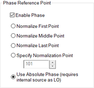
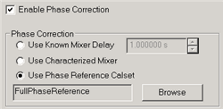

# SMC+Phase

* * *

With SMC you can optionally measure phase. This feature is available with the
S9x083A/B. SMC + phase is NOT offered in the N523xB.

In this topic:

  * [Overview](SMC_plus_Phase.md#Overview)

  * [How to make SMC+Phase measurements](SMC_plus_Phase.md#HowEnableSMCPhase)

  * [Measuring Mixers below 55MHz](SMC_plus_Phase.md#MeasBelow55)

  * [Comparing SMC+Phase with VMC Phase Measurements](SMC_plus_Phase.md#Comparing)

  * [How to improve the stability of SMC+Phase measurements](SMC_plus_Phase.md#Stable)

  * [How to Calibrate a 2-stage (LO) SMC+Phase Measurement](SMC_plus_Phase.md#Cal2stage)

### See Also

[Phase Reference Calibration](Phase_Reference_Calibration.md)

[SMC Measurements and Calibration](SMC_Measurements.md)

[Other FCA Topics](FCA_Use.md)

### Overview

There are three methods used in the VNA to calibrate SMC+Phase measurements.
All three methods rely on newer phase-coherent synthesizers in the VNA to
produce phase capability in frequency offset measurements.

With the first two methods, during an SMC calibration, the phase delay through
a Calibration Mixer is measured and compared to the known delay. The
difference is used to correct subsequent SMC+Phase measurements.

A Calibration Mixer is required with the first two methods.

  1. Enter the known delay into a dialog.

  2. Uses the known delay at various frequencies from an *s2p file from a mixer characterization. You create the *S2P file from a separate Mixer Characterization. This method is NOT supported with [Cal All](../S3_Cals/Calibrate_All_Channels.md).

  3. Uses a Phase Reference to perform a 'tier 1' calibration. A Calibration Mixer is NOT required with this process. [Learn more about this process](Phase_Reference_Calibration.md).

### Notes

  * A Reference Mixer is NOT required with any of these methods as it is with VMC.

  * SMC+Phase can be measured on Converters with an Embedded LO. [Learn how](../Applications/Embedded_LO.md).

  * Phase can be measured with Power Sweeps.

  * Phase can NOT be measured on Swept LO measurements.

  * It is especially important with SMC + Phase measurements to connect the [10 MHz reference signal](../Rear_Panel/XRtour.md#10M) of an external source to the VNA.

  * you can use a Phase Reference Cal Set with Independent power cals for input and output ports (no thru). [Learn more](SMC_Measurements.md#CalSetupDiag).

## How to make SMC+Phase measurements

  1. On the Mixer [Sweep tab](FCA_Use.md#SweepTab), check Enable Phase, then select the Phase Reference Point.

SMC Mixer Sweep tab - Phase Settings help  
---  
 Enable Phase Check to
perform phase measurements. You can also enable phase measurements at the [SMC
Cal Setup dialog](SMC_plus_Phase.htm#SMCCalSetup).

### Phase Reference Point

The SMC Phase measurement technique provides for a coherent phase relationship
from one frequency to the next in each sweep. However, for instruments with
fractional-N-based sources, the phase measurement of the first data point is
random from sweep to sweep. This initial phase offset does not impact
measurements such as group delay or deviation from linear phase. In order to
keep a phase trace from appearing random sweep-to-sweep, all phase data in the
sweep is normalized against a single point. This results in a stable,
normalized phase trace. For this normalization, select the measurement point
that has the best signal-to-noise ratio. The phase at the selected point will
always be zero before calibration and any electrical delay is applied. When
phase normalization is used in conjunction with [Segment
Sweep](FCA_Use.htm#SegmentSweep), only the choice Normalize Middle Point is
available. For instruments with direct-digital-synthesis (DDS)-based sources,
an additional choice is available called Use Absolute Phase. With this choice,
the phase of the internal sources and internal LO start up with a repeatable
phase at every point, giving stable and repeatable phase sweep-to-sweep. Phase
normalization is not used in this case. This feature allows SMC+Phase to make
measurements that previously required the Vector Mixer/Converter (VMC)
measurement class and the associated reference and calibration mixers. One
example is measuring phase changes that occur within a device, for example,
due to an internal phase shifter in a transmit/receive module. Another example
is measuring the absolute phase variation among various frequency converters
or mixers due to internal path-length differences. Limitation when Use
Absolute Phase is selected:

  * LO1 (and LO2 if used) must come from an internal source, either from a test port or from the Option XSB rear-panel source (Source3). The choice Use Absolute Phase is grayed out if either LO1 is set to Not controlled or to an external signal generator.

Note: Absolute Phase is a Licensed Feature. Learn more about [Licensed
Features](../Support/Software_Support.htm).  
  
  
  2. Select a Phase [Format](../S1_Settings/Data_Format.md) for the SMC measurement: click Response, then Format, then phase, unwrapped phase, or group delay.

  3. During SMC Cal, at the [Cal Setup dialog](SMC_Measurements.md#CalSetupDiag), select the Phase Correction method as follows:

SMC Cal Setup \- Phase Correction dialog help  
---  
 Enable Phase Correction Check to
enable Phase measurements. This can also be done during the mixer setup.

### Phase Correction

Choose one of the following methods to specify the known delay through the
characterized mixer. With the first two methods, the phase delay through a
Calibration Mixer is measured and compared to the known delay, either entered,
or stored in an *.S2PX file.

  * Use Known Mixer Delay Enter the fixed, known, delay through the calibration mixer.
  * Use Characterized Mixer Select, then browse to the *.S2P file that characterizes the calibration mixer. Use an *.S2PX file when making segmented SMC+Phase measurements. [Learn more](FCA_Use.md#SegmentSweep). Use either of the following two methods to characterize the Cal Mixer over the SMC measurement frequency range:

  1. Use the [Mixer Characterization Wizard](VMC_Measurements.md#MixerCharCal). The Cal Mixer has the same requirements as the VMC Cal Mixer. [Learn more](VMC_Measurements.md#calibrationMixer).
  2. In a calibrated VMC channel, measure the group delay of the calibration mixer, then save to an *.S2P or *.S2PX file. However, a characterized mixer is required to calibrate the VMC channel.

  * Use Phase Reference Calset Select, then browse to the Phase Reference Cal Set that covers the frequency range of the current measurement. [Learn more about SMC with a Phase Reference](Phase_Reference_Calibration.md).

  
  
### Measuring phase on Mixers below 55 MHz

Measuring phase on mixers below 55 MHz is challenging for the following two
reasons:

  1. The PNA-X couplers have significant losses at these low frequencies. The PNA-X automatically reduces the IFBW at low frequencies in order to compensate for the coupler roll-off. And with SMC+Phase, we recommend setting 100 averages in order to reduce the noise of the SC21 delay measurement. These two settings combine to make the measurement speed VERY slow.

     * Recommendation: When measuring a downconverter with an output frequency below 55 MHz, check the “Reversed Port 2 Coupler” checkbox on the [SMC Mixer Sweep](FCA_Use.md#SweepTab) tab and reverse the Port 2 coupler for the DUT measurement. With this setup, the IFBW is no longer reduced when measuring the output power. This significantly speeds up the measurement without reducing accuracy.

  2. The PNA-X has a significant number of [frequency bands](../S1_Settings/Frequency_Range.md#BandCrossings) below 55 MHz. SMC+Phase must have multiple measurement points within every frequency band.

     * Recommendation: Select the number of data points to yield a point spacing of NO MORE than 200 kHz per point. [Segment Sweep](../S1_Settings/Sweep.md#segment) can be used so that the point spacing above 55 MHz is not as dense.

### Comparing SMC+Phase with VMC Phase Measurements

SMC phase measurements do NOT require a reference mixer, and are therefore
easier to make than VMC phase measurements. Also the SMC calibration mixer is
only required to have a known delay value, although an S2P characterization
file provides more accurate results. The [Phase
Reference](Phase_Reference_Calibration.htm) method provides the highest
accuracy phase measurements for mixer/converters.

  * When measuring converters with an embedded LO, SMC with phase can provide results that are as stable and free from sweep-to-sweep jitter as VMC.

  * When measuring converters with an external LO that is shared with the reference mixer (as shown in the [VMC Setup diagram](VMC_Measurements.md#HardwareSetup)), VMC provides results that are more stable than SMC+Phase.

### How to improve the stability of SMC+Phase measurements

Stable phase measurements are attained by increasing [Sweep
Averaging](../S2_Opt/Trce_Noise.htm#averaging), and sometimes lowering the
IFBW, until you attain the desired compromise between sweep time and trace
jitter (the amount of random phase change at a single data point). For
SMC+Phase, the default IFBW is 10 Hz, and 1 average. During calibration, the
Averaging factor is temporarily multiplied by 4 to ensure an accurate phase
calibration.

The following procedure shows how to view and improve phase jitter:

  1. Create an SMC+Phase channel (Click Response, Measurement Class).

  2. Enable Phase with SMC (See above) On the phase trace (to follow) notice that the only point that has NO jitter is the data point that you selected as the Phase Reference point.

  3. Change the measurement to IPWR: (Click Response, Measure, IPWR)

  4. Change Format to Phase. (Click Response, Format, Phase)

  5. Normalize the trace. (Click Math, Memory, Normalize) [Learn more about Normalization.](../S4_Collect/Math_Operations.md#MathMemorydialogbox)

  6. Autoscale the trace. (Click Response, Scale, Autoscale).

  7. Optionally monitor the jitter with [Trace Statistics](../S4_Collect/Math_Operations.md#statistics) (Std Dev)

  8. Increase Averaging and possibly lower IFBW to improve jitter. (Click Response, Avg BW, then Averaging). Use a MINIMUM of 10 sweep averages (never use Point Averaging).

  9. After the adjustments are made, change the measurement back to your measurement of interest.

  10. When measuring a new DUT, restart Averaging.

### How to Calibrate a 2-stage (LO) SMC+Phase Measurement

Note: The following discussion does NOT pertain when a [Phase Reference
cal](Phase_Reference_Calibration.htm) is used to correct the SMC+Phase
Measurement.

When calibrating a dual-stage SMC+Phase measurement for group delay using a
characterized mixer, the channel setup requires frequency values for two LOs,
but the characterized-thru mixer uses only one LO. The frequencies of LO1 and
LO2 are different. There are two ways to overcome this challenge:

  1. Before the calibration, set the LO that is provided by an external source to uncontrolled. Then manually set the frequency of this external source to the LO frequency that gives the same input and output frequencies, and the same sweep direction, as the dual-stage setup. Perform the calibration under this condition. After the calibration, return the LO to controlled so that its frequency will be properly set during the measurement of the DUT.

  2. Configure a 1-stage mixer setup, with the LO set to the frequency that gives the same input and output frequencies and the same sweep direction as the dual-stage setup. Perform the calibration under this condition. Save the calibration data as a user calset. Configure the dual-stage case, and apply the 1-stage calibration.

* * *

* * *

