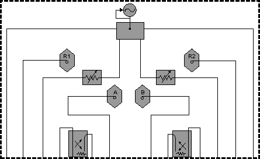
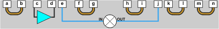

# SMC with a Booster Amp

* * *

If your mixer measurement requires more source power on the input than the VNA
can provide, a booster amplifier can be used to provide the additional power.
This topic describes how to configure and make a calibrated SMC measurement
using a booster amplifier.

### Connect

Connect the booster amplifier between the Source-Out and Coupler-Thru
connectors on the front-panel as shown in the following diagram. Your VNA
block diagram may not look like this.

Item |  Description |  Item |  Description  
---|---|---|---  
a |  SOURCE OUT |  h |  RCVR B IN  
b |  RCVR R1 IN |  i |  CPLR ARM  
c |  SOURCE OUT |  j |  PORT 2  
d |  CPLR THRU |  k |  CPLR THRU  
e |  PORT 1 |  l |  SOURCE OUT  
f |  CPLR ARM |  m |  RCVR R2 IN  
g |  RCVR A IN |  n |  SOURCE OUT  
  
### Measurement and Calibration Setup

In the following procedure:

  * Test Port power is the power level out of the source.

  * Corrected power is the power level you require at the mixer input and output.

This procedure assumes you will applying stimulus power to the mixer input to
make SC11 and SC21 measurements, and to the output of the mixer to make SC22
and SC12 measurements.

  1. Determine the gain of the booster amplifier. If the gain has significant slope across the input and output range of the mixer, see [Booster Amp with a Gain Slope](SMC_with_a_Booster_Amp.md#slope).

  2. Determine the corrected power for both the input (port 1) and output (port 2) of the mixer.

  3. Calculate the Test Port power for both ports by subtracting the gain of the amplifier from both the input and output corrected power levels.

For example, the following values assume a 25 dB booster amp on port 1 as in
the diagram above.

|  Corrected Power |  - |  Amp Gain |  = |  Test Port Power  
---|---|---|---|---|---  
Port 1 (input) |  0 dBm |  - |  25 dB |  = |  -25 dBm  
Port 2 (output) |  -20 dBm |  - |  25 dB |  = |  -45 dBm  
  
  4. On the VNA [Power dialog](../S1_Settings/Power_Level.md#powerDiag), clear the Port Power Coupled checkbox, which allows different power levels for each port.

  5. Enter the calculated Test Port Power values for each port.

  6. During the SMC Cal Wizard Select DUT Connectors and Cal Kits dialog, click View/Modify Source Cal Settings to invoke the [Source Calibration Settings dialog](../S3_Cals/Power_Cal_for_Apps.md).

  7. In Power Offset, enter the booster amplifier gain.

### Booster Amp with a Gain Slope

SMC calibration takes place over the entire input and output range of the
mixer. Therefore, the booster amplifier will also be subjected to the entire
input and output frequency range of the mixer.

To compensate for a gain slope, you might have to experiment with the source
attenuator setting, power-offset value, and initial power value to get a
combination that will not cause the VNA source to go unleveled during or after
the cal.

For example, assume the booster amp gain is 30 dB at the low end, and 20 dB at
the high end. If you enter 30 dB for the power offset value, the VNA might run
out of ALC range when the actual gain drops to 20 dB. The VNA will try to
increase its source power to account for the 10 dB gain drop. Therefore, pick
a power offset value that is in the middle of the amplifier gain band (25dB).

If possible, select a VNA attenuator setting that puts the ALC approximately
in the middle of its range at the desired corrected power with the mid-band
gain. This condition means the ALC can set the power higher and lower to
account for the gain slope, without unleveling.

If the gain slope is too large, then there may not be a setting that prevents
a source unlevel. In this case, a flatter booster amp must be used.

L

