# VMC Measurements

* * *

VMC Setup and Calibration is very similar to SMC. See [FCA
Overview](FCA_Use.htm) to learn about the features that are common to these
two applications.

The following information is unique to VMC:

  * [VMC Hardware Setup](VMC_Measurements.md#VMCSetup)

  * [Create a VMC Measurement](VMC_Measurements.md#Create)

  * [VMC Parameters Offered](VMC_Measurements.md#offered)

  * [The VMC Mixer Setup dialog](VMC_Measurements.md#How)

  * [VMC Calibrations](VMC_Measurements.md#VMCcalOverview)

### See Also

[Embedded LO](../Applications/Embedded_LO.md)

[How to make a VMC Fixed Out
measurement](How_to_make_a_VMC_Fixed_Out_measurement.htm)

* * *

## VMC Hardware Setup

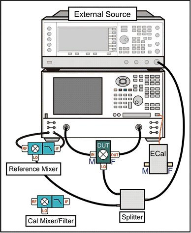
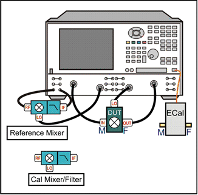

DUT Input (RF) must be connected to VNA port 1.

DUT Output (IF) can be connected to any other VNA port.

Notes:

  * When using a PNA-X with an Internal Second Source, the external source is NOT necessary.

  * [See note regarding LO power out both second source ports](../Applications/MixerConverter_Setup.md#SelectSource)

  * [Learn which VNA ports can be used for the LO.](../S0_Start/Internal_Second_Source.md)

  * [Measure a DUT with an Embedded LO](../Applications/Embedded_LO.md)

### Reference Mixer

The Reference mixer provides a phase reference for the measurements. The
reference mixer is connected in the reference receiver path of the network
analyzer, between the source out and receiver R1 in ports, as shown below.

The reference mixer is considered part of the test system setup like the test
cables. It remains in place during the entire calibration and measurement
process. The reference mixer is switched in and out of the measurement path by
the VNA as needed. [See how to manually switch the reference
mixer.](Frequency_Offset_Mode.htm#TestSet)

The reference mixer does not need to be reciprocal and does not have to match
the calibration mixer or the mixer-under-test in performance. The only
requirement of the reference mixer is that it cover the same frequency range
as the mixer under- test. In general, it is valuable to select a reference
mixer that can be used with a variety of different setups. For example, a
broadband mixer can be used in place of several narrow-band alternatives.

A low pass filter on the output of the reference mixer can be used to suppress
the LO leakage signal that comes out of the reference mixer output. It is not
strictly needed, but ensures that the VNA will not have any source unlock or
unlevel errors due to the LO leakage.

  * Connect the Reference Mixer INPUT to VNA Ref 1 Source out

  * Connect the Reference Mixer OUTPUT to VNA Rcvr R1 In

### Calibration Mixer/Filter

The Calibration mixer/filter is characterized either before or during a VMC
calibration. It is used during the VMC calibration as the THRU standard. The
calibration mixer/filter combination must meet the following requirements:

  * The mixer must be reciprocal over the frequency range of the mixer under test. This means that it has the same magnitude and phase response in the up-converting and down-converting directions (C21 = C12) as shown in the following diagram.

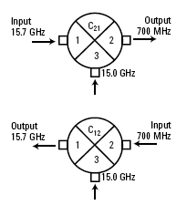

  * If the Input and Output frequency ranges are overlapping, the mixer must have Input to Output Isolation greater than 10 dB more than the conversion loss in the overlapping range.

  * The filter must reject the undesired mixing product, and pass the desired mixing product, at the output of the cal mixer. This requirement can be made easier by characterizing the mixer/filter as a downconverter. [Learn more.](VMC_Measurements.md#Measurement_direction)

Note: With a corrected VC21Swept LO measurement, the phase data is displayed
relative to the phase of the calibration mixer that was used during the VMC
calibration. In addition, Group delay display format is NOT valid.

[See an example of a Fixed Output VMC
Measurement](How_to_make_a_VMC_Fixed_Out_measurement.htm)

### Important note: Orientation of Reference mixer and Calibration
mixer/filter

The reference mixer is ALWAYS connected in the same orientation as the DUT,
since the output frequency of the reference mixer has to match that of the
DUT. The same applies to the calibration mixer/filter if it is characterized
as part of a full VMC cal.

If you characterize the calibration mixer/filter separately, you can
characterize it as either an upconverter or downconverter. [Learn
more.](VMC_Measurements.htm#Measurement_direction)

### LO Source

Note: When using a PNA-X with Internal Second Source, the external source is
NOT necessary.

  * [See note regarding LO power out both second source ports](../Applications/MixerConverter_Setup.md#SelectSource)

  * [Learn which VNA ports can be used for the LO.](../S0_Start/Internal_Second_Source.md)

  * Connect External Sources to the VNA GPIB Controller port.

  * Learn how to [Configure an External LO Source](../System/Configure_an_External_Device.md)

## Create a VMC Measurement

  1. Press Setup > Main > Meas Class....

  2. Select VMC, then either:

  1.      * OK delete the existing measurement, or

     * New Channel to create the measurement in a new channel.

  3. A VC21 measurement is displayed.

  4. To select additional parameters to display, press Trace > Trace 1-8 or Trace 9-16 > Trace N. to add additional traces.

  5. Right-click on the trace, select Measure TrN..., then select a parameter from the list then click OK.

## VMC Parameters Offered

Important Note: Connecting your DUT to the VNA: RF and IF terminology is NOT
used in FCA because the VNA does not know how the DUT is labeled or how it
will be used. Instead, the general terms INPUT and OUTPUT are used.

  * INPUT \- The DUT port being stimulated with frequencies before conversion.
  * OUTPUT \- The DUT port outputting converted frequencies.

INPUT and OUTPUT Frequencies are specified using the [Mixer Setup dialog
box](../Applications/MixerConverter_Setup.htm).  
---  
  
The DUT input is always connected to VNA port 1. However, the DUT output can
be connected to any other VNA port.

  * VC21, VC31, or VC41 Conversion Loss/Gain (default) - stimulus at Input, response at Output

  * S11 \- stimulus and response at Input

  * S22, S33, or S44 - stimulus and response at Output

  * R1 (or R) \- stimulus at Input, measures absolute power at the R1 receiver (uncorrected)

  * B, C, or D \- stimulus at Input, measures absolute power at the output receiver (uncorrected)

  * Reverse conversion loss is NOT offered because of the reference mixer.

### See Also

[Measure a DUT with an Embedded LO](../Applications/Embedded_LO.md)

## VMC Mixer Setup

#### How to start the VMC Mixer Setup dialog  
  
---  
  
### Using Hardkey/SoftTab/Softkey

| Using a mouse  
  
  1. Press Freq > Main > VMC Setup... > Mixer Setup tab.

|

  1. Click Stimulus
  2. Select Sweep
  3. Select VMC Setup...
  4. Select Mixer Setup

  
  
  
The following VMC Mixer Setup dialog tabs are presented:

  * [Sweep Tab](FCA_Use.md#SweepTab) (shared with SMC)

  * [Power Tab](FCA_Use.md#PowerDiag) (shared with SMC)

  * [Mixer Freq Tab](../Applications/MixerConverter_Setup.md#MixerFreqTab) (shared with all converter apps)

  * [Mixer Power Tab](../Applications/MixerConverter_Setup.md#MixerPowerTab) (shared with all converter apps)

  * [Mixer Setup Tab](../Applications/MixerConverter_Setup.md#MixerSetupTab) (shared with all converter apps)

## VMC Calibration Overview

The Calibration Wizard guides you through this process. The first three steps
characterize the calibration mixer that is used as the THRU standard during
the calibration process.

  1. Perform a [2-port SOLT calibration](../S3_Cals/Select_Cal.md#SOLT) over the INPUT frequency range of the DUT, and another [2-port SOLT calibration](../S3_Cals/Select_Cal.md#SOLT) over the OUTPUT frequency range. Use either a mechanical calibration kit or an ECal module.

  2. Characterize the input and output match of the calibration mixer/filter combination with the external LO connected and the output terminated with an open, short, and load. [Learn how to connect the calibration mixer/filter.](VMC_Measurements.md#ConnectCharMixer) Once characterized, an S2P file is saved and can be recalled for use in subsequent VMC calibrations using the same stimulus settings.   
Note: Use an *.S2PX file for SEGMENTED VMC measurements. [Learn
more](FCA_Use.htm#SegmentSweep).

  3. Connect the [reference mixer](VMC_Measurements.md#Reference) between the Source Out and Rcvr R1 front-panel connectors. Connect the output port of the calibration mixer/filter combination to VNA Port 2 (or at the end of the cable attached to the port).

  4. Measure the calibration mixer/filter combination as the THRU calibration standard.

  5. The VNA calculates the error terms necessary to make corrected phase measurements of your mixer/converter under test.

## VMC Cal Wizard

The following dialog boxes are presented during VMC Calibration and VMC [Mixer
Characterization](VMC_Measurements.htm#MixerCharCal).

  * [Calibration Setup](VMC_Measurements.md#Cal_setup)
  *     * [Waveguide/In-fixture/On-Wafer Setup](VMC_Measurements.md#Waveguide)
  * [Calibration Mixer Characterization](VMC_Measurements.md#Select_cal_procedure)
  * [Measurement Direction](VMC_Measurements.md#Measurement_direction)
  * [Select DUT Connectors and Cal Kits](VMC_Measurements.md#Select_dut_connectors)
  *     * [Modify Frequency Cal](VMC_Measurements.md#Modify)
    * [Specify how the ECal module is connected](VMC_Measurements.md#Orient1)
    * [Modify Mixer Cal](VMC_Measurements.md#ModifyMixerCaldiag)
    * [Select the ECal Port to be connected to the Output of the Calibration Mixer](VMC_Measurements.md#Orient)
  * [Vector Mixer Cal Steps](VMC_Measurements.md#VMCCharSetupDiag)
  * [Measure Calibration Standards](VMC_Measurements.md#Meas_cal_stds)
  *     * [Save Mixer Characterization](VMC_Measurements.md#Mixer_char_complete)
  * [Calibration Completed](VMC_Measurements.md#Save)
  * [Specify Adapter Delay](VMC_Measurements.md#SpecifyDelayDiag)

  
---  
  
#### How to Perform a VMC Calibration

  1. [Create an FCA measurement](FCA_Use.md#Create), then...

  
---  
  
### Using Hardkey/SoftTab/Softkey

| Using a mouse  
  
  1. Press Cal > Main > Smart Cal....

|

  1. Click Response
  2. Select Cal
  3. Select Smart Cal...

  
  
### To perform Mixer Characterization ONLY  
  
  1. Press Cal > Main > Other Cals > Mixer Char Wizard....

|

  1. Click response
  2. Select Cal
  3. Select Other Cals
  4. Select Mixer Char Wizard...

  
  
  
Calibration Setup dialog box help  
---  
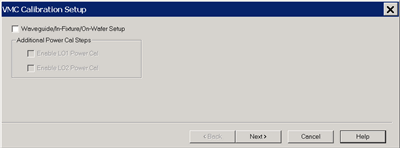 Waveguide/In-fixture/On-Wafer Setup
Check to embed or de-embed circuit networks on the input and output of your
mixer under test. Starts the following dialog box.

### Additional Power Cal Steps

Enable LO1 / LO2 Power Cal Check when LO1 / LO2 is controlled (on the [Mixer
Setup](../Applications/MixerConverter_Setup.htm#MixerSetupTab) tab) to perform
a Power Cal on the LO source(s).  
  
Waveguide/In-fixture/On-Wafer Setup dialog box help  
---  
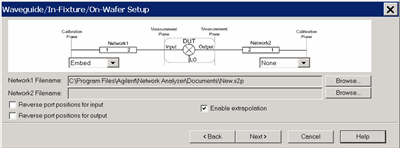 This dialog box appears ONLY if you
checked the Waveguide/In-fixture/On-Wafer Setup box in the previous [Cal
Setup](VMC_Measurements.htm#CalSetupDiag) dialog. Allows you to embed or de-
embed circuit networks on the input and output of your mixer under test. For
Network1 (Input) and Network2 (Output) select Embed, De-embed, or None. Browse
Click to navigate to the .S2P file that models the network to embed or de-
embed. Reverse port positions for input/output Check to cause the
Fixture/Adapter to be configured with Port 2 connected to the VNA and Port 1
to be connected to the DUT. The image in the dialog is updated to reflect that
change. Enable Extrapolation Check (default setting) to apply a simple
extrapolation when the S2P file has a narrower frequency range than the
channel. The values for the first and last data points are extended in either
direction to cover the frequency range of the measurement. A warning message
is also displayed when extrapolation is necessary.

### To Embed or De-embed

  * When you have a 2 port network that needs to be connected between the Cal reference plane and the DUT during the measurement, but it is NOT present during the calibration, then that network has to be De-Embedded from the port in question during the calibration. In other words, De-Embedding in FCA calibration extends the calibration reference plane to include the two port network.
  * When you have a 2 port network that is included as part of the calibration reference plane but has to be disconnected during the measurement, then that 2-port network has to be Embedded for the port in question during the calibration. In other words, Embedding in FCA calibration retracts the calibration reference plane to exclude the two port network during the measurement.

| Notes

  * Interpolation is performed when more frequencies are included in the file than in the channel, and the data points do not exactly match those of the measurement.

  
---  
  
Calibration Mixer Characterization dialog box help  
---  
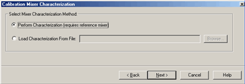 What is Calibration Mixer
Characterization? For a brief explanation, see Calibration Mixer.

### Select Mixer Characterization Method

Perform Characterization (requires a reference mixer) Performs a Mixer
characterization in addition to the VMC calibration. The mixer
characterization file will be saved at the end for use in subsequent VMC
calibrations. Choose this selection if you do NOT already have a mixer
characterization file to load. Load characterization from file Loads an S2P
calibration mixer characterization file. Click Browse to locate the file.
Note: Load an *.S2PX file for SEGMENTED VMC measurements. [Learn
more](FCA_Use.htm#SegmentSweep).

  * The frequency range of the S2P file MUST be the same, or larger than, the frequency range of the FCA measurement. If the S2P file frequency range is larger, or the data points do not exactly match those of the measurement, interpolation will be performed.
  * The VMC calibration requires that the calibration mixer be connected in the same orientation as that in which it was characterized. The direction in which it was characterized is not part of the file that is recalled. You have to remember and connect it appropriately.

"Invalid Mixer Characterization File" is displayed if the frequency range of
the S2P file is smaller that those of the measurement. Note: A Mixer
Characterization Cal can be performed separately. [Learn
how.](VMC_Measurements.htm#MixerCharCal)  
  
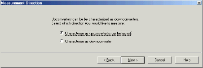

Measurement Direction dialog box help  
---  
This dialog box appears ONLY if your settings in the [Mixer
Setup](../Applications/MixerConverter_Setup.htm#MixerFreqTab) dialog box
indicate that your DUT is being tested as an upconverter (input < output). It
allows you to characterize the Calibration Mixer / Filter as a downconverter
(input > output) or an upconverter. The following example shows why you would
choose to characterize the calibration mixer as a downconverter. Consider a
DUT being used as an upconverter. The input frequency is 70 MHz, the LO is 20
GHz, and the selected (+) output frequency is 20.07 GHz. If we chose (-) in
the [mixer setup
dialog,](../Applications/MixerConverter_Setup.htm#MixerFreqTab) the output
frequency would be 19.93 GHz.

  * Characterize as upconverter A very sharp cutoff filter is required to reject the undesired output of 19.93 GHz and pass the desired 20.07 GHz.
  * Characterize as downconverter The input frequency is 20.07 GHz; the LO is 20 GHz. The sum (+) output is 40.07 GHz and the diff (-) output is 70 MHz. These are very easy to separate with a low-pass filter. The original frequencies are always used in the downconversion process, so be sure to choose a filter that will pass 70 MHz and reject 40.07 GHz.

[See connection diagrams.](VMC_Measurements.md#VMCCharSetupDiag)  
  
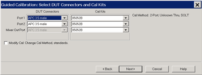

Select DUT Connectors and Cal Kits dialog box help  
---  
Allows you to specify the connector type and Cal Kit for each DUT port. Port n
For each listed VNA port, specify the DUT connector type and gender, and the
Cal Kit to use. Mixer Out Port Output port of the image filter that is
connected to the [calibration mixer](VMC_Measurements.md#calibrationMixer).
Specify the Cal Kit / standards to use for the measurement of the calibration
mixer / filter combination. Note: When selecting a cal kit for the Mixer Out
Port, be sure that the kit has standards with connectors that can mate to the
mixer output port. If you choose an ECal, the ECal must have at least one port
that can mate to the mixer output port. Note: If your DUT connectors are:

  * Waveguide Change the system impedance to 1 ohm before performing a calibration. See [Setting System Impedance](../System/System_Impedance.md).
  * Not listed (male and female) Select Type A as the connector type. Type A requires a calibration kit file containing the electrical properties of the standards used for calibration (see [Calibration kits](../S3_Cals/ModifyCalKits.md#CalKitManager)).
  * Unspecified (like a packaged device) Select Type B as the connector type. Type B requires a calibration kit file containing the electrical properties of the standards used for calibration (see [Calibration kits](../S3_Cals/ModifyCalKits.md#CalKitManager)).

Modify Cal Check to start the [Modify Cal](VMC_Measurements.md#Modify)
dialog. If performing a Mixer Characterization Cal at the same time as VMC
Cal, two Modify Cal dialogs will be presented, one after the other.  
  
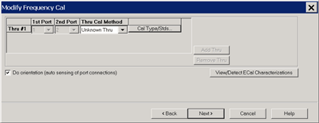

Modify Frequency Cal dialog box help  
---  
For VMC calibrations - NOT for Mixer Characterization. Thru Cal Method For
each Thru connection, choose the Thru method. [Learn more about these
choices.](../S3_Cals/Calibration_THRU_Methods.htm) Cal Type/Stds Click to
start the [Modify Calibration Selections](../S3_Cals/SOLT_Tab.md) dialog box.
The following selections are available ONLY if using an ECal module. Do
orientation When this box is checked (default) the VNA senses the ECal model
and direction in which the ECal module port is connected to the VNA ports. If
power to the ECal module is too low, it will appear as if there is no ECal
module connected. If you use low power and are having this problem, clear this
check box to provide the orientation manually. Orientation occurs first at the
middle of the frequency range that you are calibrating. If a signal is not
detected, it tries again at the lowest frequency in the range. View/Detect
ECal Characterizations Appears only if an ECal module is selected for use.
Click to invoke the [View ECal Modules and
Characterizations](../S3_Cals/Using_ECal.htm#SelectModuleAndChar) dialog box.
Displays a list of ECal modules that are connected to the VNA.  
  

Specify how the ECal module is connected dialog box help  
---  
This dialog box appears when the Do orientation checkbox in the previous
Modify Frequency dialog box is cleared. Click the ECal Port that is connected
to each VNA port.  
  
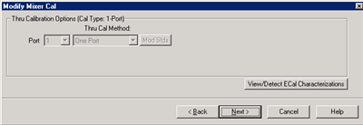

Modify Mixer Cal dialog box help  
---  
Mixer Characterization ONLY. The Thru standard is not measured. Therefore, the
Thru Cal Method choices are not available. View / Detect ECal
Characterizations Available ONLY if using an ECal module. Invokes the [Select
ECal Module and
Characterization](../S3_Cals/Using_ECal.htm#SelectModuleAndChar) dialog box.  
  

Select the ECal Port to be connected to the Output of the Calibration Mixer
dialog box help  
---  
Select the ECal Port to be connected to the output of the image filter of the
Calibration Mixer / Filter combination. [See connection
diagram](VMC_Measurements.htm#Measurement_direction) of Calibration Mixer /
Filter combination.  
  
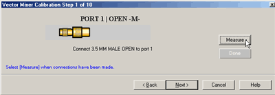

Measure Calibration Standards dialog box help  
---  
Prompts for standards to be measured. Connect the standard, then click
Measure. Measure Measures the mechanical standard and continue to the next
calibration step. [ReMeasure] Replaces Measure after standard has been
measured. Allows you to remeasure a standard. Done Click to proceed to the
[Calibration Complete](VMC_Measurements.md#Save) dialog. Available only after
all measurements for the calibration are complete. Back Returns to the
previous dialog box. Next Does NOT make a measurement. Proceeds to the next
required step. Cancel Exits the Calibration Wizard.  
  
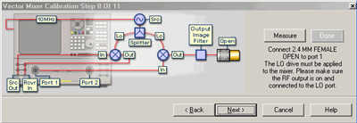

Vector Mixer Cal Steps dialog box help  
---  
Connect the Open, Short, and Load standards to the image filter output, then click Measure.' This portion of the calibration characterizes the calibration mixer. The connection is different depending on if the calibration mixer is an upconverter being characterized as a down converter. | Note: The following are simplified connection diagrams - the reference mixer and LO signals must also be connected. These images assume that the DUT output is connected to VNA port 2. As a Downconverter. (The VNA automatically switches to make the S22 measurement on the device.) 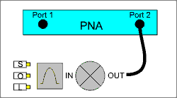 As an Upconverter 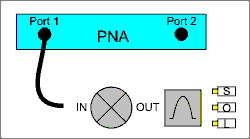  
---  
  
Done Click to proceed to the [Calibration Complete](VMC_Measurements.md#Save)
dialog. Available only after all measurements for the calibration are
complete.  
  
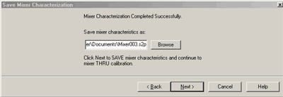

Save Mixer Characterization dialog box help  
---  
Allows you to save the characterization data of your [calibration
mixer](VMC_Measurements.htm#calibrationMixer). When performing another VMC
calibration using the same calibration mixer, this [S2P file can then be
recalled](VMC_Measurements.htm#Select_cal_procedure). Browse Navigate to the
location where you want to save the characterization data of your calibration
mixer. Either use the default file name or enter a custom file name. Next
Saves the mixer characterization file and continues with the next step in the
full system calibration routine. Finish Replaces Next if you are only
characterizing the calibration mixer instead of performing a full system
calibration. Saves the mixer characterization file and exits the mixer
characterization routine.  
  

Calibration Completed dialog box help  
---  
Finish Save to the channel's calibration register. Save As User Cal Set Starts
the [Save as User Cal Set dialog
box](../S3_Cals/Calibration_Wizard.htm#SaveAs) AND save to the channel's
calibration register. Cancel Calibration is NOT applied or saved. Learn about
[Calibration Registers](../S3_Cals/Cal_Sets.md#Registers). Learn about [User
Cal Sets](../S3_Cals/Cal_Sets.htm)  
  

Specify delay dialog box help  
---  
This dialog appears ONLY when [Adapter
Removal](../S3_Cals/Calibration_THRU_Methods.htm#AdapterRemoval) or [Unknown
Thru](../S3_Cals/Calibration_THRU_Methods.htm#UnknownThru) calibrations are
performed. The following values were estimated from the measurement. Most of
the time, they are adequate. However, for CW sweep or frequency sweep with
large step sizes, the accuracy of the values may be improved. Adapter delay To
improve this value, measure and record the delay of the adapter with a dense
step size. Enter that value here. The required precision value is the accuracy
that is required to characterize the delay value. Nominal phase offset
(Waveguide ONLY). To improve this value, measure and record the phase offset
of the Waveguide adapter with dense step size. Enter that value here. When one
connector is coax and the other connector is waveguide, the phase offset has
an ambiguity of 180 degrees. For consistency, the estimate provided here is
always between 0 and 180 degrees. You can change this estimate to any value
between -180 degrees and +180 degrees. For FCA calibrations, this dialog box
appears twice: once for the input frequencies and once for the output
frequencies. The values can be slightly different.  
  
* * *

