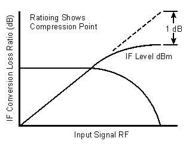

# Conversion Compression

* * *

  * [What is Conversion Compression?](conversion_compression.md#compress_what_is)

  * [Why Measure Conversion Compression?](conversion_compression.md#compress_why_meas)

  * [How to Measure Conversion Compression](conversion_compression.md#compress_how_meas)

  * [Measurement Accuracy Considerations](conversion_compression.md#compress_accuracy)

[See other Frequency Converting Device
Measurements](Frequency_Converting_Device_Measurements.htm)

What is Conversion Compression?

Conversion compression is a measure of the maximum input signal level for
which a mixer will produce linear operation. It is very similar to the [gain
compression](../Tutorials/Gain_Comp.htm) experienced in amplifiers.

To understand conversion compression, you must first understand [conversion
loss](Conversion_Loss.htm). This is the ratio of the mixer output level to the
mixer input level. This value remains constant over a specified input power
range. When the input power level exceeds a certain maximum level, the
constant ratio between input and output power levels begins to change. The
point at which the ratio has decreased 1 dB is called the 1-dB compression
point. This is illustrated in the graphic below.

Why Measure Conversion Compression?

Conversion compression is an indicator of the dynamic range of a device.
Dynamic range is generally defined as the difference between the noise floor
and the 1-dB compression point.

How to Measure Conversion Compression

The equipment and setup used to measure conversion compression are essentially
the same as for measuring conversion loss and is illustrated in the following
graphic.

The VNA performs a power sweep using [frequency-offset
mode](Frequency_Offset_Mode.htm) and the resulting display shows the mixer's
output power as a function of its input power. The 1-dB compression point (or
others such as 3-dB) can be determined using markers.

Measurement Accuracy Considerations

### Equipment Setup Considerations

  * The couplers in the VNA have very good directivity. If the return loss of the DUT is bad, the reflected signal gets sampled by the VNA and can result in errors. This relates to error in DUT gain. To increase the accuracy, an attenuator can be added between the VNA's source port and the DUT's input port. Normally a 6- to 10-dB attenuator is sufficient. Addition of this attenuator, however, decreases the available drive to the DUT.

  * With high drive levels the VNA can be driven into compression resulting in measurement error. With excessive drive levels, the VNA can be damaged. Add an attenuator between the output of the DUT and the receiver input of the VNA to avoid these problems.

### Calibration Considerations

  * [Source power calibration](../S3_Cals/PwrCalibration.md#SourcePowerCal) can be used to provide a high level of accuracy for this measurement.

