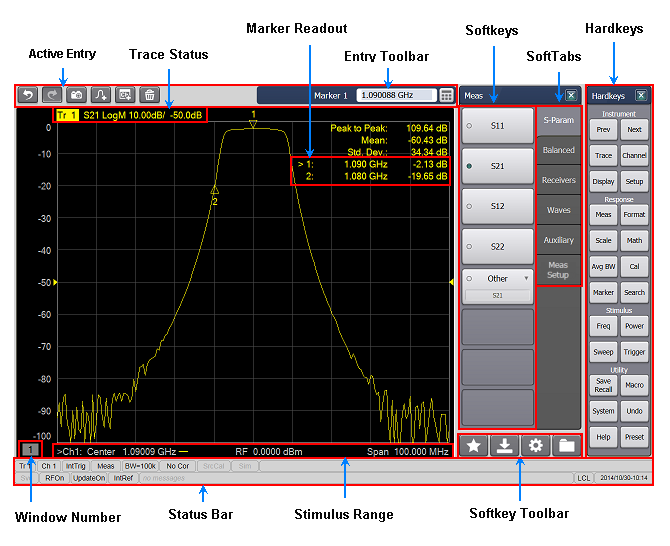
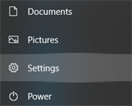
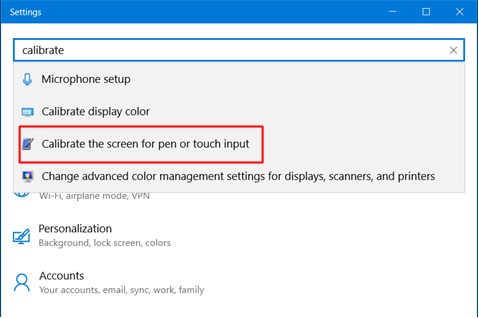
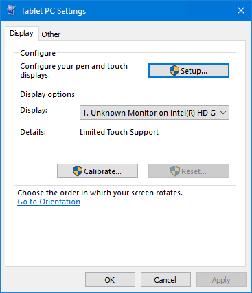
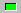

# Screen Tour

* * *

Click on image areas to learn more.

### Change VNA Display Settings

The VNA display is controlled by a third-party display driver. This driver is
capable of producing many display effects which are beyond the basic needs of
the VNA measurement environment. Keysight does not specify or warrant these
display settings.

WARNING: The VNA display must remain in the 16 bit color setting in order to
comply with international emissions regulations.

### Restore VNA Display Settings

When using external programs to control the VNA, it is possible that the
display settings may become corrupt. When this occurs, the following will
restore the VNA display settings:

  * Press System > Main > Minimize Application.

  * Right-click on the desktop, then click Personalize.

  * On the Themes tab, select Keysight Theme.

### See Also

  * [About the Touchscreen](XScreen.md#LCD)

  * [Front Panel Tour](XTour.md)

  * [Marker Drag](../S4_Collect/Markers.md#drag)

  * [Expanded Mouse capabilities](XScreen.md#rightClick)

  * [Learn how to Customize the Screen](../S1_Settings/Customize_Your_Analyzer_Screen.md)

  * [Learn to test the display screen.](../Support/Display_Test.md)

* * *

To calibrate Touchscreen: Note: The Touchscreen is self calibrating and should
not require calibration. However, if the touch locations are not accurate,
perform the following procedure to calibrate the Touchscreen.

  1. For Windows 7, perform the following procedure.
     1. In the PNA application, press System > Main > Control Panel.
     2. In the Control Panel, select Hardware and Sound > Tablet PC Settings > Calibrate the screen for pen or touch input.
  2. For Windows 10, perform the following procedure.
     1. Close the PNA application.
     2. Press or select the Windows key on an external keyboard, or click on the Windows Start icon in the lower-left corner.
     3. Select Settings to access the Settings dialog.  

     4. In the search field of the Settings dialog, type calibrate then select Calibrate the screen for pen or touch input.   

     5. The Tablet PC Settings dialog is displayed:  
  

     6. Select the Display tab.
     7. Click on the Calibrate... button.
     8. In the User Account Control dialog, click Yes.
     9. Follow the instructions displayed on the screen.

To calibrate Touchscreen when external monitor is connected to PNA: When a
second monitor is added to a Windows PC where the primary monitor has a
touchscreen, Windows may associate touch inputs with the window shown on the
extended monitor rather than on the monitor that has the touchscreen. Since
the computer in a PNA runs on the Windows operating system, the PNA can
exhibit this condition.  Note: The Touchscreen is self calibrating and should
not require calibration. However, if the touch locations are not accurate,
perform the following procedure to calibrate the Touchscreen.

  1. Minimize the PNA application window by selecting File then Minimize Application.
  2. Press or select the Windows key on an external keyboard, or click on the Windows Start icon in the lower-left corner.
  3. Select Settings to access the Settings dialog.  

  4. In the search field of the Settings dialog, type calibrate then select Calibrate the screen for pen or touch input.   

  5. The Tablet PC Settings dialog is displayed:  
  

  6. Select the Display tab.
  7. Click on the Setup... button. At this point, both the PNA screen and the external monitor will display a white background. Only one screen will also display the following message  
:  
_Touch the screen to identify it as the touchscreen._  
_If this is not the Tablet PC Screen, press Enter to move to the next screen.
To close tool, press Esc._

  8. If the message is on the PNA screen, touch the screen. The calibration is now finished and the Calibrate touch dialog will reappear. Press OK.
  9. If the message is not on the PNA screen, press Enter on the external keyboard until the message is displayed on the PNA screen. Touch the PNA screen, then press OK on the Calibrate touch dialog.

Note: If the calibration makes the touch operation worse, click on the Reset
button in the Tablet PC Settings dialog to reset the calibration data.  
  
---  
  
### Active Entry

Allows you easily select the tools. [Learn
more](../s1_settings/customize_your_analyzer_screen.htm#Tools).

### Trace Status

Provides details of each trace in the window. Highlighted trace indicates the
active trace. [Learn
more.](../S1_Settings/Customize_Your_Analyzer_Screen.htm#trace_status)

### Entry Toolbar

Along with the softkeys, allows numeric values to be entered for settings.
Learn about all
[toolbars.](../S1_Settings/Customize_Your_Analyzer_Screen.md#toolbars)

### Marker Readout

Provides stimulus and response information for markers. Learn about
[customizing the marker readout area.](../S4_Collect/Markers.md#DisplayDiag)
See also [Marker Drag.](../S4_Collect/Markers.md#drag)

### Softkeys

The combination of hardkeys and softkeys allows easy access to all VNA
features without a mouse.

### SoftTabs

Pressing these tabs will display corresponding softkeys.

### Hardkeys

Performs interface operations that are equivalent to those of keys in the
INSTRUMENT keys, RESPONSE keys, STIMULUS keys and UTILITY keys on the front
panel of VNA. [Learn more.](XTour.md#Hardkeys)

### Window Number

Provides window identification which is useful for remote programmers.

### Status Bar

Provides detail about all aspects of the status of the analyzer. [Learn
more.](../S1_Settings/Customize_Your_Analyzer_Screen.htm#StatusBar)

### Stimulus Range

Displays the start and stop values of the sweep range.

### Softkey Toolbar

These icons provide shortcuts to quickly select the softkey tools. [Learn
more.](../S1_Settings/Customize_Your_Analyzer_Screen.htm#Tools)

### Marker Drag

Drag a displayed marker across the trace using a finger (with touchscreen ON)
or a mouse. [Learn more.](../S4_Collect/Markers.md#drag)

### Expanded Mouse Capabilities

  * Cursor changes to a “hand” when hovering over a clickable object.

  * Right-click on the Entry toolbar to launch a mouse-compatible numeric pad.

Windows

  * Right-click or long press on a window area to make selections pertaining to that window.

  * Double-click on a window area to maximize the window. To return to original window configuration, right-click on window area, then click Tile.

  * Left-click on X-axis annotation to select the active channel/trace.

  * Right-click on X-axis annotation and click Start/Stop/Center to change stimulus properties. Applications are not fully supported.

  * Quickly change Scale, Reference Level, and Position. [Learn how.](../S1_Settings/Scale.md#ScaleDiag)

  * Right-click on Y-axis annotation and click Scale to change Scale.

  * Drag a trace from one window to another. Click or touch either the trace or the [Trace Status](XScreen.md). Drag the trace to another window, then release the mouse or lift your finger.

Traces

  * Left-click a trace or Trace Status to make it the selected trace.

  * Double-click on a trace or Trace Status to maximize the trace. Double-click again to return to the original trace configuration.

  * Set a [preference](../System/Preferences.md#Preferences) to always widen the active trace.

  * Set a [preference](../System/Preferences.md#Preferences) to briefly widen the active trace.

  * Drag a trace from one window to another. Click or touch either the trace or the [Trace Status](XScreen.md). Drag the trace to another window, then release the mouse or lift your finger.

Markers

  * Right-click on a trace or Trace Status to add a marker.

  * Right-click a marker to make selections pertaining to that marker, such as Marker Search or Function.

### Softkeys

  * Use the Touchscreen or adjacent buttons to select from eight dynamic softkey menu choices.

  * To Show the softkeys, press any front-panel hardkey and the corresponding softkey menu will be launched.

Softkey Annotations

Item | Description  
---|---  
| Menu...  
---  
Selection launches a dialog box.  
| Menu   
---  
Selection launches another level of softkeys.  
| Item  
---  
Indicates the item (marker, trace, window) is ON. Any number of objects can be
ON.  
| Item  
---  
Indicates the item (marker, trace, window) is OFF. Click to turn item ON.  
| Item   
---  
Indicates the item IS selected.  
| Item  
---  
Indicates the item is NOT selected. Click to select. Only one item in the
collection can be ON.  
| * Item  
---  
Enter value in Entry toolbar.  
| Item  
on |OFF  
---  
Capitalization indicates the current setting.  
  
* * *

